# Technical Design: analyze-wiring-verification

## Metadata
- **Feature**: analyze-wiring-verification
- **Status**: APPROVED
- **Created**: 2026-02-02
- **Author**: Factory Design Mode

---

## 1. Overview

### 1.1 Summary
Extend `/z:analyze` with 6 new checker classes (dead-code, wiring, cross-file, conventions, import-chain, context-engineering), fix `--check all` to run everything, add dependency graph validation to `/mahabharatha:kurukshetra`, mandate a final L5 analysis task in `/mahabharatha:design`, and print `CLAUDE_CODE_TASK_LIST_ID` in design/kurukshetra commands.

### 1.2 Goals
- `--check all` means ALL checks — no exclusions
- Wiring verification accessible via `--check wiring` and included in `all`
- Dead code detection promoted from performance-only to first-class check
- Task graph dependency validation before kurukshetra execution
- Mandatory quality gate as final task in every design

### 1.3 Non-Goals
- JavaScript/TypeScript cross-file analysis
- AI-powered semantic review changes
- Performance audit refactoring
- Modifying `feature-dev:code-reviewer` agent

---

## 2. Architecture

### 2.1 High-Level Design

```
┌──────────────────┐     ┌──────────────────┐
│  CLI: --check X  │────▶│  AnalyzeCommand   │
└──────────────────┘     │  .checkers dict   │
                         │  .run()           │
                         └──────┬───────────┘
                                │
           ┌────────────────────┼────────────────────┐
           ▼                    ▼                     ▼
    ┌─────────────┐   ┌──────────────────┐   ┌────────────────┐
    │ Existing 5   │   │ New 6 Checkers   │   │ validate_      │
    │ (lint,cplx,  │   │ (dead-code,      │   │ commands.py    │
    │  cov,sec,    │   │  wiring,cross,   │   │ (wrapped by    │
    │  perf)       │   │  conv,import,    │   │  checkers)     │
    └─────────────┘   │  context)        │   └────────────────┘
                      └──────────────────┘

┌──────────────────┐     ┌──────────────────┐
│  kurukshetra.py         │────▶│  graph_validation │
│  (pre-execution) │     │  .py (NEW)       │
└──────────────────┘     └──────────────────┘

┌──────────────────┐     ┌──────────────────┐
│  design.core.md  │────▶│  design.py        │
│  (L5 template)   │     │  (validator)      │
└──────────────────┘     └──────────────────┘
```

### 2.2 Component Breakdown

| Component | Responsibility | Files |
|-----------|---------------|-------|
| DeadCodeChecker | Wraps VultureAdapter, min-confidence 80 | analyze.py |
| WiringChecker | Wraps validate_module_wiring() | analyze.py |
| CrossFileChecker | AST-based exported-but-never-imported detection | analyze.py |
| ConventionsChecker | CLAUDE.md rules: naming, prefixes, file org | analyze.py |
| ImportChainChecker | Circular import + depth detection via DFS | analyze.py |
| ContextEngineeringChecker | Wraps validate_all() from validate_commands | analyze.py |
| GraphValidator | Dependency/consumer/reachability validation | graph_validation.py |
| DesignValidator | L5 final analysis task presence check | design.py |

### 2.3 Data Flow

1. User runs `/z:analyze --check all`
2. `AnalyzeCommand.run()` iterates ALL checkers (no exclusions)
3. Each checker returns `AnalysisResult(check_type, passed, issues, score)`
4. Results formatted as text/json/sarif

For graph validation:
1. `kurukshetra.py` calls `load_and_validate_task_graph()`
2. After existing 3 validations, calls `validate_graph_properties()` as 4th step
3. Errors → fail-fast, warnings → print and continue

---

## 3. Detailed Design

### 3.1 New CheckType Values

```python
class CheckType(Enum):
    LINT = "lint"
    COMPLEXITY = "complexity"
    COVERAGE = "coverage"
    SECURITY = "security"
    PERFORMANCE = "performance"
    DEAD_CODE = "dead-code"
    WIRING = "wiring"
    CROSS_FILE = "cross-file"
    CONVENTIONS = "conventions"
    IMPORT_CHAIN = "import-chain"
    CONTEXT_ENGINEERING = "context-engineering"
```

### 3.2 Checker Interfaces

All follow `BaseChecker.check(files: list[str]) -> AnalysisResult`.

**DeadCodeChecker**: Invokes `vulture --min-confidence {threshold}` via subprocess. Parses output lines. Returns issues list.

**WiringChecker**: Calls `validate_module_wiring(strict=config.wiring.strict)`. Converts `(bool, list[str])` to `AnalysisResult`.

**CrossFileChecker**: Uses `ast.parse()` on each .py in `mahabharatha/`. Collects module-level `def`/`class` names as exports. Scans all imports. Diffs to find unused exports. Caches parsed ASTs.

**ConventionsChecker**: Checks snake_case naming for .py files, bracketed Task prefixes in command .md files, file organization rules.

**ImportChainChecker**: Builds import graph via AST. DFS for cycles. Reports chains > max_depth. Shares AST cache with CrossFileChecker.

**ContextEngineeringChecker**: Calls `validate_all()` from validate_commands.py. Maps 7-check output to AnalysisResult.

### 3.3 Graph Validation API

```python
# mahabharatha/graph_validation.py

def validate_graph_properties(
    task_graph: dict[str, Any]
) -> tuple[list[str], list[str]]:
    """Validate graph properties beyond schema/ownership/cycles.

    Returns:
        (errors, warnings) — errors are fatal, warnings are printed.
    """
```

Checks:
1. All `dependencies` reference existing task IDs
2. No intra-level circular dependencies
3. Orphan tasks (L2+ with no dependents) → warning
4. Unreachable tasks (not reachable from L1 roots) → error
5. `consumers` reference real task IDs → error if not
6. Tasks with non-empty `consumers` have `integration_test` → error if missing

### 3.4 Design Validator Addition

```python
# In design.py:validate_task_graph()
# After existing validation, add:

# Check for mandatory L5 final analysis task
l5_tasks = [t for t in tasks if t.get("level") == 5]
has_analysis = any(
    "analysis" in t.get("title", "").lower()
    or "quality" in t.get("title", "").lower()
    for t in l5_tasks
)
if not has_analysis:
    errors.append("Missing mandatory L5 final analysis task")
```

### 3.5 Config Schema Extension

```yaml
# .mahabharatha/config.yaml additions
analyze:
  dead_code:
    min_confidence: 80
  wiring:
    strict: false
    exclude_patterns: []
  cross_file:
    scope: "mahabharatha/"
  conventions:
    naming: snake_case
    require_task_prefixes: true
  import_chain:
    max_depth: 10
  context_engineering:
    auto_split: false
```

---

## 4. Key Decisions

### 4.1 Checkers in analyze.py vs Separate Modules

**Context**: 6 new checkers could go in analyze.py or separate files.

**Options**:
1. All in analyze.py: Simple, follows existing pattern, single file
2. Separate module per checker: Better isolation, larger diff
3. Single new module for all new checkers: Middle ground

**Decision**: All in analyze.py

**Rationale**: Existing 5 checkers are all in analyze.py. Following the established pattern minimizes drift. Each checker is ~30-60 lines. Total addition is ~300 lines, manageable in one file.

**Consequences**: analyze.py grows from 532 to ~850 lines. May warrant splitting later.

### 4.2 AST Cache Sharing

**Context**: CrossFileChecker and ImportChainChecker both parse ASTs.

**Decision**: Shared `_ASTCache` class using `functools.lru_cache` on file path + mtime.

**Rationale**: Avoids double-parsing ~100+ files. Cache keyed on (path, mtime) invalidates on file change.

### 4.3 graph_validation.py as Separate Module

**Context**: Could extend validation.py or create new module.

**Decision**: New `mahabharatha/graph_validation.py` module.

**Rationale**: validation.py handles schema/ownership/cycles. Graph property validation (consumers, reachability, integration_test) is a distinct concern. Keeps validation.py focused.

---

## 5. Implementation Plan

### 5.1 Phase Summary

| Phase | Tasks | Parallel | Description |
|-------|-------|----------|-------------|
| Foundation (L1) | 3 | Yes | Config, CheckType enum, AST cache utility |
| Core (L2) | 4 | Yes | 6 new checkers + graph_validation module |
| Integration (L3) | 3 | Yes | Wire checkers into AnalyzeCommand, wire graph val into kurukshetra/validation, design validator |
| Testing (L4) | 3 | Yes | Unit + integration tests |
| Quality (L5) | 2 | No | CHANGELOG, final analysis |

### 5.2 File Ownership

| File | Task ID | Operation |
|------|---------|-----------|
| mahabharatha/commands/analyze.py | TASK-001 | modify (CheckType enum + AnalyzeConfig) |
| .mahabharatha/config.yaml | TASK-002 | modify (add analyze section) |
| mahabharatha/ast_cache.py | TASK-003 | create |
| mahabharatha/commands/analyze.py | TASK-004 | modify (DeadCodeChecker, WiringChecker, ConventionsChecker) |
| mahabharatha/commands/analyze.py | TASK-005 | modify (CrossFileChecker, ImportChainChecker) |
| mahabharatha/commands/analyze.py | TASK-006 | modify (ContextEngineeringChecker) |
| mahabharatha/graph_validation.py | TASK-007 | create |
| mahabharatha/commands/analyze.py | TASK-008 | modify (register checkers, fix --check all, update CLI) |
| mahabharatha/commands/kurukshetra.py | TASK-009 | modify (wire graph validation, print task list ID) |
| mahabharatha/validation.py | TASK-009 | modify (add 4th validation step) |
| mahabharatha/data/commands/design.core.md | TASK-010 | modify (L5 analysis template) |
| mahabharatha/commands/design.py | TASK-010 | modify (L5 validator + print task list ID) |
| mahabharatha/data/commands/analyze.md | TASK-008 | modify (update docs) |
| tests/unit/test_analyze_new_checks.py | TASK-011 | create |
| tests/unit/test_graph_validation.py | TASK-012 | create |
| tests/integration/test_rush_validation.py | TASK-012 | create |
| tests/integration/test_analyze_all_checks.py | TASK-011 | create |
| CHANGELOG.md | TASK-013 | modify |
| .mahabharatha/state/final-analysis.json | TASK-014 | create (template) |

**Note**: TASK-004, TASK-005, TASK-006 all modify analyze.py but at different levels. TASK-004 and TASK-005 are L2 (parallel within level — they add different classes to the same file but at non-overlapping locations). TASK-006 is also L2. To avoid file conflicts, TASK-004 handles 3 simpler checkers, TASK-005 handles 2 AST-based checkers, and TASK-006 handles the context engineering checker. They are serialized within L2 via dependencies to prevent concurrent writes.

### 5.3 Dependency Graph

```mermaid
graph TD
    T001[TASK-001: CheckType + Config] --> T004[TASK-004: Simple Checkers]
    T001 --> T005[TASK-005: AST Checkers]
    T001 --> T006[TASK-006: CE Checker]
    T002[TASK-002: Config YAML] --> T004
    T003[TASK-003: AST Cache] --> T005
    T004 --> T005
    T005 --> T006
    T006 --> T008[TASK-008: Wire + CLI]
    T007[TASK-007: Graph Validation] --> T009[TASK-009: Kurukshetra + Validation]
    T008 --> T010[TASK-010: Design L5]
    T008 --> T011[TASK-011: Analyze Tests]
    T009 --> T012[TASK-012: Graph Tests]
    T010 --> T013[TASK-013: CHANGELOG]
    T011 --> T013
    T012 --> T013
    T013 --> T014[TASK-014: Final Analysis]
```



---

## 6. Consumer Matrix

| Task | Creates/Modifies | Consumed By | Integration Test |
|------|-----------------|-------------|-----------------|
| TASK-001 | analyze.py (enum+config) | TASK-004,005,006,008 | tests/integration/test_analyze_all_checks.py |
| TASK-002 | .mahabharatha/config.yaml | TASK-004,005,006 | tests/integration/test_analyze_all_checks.py |
| TASK-003 | mahabharatha/ast_cache.py | TASK-005 | tests/integration/test_analyze_all_checks.py |
| TASK-004 | analyze.py (3 checkers) | TASK-005,008 | tests/integration/test_analyze_all_checks.py |
| TASK-005 | analyze.py (2 AST checkers) | TASK-006,008 | tests/integration/test_analyze_all_checks.py |
| TASK-006 | analyze.py (CE checker) | TASK-008 | tests/integration/test_analyze_all_checks.py |
| TASK-007 | mahabharatha/graph_validation.py | TASK-009 | tests/integration/test_rush_validation.py |
| TASK-008 | analyze.py (wiring+CLI), analyze.md | TASK-010,011 | tests/integration/test_analyze_all_checks.py |
| TASK-009 | kurukshetra.py, validation.py | TASK-012 | tests/integration/test_rush_validation.py |
| TASK-010 | design.core.md, design.py | TASK-013 | — (validated via design.py test suite) |
| TASK-011 | test files | leaf | — |
| TASK-012 | test files | leaf | — |
| TASK-013 | CHANGELOG.md | leaf | — |
| TASK-014 | final-analysis.json | leaf | — |

---

## 7. Risk Assessment

| Risk | Probability | Impact | Mitigation |
|------|-------------|--------|------------|
| analyze.py conflicts between L2 tasks | Med | Med | Serial deps: T004→T005→T006 |
| AST parsing slow on large projects | Low | Med | LRU cache + 60s timeout |
| vulture not installed | Low | Low | Graceful fallback with "tool not found" issue |
| validate_commands import side effects | Low | Med | Wrap calls in try/except |

---

## 8. Testing Strategy

### 8.1 Unit Tests
- Each new checker: mock inputs, verify AnalysisResult output
- Graph validation: malformed graphs, missing refs, cycles, orphans
- AST cache: cache hit/miss, invalidation on mtime change

### 8.2 Integration Tests
- `--check all` runs 11 checks
- `--check wiring` standalone
- Kurukshetra rejects bad dependency refs
- Kurukshetra warns on orphan tasks

### 8.3 Verification Commands
- `python -m pytest tests/unit/test_analyze_new_checks.py -v`
- `python -m pytest tests/unit/test_graph_validation.py -v`
- `python -m pytest tests/integration/test_rush_validation.py -v`
- `python -m pytest tests/integration/test_analyze_all_checks.py -v`
- `python -m mahabharatha.validate_commands` (no drift)

---

## 9. Parallel Execution Notes

### 9.1 Safe Parallelization
- L1: TASK-001, TASK-002, TASK-003 — no shared files, fully parallel
- L2: TASK-004→TASK-005→TASK-006 serialized (shared analyze.py); TASK-007 parallel with all L2
- L3: TASK-008, TASK-009, TASK-010 — different files, fully parallel
- L4: TASK-011, TASK-012 — different test files, fully parallel
- L5: TASK-013 then TASK-014 — sequential

### 9.2 Recommended Workers
- Minimum: 1 worker
- Optimal: 3 workers (widest parallel at L1 and L3)
- Maximum: 3 workers (no benefit beyond 3)

---

## 10. Approval

| Role | Name | Date | Signature |
|------|------|------|-----------|
| Architecture | | | PENDING |
| Engineering | | | PENDING |
