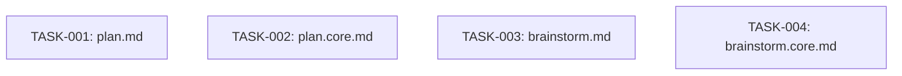

# Technical Design: enforce-workflow-boundaries

## Metadata
- **Feature**: enforce-workflow-boundaries
- **Status**: APPROVED
- **Created**: 2026-02-05
- **Author**: /mahabharatha:design

---

## 1. Overview

### 1.1 Summary
Add explicit WORKFLOW BOUNDARY sections to `/z:plan` and `/z:brainstorm` commands preventing auto-progression to the next workflow phase. This is prompt-level enforcement via documentation changes only.

### 1.2 Goals
- Prevent `/z:plan` from ever auto-running `/z:design` or implementation
- Prevent `/z:brainstorm` from ever auto-running `/z:plan`
- Ensure user maintains explicit control over workflow progression

### 1.3 Non-Goals
- Programmatic enforcement in Python code
- Changes to `/z:design`, `/z:kurukshetra`, or other commands
- CI/CD validation of workflow boundaries

---

## 2. Architecture

### 2.1 High-Level Design

No architecture changes. This is documentation-only.

```
┌─────────────────┐     HARD STOP     ┌─────────────────┐
│  /z:brainstorm  │ ──────────────→   │     USER        │
└─────────────────┘                   │  (manual run)   │
                                      └────────┬────────┘
                                               │
                                               ▼
┌─────────────────┐     HARD STOP     ┌─────────────────┐
│    /z:plan      │ ──────────────→   │     USER        │
└─────────────────┘                   │  (manual run)   │
                                      └────────┬────────┘
                                               │
                                               ▼
                                      ┌─────────────────┐
                                      │   /z:design     │
                                      └─────────────────┘
```

### 2.2 Component Breakdown

| Component | Responsibility | Files |
|-----------|---------------|-------|
| plan.md | WORKFLOW BOUNDARY section, simplified Phase 5.5 | mahabharatha/data/commands/plan.md |
| plan.core.md | Same changes (keep in sync) | mahabharatha/data/commands/plan.core.md |
| brainstorm.md | WORKFLOW BOUNDARY section, AskUserQuestion handoff | mahabharatha/data/commands/brainstorm.md |
| brainstorm.core.md | Same changes (keep in sync) | mahabharatha/data/commands/brainstorm.core.md |

### 2.3 Data Flow

N/A — Prompt documentation only.

---

## 3. Detailed Design

### 3.1 WORKFLOW BOUNDARY Section Template

Add at TOP of each command file (after title, before Flags):

```markdown
## ⛔ WORKFLOW BOUNDARY (NON-NEGOTIABLE)

This command MUST NEVER:
- Automatically run {next-command} or any {next-phase} phase
- Automatically proceed to {downstream-phase}
- Call the Skill tool to invoke another command
- Write code or make code changes

After Phase {N} completes, the command STOPS. The user must manually run {next-command}.
```

### 3.2 plan.md Changes

1. Add WORKFLOW BOUNDARY section after title (before ## Flags)
2. Update Phase 5.5 to remove "Run /z:design now" option (keep 2 options only)
3. Add ⛔ warning after Phase 5.5

### 3.3 brainstorm.md Changes

1. Add WORKFLOW BOUNDARY section after title (before ## Flags)
2. Update Phase 4 (Handoff) to use AskUserQuestion with 2 options
3. Add ⛔ warning after Phase 4

---

## 4. Key Decisions

### 4.1 Prompt-Level Enforcement Only

**Context**: Could enforce workflow boundaries in Python orchestrator code.

**Decision**: Prompt-level only

**Rationale**: The issue is Claude's interpretation, not code behavior. Direct instruction is the fix.

### 4.2 Remove "Run now" Option

**Context**: Phase 5.5 of plan.md has "Run /z:design now" which could confuse.

**Decision**: Remove it, keep only "Clear context, then /z:design" and "Stop here"

**Rationale**: Eliminates any ambiguity about auto-execution permission.

---

## 5. Implementation Plan

### 5.1 Phase Summary

| Phase | Tasks | Parallel | Est. Time |
|-------|-------|----------|-----------|
| Core | 4 | Yes (pairs) | 10 min |

### 5.2 File Ownership

| File | Task ID | Operation |
|------|---------|-----------|
| mahabharatha/data/commands/plan.md | TASK-001 | modify |
| mahabharatha/data/commands/plan.core.md | TASK-002 | modify |
| mahabharatha/data/commands/brainstorm.md | TASK-003 | modify |
| mahabharatha/data/commands/brainstorm.core.md | TASK-004 | modify |

### 5.3 Dependency Graph



All tasks are independent (Level 1). No dependencies.

---

## 6. Risk Assessment

| Risk | Probability | Impact | Mitigation |
|------|-------------|--------|------------|
| Claude ignores HARD STOP | Low | Med | Use prominent ⛔ emoji and ALL CAPS |
| Files get out of sync | Low | Low | Tasks update both .md and .core.md |

---

## 7. Testing Strategy

### 7.1 Unit Tests
N/A — No code changes.

### 7.2 Integration Tests
N/A — No code changes.

### 7.3 Verification Commands

Manual verification:
- Read each modified file, confirm WORKFLOW BOUNDARY section present
- Confirm plan.md Phase 5.5 has only 2 options
- Confirm brainstorm.md Phase 4 has AskUserQuestion

---

## 8. Parallel Execution Notes

### 8.1 Safe Parallelization
- All 4 tasks are Level 1 (no dependencies)
- Each task owns exactly one file
- Can run all 4 in parallel

### 8.2 Recommended Workers
- Minimum: 1 worker
- Optimal: 2 workers (plan pair + brainstorm pair)
- Maximum: 4 workers

### 8.3 Estimated Duration
- Single worker: 10 min
- With 2 workers: 5 min
- Speedup: 2x

---

## 9. Approval

| Role | Name | Date | Signature |
|------|------|------|-----------|
| Architecture | | | PENDING |
| Engineering | | | PENDING |
