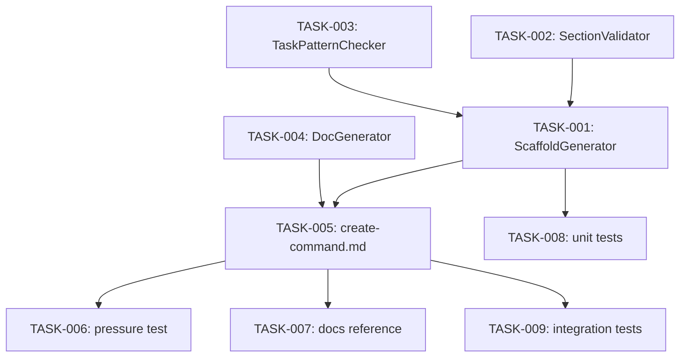

# Technical Design: Command Authoring Framework (GitHub Issue #64)

## Metadata
- **Feature**: github-issue-64
- **Status**: APPROVED
- **Created**: 2026-02-04
- **Author**: Factory Design Mode

---

## 1. Overview

### 1.1 Summary
Extend MAHABHARATHA's command validation infrastructure with authoring capabilities: scaffold new commands from templates with Task ecosystem boilerplate, validate required sections and patterns, generate pressure test scaffolds, and auto-generate documentation.

### 1.2 Goals
- Reduce command authoring friction (copy → scaffold, validate → live feedback)
- Prevent Task ecosystem drift via automated pattern validation
- Enable behavioral testing via pressure test framework
- Keep documentation in sync via auto-generation

### 1.3 Non-Goals
- GUI/TUI authoring interface
- AI-assisted command generation
- Automatic migration of old command formats

---

## 2. Architecture

### 2.1 High-Level Design

```
┌─────────────────────────────────────────────────────────────┐
│                    /mahabharatha:create-command                     │
│                   (slash command file)                      │
└────────────────────────┬────────────────────────────────────┘
                         │ invokes
                         ▼
┌─────────────────────────────────────────────────────────────┐
│               validate_commands.py (extended)               │
│  ┌─────────────┐ ┌─────────────┐ ┌─────────────────────────┐│
│  │ Validation  │ │  Scaffold   │ │   Documentation Gen     ││
│  │  (existing) │ │  (new)      │ │   (new)                 ││
│  └─────────────┘ └─────────────┘ └─────────────────────────┘│
└─────────────────────────────────────────────────────────────┘
                         │ writes
                         ▼
┌─────────────────────────────────────────────────────────────┐
│                    Generated Artifacts                       │
│  ┌─────────────┐ ┌─────────────┐ ┌─────────────────────────┐│
│  │ {cmd}.md    │ │test_{cmd}.py│ │ docs/commands/{cmd}.md  ││
│  │ (+.core.md) │ │ (pressure)  │ │ (+wiki index update)    ││
│  └─────────────┘ └─────────────┘ └─────────────────────────┘│
└─────────────────────────────────────────────────────────────┘
```

### 2.2 Component Breakdown

| Component | Responsibility | Location |
|-----------|---------------|----------|
| ScaffoldGenerator | Generate command files from template | validate_commands.py |
| SectionValidator | Check required sections exist | validate_commands.py |
| TaskPatternChecker | Validate Task tool call patterns | validate_commands.py |
| PressureTestScaffold | Generate test file skeleton | validate_commands.py |
| DocGenerator | Extract docs from command files | validate_commands.py |
| create-command.md | Slash command interface | mahabharatha/data/commands/ |

### 2.3 Data Flow

1. User invokes `/mahabharatha:create-command foo`
2. Command reads _template.md
3. Replaces placeholders with command metadata
4. Injects Task tracking boilerplate
5. Writes foo.md (and .core.md/.details.md if >300 lines)
6. Generates tests/pressure/test_foo.py scaffold
7. Generates docs/commands/foo.md reference
8. Updates docs/commands.md index

---

## 3. Detailed Design

### 3.1 Scaffold Generator

```python
# In validate_commands.py

class ScaffoldGenerator:
    """Generate command files from _template.md."""

    def __init__(self, commands_dir: Path):
        self.commands_dir = commands_dir
        self.template_path = commands_dir / "_template.md"

    def scaffold(
        self,
        name: str,
        description: str = "",
        flags: list[dict] | None = None,
        interactive: bool = False,
    ) -> Path:
        """Generate command file from template.

        Args:
            name: Command name (e.g., "my-command")
            description: One-line description
            flags: List of {name, default, description} dicts
            interactive: If True, prompt for missing metadata

        Returns:
            Path to created command file
        """
        ...
```

### 3.2 Section Validator

Required sections (configurable):
- **Pre-Flight** or **Pre-flight**: Setup and validation logic
- **Task Tracking**: TaskCreate/TaskUpdate pattern
- **Help**: Help text for --help flag

```python
REQUIRED_SECTIONS = {
    "pre-flight": ["Pre-Flight", "Pre-flight", "Preflight"],
    "task_tracking": ["Task Tracking"],
    "help": ["Help"],
}

def validate_required_sections(filepath: Path) -> tuple[bool, list[str]]:
    """Check that required sections exist in command file."""
    ...
```

### 3.3 Task Pattern Checker

Validates Task ecosystem integration matches minimum pattern:

```python
TASK_PATTERN_RULES = [
    {
        "name": "lifecycle_start",
        "pattern": r"TaskCreate:\s*\n\s*-\s*subject:",
        "message": "Missing TaskCreate with subject field",
    },
    {
        "name": "lifecycle_update",
        "pattern": r"TaskUpdate:\s*\n\s*-\s*taskId:",
        "message": "Missing TaskUpdate with taskId field",
    },
    {
        "name": "status_in_progress",
        "pattern": r'status:\s*["\']?in_progress',
        "message": "Missing status: in_progress transition",
    },
    {
        "name": "status_completed",
        "pattern": r'status:\s*["\']?completed',
        "message": "Missing status: completed transition",
    },
]
```

### 3.4 Pressure Test Scaffold

Generated test structure:

```python
# tests/pressure/test_{name}.py
"""Pressure tests for /mahabharatha:{name} command."""

import pytest
from pathlib import Path

COMMAND_FILE = Path("mahabharatha/data/commands/{name}.md")


class TestCommand{Name}:
    """Verify /mahabharatha:{name} command behavior."""

    def test_command_file_exists(self):
        """Command file must exist."""
        assert COMMAND_FILE.exists()

    def test_passes_validation(self):
        """Command must pass validate_commands checks."""
        from mahabharatha.validate_commands import validate_task_references
        passed, errors = validate_task_references(COMMAND_FILE.parent)
        # Filter to just this command
        relevant = [e for e in errors if "{name}" in e]
        assert not relevant, relevant

    def test_has_required_sections(self):
        """Command must have Pre-Flight, Task Tracking, Help."""
        content = COMMAND_FILE.read_text()
        assert "## Pre-Flight" in content or "## Pre-flight" in content
        assert "## Task Tracking" in content
        assert "## Help" in content

    @pytest.mark.skip(reason="Pressure test - manual verification")
    def test_execution_without_command(self):
        """Verify behavior when command not loaded."""
        # TODO: Implement pressure test
        pass

    @pytest.mark.skip(reason="Pressure test - manual verification")
    def test_execution_with_command(self):
        """Verify behavior when command is loaded."""
        # TODO: Implement pressure test
        pass
```

### 3.5 Documentation Generator

```python
class DocGenerator:
    """Generate documentation from command files."""

    def __init__(self, commands_dir: Path, docs_dir: Path):
        self.commands_dir = commands_dir
        self.docs_dir = docs_dir

    def generate_command_doc(self, name: str) -> Path:
        """Generate docs/commands/{name}.md from command file."""
        ...

    def update_wiki_index(self, name: str, description: str) -> None:
        """Add entry to docs/commands.md index."""
        ...

    def extract_help_text(self, filepath: Path) -> str:
        """Extract help block from command file."""
        ...
```

---

## 4. Key Decisions

### 4.1 Extend validate_commands.py vs New Module

**Context**: Requirements specify authoring functions in validate_commands.py.

**Options Considered**:
1. New module (mahabharatha/command_authoring.py): Cleaner separation
2. Extend validate_commands.py: Single source of truth, specified in requirements

**Decision**: Extend validate_commands.py

**Rationale**: Requirements explicitly state "Extend existing validate_commands.py (single source of truth)" (NFR-1). Keeps validation and authoring co-located.

**Consequences**: validate_commands.py grows from 630 to ~900 lines. Consider splitting later if maintenance burden increases.

### 4.2 Pressure Tests Optional

**Context**: Should pressure tests be required to ship commands?

**Decision**: Optional (FR-3.4)

**Rationale**: Passing pressure tests NOT required to ship. Framework provides scaffolds and basic structural tests that run, but behavioral tests require human judgment.

---

## 5. Implementation Plan

### 5.1 Phase Summary

| Phase | Tasks | Parallel |
|-------|-------|----------|
| Foundation (L1) | 3 | Yes |
| Core (L2) | 2 | Yes |
| Integration (L3) | 2 | Yes |
| Testing (L4) | 2 | Yes |

### 5.2 File Ownership

| File | Task ID | Operation |
|------|---------|-----------|
| mahabharatha/validate_commands.py | TASK-001, TASK-002, TASK-003, TASK-004 | modify |
| mahabharatha/data/commands/create-command.md | TASK-005 | create |
| tests/pressure/test_create_command.py | TASK-006 | create |
| docs/commands/create-command.md | TASK-007 | create |
| tests/unit/test_scaffold_generator.py | TASK-008 | create |
| tests/integration/test_authoring_flow.py | TASK-009 | create |

### 5.3 Consumer Matrix

| Task | Creates/Modifies | Consumed By | Integration Test |
|------|-----------------|-------------|------------------|
| TASK-001 | ScaffoldGenerator in validate_commands.py | TASK-005 (command), TASK-008 (tests) | tests/integration/test_authoring_flow.py |
| TASK-002 | SectionValidator in validate_commands.py | TASK-001, TASK-005 | tests/integration/test_authoring_flow.py |
| TASK-003 | TaskPatternChecker in validate_commands.py | TASK-001, TASK-005 | tests/integration/test_authoring_flow.py |
| TASK-004 | DocGenerator in validate_commands.py | TASK-005, TASK-007 | tests/integration/test_authoring_flow.py |
| TASK-005 | mahabharatha/data/commands/create-command.md | leaf (user-invoked) | — |
| TASK-006 | tests/pressure/test_create_command.py | leaf (test file) | — |
| TASK-007 | docs/commands/create-command.md | leaf (documentation) | — |
| TASK-008 | tests/unit/test_scaffold_generator.py | leaf (test file) | — |
| TASK-009 | tests/integration/test_authoring_flow.py | leaf (test file) | — |

### 5.4 Dependency Graph



---

## 6. Risk Assessment

| Risk | Probability | Impact | Mitigation |
|------|-------------|--------|------------|
| validate_commands.py too large | Medium | Low | Accept for now, split in future if needed |
| Section validation too strict | Low | High | Warn-only mode by default, strict opt-in |
| Pressure tests confusing | Medium | Low | Clear documentation, skip by default |

---

## 7. Testing Strategy

### 7.1 Unit Tests
- ScaffoldGenerator.scaffold() creates valid file
- SectionValidator detects missing sections
- TaskPatternChecker finds missing patterns
- DocGenerator extracts correct content

### 7.2 Integration Tests
- Full authoring flow: scaffold → validate → generate docs
- Generated command passes validation
- Pressure test scaffold is runnable

### 7.3 Verification Commands

```bash
# Unit tests
pytest tests/unit/test_scaffold_generator.py -v

# Integration tests
pytest tests/integration/test_authoring_flow.py -v

# Validation check
python -m mahabharatha.validate_commands

# Full test suite
pytest tests/ -x --timeout=60
```

---

## 8. Parallel Execution Notes

### 8.1 Safe Parallelization
- Level 1 (Foundation): TASK-002, TASK-003 can run in parallel (no shared files)
- Level 2 (Core): TASK-001, TASK-004 can run after L1 completes
- Level 3 (Integration): TASK-005 after L2 completes
- Level 4 (Testing): TASK-006, TASK-007, TASK-008, TASK-009 can run in parallel

### 8.2 Recommended Workers
- Minimum: 2 workers
- Optimal: 4 workers (based on widest level)
- Maximum: 4 workers (diminishing returns beyond)

---

## 9. Approval

| Role | Name | Date | Signature |
|------|------|------|-----------|
| Architecture | | | PENDING |
| Engineering | | | PENDING |
