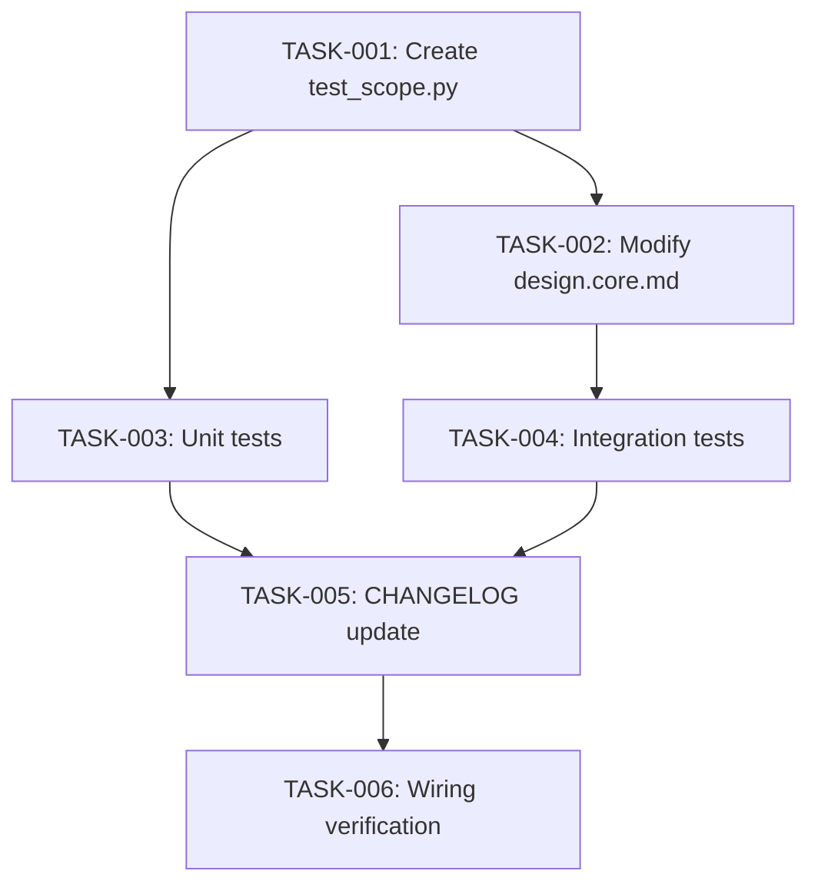

# Technical Design: github-issue-98

## Metadata
- **Feature**: github-issue-98
- **Status**: APPROVED
- **Created**: 2026-02-04
- **Author**: Factory Design Mode

---

## 1. Overview

### 1.1 Summary
Modify the `/zerg:design` command instructions to auto-inject a mandatory wiring verification task into Level 5 (Quality) of every generated task graph. The wiring task runs `python -m zerg.validate_commands` followed by scoped pytest to verify all new modules have production callers and tests pass.

### 1.2 Goals
- Auto-inject wiring verification task into every task graph at L5
- Deterministic verification (no AI/LLM inference)
- Scoped pytest execution (new + affected tests only)
- Fail fast on broken imports or orphaned modules

### 1.3 Non-Goals
- Full test suite execution (too slow)
- AI-based code review
- Security scanning (handled by `/zerg:analyze`)

---

## 2. Architecture

### 2.1 High-Level Design

```
┌─────────────────┐     ┌─────────────────┐     ┌─────────────────┐
│  /zerg:design   │────▶│  Task Graph     │────▶│  Workers        │
│  (design.core.md)     │  Generation     │     │  Execute Tasks  │
└─────────────────┘     └─────────────────┘     └─────────────────┘
                               │
                               ▼
                        ┌─────────────────┐
                        │  L5: Wiring     │
                        │  Verification   │
                        │  (auto-injected)│
                        └─────────────────┘
```

### 2.2 Component Breakdown

| Component | Responsibility | Files |
|-----------|---------------|-------|
| Design Command | Prompt instructions to inject wiring task | `zerg/data/commands/design.core.md` |
| Wiring Task | Task definition template for L5 | (embedded in design.core.md) |
| Test Scope Helper | Generate pytest path filter from task files | `zerg/test_scope.py` |

### 2.3 Data Flow

1. User runs `/zerg:design`
2. Claude generates task-graph.json following design.core.md instructions
3. **NEW**: Instructions mandate appending wiring verification task to L5
4. Wiring task depends on all L4 tasks
5. Workers execute L1-L4 tasks
6. Final worker executes wiring task with scoped pytest

---

## 3. Detailed Design

### 3.1 Wiring Task Template

The following task definition is injected into every task graph as the last task:

```json
{
  "id": "TASK-{N}",
  "title": "Run wiring verification",
  "description": "Verify all new modules have production callers and imports resolve. Run validate_commands for structural checks, then scoped pytest for new + affected tests.",
  "phase": "quality",
  "level": 5,
  "dependencies": ["<all L4 task IDs>"],
  "files": {
    "create": [],
    "modify": [],
    "read": ["zerg/**/*.py", "tests/**/*.py"]
  },
  "verification": {
    "command": "python -m zerg.validate_commands && python -m pytest {test_paths} -x --timeout=60 -q",
    "timeout_seconds": 120
  },
  "estimate_minutes": 5,
  "skills_required": [],
  "consumers": [],
  "integration_test": null
}
```

### 3.2 Test Scope Detection

The wiring task verification command includes a pytest path filter built from:

1. **New test files**: `files.create` entries matching `tests/**/*.py` from all tasks
2. **Affected tests**: Tests that import modules from `files.create` or `files.modify`

Example verification command:
```bash
python -m zerg.validate_commands && python -m pytest tests/unit/test_new_module.py tests/integration/test_affected.py -x --timeout=60 -q
```

### 3.3 Test Scope Helper Module

A new helper module `zerg/test_scope.py` provides programmatic test scope detection:

```python
def get_scoped_test_paths(task_graph: TaskGraph) -> list[str]:
    """Extract test paths from task graph files.create/modify lists."""
    ...

def find_affected_tests(modified_modules: list[str], tests_dir: Path) -> list[str]:
    """Find tests that import any of the modified modules."""
    ...
```

---

## 4. Key Decisions

### 4.1 Decision: Embed Instructions in design.core.md

**Context**: The wiring task injection could happen at prompt-time (via design.core.md instructions) or at runtime (via Python code in parser.py).

**Options Considered**:
1. **Prompt-time injection**: Modify design.core.md to instruct Claude to always append wiring task
   - Pros: Zero code changes, works with existing task graph generation flow
   - Cons: Relies on Claude following instructions exactly
2. **Runtime injection**: Modify TaskParser to auto-inject wiring task after parsing
   - Pros: Guaranteed injection, deterministic
   - Cons: More complex, requires schema changes, harder to customize per-feature
3. **Hybrid**: Prompt-time with runtime validation
   - Pros: Best of both — flexible generation, validated enforcement
   - Cons: More moving parts

**Decision**: Option 1 (Prompt-time injection)

**Rationale**: The task graph is fully prompt-generated today. Adding Python-side injection would introduce a parallel code path that must stay in sync with the prompt. By keeping it prompt-driven, customization is easier and the change is minimal.

**Consequences**: We add explicit wiring task injection instructions to Phase 3 of design.core.md.

### 4.2 Decision: Test Scope Helper Module

**Context**: The verification command needs a pytest path filter. This could be hardcoded, generated inline by Claude, or computed by a helper module.

**Options Considered**:
1. **Hardcoded full suite**: `pytest tests/ -x`
   - Pros: Simple
   - Cons: Too slow, violates NFR-1
2. **Inline generation**: Claude generates paths based on task files
   - Pros: No new code
   - Cons: Error-prone, verbose task definitions
3. **Helper module**: `python -m zerg.test_scope` generates paths
   - Pros: Reusable, testable, accurate
   - Cons: New module to maintain

**Decision**: Option 3 (Helper module)

**Rationale**: Test scope detection requires AST analysis to find imports. A dedicated module is more reliable than inline prompt logic and can be unit tested.

**Consequences**: We create `zerg/test_scope.py` with `get_scoped_test_paths()` function.

---

## 5. Implementation Plan

### 5.1 Phase Summary

| Phase | Tasks | Parallel | Est. Time |
|-------|-------|----------|-----------|
| Foundation | 1 | Yes | 10 min |
| Core | 1 | Yes | 20 min |
| Integration | 1 | Yes | 15 min |
| Testing | 2 | Yes | 20 min |
| Quality | 2 | No | 10 min |

### 5.2 File Ownership

| File | Task ID | Operation |
|------|---------|-----------|
| `zerg/test_scope.py` | TASK-001 | create |
| `zerg/data/commands/design.core.md` | TASK-002 | modify |
| `tests/unit/test_test_scope.py` | TASK-003 | create |
| `tests/integration/test_design_wiring_injection.py` | TASK-004 | create |
| `CHANGELOG.md` | TASK-005 | modify |

### 5.3 Dependency Graph



---

## 6. Risk Assessment

| Risk | Probability | Impact | Mitigation |
|------|-------------|--------|------------|
| Claude doesn't follow injection instructions | Low | Med | Add validation in TaskParser |
| Test scope detection misses affected tests | Med | Low | Conservative fallback: run all tests |
| pytest-timeout not installed | Low | High | Already in dev dependencies |

---

## 7. Testing Strategy

### 7.1 Unit Tests
- `test_test_scope.py`: Test scope detection logic (new test files, affected tests)
- Test edge cases: no tests, all tests affected, nested imports

### 7.2 Integration Tests
- `test_design_wiring_injection.py`: Verify task graph generation includes wiring task
- Verify wiring task dependencies are correct (all L4 tasks)
- Verify verification command format

### 7.3 Verification Commands
- TASK-001: `python -c "from zerg.test_scope import get_scoped_test_paths"`
- TASK-002: `grep -q "Run wiring verification" zerg/data/commands/design.core.md`
- TASK-003: `pytest tests/unit/test_test_scope.py -v`
- TASK-004: `pytest tests/integration/test_design_wiring_injection.py -v`
- TASK-005: `grep -q "github-issue-98" CHANGELOG.md`
- TASK-006: `python -m zerg.validate_commands && pytest tests/ -x --timeout=60 -q`

---

## 8. Parallel Execution Notes

### 8.1 Safe Parallelization
- TASK-001 (test_scope.py) has no dependencies
- TASK-002 depends on TASK-001 (needs to reference test_scope)
- TASK-003 and TASK-004 can run in parallel after their dependencies complete
- TASK-005 and TASK-006 are sequential (L5)

### 8.2 Recommended Workers
- Minimum: 1 worker (sequential execution)
- Optimal: 2 workers (L3/L4 parallelization)
- Maximum: 2 workers (graph width limited)

### 8.3 Estimated Duration
- Single worker: ~75 min
- With 2 workers: ~55 min
- Speedup: 1.4x

---

## 9. Approval

| Role | Name | Date | Signature |
|------|------|------|-----------|
| Architecture | | | PENDING |
| Engineering | | | PENDING |
