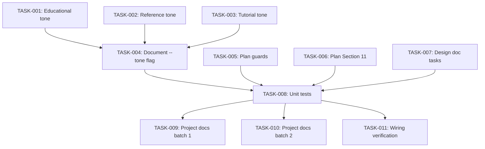

# Technical Design: github-issues-129-163-165

## Metadata
- **Feature**: github-issues-129-163-165
- **Status**: DRAFT
- **Created**: 2026-02-07
- **Author**: Factory Design Mode

---

## 1. Overview

### 1.1 Summary
Three prompt-level and one code-level change across MAHABHARATHA's documentation, planning, and design commands. The `--tone` flag adds tone-controlled documentation generation to `/mahabharatha:document` (with 3 tone definition files). Anti-implementation guards harden `/z:plan` against workflow drift. A new Section 11 in the plan template and mandatory doc tasks in the design command ensure documentation stays current. All project docs are updated to reflect these changes.

### 1.2 Goals
- Educational documentation as default output from `/mahabharatha:document`
- Zero-tolerance plan→design→kurukshetra workflow boundary enforcement
- Documentation drift eliminated via systematic impact tracking

### 1.3 Non-Goals
- Python-level runtime enforcement of workflow boundaries (deferred)
- Programmatic tone transformation engine (tone is prompt-level)
- Splitting `document.md` (stays under 300 lines)

---

## 2. Architecture

### 2.1 High-Level Design

```
┌─────────────────────────────────────────────────────┐
│                 Slash Commands (prompt layer)        │
│                                                     │
│  ┌──────────┐  ┌──────────┐  ┌──────────────────┐  │
│  │ plan.md  │  │design.md │  │  document.md     │  │
│  │ +guards  │  │ +doc     │  │  +--tone flag    │  │
│  │          │  │  tasks   │  │  reads tone/*.md │  │
│  └──────────┘  └──────────┘  └──────────────────┘  │
│                                       │             │
│                              ┌────────▼─────────┐   │
│                              │ mahabharatha/data/tones/  │   │
│                              │ ├ educational.md  │   │
│                              │ ├ reference.md    │   │
│                              │ └ tutorial.md     │   │
│                              └──────────────────┘   │
│                                                     │
│  ┌──────────────────────────────────────────────┐   │
│  │ mahabharatha/commands/document.py  (+--tone option)  │   │
│  └──────────────────────────────────────────────┘   │
└─────────────────────────────────────────────────────┘
```

### 2.2 Component Breakdown

| Component | Responsibility | Files |
|-----------|---------------|-------|
| Tone Definitions | Define output style for each tone | `mahabharatha/data/tones/{educational,reference,tutorial}.md` |
| Document Command (Python) | Parse `--tone` flag, pass to renderer | `mahabharatha/commands/document.py` |
| Document Command (Prompt) | Instruct Claude to load and apply tone | `mahabharatha/data/commands/document.md` |
| Plan Core (Prompt) | Anti-implementation guards at 4+ locations | `mahabharatha/data/commands/plan.core.md` |
| Plan Parent (Prompt) | Sync guards with core file | `mahabharatha/data/commands/plan.md` |
| Plan Details (Prompt) | Section 11 in requirements template | `mahabharatha/data/commands/plan.details.md` |
| Design Core (Prompt) | Mandatory doc task generation | `mahabharatha/data/commands/design.core.md` |
| Design Parent (Prompt) | Sync doc task guidance with core | `mahabharatha/data/commands/design.md` |
| Project Docs | Keep docs current with changes | README, CHANGELOG, wiki, command refs |

### 2.3 Data Flow

1. User invokes `/mahabharatha:document target --tone educational`
2. Click parses `--tone` flag (default: `educational`)
3. Python passes tone to DocRenderer
4. Prompt layer reads `mahabharatha/data/tones/educational.md` for style instructions
5. DocRenderer generates documentation following tone guidelines
6. Output to stdout or `--output` path

---

## 3. Detailed Design

### 3.1 Tone Flag (document.py)

```python
@click.option(
    "--tone",
    type=click.Choice(["educational", "reference", "tutorial"]),
    default="educational",
    help="Documentation tone (default: educational)",
)
```

The tone string is passed to DocRenderer.render() and stored for prompt-layer use. The renderer loads the corresponding tone definition file.

### 3.2 Tone Definition Files

Each tone file at `mahabharatha/data/tones/{tone}.md` contains:
- Tone name and description
- Output structure template
- Required sections per concept
- Example output format

**Educational** (default): CONCEPT → NARRATIVE → DIAGRAM → COMMAND sections for every concept. Explanatory, teaches "why" not just "what".

**Reference**: Terse tables, API signatures, parameter lists. Current behavior preserved for backward compatibility.

**Tutorial**: Step-by-step walkthrough with simulated dialogue, progressive complexity.

### 3.3 Plan Anti-Implementation Guards

Four guard locations in `plan.core.md`:
1. **Top-of-file banner** (existing, strengthen)
2. **Before Phase 2** (new) — "DO NOT write code"
3. **Before Phase 5** (new) — "DO NOT proceed to design"
4. **Post-approval section** (existing, strengthen) — "PLANNING COMPLETE" banner

Terminal output format:
```
═══════════════════════════════════════════════════════════════
                    ⛔ PLANNING COMPLETE ⛔
═══════════════════════════════════════════════════════════════

This command has finished. DO NOT proceed to implementation.
The user must manually run /z:design to continue.

EXIT NOW — do not write code, do not invoke other commands.
═══════════════════════════════════════════════════════════════
```

### 3.4 Documentation Impact Analysis (Section 11)

Added to `plan.details.md` requirements template after Section 10:

```markdown
## 11. Documentation Impact Analysis

### 11.1 Files Requiring Documentation Updates
| File | Current State | Required Update | Priority |
|------|--------------|-----------------|----------|

### 11.2 Documentation Tasks for Design Phase
- [ ] CHANGELOG.md update task (ALWAYS required)
- [ ] README.md update (if applicable)
- [ ] Command reference updates (if command/flag functionality changed)
- [ ] CLAUDE.md update (if project conventions changed)
- [ ] Wiki updates (if user-facing behavior changed)
```

### 3.5 Mandatory Doc Tasks in Design

`design.core.md` gets a new subsection in Phase 2 requiring:
- CHANGELOG.md task ALWAYS in Level 5
- Doc update tasks when command/flag behavior changes

---

## 4. Key Decisions

### 4.1 Tone as Prompt-Level Directive

**Context**: Need to control documentation output style.

**Options Considered**:
1. Programmatic tone engine in Python: Complex, requires template system
2. Prompt-level directive via tone files: Simple, extensible, no code complexity
3. Hardcoded tone templates in renderer: Not extensible

**Decision**: Prompt-level directive (option 2)

**Rationale**: Adding a tone file = adding a new tone. No code changes needed. Claude reads the tone file and follows its instructions. This is the simplest approach that works.

**Consequences**: Tone quality depends on prompt engineering, not code logic. New tones are trivially added.

### 4.2 Guard Placement Strategy

**Context**: `/z:plan` sometimes auto-implements despite existing guard.

**Options Considered**:
1. Single stronger guard at top: Insufficient — Claude forgets by Phase 5
2. Redundant guards at 4 locations: Repetitive but effective
3. Python-level enforcement: Complex, requires intercepting tool calls

**Decision**: Redundant guards at 4 locations (option 2)

**Rationale**: Claude's context window means single guards get forgotten. Redundancy at decision boundaries (before code-touching phases) is the most cost-effective prevention.

**Consequences**: Slightly longer command file but well within 300-line split threshold.

---

## 5. Implementation Plan

### 5.1 Phase Summary

| Phase | Tasks | Parallel | Est. Time |
|-------|-------|----------|-----------|
| Foundation (L1) | 3 | Yes | 15 min |
| Core (L2) | 3 | Yes | 20 min |
| Integration (L3) | 2 | Yes | 15 min |
| Testing (L4) | 1 | No | 15 min |
| Quality (L5) | 2 | Yes | 15 min |

### 5.2 File Ownership

| File | Task ID | Operation |
|------|---------|-----------|
| `mahabharatha/data/tones/educational.md` | TASK-001 | create |
| `mahabharatha/data/tones/reference.md` | TASK-002 | create |
| `mahabharatha/data/tones/tutorial.md` | TASK-003 | create |
| `mahabharatha/commands/document.py` | TASK-004 | modify |
| `mahabharatha/data/commands/document.md` | TASK-004 | modify |
| `mahabharatha/data/commands/plan.core.md` | TASK-005 | modify |
| `mahabharatha/data/commands/plan.md` | TASK-005 | modify |
| `mahabharatha/data/commands/plan.details.md` | TASK-006 | modify |
| `mahabharatha/data/commands/design.core.md` | TASK-007 | modify |
| `mahabharatha/data/commands/design.md` | TASK-007 | modify |
| `tests/unit/test_document_tone.py` | TASK-008 | create |
| `CHANGELOG.md` | TASK-009 | modify |
| `README.md` | TASK-009 | modify |
| `docs/commands-quick.md` | TASK-009 | modify |
| `docs/commands-deep.md` | TASK-009 | modify |
| `.gsd/wiki/Command-Reference.md` | TASK-010 | modify |
| `.gsd/wiki/Tutorial.md` | TASK-010 | modify |
| `CLAUDE.md` | TASK-010 | modify |

### 5.3 Dependency Graph



---

## 6. Risk Assessment

| Risk | Probability | Impact | Mitigation |
|------|-------------|--------|------------|
| Plan guards insufficient (Claude ignores them) | Low | Med | 4 redundant locations + terminal banner |
| Tone files too vague for consistent output | Med | Low | Include concrete examples in each tone file |
| document.md exceeds 300-line split threshold | Low | Low | Monitor line count, split if needed |
| Parent/core file sync drift | Med | Med | Modify both in same task |

---

## 7. Testing Strategy

### 7.1 Unit Tests
- `--tone` flag parsing: default (educational), explicit (reference, tutorial), invalid (error)
- `--tone` passed to renderer correctly
- Tone definition files exist at expected paths

### 7.2 Integration Tests
- `validate_commands` passes after all changes
- No drift in command files (Task tool references preserved)

### 7.3 Verification Commands
- `python -m pytest tests/unit/test_document_tone.py -x -q`
- `python -m mahabharatha.validate_commands`
- `grep -c "MUST NEVER" mahabharatha/data/commands/plan.core.md` (expect >= 4 guard markers)

---

## 8. Parallel Execution Notes

### 8.1 Safe Parallelization
- Level 1: 3 tone files, fully parallel, no shared files
- Level 2: 3 tasks modifying disjoint command files, fully parallel
- Level 3: 2 doc tasks modifying disjoint doc sets, fully parallel
- No two tasks modify the same file

### 8.2 Recommended Workers
- Minimum: 1 worker (sequential by level)
- Optimal: 3 workers (widest level is L1/L2 at 3 tasks)
- Maximum: 3 workers (only 3 parallel at widest)

### 8.3 Estimated Duration
- Single worker: ~80 min
- With 3 workers: ~45 min
- Speedup: ~1.8x

---

## 9. Consumer Matrix

| Task | Creates/Modifies | Consumed By | Integration Test |
|------|-----------------|-------------|-----------------|
| TASK-001 | `mahabharatha/data/tones/educational.md` | TASK-004 | tests/unit/test_document_tone.py |
| TASK-002 | `mahabharatha/data/tones/reference.md` | TASK-004 | tests/unit/test_document_tone.py |
| TASK-003 | `mahabharatha/data/tones/tutorial.md` | TASK-004 | tests/unit/test_document_tone.py |
| TASK-004 | `mahabharatha/commands/document.py`, `document.md` | TASK-008 | tests/unit/test_document_tone.py |
| TASK-005 | `plan.core.md`, `plan.md` | leaf (prompt) | — |
| TASK-006 | `plan.details.md` | leaf (prompt) | — |
| TASK-007 | `design.core.md`, `design.md` | leaf (prompt) | — |
| TASK-008 | `tests/unit/test_document_tone.py` | leaf (test) | — |
| TASK-009 | CHANGELOG, README, docs/* | leaf (docs) | — |
| TASK-010 | wiki/*, CLAUDE.md | leaf (docs) | — |
| TASK-011 | (none — verification only) | leaf | — |

---

## 10. Approval

| Role | Name | Date | Signature |
|------|------|------|-----------|
| Architecture | | | PENDING |
| Engineering | | | PENDING |
