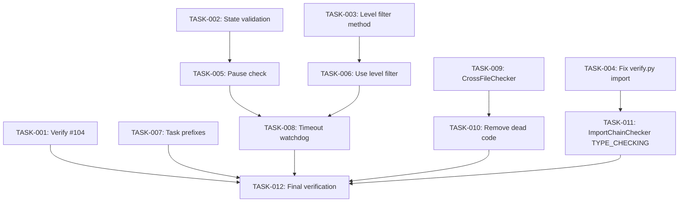

# Technical Design: GitHub Issues #104-111 Quality Gates & Orchestrator Resilience

## Metadata
- **Feature**: github-issues-batch
- **Status**: APPROVED
- **Created**: 2026-02-03
- **Author**: Factory Design Mode

---

## 1. Overview

### 1.1 Summary
Fix 8 GitHub issues covering quality gate improvements (#104-107) and orchestrator resilience (#108-111). The core changes involve adding state machine validation, pause-aware task claiming, level-filtered task assignment, worker timeout watchdog, and reducing false positives in static analysis checkers.

### 1.2 Goals
- Close all 8 issues with verified fixes
- Improve worker resilience to orchestrator state changes
- Reduce CrossFileChecker false positives from ~89% to <20%
- Ensure Task ecosystem conventions are consistent across all commands

### 1.3 Non-Goals
- Refactoring orchestrator architecture beyond bug fixes
- Adding new CLI commands
- Performance optimization unrelated to the bugs

---

## 2. Architecture

### 2.1 High-Level Design

```
┌─────────────────────┐     ┌─────────────────────┐
│    Orchestrator     │────▶│    StateManager     │
└─────────────────────┘     └─────────────────────┘
         │                           │
         │ pause/level signals       │ state.json
         ▼                           ▼
┌─────────────────────┐     ┌─────────────────────┐
│  WorkerProtocol     │◀────│  State Validation   │
│  - pause check      │     │  - transitions      │
│  - level filter     │     │  - level filter     │
│  - timeout watchdog │     └─────────────────────┘
└─────────────────────┘
```

### 2.2 Component Breakdown

| Component | Responsibility | Files |
|-----------|---------------|-------|
| StateManager | State persistence, validation, level/status filtering | `mahabharatha/state.py` |
| WorkerProtocol | Task claiming with pause/level awareness | `mahabharatha/worker_protocol.py` |
| WorkerMain | Entry point with timeout watchdog | `mahabharatha/worker_main.py` |
| CrossFileChecker | Dead code detection | `mahabharatha/commands/analyze.py`, `mahabharatha/ast_cache.py` |
| ImportChainChecker | Import depth analysis | `mahabharatha/commands/analyze.py` |
| Command files | Task ecosystem conventions | `mahabharatha/data/commands/*.md` |

### 2.3 Data Flow

1. **Pause signal**: Orchestrator sets `paused=true` in state → Workers check `is_paused()` before claiming
2. **Level transitions**: Orchestrator sets `current_level` → Workers filter tasks by level
3. **State validation**: All `set_task_status()` calls validate transition legality

---

## 3. Detailed Design

### 3.1 State Machine Validation (#111)

```python
# mahabharatha/state.py - VALID_TRANSITIONS constant
VALID_TRANSITIONS: dict[str, set[str]] = {
    "pending": {"claimed", "in_progress", "failed"},
    "claimed": {"in_progress", "pending", "failed"},
    "in_progress": {"complete", "failed", "paused"},
    "complete": set(),  # Terminal - no further transitions
    "failed": {"pending"},  # Retry only
    "paused": {"in_progress", "failed"},  # Resume or fail
}

# In set_task_status() - add validation with warning (not error)
current_status = task_state.get("status")
if current_status and status_str not in VALID_TRANSITIONS.get(current_status, set()):
    logger.warning(f"Invalid transition: {current_status} -> {status_str} for {task_id}")
```

### 3.2 Level-Filtered Task Query (#110)

```python
# mahabharatha/state.py - new method
def get_tasks_by_status_and_level(
    self, status: TaskStatus | str, level: int
) -> list[str]:
    """Get task IDs with specific status AND level."""
    status_str = status.value if isinstance(status, TaskStatus) else status
    with self._lock:
        return [
            tid for tid, task in self._state.get("tasks", {}).items()
            if task.get("status") == status_str and task.get("level") == level
        ]
```

### 3.3 Pause Check in Task Claiming (#108)

```python
# mahabharatha/worker_protocol.py - claim_next_task() modification
def claim_next_task(self, ...) -> Task | None:
    while True:
        self.state.load()

        # Check pause state before claiming
        if self.state.is_paused():
            logger.info("Execution paused, not claiming tasks")
            time.sleep(poll_interval)
            continue  # Keep polling until unpaused or timeout

        # Use level-filtered query
        current_level = self.state.get_current_level()
        pending = self.state.get_tasks_by_status_and_level(
            TaskStatus.PENDING, current_level
        )
        # ... rest of claiming logic
```

### 3.4 Worker Timeout Watchdog (#109)

```python
# mahabharatha/worker_main.py - add signal handler and watchdog
import signal
import threading

def setup_timeout_watchdog(timeout_seconds: int = 3600) -> threading.Timer:
    """Set up a watchdog that terminates worker after timeout."""
    def timeout_handler():
        logger.error(f"Worker timeout after {timeout_seconds}s")
        sys.exit(124)  # Standard timeout exit code

    timer = threading.Timer(timeout_seconds, timeout_handler)
    timer.daemon = True
    timer.start()
    return timer
```

### 3.5 CrossFileChecker Improvements (#107)

```python
# mahabharatha/ast_cache.py - enhanced collect_imports to track same-module usage
def collect_same_module_usage(tree: ast.Module) -> set[str]:
    """Collect names used within the same module (function calls, attribute access)."""
    used: set[str] = set()
    for node in ast.walk(tree):
        if isinstance(node, ast.Name):
            used.add(node.id)
        elif isinstance(node, ast.Attribute):
            used.add(node.attr)
    return used

# mahabharatha/commands/analyze.py - CrossFileChecker modifications
# 1. Skip TYPE_CHECKING imports
# 2. Include same-module usage in "imported" set
# 3. Skip exception classes (usually caught, not imported)
```

### 3.6 ImportChainChecker TYPE_CHECKING Fix (#106)

```python
# mahabharatha/commands/analyze.py - skip TYPE_CHECKING block imports
def _is_under_type_checking(node: ast.AST, tree: ast.Module) -> bool:
    """Check if import is inside 'if TYPE_CHECKING:' block."""
    for if_node in ast.walk(tree):
        if isinstance(if_node, ast.If):
            test = if_node.test
            if (isinstance(test, ast.Name) and test.id == "TYPE_CHECKING") or \
               (isinstance(test, ast.Attribute) and test.attr == "TYPE_CHECKING"):
                # Check if node is in this block's body
                for child in ast.walk(if_node):
                    if child is node:
                        return True
    return False
```

---

## 4. Key Decisions

### 4.1 Warnings vs Errors for State Validation

**Context**: Invalid state transitions could indicate bugs, but failing hard would break existing workflows.

**Options Considered**:
1. Raise exception on invalid transition: Strict but breaking
2. Log warning and allow: Permissive, enables diagnosis
3. Log warning, record metric, allow: Full observability

**Decision**: Option 2 - Log warning and allow

**Rationale**: Backward compatibility is critical. Warnings provide visibility without breaking existing code. Can tighten later after monitoring.

**Consequences**: Some invalid transitions may slip through silently if logs aren't monitored.

### 4.2 Pause Polling vs Blocking

**Context**: When paused, workers could block or poll.

**Options Considered**:
1. Return None immediately: Fast but loses context
2. Poll until timeout: Maintains worker, may waste resources
3. Sleep with heartbeat: Balanced approach

**Decision**: Option 2 - Poll with backoff

**Rationale**: Workers are long-lived; polling keeps them ready for unpause. Backoff prevents busy-waiting.

---

## 5. Implementation Plan

### 5.1 Phase Summary

| Phase | Tasks | Parallel | Est. Time |
|-------|-------|----------|-----------|
| Foundation | 3 | Yes | 15m |
| Core | 3 | Yes | 20m |
| Conventions | 1 | No | 30m |
| Integration | 3 | Yes | 45m |
| Quality | 2 | Yes | 20m |

### 5.2 File Ownership

| File | Task ID | Operation |
|------|---------|-----------|
| `mahabharatha/state.py` | TASK-002, TASK-003 | modify |
| `mahabharatha/worker_protocol.py` | TASK-005, TASK-006 | modify |
| `mahabharatha/worker_main.py` | TASK-008 | modify |
| `mahabharatha/commands/analyze.py` | TASK-009, TASK-011 | modify |
| `mahabharatha/ast_cache.py` | TASK-009 | modify |
| `mahabharatha/data/commands/*.md` | TASK-007 | modify (17 files) |
| `CHANGELOG.md` | TASK-012 | modify |

### 5.3 Dependency Graph



---

## 6. Risk Assessment

| Risk | Probability | Impact | Mitigation |
|------|-------------|--------|------------|
| State validation breaks edge cases | Medium | Medium | Warnings only, not errors |
| Level filter misses tasks | Low | High | Fallback to unfiltered if level unknown |
| CrossFileChecker still has FPs | Medium | Low | Focus on obvious improvements, document remaining |
| Pause polling wastes CPU | Low | Low | Backoff with 10s max interval |

---

## 7. Testing Strategy

### 7.1 Unit Tests
- State transition validation (all valid + invalid cases)
- Level filter method
- Pause state checking
- Same-module usage collection

### 7.2 Integration Tests
- Worker respects pause signal
- Worker claims only from current level
- Timeout watchdog terminates properly

### 7.3 Verification Commands
```bash
# Foundation
python -c "from mahabharatha.state import StateManager; print('OK')"
ruff check .

# Core
python -c "from mahabharatha.worker_protocol import WorkerProtocol; print('OK')"

# Integration
pytest tests/unit/test_state*.py -x -q
pytest tests/unit/test_worker*.py -x -q

# Quality
python -m mahabharatha.validate_commands
pytest tests/integration -x -q --ignore=tests/integration/test_container_e2e_live.py
```

---

## 8. Parallel Execution Notes

### 8.1 Safe Parallelization
- Level 1 tasks have no dependencies, fully parallel
- Level 2 respects state.py completion before worker_protocol.py changes
- Level 3 (conventions) runs alone to avoid merge conflicts in 17 files
- Level 4 has independent integration tasks
- Level 5 serializes final verification

### 8.2 Recommended Workers
- Minimum: 1 worker (sequential)
- Optimal: 3 workers (max parallelization in Level 1/4)
- Maximum: 3 workers (no benefit beyond widest level)

### 8.3 Estimated Duration
- Single worker: ~130 minutes
- With 3 workers: ~70 minutes
- Speedup: ~1.9x

---

## 9. Approval

| Role | Name | Date | Signature |
|------|------|------|-----------|
| Architecture | | | PENDING |
| Engineering | | | PENDING |
