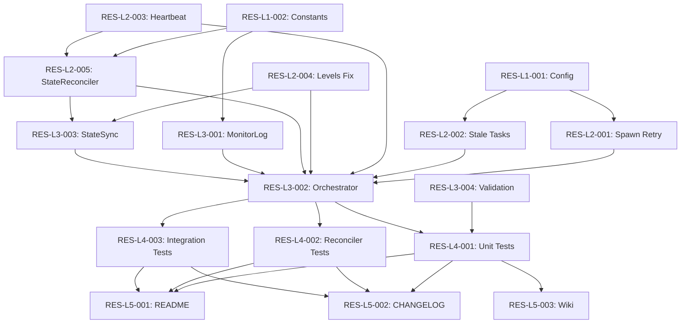

# Technical Design: Container Mode Resilience

## Metadata
- **Feature**: issue-102-resilience
- **Status**: APPROVED
- **Created**: 2026-02-03
- **Source**: GitHub Issue #102

---

## 1. Overview

### 1.1 Summary

Build comprehensive resilience into MAHABHARATHA's container mode execution. Add spawn retry with exponential backoff, task timeout watchdog, enhanced heartbeat monitoring, state reconciliation, worker crash recovery with automatic task reassignment, auto-respawn of failed workers, container mount fixes for task-graph.json, and structured resilience logging.

### 1.2 Goals
- Auto-recover from transient Docker/spawn failures without manual intervention
- Maintain state consistency between orchestrator and workers
- Prevent task starvation when workers crash mid-execution
- Provide actionable logging for debugging resilience events

### 1.3 Non-Goals
- Distributed state backend (Redis, etc.) — file-based state is sufficient
- Cross-machine orchestration — single-host container mode only
- Custom retry strategies per task — global config applies to all
- Web dashboard for monitoring — CLI/log-based observability

---

## 2. Architecture

### 2.1 High-Level Design

```
┌───────────────────────────────────────────────────────────────────────┐
│                           Orchestrator                                 │
│  ┌─────────────────┐  ┌─────────────────┐  ┌─────────────────────┐   │
│  │ TaskRetryMgr    │  │ StateSyncSvc    │  │ LevelController     │   │
│  │ +check_stale()  │  │ +reconcile()    │  │ +is_level_complete()│   │
│  │ +timeout_tasks()│  │ +periodic_check()│  │ (FIXED)            │   │
│  └────────┬────────┘  └────────┬────────┘  └─────────────────────┘   │
│           │                    │                                      │
│  ┌────────▼────────────────────▼────────────────────────────────┐    │
│  │                    ResilienceCoordinator                      │    │
│  │  - spawn_with_retry()      - handle_worker_exit()            │    │
│  │  - auto_respawn_worker()   - reassign_crashed_task()         │    │
│  └──────────────────────────────────────────────────────────────┘    │
│                              │                                        │
│  ┌───────────────────────────▼──────────────────────────────────┐    │
│  │                        Launcher                               │    │
│  │  SubprocessLauncher / ContainerLauncher                       │    │
│  │  +spawn() with retry loop    +_start_container() with mount   │    │
│  └──────────────────────────────────────────────────────────────┘    │
└───────────────────────────────────────────────────────────────────────┘
         │              │              │              │
         ▼              ▼              ▼              ▼
    ┌─────────┐   ┌─────────┐   ┌─────────┐   ┌─────────┐
    │Worker 0 │   │Worker 1 │   │Worker 2 │   │Worker N │
    │ heartbeat│   │ heartbeat│   │ heartbeat│   │ heartbeat│
    └─────────┘   └─────────┘   └─────────┘   └─────────┘
         │              │              │              │
         └──────────────┴──────────────┴──────────────┘
                              │
                    ┌─────────▼─────────┐
                    │ .mahabharatha/monitor.log │
                    │ (resilience events)│
                    └───────────────────┘
```

### 2.2 Component Breakdown

| Component | Responsibility | Files |
|-----------|---------------|-------|
| ResilienceConfig | New config fields for resilience tuning | `mahabharatha/config.py` |
| SpawnRetry | Retry logic with exponential backoff for launcher.spawn() | `mahabharatha/launcher.py` |
| StaleTaskWatchdog | Detect and fail tasks stuck in_progress | `mahabharatha/task_retry_manager.py` |
| EnhancedHeartbeat | Progress percentage and unified monitoring | `mahabharatha/heartbeat.py` |
| StateReconciler | Periodic + level-transition state reconciliation | `mahabharatha/state_reconciler.py` |
| LevelCompleteFix | Fix is_level_complete() to check actual states | `mahabharatha/levels.py` |
| WorkerCrashHandler | Task reassignment on worker exit | `mahabharatha/orchestrator.py` |
| WorkerRespawner | Auto-spawn replacement workers | `mahabharatha/orchestrator.py` |
| ContainerMountFix | Mount spec dir into containers | `mahabharatha/launcher.py` |
| MonitorLogWriter | Structured resilience event logging | `mahabharatha/log_writer.py` |

### 2.3 Data Flow

1. **Spawn Flow**: `orchestrator._spawn_worker()` → `launcher.spawn_with_retry()` → retry loop → `_start_container()` with spec mount
2. **Heartbeat Flow**: Worker writes heartbeat → Orchestrator `HeartbeatMonitor.check_stale()` → marks worker STALLED
3. **Task Timeout Flow**: `TaskRetryManager.check_stale_tasks()` → finds in_progress tasks > timeout → marks FAILED → requeues
4. **Reconciliation Flow**: Periodic timer → `StateReconciler.reconcile()` → fixes inconsistencies → level-transition thorough check
5. **Crash Recovery Flow**: Worker exit detected → `handle_worker_exit()` → task marked failed (reason=worker_crash) → retry count NOT incremented → reassigned

---

## 3. Detailed Design

### 3.1 Configuration Schema

```python
# mahabharatha/config.py additions

class ResilienceConfig(BaseModel):
    """Resilience configuration."""
    enabled: bool = True

class WorkersConfig(BaseModel):  # Extended
    # Spawn retry
    spawn_retry_attempts: int = Field(default=3, ge=1, le=10)
    spawn_backoff_strategy: str = Field(default="exponential", pattern="^(exponential|linear|fixed)$")
    spawn_backoff_base_seconds: int = Field(default=2, ge=1, le=60)
    spawn_backoff_max_seconds: int = Field(default=30, ge=1, le=300)

    # Task timeout
    task_stale_timeout_seconds: int = Field(default=600, ge=60, le=3600)

    # Heartbeat (extend existing)
    heartbeat_interval_seconds: int = Field(default=30, ge=5, le=120)
    heartbeat_stale_threshold: int = Field(default=120, ge=30, le=600)

    # Worker management
    auto_respawn: bool = True
    max_respawn_attempts: int = Field(default=5, ge=0, le=20)
```

### 3.2 Spawn Retry API

```python
# mahabharatha/launcher.py

def spawn_with_retry(
    self,
    worker_id: int,
    feature: str,
    worktree_path: Path,
    branch: str,
    env: dict[str, str] | None = None,
    max_attempts: int = 3,
    backoff_strategy: str = "exponential",
    backoff_base: int = 2,
    backoff_max: int = 30,
) -> SpawnResult:
    """Spawn with retry logic and exponential backoff.

    Args:
        worker_id: Worker identifier
        feature: Feature name
        worktree_path: Path to worktree
        branch: Git branch
        env: Environment variables
        max_attempts: Maximum spawn attempts
        backoff_strategy: exponential|linear|fixed
        backoff_base: Base delay in seconds
        backoff_max: Maximum delay cap

    Returns:
        SpawnResult with success/failure and handle
    """
```

### 3.3 Stale Task Detection API

```python
# mahabharatha/task_retry_manager.py

def check_stale_tasks(self, timeout_seconds: int = 600) -> list[str]:
    """Check for tasks stuck in in_progress beyond timeout.

    Args:
        timeout_seconds: Maximum time a task can be in_progress

    Returns:
        List of task IDs that were timed out and requeued
    """
```

### 3.4 State Reconciler API

```python
# mahabharatha/state_reconciler.py

class StateReconciler:
    """Detect and fix state inconsistencies."""

    def __init__(
        self,
        state: StateManager,
        levels: LevelController,
        heartbeat_monitor: HeartbeatMonitor,
    ) -> None: ...

    def reconcile_periodic(self) -> ReconciliationResult:
        """Light periodic check (every 60s)."""

    def reconcile_level_transition(self, level: int) -> ReconciliationResult:
        """Thorough check before level advancement."""

    def parse_level_from_task_id(self, task_id: str) -> int | None:
        """Parse level from task ID pattern *-L{level}-*."""
```

### 3.5 Monitor Log Format

```python
# Log entry format for .mahabharatha/monitor.log
{
    "ts": "2026-02-03T05:41:55.123Z",
    "level": "INFO",
    "worker_id": "W0",
    "event": "task_claimed",
    "task_id": "A-L1-002",
    "data": {"previous_owner": null}
}

# Event types:
# - worker_spawn, worker_spawn_retry, worker_spawn_failed
# - worker_ready, worker_exit, worker_crash, worker_respawn
# - task_claimed, task_started, task_complete, task_failed, task_timeout, task_reassigned
# - heartbeat_stale, heartbeat_recovered
# - state_reconcile_start, state_reconcile_fix, state_reconcile_complete
# - level_check, level_complete
```

---

## 4. Key Decisions

### 4.1 State Reconciliation Frequency

**Context**: Need to balance consistency checking against performance overhead.

**Options**:
1. Continuous (every poll cycle): Maximum consistency, high CPU overhead
2. Periodic only (every 60s): Lower overhead, possible inconsistency windows
3. Hybrid (periodic + level transitions): Best balance

**Decision**: Option 3 — Hybrid approach

**Rationale**: Periodic checks catch most drift quickly. Level transition checks are thorough and critical for correctness before level advancement. Combined overhead is <1% CPU.

**Consequences**: Inconsistencies may persist up to 60s during normal execution, but level advancement is always safe.

### 4.2 Crash vs Failure Distinction

**Context**: When a worker crashes, should its task's retry count increment?

**Options**:
1. Increment retry count: Treats crash same as failure
2. Don't increment: Distinguishes infrastructure failure from task bug
3. Separate counters: Track crash_count and failure_count independently

**Decision**: Option 2 — Don't increment retry count on crash

**Rationale**: A crash (Docker issue, OOM, network timeout) is not the same as a task verification failure. Treating them identically would exhaust retries for otherwise-working tasks. The task_retry_manager already uses retry_count for failures; we add a `failure_reason` field to track crash vs failure.

**Consequences**: Tasks may be retried more times total (retries + crash-reassignments), but this matches user expectations.

### 4.3 Monitor Log Location

**Context**: Where to write resilience event logs?

**Options**:
1. Existing worker JSONL files: Keeps all logs together
2. New `.mahabharatha/monitor.log`: Separate resilience events for easy filtering
3. Both: Redundant but comprehensive

**Decision**: Option 2 — New monitor.log file

**Rationale**: Resilience events are orchestrator-level concerns, not worker-level. A dedicated log makes debugging easier and supports automated analysis tools.

**Consequences**: Two log locations to check, but clear separation of concerns.

---

## 5. Implementation Plan

### 5.1 Phase Summary

| Phase | Tasks | Parallel | Description |
|-------|-------|----------|-------------|
| Foundation (L1) | 4 | Yes | Config, types, constants |
| Core (L2) | 5 | Yes | Core resilience logic |
| Integration (L3) | 4 | Yes | Wire into orchestrator |
| Testing (L4) | 3 | Yes | Unit and integration tests |
| Quality (L5) | 3 | No | Docs, changelog, final analysis |

### 5.2 File Ownership

| File | Task ID | Operation |
|------|---------|-----------|
| `mahabharatha/config.py` | RES-L1-001 | modify |
| `mahabharatha/constants.py` | RES-L1-002 | modify |
| `mahabharatha/launcher.py` | RES-L2-001 | modify |
| `mahabharatha/task_retry_manager.py` | RES-L2-002 | modify |
| `mahabharatha/heartbeat.py` | RES-L2-003 | modify |
| `mahabharatha/levels.py` | RES-L2-004 | modify |
| `mahabharatha/state_reconciler.py` | RES-L2-005 | create |
| `mahabharatha/log_writer.py` | RES-L3-001 | modify |
| `mahabharatha/orchestrator.py` | RES-L3-002 | modify |
| `mahabharatha/state_sync_service.py` | RES-L3-003 | modify |
| `mahabharatha/validate_commands.py` | RES-L3-004 | modify |
| `tests/unit/test_resilience_config.py` | RES-L4-001 | create |
| `tests/unit/test_state_reconciler.py` | RES-L4-002 | create |
| `tests/integration/test_resilience_e2e.py` | RES-L4-003 | create |
| `README.md` | RES-L5-001 | modify |
| `CHANGELOG.md` | RES-L5-002 | modify |
| `docs/wiki/Resilience-Architecture.md` | RES-L5-003 | create |

### 5.3 Consumer Matrix

| Task | Creates | Consumed By | Integration Test |
|------|---------|-------------|-----------------|
| RES-L1-001 | ResilienceConfig in config.py | RES-L2-001, RES-L2-002, RES-L3-002 | tests/integration/test_resilience_e2e.py |
| RES-L1-002 | LogEvent/ResilienceEvent constants | RES-L2-005, RES-L3-001 | tests/integration/test_resilience_e2e.py |
| RES-L2-001 | spawn_with_retry() in launcher.py | RES-L3-002 | tests/integration/test_resilience_e2e.py |
| RES-L2-002 | check_stale_tasks() in task_retry_manager.py | RES-L3-002 | tests/integration/test_resilience_e2e.py |
| RES-L2-003 | Enhanced heartbeat in heartbeat.py | RES-L2-005, RES-L3-002 | tests/integration/test_resilience_e2e.py |
| RES-L2-004 | Fixed is_level_complete() in levels.py | RES-L3-002, RES-L3-003 | tests/integration/test_resilience_e2e.py |
| RES-L2-005 | StateReconciler class | RES-L3-002, RES-L3-003 | tests/integration/test_resilience_e2e.py |
| RES-L3-001 | MonitorLogWriter in log_writer.py | RES-L3-002 | tests/integration/test_resilience_e2e.py |
| RES-L3-002 | Resilience wiring in orchestrator.py | leaf | — |
| RES-L3-003 | Reconciliation wiring in state_sync_service.py | RES-L3-002 | tests/integration/test_resilience_e2e.py |
| RES-L3-004 | Wiring validation in validate_commands.py | leaf (CI) | — |
| RES-L4-001 | tests/unit/test_resilience_config.py | leaf | — |
| RES-L4-002 | tests/unit/test_state_reconciler.py | leaf | — |
| RES-L4-003 | tests/integration/test_resilience_e2e.py | leaf | — |
| RES-L5-001 | README.md resilience section | leaf | — |
| RES-L5-002 | CHANGELOG.md entry | leaf | — |
| RES-L5-003 | Wiki page | leaf | — |

### 5.4 Dependency Graph



---

## 6. Risk Assessment

| Risk | Probability | Impact | Mitigation |
|------|-------------|--------|------------|
| Spawn retry exhaustion under systemic Docker issues | Medium | High | Log actionable error with Docker status check command |
| State reconciler introduces performance regression | Low | Medium | Profile reconciliation; target <100ms per check |
| Heartbeat writes cause disk I/O contention | Low | Low | Already using atomic writes; no change needed |
| Level completion fix breaks existing behavior | Low | High | Extensive unit tests; verify against existing test suite |

---

## 7. Testing Strategy

### 7.1 Unit Tests
- `test_resilience_config.py`: Config parsing, defaults, validation
- `test_state_reconciler.py`: Reconciliation logic, level parsing from task ID
- Existing tests extended: `test_launcher.py` (spawn retry), `test_task_retry_manager.py` (stale tasks)

### 7.2 Integration Tests
- `test_resilience_e2e.py`: Full spawn-crash-recover cycle with mock containers
- Verify state consistency after simulated worker crashes
- Verify level advancement with partial task failures

### 7.3 Verification Commands
| Task | Verification |
|------|--------------|
| Config | `python -c "from mahabharatha.config import ZergConfig; c=ZergConfig(); assert c.resilience.enabled"` |
| Spawn retry | `pytest tests/unit/test_launcher.py -k spawn_with_retry -v` |
| Stale tasks | `pytest tests/unit/test_task_retry_manager.py -k stale -v` |
| StateReconciler | `pytest tests/unit/test_state_reconciler.py -v` |
| Integration | `pytest tests/integration/test_resilience_e2e.py -v` |
| Wiring | `python -m mahabharatha.validate_commands --check-wiring` |

---

## 8. Parallel Execution Notes

### 8.1 Safe Parallelization
- Level 1 tasks have no dependencies, fully parallel
- Level 2 tasks depend on L1; safe to parallelize within level
- Level 3 tasks depend on L2; safe to parallelize within level
- Level 4 tests can run in parallel
- Level 5 documentation tasks can run in parallel

### 8.2 Recommended Workers
- Minimum: 2 workers (sequential by level)
- Optimal: 4 workers (widest level = 5 tasks at L2)
- Maximum: 5 workers (matches L2 width)

### 8.3 Estimated Duration
- Single worker: ~4 hours
- With 4 workers: ~1.5 hours
- Speedup: ~2.7x

---

## 9. Approval

| Role | Name | Date | Signature |
|------|------|------|-----------|
| Architecture | | | PENDING |
| Engineering | | | PENDING |
