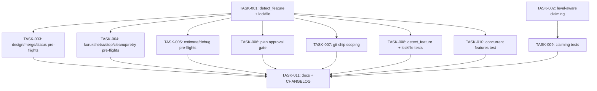

# Technical Design: multi-epic-isolation

## Metadata
- **Feature**: multi-epic-isolation
- **Status**: DRAFT
- **Created**: 2026-02-11
- **Author**: MAHABHARATHA Design Mode

---

## 1. Overview

### 1.1 Summary
Fix 6 root causes that prevent MAHABHARATHA from safely running two independent epics in parallel across terminal sessions. The primary fix replaces the global `.current-feature` singleton with a `ZERG_FEATURE` environment variable as the primary feature detection source, adds level-aware task claiming, restructures the plan approval gate, scopes git ship to feature branches, adds advisory lockfiles, and auto-scopes task lists.

### 1.2 Goals
- Two terminals can run independent epics without cross-stomping
- Workers respect level boundaries during task claiming
- Plan command stops cleanly after approval (no auto-design)
- Git ship scopes to active feature's branches only
- Advisory lockfile warns about concurrent sessions

### 1.3 Non-Goals
- Cross-epic file ownership validation at design time
- Multi-repo orchestration
- GUI/TUI for multi-epic management
- Changes to Docker/container launcher (already isolated)

---

## 2. Architecture

### 2.1 High-Level Design

```
Terminal 1                          Terminal 2
┌──────────────────┐               ┌──────────────────┐
│ export            │               │ export            │
│ ZERG_FEATURE=epic1│               │ ZERG_FEATURE=epic2│
│                  │               │                  │
│ detect_feature() │               │ detect_feature() │
│   1. env var ✓   │               │   1. env var ✓   │
│   2. file (skip) │               │   2. file (skip) │
│   3. state (skip)│               │   3. state (skip)│
└──────┬───────────┘               └──────┬───────────┘
       │                                  │
       ▼                                  ▼
 .gsd/specs/epic1/               .gsd/specs/epic2/
 ├── requirements.md             ├── requirements.md
 ├── design.md                   ├── design.md
 ├── task-graph.json             ├── task-graph.json
 └── .lock (advisory)            └── .lock (advisory)
```

### 2.2 Component Breakdown

| Component | Responsibility | Files |
|-----------|---------------|-------|
| Feature Detector | Resolve active feature from env/file/state | `mahabharatha/commands/_utils.py` |
| Level Enforcer | Prevent workers claiming above current level | `mahabharatha/protocol_state.py` |
| Lockfile Manager | Advisory lock per feature during kurukshetra | `mahabharatha/commands/_utils.py` |
| Plan Approval Gate | Structured stop after approval | `plan.core.md`, `plan.md` |
| Ship Scoper | Limit git ship to feature branches | `git.details.md` |
| Pre-flight Pattern | Env-aware feature detection in 15 commands | `mahabharatha/data/commands/*.md` |

### 2.3 Data Flow

**Feature Detection (updated priority):**
1. `ZERG_FEATURE` env var (process-scoped, terminal-isolated)
2. `--feature` CLI flag (explicit override, already supported in some commands)
3. `.gsd/.current-feature` file (backward compat fallback)
4. `.mahabharatha/state/*.json` (most recent, last resort)

**Task Claiming (updated):**
1. Worker calls `claim_next_task_async()`
2. Gets pending tasks via `get_tasks_by_status(PENDING)`
3. For each pending task, calls `claim_task(task_id, worker_id, dependency_checker=..., current_level=self.state.get_current_level())`
4. `claim_task()` verifies `task.level <= current_level` before claiming

**Advisory Lockfile:**
1. `/z:kurukshetra` creates `.gsd/specs/{feature}/.lock` with `{pid}:{timestamp}`
2. Another `/z:kurukshetra` checks `.lock`, warns if recent (< 2hr), asks user to confirm
3. `/z:cleanup` removes stale locks

---

## 3. Detailed Design

### 3.1 detect_feature() — Updated Priority Chain

```python
# mahabharatha/commands/_utils.py
def detect_feature() -> str | None:
    """Detect active feature from project state.

    Priority order:
    1. ZERG_FEATURE env var (terminal-session-scoped)
    2. .gsd/.current-feature (explicit user intent from /mahabharatha:plan)
    3. .mahabharatha/state/*.json (most recently modified state file)
    """
    # Primary: env var (terminal-scoped, multi-epic safe)
    env_feature = os.environ.get("ZERG_FEATURE", "").strip()
    if env_feature:
        return env_feature

    # Secondary: explicit feature set by /mahabharatha:plan
    current_feature = Path(GSD_DIR) / ".current-feature"
    if current_feature.exists():
        name = current_feature.read_text().strip()
        if name:
            return name

    # Fallback: most recently modified state file
    state_dir = Path(STATE_DIR)
    if state_dir.exists():
        state_files = list(state_dir.glob("*.json"))
        if state_files:
            state_files.sort(key=lambda p: p.stat().st_mtime, reverse=True)
            return state_files[0].stem

    return None
```

### 3.2 Advisory Lockfile Functions

```python
# mahabharatha/commands/_utils.py (new functions)
import os
import time

def acquire_feature_lock(feature: str, gsd_dir: str = ".gsd") -> bool:
    """Create advisory lock for a feature.

    Returns True if lock acquired, False if another session holds it.
    """
    lock_path = Path(gsd_dir) / "specs" / feature / ".lock"
    if lock_path.exists():
        content = lock_path.read_text().strip()
        try:
            pid_str, ts_str = content.split(":", 1)
            ts = float(ts_str)
            # Stale if > 2 hours old
            if time.time() - ts > 7200:
                lock_path.unlink()
            else:
                return False  # Active lock
        except (ValueError, OSError):
            lock_path.unlink()  # Corrupt lock, remove

    lock_path.parent.mkdir(parents=True, exist_ok=True)
    lock_path.write_text(f"{os.getpid()}:{time.time()}")
    return True

def release_feature_lock(feature: str, gsd_dir: str = ".gsd") -> None:
    """Release advisory lock for a feature."""
    lock_path = Path(gsd_dir) / "specs" / feature / ".lock"
    if lock_path.exists():
        lock_path.unlink(missing_ok=True)

def check_feature_lock(feature: str, gsd_dir: str = ".gsd") -> dict | None:
    """Check if a feature is locked. Returns lock info or None."""
    lock_path = Path(gsd_dir) / "specs" / feature / ".lock"
    if not lock_path.exists():
        return None
    content = lock_path.read_text().strip()
    try:
        pid_str, ts_str = content.split(":", 1)
        ts = float(ts_str)
        if time.time() - ts > 7200:
            return None  # Stale
        return {"pid": int(pid_str), "timestamp": ts, "age_seconds": time.time() - ts}
    except (ValueError, OSError):
        return None
```

### 3.3 Level-Aware Claiming Fix

```python
# mahabharatha/protocol_state.py — claim_next_task_async(), line ~371
# BEFORE:
if self.state.claim_task(
    task_id,
    self.worker_id,
    dependency_checker=self.dependency_checker,
):

# AFTER:
if self.state.claim_task(
    task_id,
    self.worker_id,
    current_level=self.state.get_current_level(),
    dependency_checker=self.dependency_checker,
):
```

### 3.4 Command Pre-Flight Pattern

All 15 command markdown files update from:
```bash
FEATURE=$(cat .gsd/.current-feature 2>/dev/null)
```

To:
```bash
FEATURE=${ZERG_FEATURE:-$(cat .gsd/.current-feature 2>/dev/null)}
```

### 3.5 Plan Approval Gate (RC6)

Phase 5 in `plan.core.md` and `plan.md` changes:

**Before:**
```
- "APPROVED" — proceed to design phase
```

**After:**
```
- "APPROVED" — requirements are complete and locked
```

Add structured AskUserQuestion gate:
```
Call AskUserQuestion:
  - question: "Do you approve these requirements?"
  - header: "Approval"
  - options:
    - label: "Approve"
      description: "Lock requirements and stop. You will run /z:design separately."
    - label: "Request changes"
      description: "Describe what needs to change"
```

Move ⛔ PLANNING COMPLETE banner to execute BEFORE any tool calls after approval.

### 3.6 Git Ship Feature-Scoping (RC2)

In `git.details.md`, the ship action pipeline step 1 (Commit) adds feature-scoping:
- Read active feature via `detect_feature()` pattern
- If feature detected, scope commit scan to `mahabharatha/{feature}/*` branches
- PR title format: `feat({feature}): {summary}`
- If no feature (non-MAHABHARATHA workflow), ship works unchanged

---

## 4. Key Decisions

### Decision: ZERG_FEATURE env var as primary detection

**Context**: `.gsd/.current-feature` is a global singleton that Terminal 2 overwrites when planning a new epic.

**Options Considered**:
1. Environment variable per terminal: process-scoped, zero filesystem contention
2. Per-terminal PID-based file: `.current-feature.{PID}` — requires cleanup, stale files
3. Session ID tracking: complex, requires new infrastructure

**Decision**: Environment variable (Option 1)

**Rationale**: Shell env vars are inherently process-scoped. Each terminal has its own `ZERG_FEATURE`. No filesystem contention. Zero new infrastructure. Backward compatible (falls through to file if not set).

**Consequences**: Single-epic users see no change. Multi-epic users export one env var.

### Decision: Advisory (not mandatory) lockfile

**Context**: Need to detect concurrent sessions running the same feature.

**Options Considered**:
1. Advisory lockfile with warning: low friction, user can override
2. Mandatory file lock: blocks concurrent sessions, potential deadlocks
3. No lock: rely entirely on env var isolation

**Decision**: Advisory lockfile (Option 1)

**Rationale**: Mandatory locks create more problems (stale locks, deadlocks). Advisory warns the user while preserving flexibility. Combined with env var isolation, the risk of actual conflict is minimal.

### Decision: One-line fix for level enforcement

**Context**: `claim_task()` already supports `current_level` parameter, but the call site in `protocol_state.py` doesn't pass it.

**Decision**: Pass `current_level=self.state.get_current_level()` at the existing call site.

**Rationale**: The enforcement code already exists and is tested. Only the call site is missing the parameter. Minimal blast radius.

---

## 5. Implementation Plan

### 5.1 Phase Summary

| Phase | Tasks | Parallel | Est. Time |
|-------|-------|----------|-----------|
| Foundation (L1) | 2 | Yes | 15 min |
| Propagation (L2) | 8 | Yes | 20 min |
| Quality (L3) | 1 | No | 10 min |

### 5.2 File Ownership

| File | Task ID | Operation |
|------|---------|-----------|
| `mahabharatha/commands/_utils.py` | TASK-001 | modify |
| `mahabharatha/protocol_state.py` | TASK-002 | modify |
| `mahabharatha/data/commands/design.md` | TASK-003 | modify |
| `mahabharatha/data/commands/design.core.md` | TASK-003 | modify |
| `mahabharatha/data/commands/merge.md` | TASK-003 | modify |
| `mahabharatha/data/commands/merge.core.md` | TASK-003 | modify |
| `mahabharatha/data/commands/status.md` | TASK-003 | modify |
| `mahabharatha/data/commands/status.core.md` | TASK-003 | modify |
| `mahabharatha/data/commands/kurukshetra.md` | TASK-004 | modify |
| `mahabharatha/data/commands/kurukshetra.core.md` | TASK-004 | modify |
| `mahabharatha/data/commands/stop.md` | TASK-004 | modify |
| `mahabharatha/data/commands/cleanup.md` | TASK-004 | modify |
| `mahabharatha/data/commands/retry.md` | TASK-004 | modify |
| `mahabharatha/data/commands/estimate.md` | TASK-005 | modify |
| `mahabharatha/data/commands/estimate.core.md` | TASK-005 | modify |
| `mahabharatha/data/commands/debug.md` | TASK-005 | modify |
| `mahabharatha/data/commands/debug.core.md` | TASK-005 | modify |
| `mahabharatha/data/commands/plan.md` | TASK-006 | modify |
| `mahabharatha/data/commands/plan.core.md` | TASK-006 | modify |
| `mahabharatha/data/commands/git.details.md` | TASK-007 | modify |
| `tests/unit/test_commands_utils.py` | TASK-008 | modify |
| `tests/unit/test_lockfile.py` | TASK-008 | create |
| `tests/integration/test_claim_enforcement.py` | TASK-009 | modify |
| `tests/integration/test_concurrent_features.py` | TASK-010 | create |
| `CHANGELOG.md` | TASK-011 | modify |
| `README.md` | TASK-011 | modify |

### 5.3 Dependency Graph



---

## 6. Risk Assessment

| Risk | Probability | Impact | Mitigation |
|------|-------------|--------|------------|
| Breaking backward compat for `.current-feature` | Low | High | Kept as fallback in priority chain |
| Plan approval gate still bypassed by LLM | Medium | Medium | Use AskUserQuestion (mechanical gate) + remove affirmative language |
| Lock file left stale after crash | Low | Low | Auto-expiry (2hr) + `/z:cleanup` removes stale locks |
| Level enforcement too strict | Low | Medium | Only enforces `task.level <= current_level`, tested |
| Command markdown pre-flight missed | Low | Medium | grep audit verifies all 15 files updated |

---

## 7. Testing Strategy

### 7.1 Unit Tests
- `detect_feature()` priority: ZERG_FEATURE > .current-feature > state JSON
- `detect_feature()` edge cases: empty env var, whitespace
- Lockfile acquire/release/check/stale expiry
- Level-aware claiming: task rejected when level > current_level

### 7.2 Integration Tests
- Concurrent feature detection: two features don't stomp via env vars
- Level enforcement with full StateManager + DependencyChecker
- Existing claim_enforcement tests still pass

### 7.3 Verification Commands
- `pytest tests/unit/test_commands_utils.py -v`
- `pytest tests/unit/test_lockfile.py -v`
- `pytest tests/integration/test_claim_enforcement.py -v`
- `pytest tests/integration/test_concurrent_features.py -v`
- `python -m mahabharatha.validate_commands`
- `grep -c 'ZERG_FEATURE' mahabharatha/data/commands/*.md` (expect 15+ matches)

---

## 8. Parallel Execution Notes

### 8.1 Safe Parallelization
- Level 1: 2 tasks modify disjoint Python files — fully parallel
- Level 2: 8 tasks modify disjoint sets of markdown/test files — fully parallel
- Level 3: 1 documentation task — sequential
- No two tasks modify the same file

### 8.2 Recommended Workers
- Minimum: 2 workers (one per level, sequential)
- Optimal: 8 workers (matches widest level L2)
- Maximum: 8 workers (diminishing returns beyond L2 width)

### 8.3 Estimated Duration
- Single worker: ~45 min
- With 8 workers: ~20 min
- Speedup: ~2.3x

---

## 9. Approval

| Role | Name | Date | Signature |
|------|------|------|-----------|
| Architecture | | | PENDING |
| Engineering | | | PENDING |
