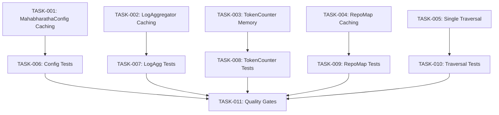

# Technical Design: performance-core

## Metadata
- **Feature**: performance-core
- **Status**: DRAFT
- **Created**: 2026-02-05
- **Issues**: #133, #134, #144
- **Author**: MAHABHARATHA Design Mode

---

## 1. Overview

### 1.1 Summary

This feature adds caching layers to MAHABHARATHA's four most I/O-intensive subsystems: MahabharathaConfig loading, LogAggregator file reads, TokenCounter lookups, and RepoMap AST parsing. Each cache uses mtime or TTL invalidation, thread-safe access via `threading.Lock`, and bounded memory via LRU eviction where appropriate.

### 1.2 Goals

- Reduce MahabharathaConfig load time from 250ms+ to <5ms (cached)
- Reduce LogAggregator query time from 500ms+ to <10ms (cached)
- Reduce directory traversal from 600ms-3s to 100-500ms via single-pass collection
- Reduce RepoMap build time from 2-5s to <100ms (cached)
- Thread-safe operation for all caches
- Bounded memory usage with LRU eviction

### 1.3 Non-Goals

- Watchdog-based file system events (future enhancement)
- Redis/external cache backends
- Configuration-driven TTL values (hardcoded 30s for now)
- Cache warming on startup

---

## 2. Architecture

### 2.1 High-Level Design

```
┌─────────────────────────────────────────────────────────────────┐
│                      MAHABHARATHA Orchestrator                          │
└─────────────────────────────────────────────────────────────────┘
         │                    │                    │
         ▼                    ▼                    ▼
┌─────────────────┐  ┌─────────────────┐  ┌─────────────────┐
│   MahabharathaConfig    │  │  LogAggregator  │  │    RepoMap      │
│   (Singleton)   │  │  (Per-file LRU) │  │   (TTL Cache)   │
├─────────────────┤  ├─────────────────┤  ├─────────────────┤
│ • mtime check   │  │ • mtime/file    │  │ • 30s TTL       │
│ • Lock          │  │ • LRU(100)      │  │ • invalidate()  │
│ • force_reload  │  │ • Lock          │  │ • Lock          │
└────────┬────────┘  └────────┬────────┘  └────────┬────────┘
         │                    │                    │
         ▼                    ▼                    ▼
    .mahabharatha/config.yaml    .mahabharatha/logs/*.jsonl    mahabharatha/**/*.py
```

```
┌─────────────────────────────────────────────────────────────────┐
│                    TokenCounter (In-Memory)                     │
├─────────────────────────────────────────────────────────────────┤
│ • In-memory dict for lookups                                    │
│ • LRU eviction (max 10000 entries)                              │
│ • Periodic file persist on store (atomic write)                 │
│ • Lock for thread safety                                        │
└─────────────────────────────────────────────────────────────────┘

┌─────────────────────────────────────────────────────────────────┐
│                 Single-Pass Directory Traversal                 │
├─────────────────────────────────────────────────────────────────┤
│ security_rules.detect_project_stack():                          │
│   • Single rglob("*") → classify in memory                      │
│                                                                 │
│ repo_map._collect_files():                                      │
│   • Single rglob("*") → filter by suffix in memory              │
└─────────────────────────────────────────────────────────────────┘
```

### 2.2 Component Breakdown

| Component | Responsibility | Files |
|-----------|----------------|-------|
| MahabharathaConfig Singleton | Cache config with mtime invalidation | `mahabharatha/config.py` |
| LogAggregator Cache | Per-file mtime cache with LRU | `mahabharatha/log_aggregator.py` |
| TokenCounter Memory | In-memory cache with LRU, file persist | `mahabharatha/token_counter.py` |
| RepoMap TTL Cache | 30s TTL cache for SymbolGraph | `mahabharatha/repo_map.py` |
| Single-Pass Traversal | Collect-then-filter pattern | `mahabharatha/security_rules.py`, `mahabharatha/repo_map.py` |

### 2.3 Data Flow

**MahabharathaConfig:**
```
load() → check _cache_mtime vs file mtime → hit: return cached | miss: parse YAML, store
```

**LogAggregator:**
```
query() → _read_all_entries() → for each file: mtime check → hit: return cached | miss: parse JSONL
```

**TokenCounter:**
```
count() → _cache_lookup() → O(1) dict lookup → hit: return | miss: count + store
```

**RepoMap:**
```
build_map() → check _cache_time vs now - TTL → hit: return cached | miss: build SymbolGraph
```

---

## 3. Detailed Design

### 3.1 MahabharathaConfig Singleton (FR-1)

```python
# mahabharatha/config.py additions

class MahabharathaConfig(BaseModel):
    # Class-level cache
    _cached_instance: ClassVar["MahabharathaConfig | None"] = None
    _cache_mtime: ClassVar[float | None] = None
    _cache_path: ClassVar[Path | None] = None
    _cache_lock: ClassVar[threading.Lock] = threading.Lock()

    @classmethod
    def load(cls, config_path: str | Path | None = None, force_reload: bool = False) -> "MahabharathaConfig":
        """Load configuration with mtime-based caching.

        Args:
            config_path: Path to config file. Defaults to .mahabharatha/config.yaml
            force_reload: Bypass cache and force reload from disk

        Returns:
            MahabharathaConfig instance (cached if valid)
        """
        config_path = Path(".mahabharatha/config.yaml") if config_path is None else Path(config_path)

        with cls._cache_lock:
            # Check cache validity
            if not force_reload and cls._cached_instance is not None:
                if cls._cache_path == config_path:
                    try:
                        current_mtime = config_path.stat().st_mtime
                        if current_mtime == cls._cache_mtime:
                            logger.debug("Cache hit for MahabharathaConfig")
                            return cls._cached_instance
                    except FileNotFoundError:
                        pass

            # Cache miss or invalid
            logger.debug("Cache miss for MahabharathaConfig, loading from %s", config_path)

            if not config_path.exists():
                instance = cls()
            else:
                with open(config_path) as f:
                    data = yaml.safe_load(f) or {}
                instance = cls.from_dict(data)

            # Update cache
            cls._cached_instance = instance
            cls._cache_path = config_path
            try:
                cls._cache_mtime = config_path.stat().st_mtime
            except FileNotFoundError:
                cls._cache_mtime = None

            return instance

    @classmethod
    def invalidate_cache(cls) -> None:
        """Invalidate the cached config instance."""
        with cls._cache_lock:
            cls._cached_instance = None
            cls._cache_mtime = None
            cls._cache_path = None
            logger.debug("Invalidating cache for MahabharathaConfig")
```

### 3.2 LogAggregator Per-File Cache (FR-2)

```python
# mahabharatha/log_aggregator.py additions

from collections import OrderedDict
import threading

class LogAggregator:
    MAX_CACHED_FILES = 100  # LRU limit

    def __init__(self, log_dir: str | Path) -> None:
        self.log_dir = Path(log_dir)
        self.workers_dir = self.log_dir / "workers"
        self.tasks_dir = self.log_dir / "tasks"

        # Per-file cache: {path: {"mtime": float, "entries": list}}
        self._file_cache: OrderedDict[str, dict] = OrderedDict()
        self._cache_lock = threading.Lock()

    def _read_all_entries(self) -> list[dict[str, Any]]:
        """Read all log entries with per-file caching."""
        entries: list[dict[str, Any]] = []
        files_to_read: list[Path] = []

        # Collect all JSONL files
        if self.workers_dir.exists():
            files_to_read.extend(self.workers_dir.glob("*.jsonl"))
        orchestrator_file = self.log_dir / "orchestrator.jsonl"
        if orchestrator_file.exists():
            files_to_read.append(orchestrator_file)

        with self._cache_lock:
            for jsonl_file in files_to_read:
                key = str(jsonl_file)
                try:
                    current_mtime = jsonl_file.stat().st_mtime
                except FileNotFoundError:
                    continue

                cached = self._file_cache.get(key)
                if cached and cached["mtime"] == current_mtime:
                    # Cache hit - move to end for LRU
                    self._file_cache.move_to_end(key)
                    entries.extend(cached["entries"])
                    logger.debug("Cache hit for log file %s", jsonl_file.name)
                else:
                    # Cache miss - read file
                    logger.debug("Cache miss for log file %s", jsonl_file.name)
                    file_entries = self._read_jsonl(jsonl_file)
                    entries.extend(file_entries)

                    # Update cache with LRU eviction
                    self._file_cache[key] = {"mtime": current_mtime, "entries": file_entries}
                    self._file_cache.move_to_end(key)

                    # Evict oldest if over limit
                    while len(self._file_cache) > self.MAX_CACHED_FILES:
                        oldest_key, _ = self._file_cache.popitem(last=False)
                        logger.debug("Evicting cached log file %s", oldest_key)

        return entries
```

### 3.3 TokenCounter In-Memory Cache (FR-4)

```python
# mahabharatha/token_counter.py refactored

from collections import OrderedDict
import threading

class TokenCounter:
    MAX_CACHE_ENTRIES = 10000  # LRU limit

    def __init__(self, config: TokenMetricsConfig | None = None) -> None:
        # ... existing config setup ...

        self._cache_path = Path(STATE_DIR) / "token-cache.json"
        self._cache: OrderedDict[str, dict] = OrderedDict()
        self._cache_lock = threading.Lock()
        self._cache_dirty = False

        # Load existing cache file into memory
        self._load_cache_from_file()

    def _load_cache_from_file(self) -> None:
        """Load cache from disk into memory on init."""
        try:
            if self._cache_path.exists():
                with open(self._cache_path) as f:
                    data = json.loads(f.read())
                    # Convert to OrderedDict for LRU
                    for k, v in data.items():
                        self._cache[k] = v
                        # Evict if over limit during load
                        if len(self._cache) >= self.MAX_CACHE_ENTRIES:
                            break
        except Exception:
            logger.debug("Failed to load token cache from file")

    def _cache_lookup(self, text_hash: str) -> TokenResult | None:
        """O(1) in-memory lookup."""
        with self._cache_lock:
            entry = self._cache.get(text_hash)
            if entry is None:
                return None

            age = time.time() - entry.get("timestamp", 0)
            if age > self._config.cache_ttl_seconds:
                return None

            # Move to end for LRU
            self._cache.move_to_end(text_hash)
            logger.debug("Cache hit for token hash %s", text_hash[:12])

            return TokenResult(
                count=entry["count"],
                mode=entry["mode"],
                source="cache",
            )

    def _cache_store(self, text_hash: str, result: TokenResult) -> None:
        """Store in memory with LRU eviction, persist periodically."""
        with self._cache_lock:
            self._cache[text_hash] = {
                "count": result.count,
                "mode": result.mode,
                "timestamp": time.time(),
            }
            self._cache.move_to_end(text_hash)

            # LRU eviction
            while len(self._cache) > self.MAX_CACHE_ENTRIES:
                self._cache.popitem(last=False)

            self._cache_dirty = True
            logger.debug("Cache miss for token hash %s, stored", text_hash[:12])

        # Persist to file (atomic write)
        self._persist_cache()

    def _persist_cache(self) -> None:
        """Atomically persist cache to file."""
        with self._cache_lock:
            if not self._cache_dirty:
                return

            self._cache_path.parent.mkdir(parents=True, exist_ok=True)
            data = json.dumps(dict(self._cache))

            fd, tmp_path = tempfile.mkstemp(dir=str(self._cache_path.parent), suffix=".tmp")
            try:
                with os.fdopen(fd, "w") as f:
                    f.write(data)
                os.replace(tmp_path, str(self._cache_path))
                self._cache_dirty = False
            except Exception:
                try:
                    os.unlink(tmp_path)
                except OSError:
                    pass
```

### 3.4 RepoMap TTL Cache (FR-5)

```python
# mahabharatha/repo_map.py additions

import threading
import time

# Module-level cache
_cached_graph: SymbolGraph | None = None
_cache_time: float | None = None
_cache_root: Path | None = None
_cache_languages: list[str] | None = None
_cache_lock = threading.Lock()
_CACHE_TTL_SECONDS = 30

def build_map(
    root: str | Path,
    languages: list[str] | None = None,
) -> SymbolGraph:
    """Build a symbol graph with TTL-based caching.

    Cached result is returned if:
    - Same root and languages
    - Within TTL (30 seconds)
    """
    global _cached_graph, _cache_time, _cache_root, _cache_languages

    root = Path(root).resolve()
    languages = languages or ["python", "javascript", "typescript"]

    with _cache_lock:
        # Check cache validity
        if (
            _cached_graph is not None
            and _cache_root == root
            and _cache_languages == languages
            and _cache_time is not None
            and (time.time() - _cache_time) < _CACHE_TTL_SECONDS
        ):
            logger.debug("Cache hit for RepoMap (TTL: %.1fs remaining)",
                        _CACHE_TTL_SECONDS - (time.time() - _cache_time))
            return _cached_graph

        # Cache miss - build fresh
        logger.debug("Cache miss for RepoMap, building from %s", root)
        graph = _build_map_impl(root, languages)

        # Update cache
        _cached_graph = graph
        _cache_time = time.time()
        _cache_root = root
        _cache_languages = languages

        return graph

def invalidate_cache() -> None:
    """Invalidate the cached SymbolGraph."""
    global _cached_graph, _cache_time, _cache_root, _cache_languages

    with _cache_lock:
        _cached_graph = None
        _cache_time = None
        _cache_root = None
        _cache_languages = None
        logger.debug("Invalidating cache for RepoMap")

def _build_map_impl(root: Path, languages: list[str]) -> SymbolGraph:
    """Internal implementation of build_map (moved from original build_map)."""
    # ... existing implementation ...
```

### 3.5 Single-Pass Directory Traversal (FR-3)

```python
# mahabharatha/security_rules.py - detect_project_stack() refactored

def detect_project_stack(project_path: Path) -> ProjectStack:
    """Detect technology stack with single-pass directory traversal."""
    stack = ProjectStack()
    project_path = Path(project_path)

    # Single traversal - classify all files
    all_files: dict[str, list[Path]] = {}  # extension -> files
    exact_files: set[str] = set()  # exact filenames found

    for filepath in project_path.rglob("*"):
        if filepath.is_file():
            name = filepath.name
            ext = f"*.{name.split('.')[-1]}" if "." in name else name

            # Track exact filenames
            exact_files.add(name)

            # Track by glob pattern
            if ext.startswith("*."):
                all_files.setdefault(ext, []).append(filepath)

    # Classify from collected files
    for pattern, language in LANGUAGE_DETECTION.items():
        if pattern.startswith("*"):
            if pattern in all_files and all_files[pattern]:
                stack.languages.add(language)
        else:
            if pattern in exact_files:
                stack.languages.add(language)

    # ... rest of detection logic using exact_files ...
```

```python
# mahabharatha/repo_map.py - _collect_files() refactored

def _collect_files(root: Path, languages: list[str]) -> list[Path]:
    """Collect source files with single-pass traversal."""
    exts: set[str] = set()
    for lang in languages:
        exts.update(_LANG_EXTENSIONS.get(lang, []))

    # Single traversal, filter in memory
    result: list[Path] = []
    for fp in root.rglob("*"):
        if not fp.is_file():
            continue

        # Check extension
        if fp.suffix not in exts:
            continue

        # Check skip directories
        parts = fp.relative_to(root).parts
        if any(p.startswith(".") or p in _SKIP_DIRS for p in parts):
            continue

        result.append(fp)

    return result
```

---

## 4. Key Decisions

### 4.1 mtime vs Hash for Cache Invalidation

**Context**: Need to detect when config/log files have changed.

**Options Considered**:
1. mtime check: O(1) stat call, possible false negatives on same-second changes
2. Content hash: O(n) read, always accurate
3. Watchdog events: Zero-poll, requires background thread

**Decision**: mtime check

**Rationale**: mtime is fast enough for our use case. Same-second overwrites are rare in practice. Watchdog adds complexity and a background thread.

**Consequences**: Rare edge case where same-second modifications aren't detected. User can call `force_reload=True` if needed.

### 4.2 OrderedDict vs functools.lru_cache for LRU

**Context**: Need LRU eviction for bounded cache sizes.

**Options Considered**:
1. `functools.lru_cache`: Built-in, but operates on function return values
2. `OrderedDict`: Manual but flexible for per-entry invalidation
3. `cachetools.LRUCache`: Third-party dependency

**Decision**: OrderedDict

**Rationale**: Zero new dependencies. We need per-entry mtime tracking which lru_cache doesn't support. OrderedDict.move_to_end() is O(1).

**Consequences**: Slightly more code than lru_cache, but full control over invalidation logic.

### 4.3 Module-Level vs Instance-Level Cache for RepoMap

**Context**: RepoMap's build_map is a module-level function, not a class method.

**Options Considered**:
1. Module-level globals with lock
2. Convert to class with instance cache
3. Singleton pattern

**Decision**: Module-level globals with lock

**Rationale**: Maintains backward compatibility with existing `build_map()` callers. Adding a class would require changing all call sites.

**Consequences**: Global state, but isolated to this module and protected by lock.

---

## 5. Implementation Plan

### 5.1 Phase Summary

| Phase | Tasks | Parallel | Est. Time |
|-------|-------|----------|-----------|
| Foundation | 0 | N/A | N/A |
| Core | 5 | Yes (5-way) | 30 min |
| Testing | 5 | Yes (5-way) | 30 min |
| Quality | 1 | No | 15 min |

**Total**: 11 tasks across 3 levels

### 5.2 File Ownership

| File | Task ID | Operation |
|------|---------|-----------|
| mahabharatha/config.py | TASK-001 | modify |
| mahabharatha/log_aggregator.py | TASK-002 | modify |
| mahabharatha/token_counter.py | TASK-003 | modify |
| mahabharatha/repo_map.py | TASK-004 | modify |
| mahabharatha/security_rules.py | TASK-005 | modify |
| tests/test_config_caching.py | TASK-006 | create |
| tests/test_log_aggregator_caching.py | TASK-007 | create |
| tests/test_token_counter_memory.py | TASK-008 | create |
| tests/test_repo_map_caching.py | TASK-009 | create |
| tests/test_single_traversal.py | TASK-010 | create |

### 5.3 Dependency Graph



---

## 6. Risk Assessment

| Risk | Probability | Impact | Mitigation |
|------|-------------|--------|------------|
| Stale config not reloaded | Low | Medium | mtime check on every access, force_reload param |
| Memory growth in large projects | Low | Medium | LRU eviction with hard limits |
| Thread contention | Low | Low | Fine-grained locking per subsystem |
| Cache coherence across processes | Low | Low | Single-process design; each process has own cache |

---

## 7. Testing Strategy

### 7.1 Unit Tests

- `test_config_caching.py`: Singleton behavior, mtime invalidation, force_reload
- `test_log_aggregator_caching.py`: Per-file cache, LRU eviction at 100 files
- `test_token_counter_memory.py`: In-memory lookup, LRU at 10000 entries, file persistence
- `test_repo_map_caching.py`: TTL behavior, invalidate_cache()
- `test_single_traversal.py`: Single rglob pattern, correct classification

### 7.2 Integration Tests

- Existing tests must pass (backward compatibility)
- Performance benchmarks to verify improvements

### 7.3 Verification Commands

| Task | Command |
|------|---------|
| TASK-001 | `python -c "from mahabharatha.config import MahabharathaConfig; c1=MahabharathaConfig.load(); c2=MahabharathaConfig.load(); assert c1 is c2"` |
| TASK-002 | `python -c "from mahabharatha.log_aggregator import LogAggregator; la=LogAggregator('.mahabharatha/logs'); la.query(); la.query()"` |
| TASK-003 | `python -c "from mahabharatha.token_counter import TokenCounter; tc=TokenCounter(); tc.count('test'); tc.count('test')"` |
| TASK-004 | `python -c "from mahabharatha.repo_map import build_map, invalidate_cache; build_map('.'); invalidate_cache()"` |
| TASK-005 | `python -c "from mahabharatha.security_rules import detect_project_stack; from pathlib import Path; detect_project_stack(Path('.'))"` |
| TASK-006 to TASK-010 | `pytest tests/test_*_caching.py tests/test_*_memory.py tests/test_single_traversal.py -v` |
| TASK-011 | `make lint && make typecheck && pytest tests/ -v` |

---

## 8. Parallel Execution Notes

### 8.1 Safe Parallelization

- Level 1 (Core): All 5 implementation tasks modify different files — fully parallel
- Level 2 (Testing): All 5 test creation tasks — fully parallel
- Level 3 (Quality): Single task — sequential

### 8.2 Recommended Workers

- Minimum: 1 worker (sequential, ~75 min)
- Optimal: 5 workers (based on widest level)
- Maximum: 5 workers (no benefit beyond)

### 8.3 Estimated Duration

- Single worker: ~75 minutes
- With 5 workers: ~30 minutes (2.5x speedup)

---

## 9. Approval

| Role | Name | Date | Signature |
|------|------|------|-----------|
| Architecture | | | PENDING |
| Engineering | | | PENDING |
