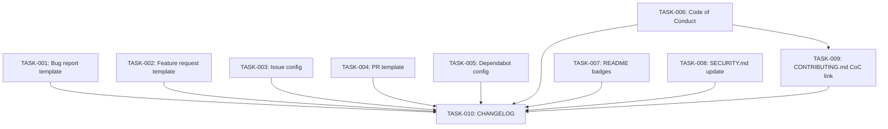

# Technical Design: phase-1-community-governance

## Metadata
- **Feature**: phase-1-community-governance
- **Status**: DRAFT
- **Created**: 2026-02-07
- **Author**: Factory Design Mode
- **Parent Epic**: #179 (MAHABHARATHA Public Release)
- **Issues**: #185, #186, #187, #188

---

## 1. Overview

### 1.1 Summary
Add standard open-source community infrastructure to the MAHABHARATHA repository: GitHub issue templates (bug report, feature request, config), PR template, Code of Conduct, Dependabot configuration, README badges, GitHub topics, secret scanning + push protection, SECURITY.md version update, and CONTRIBUTING.md CoC link. All changes are static configuration files with no runtime code impact.

### 1.2 Goals
- Structured bug reports and feature requests via YAML form templates
- Consistent PR descriptions via template
- Clear community standards via Contributor Covenant v2.1
- Automated dependency vulnerability alerts via Dependabot
- At-a-glance project health via README badges
- GitHub discoverability via repository topics
- Secret leak prevention via secret scanning + push protection
- Accurate supported-versions table in SECURITY.md

### 1.3 Non-Goals
- CodeQL workflow (Phase 2, #189)
- mypy in CI (Phase 2, #189)
- mkdocs documentation site (Phase 2, #190)
- Making the repo public (separate decision)
- Terminal demo / social preview (Phase 3, #191)

---

## 2. Architecture

### 2.1 High-Level Design

This feature is entirely static configuration — no runtime components, no data flow, no services. The "architecture" is a file layout under `.github/` and modifications to root-level docs.

```
.github/
├── ISSUE_TEMPLATE/
│   ├── bug_report.yml          # TASK-001 (new)
│   ├── feature_request.yml     # TASK-002 (new)
│   └── config.yml              # TASK-003 (new)
├── PULL_REQUEST_TEMPLATE.md    # TASK-004 (new)
└── dependabot.yml              # TASK-005 (new)

CODE_OF_CONDUCT.md              # TASK-006 (new)
README.md                       # TASK-007 (modify — badges)
SECURITY.md                     # TASK-008 (modify — versions)
CONTRIBUTING.md                 # TASK-009 (modify — CoC link)
CHANGELOG.md                    # TASK-010 (modify — Phase 1 entries)
```

### 2.2 Component Breakdown

| Component | Responsibility | Files |
|-----------|---------------|-------|
| Issue Templates | Structured bug/feature reporting via GitHub forms | `.github/ISSUE_TEMPLATE/bug_report.yml`, `feature_request.yml`, `config.yml` |
| PR Template | Consistent pull request descriptions | `.github/PULL_REQUEST_TEMPLATE.md` |
| Dependabot | Automated dependency vulnerability alerts | `.github/dependabot.yml` |
| Code of Conduct | Community standards (Contributor Covenant v2.1) | `CODE_OF_CONDUCT.md` |
| README Badges | At-a-glance project health indicators | `README.md` (modify) |
| SECURITY.md Update | Accurate supported versions table | `SECURITY.md` (modify) |
| CONTRIBUTING.md Update | Link to Code of Conduct | `CONTRIBUTING.md` (modify) |
| GitHub API Config | Topics, secret scanning, push protection | Script/manual via `gh` CLI |
| CHANGELOG | Document all Phase 1 changes | `CHANGELOG.md` (modify) |

### 2.3 Data Flow
N/A — static configuration files. No runtime data flow.

---

## 3. Detailed Design

### 3.1 Bug Report Template (FR-001)

`.github/ISSUE_TEMPLATE/bug_report.yml` — YAML form with fields:
- **name**: Bug Report
- **description**: Report a bug in MAHABHARATHA
- **labels**: `bug`
- **body fields**: description (textarea, required), repro steps (textarea, required), expected behavior (textarea, required), actual behavior (textarea, required), MAHABHARATHA version (input, required), Python version (input, required), OS (dropdown), logs (textarea, optional)

### 3.2 Feature Request Template (FR-002)

`.github/ISSUE_TEMPLATE/feature_request.yml` — YAML form with fields:
- **name**: Feature Request
- **description**: Suggest a new feature
- **labels**: `enhancement`
- **body fields**: problem statement (textarea, required), proposed solution (textarea, required), alternatives considered (textarea, optional), additional context (textarea, optional)

### 3.3 Issue Config (FR-003)

`.github/ISSUE_TEMPLATE/config.yml`:
- `blank_issues_enabled: false`
- Contact links: Discussions (questions), SECURITY.md (vulnerabilities)

### 3.4 PR Template (FR-004)

`.github/PULL_REQUEST_TEMPLATE.md` — Sections:
- Summary (what and why)
- Changes (bulleted list)
- Test Plan (how to verify)
- Checklist: tests pass, CHANGELOG updated, ruff/mypy clean

### 3.5 Code of Conduct (FR-005)

`CODE_OF_CONDUCT.md` — Contributor Covenant v2.1, enforcement contact via GitHub Security Advisories link (per Q-002 resolution).

### 3.6 Dependabot Config (FR-006)

`.github/dependabot.yml`:
- `package-ecosystem: pip`
- `directory: "/"`
- `schedule.interval: weekly`
- `labels: ["dependencies"]`
- `reviewers: ["rocklambros"]`

### 3.7 Secret Scanning + Push Protection (FR-007, FR-008)

Enable via `gh api` commands:
```bash
gh api repos/rocklambros/mahabharatha -X PATCH -f security_and_analysis[secret_scanning][status]=enabled
gh api repos/rocklambros/mahabharatha -X PATCH -f security_and_analysis[secret_scanning_push_protection][status]=enabled
```

### 3.8 README Badges (FR-009)

Add badge row after the logo block:
- PyPI version: `https://img.shields.io/pypi/v/mahabharatha-ai`
- Python version: `https://img.shields.io/pypi/pyversions/mahabharatha-ai`
- License: `https://img.shields.io/github/license/rocklambros/mahabharatha`
- CI status: `https://img.shields.io/github/actions/workflow/status/rocklambros/mahabharatha/ci.yml?branch=main`

### 3.9 GitHub Topics (FR-010)

Set via `gh api`:
```bash
gh api repos/rocklambros/mahabharatha/topics -X PUT -f names='["claude-code","parallel-execution","ai-coding","cli","python","developer-tools","automation","code-generation","llm"]'
```

### 3.10 SECURITY.md Update (FR-012)

Add `0.2.x | Yes` row, keep `0.1.x | Yes`.

### 3.11 CONTRIBUTING.md Update

Add CoC reference in the introductory section, linking to `CODE_OF_CONDUCT.md`.

### 3.12 License Compatibility Audit (FR-011)

Verify all runtime dependencies are MIT/BSD/Apache compatible:
- click (BSD-3), pydantic (MIT), pyyaml (MIT), rich (MIT)
- Dev deps: pytest (MIT), ruff (MIT), mypy (MIT), pre-commit (MIT)

---

## 4. Key Decisions

### Decision: YAML Form Templates vs Markdown Templates

**Context**: GitHub supports both markdown-based and YAML form-based issue templates.

**Options Considered**:
1. Markdown templates: Simpler, but users can ignore/delete fields
2. YAML forms: Renders as structured form in GitHub UI, fields can be required

**Decision**: YAML forms

**Rationale**: Required fields ensure bug reports include repro steps and version info. Forms provide better UX for non-technical reporters.

**Consequences**: Templates use `.yml` extension, require specific YAML schema.

### Decision: Enforcement Contact for Code of Conduct

**Context**: Contributor Covenant requires an enforcement contact.

**Options Considered**:
1. Personal email: Exposes maintainer email publicly
2. GitHub Security Advisories link: Private, built-in to GitHub

**Decision**: GitHub Security Advisories link (per Q-002 resolution)

**Rationale**: No personal email exposure. GitHub provides private reporting infrastructure.

**Consequences**: Enforcement section links to `https://github.com/rocklambros/mahabharatha/security/advisories/new`.

---

## 5. Implementation Plan

### 5.1 Phase Summary

| Phase | Tasks | Parallel | Est. Time |
|-------|-------|----------|-----------|
| Foundation (L1) | 6 | Yes | 10 min |
| Integration (L2) | 2 | Yes | 5 min |
| Quality (L3) | 2 | Yes | 5 min |

### 5.2 File Ownership

| File | Task ID | Operation |
|------|---------|-----------|
| `.github/ISSUE_TEMPLATE/bug_report.yml` | TASK-001 | create |
| `.github/ISSUE_TEMPLATE/feature_request.yml` | TASK-002 | create |
| `.github/ISSUE_TEMPLATE/config.yml` | TASK-003 | create |
| `.github/PULL_REQUEST_TEMPLATE.md` | TASK-004 | create |
| `.github/dependabot.yml` | TASK-005 | create |
| `CODE_OF_CONDUCT.md` | TASK-006 | create |
| `README.md` | TASK-007 | modify |
| `SECURITY.md` | TASK-008 | modify |
| `CONTRIBUTING.md` | TASK-009 | modify |
| `CHANGELOG.md` | TASK-010 | modify |

### 5.3 Dependency Graph



---

## 6. Risk Assessment

| Risk | Probability | Impact | Mitigation |
|------|-------------|--------|------------|
| YAML template syntax error | Low | Low | Validate with `yq` or manual GitHub preview |
| Badges show "not found" while private | High | Low | Expected — documented in assumptions |
| `gh api` calls fail (no token) | Medium | Medium | Provide manual fallback instructions |
| Dependabot floods with PRs | Low | Low | Weekly schedule + single ecosystem limits volume |

---

## 7. Testing Strategy

### 7.1 Validation
- YAML syntax validation for all `.yml` files
- Markdown lint for `.md` files
- `gh api` response verification for topics/secret scanning
- CI passes on PR (existing quality, smoke, test, audit checks)

### 7.2 Verification Commands
Each task has a verification command that confirms correctness without relying on GitHub UI rendering.

---

## 8. Parallel Execution Notes

### 8.1 Safe Parallelization
- Level 1: 6 tasks with no dependencies, fully parallel
- Level 2: CONTRIBUTING.md depends on CoC (TASK-006)
- Level 3: CHANGELOG depends on all other tasks
- No two tasks modify the same file

### 8.2 Recommended Workers
- Minimum: 1 worker (sequential, ~20 min)
- Optimal: 6 workers (Level 1 fully parallel)
- Maximum: 6 workers (diminishing returns beyond — L2/L3 are narrow)

### 8.3 Estimated Duration
- Single worker: ~20 minutes
- With 6 workers: ~8 minutes
- Speedup: ~2.5x

---

## 9. Consumer Matrix

| Task | Creates | Consumed By | Integration Test |
|------|---------|-------------|-----------------|
| TASK-001 | `.github/ISSUE_TEMPLATE/bug_report.yml` | leaf | — |
| TASK-002 | `.github/ISSUE_TEMPLATE/feature_request.yml` | leaf | — |
| TASK-003 | `.github/ISSUE_TEMPLATE/config.yml` | leaf | — |
| TASK-004 | `.github/PULL_REQUEST_TEMPLATE.md` | leaf | — |
| TASK-005 | `.github/dependabot.yml` | leaf | — |
| TASK-006 | `CODE_OF_CONDUCT.md` | TASK-009 | — |
| TASK-007 | (modifies `README.md`) | leaf | — |
| TASK-008 | (modifies `SECURITY.md`) | leaf | — |
| TASK-009 | (modifies `CONTRIBUTING.md`) | leaf | — |
| TASK-010 | (modifies `CHANGELOG.md`) | leaf | — |

Note: All tasks are leaf or near-leaf. This is a static config feature — no production Python/JS modules are created, so integration tests are not applicable. Validation is via YAML/Markdown syntax checks and CI.

---

## 10. Approval

| Role | Name | Date | Signature |
|------|------|------|-----------|
| Architecture | | | PENDING |
| Engineering | | | PENDING |
