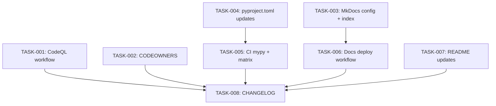

# Technical Design: phase-2-ci-quality

## Metadata
- **Feature**: phase-2-ci-quality
- **Status**: DRAFT
- **Created**: 2026-02-07
- **Author**: Factory Design Mode
- **Parent Epic**: #179 (MAHABHARATHA Public Release)
- **Issues**: #189, #190

---

## 1. Overview

### 1.1 Summary
Add CI security scanning (CodeQL), type checking enforcement (mypy), Python 3.13 test coverage, code ownership (CODEOWNERS), a MkDocs documentation site with GitHub Pages deployment, and structured GitHub Discussions categories. All changes are configuration/workflow files — no Python source code modifications.

### 1.2 Goals
- Automate security vulnerability detection in PRs via CodeQL
- Enforce mypy strict type checking in CI (block merge on failure)
- Verify compatibility with Python 3.12 and 3.13
- Enable automatic code review assignment via CODEOWNERS
- Provide a searchable, navigable documentation site
- Structure community engagement through GitHub Discussions categories

### 1.3 Non-Goals
- Changing the coverage floor (stays at 50)
- Terminal demo or social preview (Phase 3)
- Making repo public
- Link checker workflow
- Secret scanning

---

## 2. Architecture

### 2.1 High-Level Design

This feature adds 5 new files and modifies 3 existing files. No new Python modules, no runtime changes.

```
.github/workflows/
├── ci.yml          ← MODIFY: add mypy step, expand matrix to 3.12+3.13
├── codeql.yml      ← CREATE: CodeQL security scanning
├── docs.yml        ← CREATE: MkDocs build + GitHub Pages deploy
└── release.yml     (unchanged)

root/
├── CODEOWNERS      ← CREATE: code ownership rules
├── mkdocs.yml      ← CREATE: MkDocs Material configuration
├── pyproject.toml  ← MODIFY: add 3.13 classifier, docs optional deps
├── README.md       ← MODIFY: add Discussions link, coverage badge
├── CHANGELOG.md    ← MODIFY: add Phase 2 entries
└── docs/
    └── index.md    ← CREATE: docs site landing page
```

### 2.2 Component Breakdown

| Component | Responsibility | Files |
|-----------|---------------|-------|
| CodeQL Workflow | SAST scanning on push/PR/weekly | `.github/workflows/codeql.yml` |
| CI Enhancement | mypy enforcement + Python 3.13 matrix | `.github/workflows/ci.yml` |
| Code Ownership | Auto-assign reviewers per path | `CODEOWNERS` |
| Docs Site Config | MkDocs Material theme setup | `mkdocs.yml` |
| Docs Landing Page | Entry point for docs site | `docs/index.md` |
| Docs Deployment | GitHub Pages via workflow | `.github/workflows/docs.yml` |
| Project Metadata | Classifiers + docs deps | `pyproject.toml` |
| README Updates | Badge + Discussions link | `README.md` |
| Changelog | Phase 2 entries | `CHANGELOG.md` |

### 2.3 Data Flow

No runtime data flow — all components are CI/CD configuration:
1. **PR opened** → `ci.yml` runs quality (lint + mypy + validate), smoke, test (3.12 + 3.13), audit
2. **PR opened** → `codeql.yml` runs Python security analysis (advisory, non-blocking)
3. **PR opened** → CODEOWNERS auto-assigns @rocklambros
4. **Push to main** → `docs.yml` builds mkdocs and deploys to GitHub Pages

---

## 3. Detailed Design

### 3.1 CodeQL Workflow (`.github/workflows/codeql.yml`)

```yaml
# Triggers: push to main, PRs, weekly schedule (Monday 9am)
# Language: Python
# Query suite: security-and-quality
# Non-blocking (advisory only — not a required check)
```

### 3.2 CI Enhancement (`.github/workflows/ci.yml`)

Changes to existing file:
1. **quality job**: Add `mypy mahabharatha/` step after lint check
2. **test job**: Expand matrix from `[1, 2]` shards to `python-version: ['3.12', '3.13']` × `shard: [1, 2]` (4 combinations)
3. All other jobs (quality, smoke, audit) stay on Python 3.12

### 3.3 CODEOWNERS

```
# Default
* @rocklambros

# Core orchestrator
/mahabharatha/ @rocklambros

# CI/CD
/.github/ @rocklambros

# Documentation
/docs/ @rocklambros
```

### 3.4 MkDocs Configuration (`mkdocs.yml`)

- Theme: Material for MkDocs
- Navigation tabs enabled
- Search enabled
- Content from existing `docs/` folder
- Navigation structure mapping all 8+ existing doc files

### 3.5 Docs Landing Page (`docs/index.md`)

Adapted from README.md — overview, quick start, key concepts. Links to other docs pages.

### 3.6 Docs Deployment (`.github/workflows/docs.yml`)

```yaml
# Trigger: push to main (docs/** or mkdocs.yml changes)
# Steps: checkout → setup python → install mkdocs-material → mkdocs build --strict → deploy to gh-pages
# Uses: actions/deploy-pages
```

### 3.7 pyproject.toml Changes

```toml
# Add classifier
"Programming Language :: Python :: 3.13",

# Add optional deps
docs = ["mkdocs>=1.6", "mkdocs-material>=9.5"]
```

### 3.8 README.md Changes

1. Add coverage badge after CI badge
2. Add Discussions link in Documentation table

---

## 4. Key Decisions

### 4.1 CodeQL as Advisory (Non-Blocking)

**Context**: CodeQL can be a required check or advisory.
**Decision**: Advisory only (not added to required checks initially).
**Rationale**: Per Q-001 resolution in requirements. Avoids blocking PRs on false positives during initial rollout. Can be promoted to required after tuning.

### 4.2 Test Matrix Strategy

**Context**: Could add 3.13 as a separate job or expand existing matrix.
**Decision**: Expand existing test job matrix to `python-version × shard`.
**Rationale**: Reuses existing test infrastructure. 4 jobs (2 versions × 2 shards) is manageable. No duplication of configuration.

### 4.3 MkDocs over Other Doc Generators

**Context**: Could use Sphinx, Docusaurus, or MkDocs.
**Decision**: MkDocs with Material theme.
**Rationale**: Specified in requirements (FR-005). Material is the most popular MkDocs theme, has search built-in, and works well with existing markdown docs.

---

## 5. Implementation Plan

### 5.1 Phase Summary

| Phase | Tasks | Parallel | Est. Time |
|-------|-------|----------|-----------|
| Foundation (L1) | 4 | Yes | 10 min |
| Integration (L2) | 3 | Yes | 15 min |
| Quality (L3) | 2 | No | 10 min |

### 5.2 File Ownership

| File | Task ID | Operation |
|------|---------|-----------|
| `.github/workflows/codeql.yml` | TASK-001 | create |
| `CODEOWNERS` | TASK-002 | create |
| `mkdocs.yml` | TASK-003 | create |
| `docs/index.md` | TASK-003 | create |
| `pyproject.toml` | TASK-004 | modify |
| `.github/workflows/ci.yml` | TASK-005 | modify |
| `.github/workflows/docs.yml` | TASK-006 | create |
| `README.md` | TASK-007 | modify |
| `CHANGELOG.md` | TASK-008 | modify |

### 5.3 Consumer Matrix

| Task | Creates/Modifies | Consumed By | Integration Test |
|------|-----------------|-------------|-----------------|
| TASK-001 | `codeql.yml` | leaf (CI workflow) | — |
| TASK-002 | `CODEOWNERS` | leaf (GitHub feature) | — |
| TASK-003 | `mkdocs.yml`, `docs/index.md` | TASK-006 | — |
| TASK-004 | `pyproject.toml` | TASK-005 (3.13 needs classifier) | — |
| TASK-005 | `ci.yml` | leaf (CI workflow) | — |
| TASK-006 | `docs.yml` | leaf (CI workflow) | — |
| TASK-007 | `README.md` | leaf | — |
| TASK-008 | `CHANGELOG.md` | leaf | — |

Note: No integration tests needed — all tasks produce static config/workflow files verified by `yamllint`, `mkdocs build --strict`, or syntax checks.

### 5.4 Dependency Graph



---

## 6. Risk Assessment

| Risk | Probability | Impact | Mitigation |
|------|-------------|--------|------------|
| mypy failures in CI | Medium | Medium | mypy already passes locally; strict config exists |
| Python 3.13 test failures | Low | Medium | All deps support 3.13; quick fix if issues found |
| mkdocs build failure | Low | Low | Existing docs are standard markdown |
| CodeQL false positives | Medium | Low | Advisory only, won't block PRs |

---

## 7. Testing Strategy

### 7.1 Verification Commands
Each task has a local verification command (no CI needed):
- CodeQL: YAML syntax validation
- CODEOWNERS: File exists with correct format
- MkDocs: `pip install mkdocs-material && mkdocs build --strict`
- ci.yml: YAML syntax validation
- pyproject.toml: `pip install -e ".[docs]"` succeeds

### 7.2 Integration Verification
After all tasks merge:
- Push to feature branch → CI runs with mypy + 3.13 matrix
- `mkdocs build --strict` passes
- CodeQL workflow is present

---

## 8. Parallel Execution Notes

### 8.1 Safe Parallelization
- Level 1: 4 independent tasks (codeql.yml, CODEOWNERS, mkdocs config, pyproject.toml)
- Level 2: 3 tasks depending on L1 outputs (ci.yml depends on pyproject.toml; docs.yml depends on mkdocs config; README is independent but logically L2)
- Level 3: 1 task (CHANGELOG) depending on all others

### 8.2 Recommended Workers
- Minimum: 1 worker (sequential)
- Optimal: 4 workers (widest level is L1 with 4 tasks)
- Maximum: 4 workers (no benefit beyond L1 width)

### 8.3 Estimated Duration
- Single worker: ~35 min
- With 4 workers: ~15 min
- Speedup: ~2.3x

---

## 9. Approval

| Role | Name | Date | Signature |
|------|------|------|-----------|
| Architecture | | | PENDING |
| Engineering | | | PENDING |
