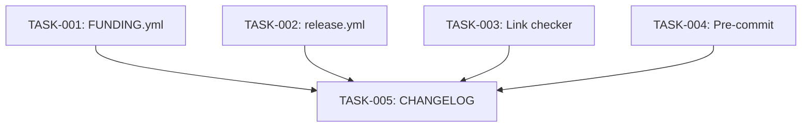

# Technical Design: phase-3-post-release-polish

## Metadata
- **Feature**: phase-3-post-release-polish
- **Status**: DRAFT
- **Created**: 2026-02-07
- **Author**: Factory Design Mode
- **Issue**: #191

---

## 1. Overview

### 1.1 Summary
Four independent infrastructure/CI improvements for post-v0.2.0 polish: GitHub Sponsors setup, release notes automation config, documentation link checking in CI, and expanded pre-commit hooks. All tasks are file-creation or file-modification with zero interdependencies — fully parallelizable.

### 1.2 Goals
- Enable GitHub Sponsors button on the repository
- Auto-categorize release notes by PR labels
- Catch broken documentation links before merge
- Enforce whitespace/format hygiene via pre-commit

### 1.3 Non-Goals
- Terminal demo recording (manual)
- Social preview image (manual)
- Docker Hub publishing (deferred)
- Changing existing CI required checks

---

## 2. Architecture

### 2.1 High-Level Design

No new code components. All changes are configuration files.

```
┌──────────────────────────────────────────────────────┐
│                  GitHub Repository                    │
│                                                       │
│  .github/                                             │
│  ├── FUNDING.yml        ← NEW (Sponsors button)       │
│  ├── release.yml        ← NEW (release note categories)│
│  └── workflows/                                       │
│      └── ci.yml         ← MODIFY (add lychee job)     │
│                                                       │
│  .pre-commit-config.yaml ← MODIFY (add standard hooks)│
│                                                       │
│  CHANGELOG.md           ← MODIFY (add entries)        │
└──────────────────────────────────────────────────────┘
```

### 2.2 Component Breakdown

| Component | Responsibility | Files |
|-----------|---------------|-------|
| FUNDING.yml | Enable Sponsor button on repo | `.github/FUNDING.yml` |
| release.yml | Categorize auto-generated release notes | `.github/release.yml` |
| Link checker | CI job to detect broken doc links | `.github/workflows/ci.yml` |
| Pre-commit hooks | Enforce whitespace/format hygiene | `.pre-commit-config.yaml` |
| CHANGELOG | Document all changes | `CHANGELOG.md` |

### 2.3 Data Flow
No runtime data flow — all components are static config consumed by GitHub or git hooks at build/commit time.

---

## 3. Detailed Design

### 3.1 FUNDING.yml

```yaml
# .github/FUNDING.yml
github: rocklambros
# buy_me_a_coffee:
# open_collective:
```

### 3.2 Release Notes Config

```yaml
# .github/release.yml
changelog:
  exclude:
    labels:
      - skip-changelog
      - duplicate
  categories:
    - title: New Features
      labels:
        - enhancement
    - title: Bug Fixes
      labels:
        - bug
    - title: Documentation
      labels:
        - documentation
    - title: Dependencies
      labels:
        - dependencies
    - title: Other Changes
      labels:
        - "*"
```

### 3.3 Link Checker CI Job

New job `link-check` added to `.github/workflows/ci.yml`. Runs in parallel with `quality` (no dependency). Uses `lychee-action` with:
- Scope: `docs/**/*.md README.md CONTRIBUTING.md CHANGELOG.md`
- Excludes: `localhost`, `example.com`, PyPI badge URLs
- Retries: 3, timeout: 30s
- `continue-on-error: true` (non-blocking warning)

### 3.4 Pre-commit Expansion

Add `pre-commit/pre-commit-hooks` repo block **after** existing ruff block:
- `trailing-whitespace`
- `end-of-file-fixer`
- `check-yaml`
- `check-json`
- `check-toml`
- `check-added-large-files` (args: `['--maxkb=500']`)

---

## 4. Key Decisions

### 4.1 Link Checker: Non-Blocking

**Context**: External URLs can be flaky (rate limits, timeouts), causing false CI failures.

**Options Considered**:
1. Blocking (`required`): strict but risks flaky failures
2. Non-blocking (`continue-on-error`): catches issues as warnings, no false failures
3. Separate workflow: more complex, harder to discover

**Decision**: Non-blocking via `continue-on-error: true`

**Rationale**: Requirements explicitly say "warning (non-blocking) initially". Can promote later.

**Consequences**: Broken links won't block PRs but will be visible in CI output.

### 4.2 Lychee Action vs CLI

**Context**: Need a link checker in CI.

**Options Considered**:
1. `lychee-action` GitHub Action: turnkey, maintained, cached
2. Raw `lychee` CLI install: more control, more setup
3. `markdown-link-check`: older, slower, npm-based

**Decision**: `lychee/lychee-action` GitHub Action

**Rationale**: Most maintained, fastest, Rust-based, first-class GitHub Action support.

**Consequences**: Depends on external action. Pin to specific version for reproducibility.

---

## 5. Implementation Plan

### 5.1 Phase Summary

| Phase | Tasks | Parallel | Est. Time |
|-------|-------|----------|-----------|
| Foundation (L1) | 4 | Yes | 10 min |
| Quality (L2) | 1 | No | 5 min |

All implementation tasks are independent — max parallelization at Level 1.

### 5.2 File Ownership

| File | Task ID | Operation |
|------|---------|-----------|
| `.github/FUNDING.yml` | TASK-001 | create |
| `.github/release.yml` | TASK-002 | create |
| `.github/workflows/ci.yml` | TASK-003 | modify |
| `.pre-commit-config.yaml` | TASK-004 | modify |
| `CHANGELOG.md` | TASK-005 | modify |

### 5.3 Dependency Graph



---

## 6. Risk Assessment

| Risk | Probability | Impact | Mitigation |
|------|-------------|--------|------------|
| Lychee fails on valid external URLs | Medium | Low | Retries, exclude list, non-blocking |
| Pre-commit hooks break existing ruff | Low | Medium | Append after ruff block, don't modify existing |
| release.yml confused with workflows/release.yml | Low | Low | Different directories — no conflict |

---

## 7. Testing Strategy

### 7.1 Verification Commands
- TASK-001: `test -f .github/FUNDING.yml && grep -q 'github: rocklambros' .github/FUNDING.yml`
- TASK-002: `test -f .github/release.yml && python -c "import yaml; d=yaml.safe_load(open('.github/release.yml')); assert len(d['changelog']['categories']) == 5"`
- TASK-003: `python -c "import yaml; ci=yaml.safe_load(open('.github/workflows/ci.yml')); assert 'link-check' in ci['jobs']"`
- TASK-004: `grep -c 'id:' .pre-commit-config.yaml | grep -q '8'`
- TASK-005: `grep -q 'FUNDING.yml' CHANGELOG.md && grep -q 'release.yml' CHANGELOG.md && grep -q 'lychee' CHANGELOG.md && grep -q 'pre-commit' CHANGELOG.md`

---

## 8. Parallel Execution Notes

### 8.1 Safe Parallelization
- Level 1: 4 tasks, zero shared files, fully parallel
- Level 2: 1 task (CHANGELOG), depends on all L1 tasks

### 8.2 Recommended Workers
- Minimum: 1 worker (sequential)
- Optimal: 4 workers (one per L1 task)
- Maximum: 4 workers (no benefit beyond)

### 8.3 Estimated Duration
- Single worker: ~15 min
- With 4 workers: ~10 min (L1 parallel + L2 sequential)
- Speedup: ~1.5x

---

## 9. Approval

| Role | Name | Date | Signature |
|------|------|------|-----------|
| Architecture | | | PENDING |
| Engineering | | | PENDING |
