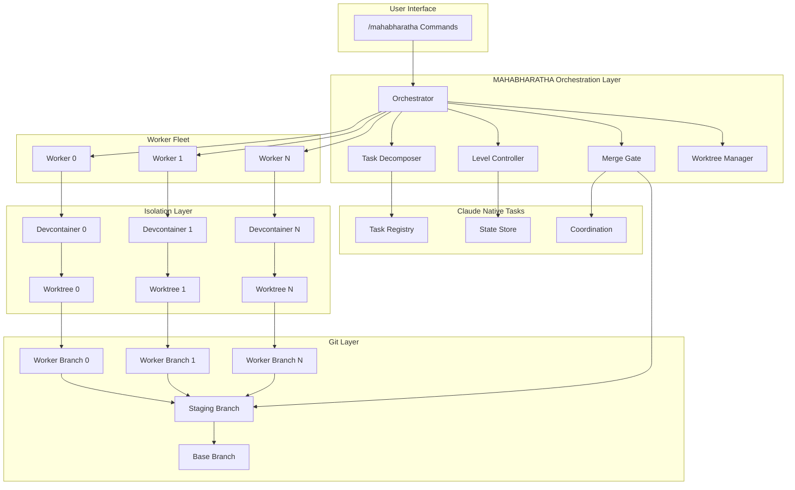
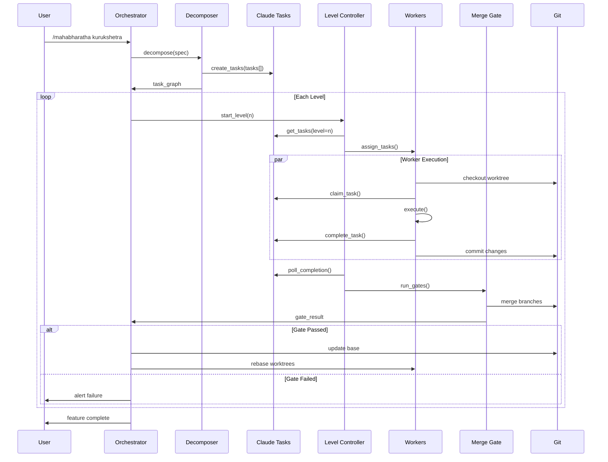
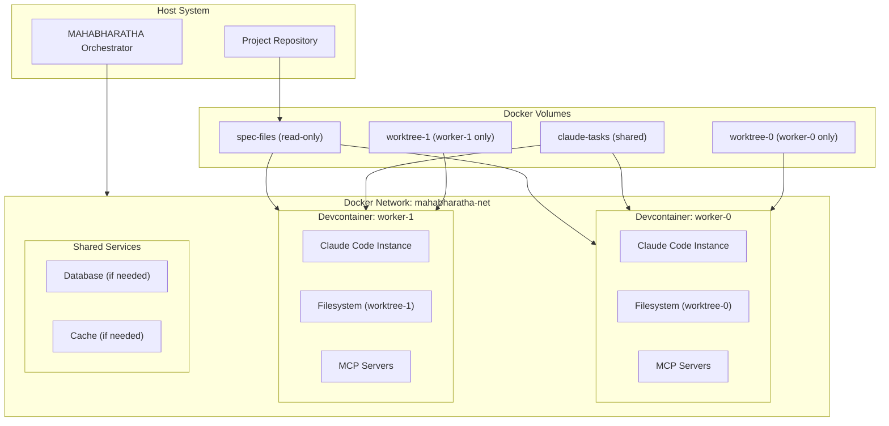
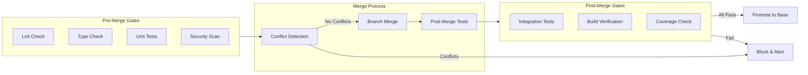
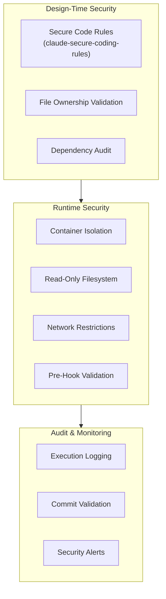
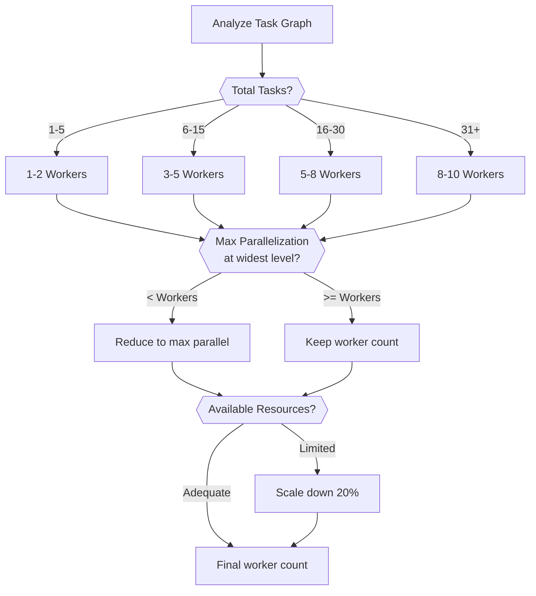

# MAHABHARATHA Architecture Synthesis

**Phase**: 2 - Architecture Design
**Date**: January 25, 2026
**Status**: DRAFT
**Based On**: Phase 1 Capability Matrix and Synthesis

---

## Executive Summary

MAHABHARATHA is a parallel execution orchestration layer for Claude Code. It transforms spec-driven feature development into dependency-ordered waves of isolated workers. Claude Native Tasks provides state persistence and coordination primitives. MAHABHARATHA adds five capabilities Tasks lacks: level-based synchronization, git worktree isolation, exclusive file ownership, merge gates, and task decomposition.

This document specifies the complete plugin architecture for Claude marketplace deployment.

---

## 1. System Architecture

### 1.1 High-Level Architecture



### 1.2 Execution Flow



### 1.3 Component Responsibilities

| Component | Responsibility | Source Pattern |
|-----------|---------------|----------------|
| **Orchestrator** | Fleet lifecycle, level transitions, status reporting | MAHABHARATHA original |
| **Task Decomposer** | Parse spec → task graph with levels and file assignments | superpowers writing-plans |
| **Level Controller** | Block level N+1 until N complete, poll task status | MAHABHARATHA original |
| **Merge Gate** | Quality verification, branch merging, conflict detection | MAHABHARATHA original |
| **Worktree Manager** | Create/delete worktrees, branch management | packnplay |
| **Security Monitor** | Pre/post hook validation, audit logging | nova-protector |

---

## 2. Command Specifications

### 2.1 Command Summary

| Command | Purpose | Phase |
|---------|---------|-------|
| `/mahabharatha init` | Initialize project for MAHABHARATHA | Setup |
| `/mahabharatha plan` | Capture requirements interactively | Planning |
| `/mahabharatha design` | Generate architecture and task graph | Design |
| `/mahabharatha kurukshetra` | Launch parallel execution | Execution |
| `/mahabharatha status` | Show progress across all workers | Monitoring |
| `/mahabharatha logs` | Stream worker logs | Monitoring |
| `/mahabharatha stop` | Halt execution gracefully | Control |
| `/mahabharatha retry` | Retry failed/blocked tasks | Recovery |
| `/mahabharatha merge` | Force merge gate execution | Control |
| `/mahabharatha cleanup` | Remove worktrees and branches | Maintenance |

### 2.2 Command: /mahabharatha init

**Purpose**: Initialize MAHABHARATHA infrastructure for a project

**Flags**:
| Flag | Type | Default | Description |
|------|------|---------|-------------|
| `--detect` | bool | true | Auto-detect language/framework |
| `--workers` | int | 5 | Default worker count |
| `--security` | enum | standard | Security level: minimal, standard, strict |

**Behavior**:
1. Detect project type (language, framework, package manager)
2. Generate `.devcontainer/` configuration
3. Generate `.mahabharatha/config.yaml`
4. Generate `.gsd/PROJECT.md` and `INFRASTRUCTURE.md`
5. Create `.claude/commands/` directory with MAHABHARATHA commands

**Output Files**:
```
.mahabharatha/
├── config.yaml              # MAHABHARATHA configuration
├── security-rules.yaml      # Security constraints
└── orchestrator.py          # Fleet manager (generated)

.devcontainer/
├── devcontainer.json        # Container definition
├── Dockerfile               # Worker image
├── docker-compose.yaml      # Multi-container setup
└── scripts/
    ├── post-create.sh       # Setup script
    └── post-start.sh        # Startup script

.gsd/
├── PROJECT.md               # Project overview
└── INFRASTRUCTURE.md        # Runtime requirements
```

**Verification**: `docker compose -f .devcontainer/docker-compose.yaml config`

---

### 2.3 Command: /mahabharatha plan [feature-name]

**Purpose**: Capture complete requirements for a feature

**Flags**:
| Flag | Type | Default | Description |
|------|------|---------|-------------|
| `--template` | string | default | Requirements template to use |
| `--interactive` | bool | true | Enable interactive questioning |
| `--from-issue` | string | null | Import from GitHub issue URL |

**Behavior**:
1. Create `.gsd/specs/{feature}/` directory
2. If `--from-issue`: fetch issue content as starting point
3. Enter plan mode (Opus 4.5 for reasoning)
4. Gather requirements through structured questions
5. Generate `requirements.md` with user approval

**Output Files**:
```
.gsd/specs/{feature}/
├── requirements.md          # Complete requirements
└── .meta.json               # Timestamps, status
```

**Verification**: Requirements marked as APPROVED

---

### 2.4 Command: /mahabharatha design

**Purpose**: Generate technical architecture and task graph

**Flags**:
| Flag | Type | Default | Description |
|------|------|---------|-------------|
| `--max-task-minutes` | int | 30 | Maximum minutes per task |
| `--min-task-minutes` | int | 5 | Minimum minutes per task |
| `--validate-only` | bool | false | Validate existing graph without regenerating |

**Behavior**:
1. Load requirements.md for current feature
2. Analyze codebase for patterns and conventions
3. Design architecture with components and data flow
4. Decompose into tasks following superpowers pattern:
   - 5-30 minute duration
   - Explicit file paths (create/modify/read)
   - Verification command per task
   - Exclusive file ownership
5. Assign tasks to levels based on dependencies
6. Generate `design.md` and `task-graph.json`

**Output Files**:
```
.gsd/specs/{feature}/
├── design.md                # Technical architecture
└── task-graph.json          # Execution graph
```

**Task Graph Schema**:
```json
{
  "$schema": "https://mahabharatha.dev/schemas/task-graph-v1.json",
  "feature": "string",
  "version": "1.0",
  "generated": "ISO8601",
  "tasks": [{
    "id": "TASK-NNN",
    "title": "string",
    "description": "string",
    "level": "integer (1-5)",
    "dependencies": ["TASK-NNN"],
    "files": {
      "create": ["path"],
      "modify": ["path"],
      "read": ["path"]
    },
    "verification": {
      "command": "string",
      "timeout_seconds": "integer"
    },
    "estimate_minutes": "integer"
  }],
  "levels": {
    "1": { "name": "foundation", "tasks": [] },
    "2": { "name": "core", "tasks": [] },
    "3": { "name": "integration", "tasks": [] },
    "4": { "name": "testing", "tasks": [] },
    "5": { "name": "quality", "tasks": [] }
  }
}
```

**Verification**: `jq empty .gsd/specs/{feature}/task-graph.json`

---

### 2.5 Command: /mahabharatha kurukshetra [workers]

**Purpose**: Launch parallel worker execution

**Flags**:
| Flag | Type | Default | Description |
|------|------|---------|-------------|
| `[workers]` | int | 5 | Number of workers to launch |
| `--level` | int | null | Start from specific level |
| `--dry-run` | bool | false | Show plan without executing |
| `--continue` | bool | false | Continue from previous run |
| `--timeout` | int | 3600 | Maximum execution time (seconds) |

**Behavior**:
1. Validate task graph exists and is approved
2. Calculate optimal worker count (min of requested, max_parallelization)
3. Create worker branches: `mahabharatha/{feature}/worker-{N}`
4. Create worktrees: `.mahabharatha-worktrees/{feature}/worker-{N}/`
5. Generate worker assignments (balanced by level)
6. Register tasks in Claude Native Tasks
7. Allocate ports (49152-65535 range)
8. Launch devcontainers
9. Start orchestrator monitoring loop

**Output**:
```
.gsd/specs/{feature}/
├── worker-assignments.json  # Task→worker mapping
└── execution-log.jsonl      # Execution events

.mahabharatha-worktrees/{feature}/
├── worker-0/                # Worktree for worker 0
├── worker-1/                # Worktree for worker 1
└── worker-N/                # Worktree for worker N
```

**Verification**: All workers report ready status

---

### 2.6 Command: /mahabharatha status

**Purpose**: Display execution progress

**Flags**:
| Flag | Type | Default | Description |
|------|------|---------|-------------|
| `--watch` | bool | false | Continuous update (every 5s) |
| `--json` | bool | false | Output as JSON |
| `--level` | int | null | Filter to specific level |

**Output Format**:
```
═══════════════════════════════════════════════════════════════
                    MAHABHARATHA STATUS: {feature}
═══════════════════════════════════════════════════════════════

Progress: ████████████░░░░░░░░ 60% (12/20 tasks)
Runtime:  00:23:45
Workers:  5 active, 0 blocked, 0 crashed

Level Status:
┌───────┬─────────────┬──────────┬──────────┬─────────┐
│ Level │ Name        │ Tasks    │ Complete │ Status  │
├───────┼─────────────┼──────────┼──────────┼─────────┤
│   1   │ foundation  │ 4        │ 4        │ ✓ DONE  │
│   2   │ core        │ 6        │ 4        │ RUNNING │
│   3   │ integration │ 5        │ 0        │ PENDING │
│   4   │ testing     │ 4        │ 0        │ PENDING │
│   5   │ quality     │ 1        │ 0        │ PENDING │
└───────┴─────────────┴──────────┴──────────┴─────────┘

Worker Status:
┌──────────┬────────┬─────────────┬──────────────────┬─────────┐
│ Worker   │ Port   │ Task        │ Progress         │ Status  │
├──────────┼────────┼─────────────┼──────────────────┼─────────┤
│ worker-0 │ 49152  │ TASK-007    │ ████████░░ 80%   │ RUNNING │
│ worker-1 │ 49153  │ TASK-008    │ ███░░░░░░░ 30%   │ RUNNING │
│ worker-2 │ 49154  │ TASK-009    │ █████████░ 90%   │ RUNNING │
│ worker-3 │ 49155  │ -           │ -                │ IDLE    │
│ worker-4 │ 49156  │ TASK-010    │ ██░░░░░░░░ 20%   │ RUNNING │
└──────────┴────────┴─────────────┴──────────────────┴─────────┘

Recent Events:
  [12:34:56] TASK-006 completed by worker-3 (verification passed)
  [12:35:01] TASK-007 started by worker-0
  [12:35:02] TASK-008 started by worker-1

═══════════════════════════════════════════════════════════════
```

---

### 2.7 Command: /mahabharatha logs [worker]

**Purpose**: Stream logs from workers

**Flags**:
| Flag | Type | Default | Description |
|------|------|---------|-------------|
| `[worker]` | int | all | Specific worker ID or "all" |
| `--tail` | int | 100 | Lines to show |
| `--follow` | bool | true | Stream new logs |
| `--level` | enum | info | Log level filter: debug, info, warn, error |

---

### 2.8 Command: /mahabharatha stop [worker]

**Purpose**: Halt execution gracefully

**Flags**:
| Flag | Type | Default | Description |
|------|------|---------|-------------|
| `[worker]` | int | all | Specific worker ID or "all" |
| `--force` | bool | false | Kill without cleanup |
| `--checkpoint` | bool | true | Commit in-progress work |

**Behavior**:
1. Signal workers to complete current task
2. Workers commit in-progress work with WIP marker
3. Update task status to "paused"
4. Stop containers
5. Preserve worktrees for continuation

---

### 2.9 Command: /mahabharatha retry [task-id]

**Purpose**: Retry failed or blocked tasks

**Flags**:
| Flag | Type | Default | Description |
|------|------|---------|-------------|
| `[task-id]` | string | all-blocked | Specific task or "all-blocked" |
| `--reset` | bool | false | Reset task to fresh state |
| `--worker` | int | null | Assign to specific worker |

---

### 2.10 Command: /mahabharatha merge

**Purpose**: Manually trigger merge gate

**Flags**:
| Flag | Type | Default | Description |
|------|------|---------|-------------|
| `--level` | int | current | Level to merge |
| `--skip-gates` | bool | false | Skip quality gates (dangerous) |
| `--dry-run` | bool | false | Show merge plan without executing |

---

### 2.11 Command: /mahabharatha cleanup

**Purpose**: Remove MAHABHARATHA artifacts

**Flags**:
| Flag | Type | Default | Description |
|------|------|---------|-------------|
| `--feature` | string | current | Feature to clean |
| `--all` | bool | false | Clean all features |
| `--keep-specs` | bool | true | Preserve .gsd/specs/ |
| `--keep-branches` | bool | false | Preserve git branches |

**Behavior**:
1. Stop any running workers
2. Remove worktrees (`.mahabharatha-worktrees/`)
3. Remove worker branches (unless `--keep-branches`)
4. Clear execution logs
5. Optionally remove specs

---

## 3. Worker Isolation Model

### 3.1 Isolation Architecture



### 3.2 Devcontainer Configuration

**`.devcontainer/devcontainer.json`**:
```json
{
  "name": "mahabharatha-worker-${localEnv:ZERG_WORKER_ID}",
  "build": {
    "dockerfile": "Dockerfile",
    "context": "..",
    "args": {
      "WORKER_ID": "${localEnv:ZERG_WORKER_ID:-0}"
    }
  },
  "mounts": [
    {
      "source": "${localWorkspaceFolder}/.gsd",
      "target": "/workspace/.gsd",
      "type": "bind",
      "consistency": "cached"
    },
    {
      "source": "mahabharatha-tasks-${localEnv:ZERG_FEATURE}",
      "target": "/root/.claude/tasks",
      "type": "volume"
    },
    {
      "source": "${localWorkspaceFolder}/.mahabharatha-worktrees/${localEnv:ZERG_FEATURE}/worker-${localEnv:ZERG_WORKER_ID}",
      "target": "/workspace",
      "type": "bind"
    }
  ],
  "containerEnv": {
    "ZERG_WORKER_ID": "${localEnv:ZERG_WORKER_ID}",
    "ZERG_FEATURE": "${localEnv:ZERG_FEATURE}",
    "ZERG_BRANCH": "${localEnv:ZERG_BRANCH}",
    "CLAUDE_CODE_TASK_LIST_ID": "${localEnv:ZERG_FEATURE}"
  },
  "runArgs": [
    "--init",
    "--network=mahabharatha-net",
    "--name=mahabharatha-worker-${localEnv:ZERG_WORKER_ID}",
    "--security-opt=no-new-privileges:true",
    "--read-only",
    "--tmpfs=/tmp:rw,noexec,nosuid,size=1g"
  ],
  "postStartCommand": "/workspace/.devcontainer/scripts/worker-start.sh"
}
```

**`.devcontainer/Dockerfile`**:
```dockerfile
FROM mcr.microsoft.com/devcontainers/base:ubuntu-22.04

ARG WORKER_ID=0

# Security: Non-root user
RUN useradd -m -s /bin/bash mahabharatha && \
    mkdir -p /home/mahabharatha/.claude && \
    chown -R mahabharatha:mahabharatha /home/mahabharatha

# Runtime dependencies
RUN apt-get update && apt-get install -y --no-install-recommends \
    git curl jq netcat-openbsd \
    && rm -rf /var/lib/apt/lists/*

# Node.js for Claude Code
ENV NODE_VERSION=20
RUN curl -fsSL https://deb.nodesource.com/setup_${NODE_VERSION}.x | bash - && \
    apt-get install -y nodejs && \
    npm install -g @anthropic-ai/claude-code

# MCP servers
RUN npm install -g \
    @anthropic-ai/mcp-server-filesystem

# Security: Remove unnecessary tools
RUN apt-get purge -y wget && \
    apt-get autoremove -y

USER mahabharatha
WORKDIR /workspace

LABEL mahabharatha.worker.id="${WORKER_ID}"
```

**`.devcontainer/docker-compose.yaml`**:
```yaml
version: '3.8'

services:
  worker:
    build:
      context: ..
      dockerfile: .devcontainer/Dockerfile
      args:
        WORKER_ID: ${ZERG_WORKER_ID:-0}
    environment:
      - ZERG_WORKER_ID=${ZERG_WORKER_ID:-0}
      - ZERG_FEATURE=${ZERG_FEATURE}
      - ZERG_BRANCH=${ZERG_BRANCH:-main}
      - CLAUDE_CODE_TASK_LIST_ID=${ZERG_FEATURE}
      - ANTHROPIC_API_KEY=${ANTHROPIC_API_KEY}
    volumes:
      - ../.gsd:/workspace/.gsd:ro
      - mahabharatha-tasks:/home/mahabharatha/.claude/tasks
      - ../.mahabharatha-worktrees/${ZERG_FEATURE}/worker-${ZERG_WORKER_ID:-0}:/workspace
    networks:
      - mahabharatha-net
    security_opt:
      - no-new-privileges:true
    read_only: true
    tmpfs:
      - /tmp:rw,noexec,nosuid,size=1g
    deploy:
      resources:
        limits:
          cpus: '2'
          memory: 4G

volumes:
  mahabharatha-tasks:
    name: mahabharatha-tasks-${ZERG_FEATURE}

networks:
  mahabharatha-net:
    name: mahabharatha-${ZERG_FEATURE}-net
```

### 3.3 Worktree Management

**Creation** (packnplay pattern):
```bash
create_worktree() {
    local feature=$1
    local worker_id=$2
    local branch="mahabharatha/${feature}/worker-${worker_id}"
    local path=".mahabharatha-worktrees/${feature}/worker-${worker_id}"

    # Create branch if needed
    git branch "${branch}" 2>/dev/null || true

    # Create worktree
    git worktree add "${path}" "${branch}" 2>/dev/null || {
        # If exists, remove and recreate
        git worktree remove "${path}" --force 2>/dev/null
        git worktree add "${path}" "${branch}"
    }

    echo "${path}"
}
```

**Cleanup**:
```bash
cleanup_worktrees() {
    local feature=$1

    # Remove all worktrees for feature
    git worktree list --porcelain | \
        grep "worktree.*${feature}" | \
        cut -d' ' -f2 | \
        xargs -I{} git worktree remove {} --force

    # Remove branches
    git branch -D $(git branch | grep "mahabharatha/${feature}/") 2>/dev/null || true

    # Remove directory
    rm -rf ".mahabharatha-worktrees/${feature}"
}
```

---

## 4. State Persistence Schema

### 4.1 Claude Native Tasks Integration

MAHABHARATHA uses Claude Native Tasks as the persistence layer. Tasks are registered with metadata that MAHABHARATHA interprets.

**Task Metadata Schema**:
```typescript
interface ZergTaskMetadata {
  // MAHABHARATHA-specific fields stored in task description/metadata
  zerg_version: "1.0";
  feature: string;
  task_id: string;           // "TASK-001"
  level: number;             // 1-5
  dependencies: string[];    // ["TASK-001", "TASK-002"]
  assigned_worker: number;   // Worker ID or -1 if unassigned

  files: {
    create: string[];
    modify: string[];
    read: string[];
  };

  verification: {
    command: string;
    timeout_seconds: number;
    last_result?: "pass" | "fail";
    last_run?: string;       // ISO8601
  };

  execution: {
    started_at?: string;     // ISO8601
    completed_at?: string;   // ISO8601
    retry_count: number;
    error_message?: string;
  };
}
```

### 4.2 Orchestrator State

Persisted to `.mahabharatha/state/{feature}.json`:
```json
{
  "feature": "user-auth",
  "started_at": "2026-01-25T10:00:00Z",
  "current_level": 2,
  "workers": {
    "0": {
      "status": "running",
      "current_task": "TASK-007",
      "port": 49152,
      "container_id": "abc123",
      "health_check_at": "2026-01-25T10:30:00Z"
    }
  },
  "levels": {
    "1": {
      "status": "complete",
      "started_at": "2026-01-25T10:00:00Z",
      "completed_at": "2026-01-25T10:15:00Z",
      "merge_commit": "abc123def"
    },
    "2": {
      "status": "running",
      "started_at": "2026-01-25T10:15:00Z"
    }
  },
  "execution_log": [
    {
      "timestamp": "2026-01-25T10:00:00Z",
      "event": "rush_started",
      "data": {"workers": 5}
    }
  ]
}
```

### 4.3 Session Continuity

When workers restart (crash, context limit, manual stop):

1. **Worker reads state from Claude Tasks**: Task status persists across sessions
2. **Worker identifies incomplete tasks**: Queries tasks with `assigned_worker=self` and `status!=complete`
3. **Worker resumes execution**: Picks up from last committed state

**Context Threshold Handling** (70% rule):
```python
def check_context_threshold(worker):
    if worker.context_usage > 0.70:
        # Commit any in-progress work
        worker.commit_wip()

        # Update task status
        task.metadata.execution.paused_at = now()
        task.metadata.execution.pause_reason = "context_threshold"

        # Exit cleanly
        worker.exit(code=0)

        # Orchestrator will detect exit and restart
```

---

## 5. Quality Gate Definitions

### 5.1 Gate Architecture



### 5.2 Gate Definitions

**Level Transition Gates** (run after each level completes):

| Gate | Command | Timeout | Failure Action |
|------|---------|---------|----------------|
| Lint | `npm run lint` | 120s | Block merge, report errors |
| TypeCheck | `npm run typecheck` | 180s | Block merge, report errors |
| UnitTests | `npm test -- --coverage` | 300s | Block merge, report failures |
| SecurityScan | `npm audit --audit-level=high` | 60s | Block merge, alert |

**Merge Gates** (run during branch merge):

| Gate | Condition | Failure Action |
|------|-----------|----------------|
| ConflictCheck | No merge conflicts | Re-run conflicting tasks on merged base |
| BuildCheck | Build succeeds | Block, identify breaking change |
| IntegrationTests | Integration tests pass | Block, alert |

**Configuration** (`.mahabharatha/config.yaml`):
```yaml
quality_gates:
  level_transition:
    - name: lint
      command: npm run lint
      timeout: 120
      required: true

    - name: typecheck
      command: npm run typecheck
      timeout: 180
      required: true

    - name: unit_tests
      command: npm test
      timeout: 300
      required: true
      coverage_threshold: 80

    - name: security
      command: npm audit --audit-level=high
      timeout: 60
      required: false  # Warning only

  merge:
    - name: build
      command: npm run build
      timeout: 300
      required: true

    - name: integration
      command: npm run test:integration
      timeout: 600
      required: true

  final:
    - name: e2e
      command: npm run test:e2e
      timeout: 900
      required: true
```

### 5.3 Two-Stage Review (superpowers pattern)

After task verification passes, optional review gates:

**Stage 1: Spec Compliance**
- Does implementation match requirements.md?
- Are all acceptance criteria addressed?
- Is file ownership respected?

**Stage 2: Code Quality**
- Does code follow project conventions?
- Is test coverage adequate?
- Are there security concerns?

```yaml
review_gates:
  spec_compliance:
    enabled: true
    auto: true  # Use Claude to verify

  code_quality:
    enabled: true
    auto: true
    checks:
      - naming_conventions
      - error_handling
      - documentation
```

---

## 6. Security Control Implementation

### 6.1 Security Architecture



### 6.2 Container Security

**Isolation Controls**:
```yaml
security:
  container:
    # Run as non-root
    user: mahabharatha

    # Read-only root filesystem
    read_only: true
    tmpfs:
      - /tmp:rw,noexec,nosuid,size=1g

    # No privilege escalation
    security_opt:
      - no-new-privileges:true

    # Resource limits
    resources:
      limits:
        cpus: '2'
        memory: 4G
        pids: 100

    # Network isolation
    network_mode: mahabharatha-net  # Internal network only

    # Mount restrictions
    volumes:
      - type: bind
        source: .gsd
        target: /workspace/.gsd
        read_only: true  # Specs are read-only
      - type: bind
        source: worktree
        target: /workspace
        read_only: false  # Worktree is writable
```

### 6.3 Pre-Commit Hooks

**`.mahabharatha/hooks/pre-commit`**:
```bash
#!/bin/bash
# MAHABHARATHA Security Pre-Commit Hook

set -e

# 1. Check for non-ASCII in agent-ingested files
echo "Checking for non-ASCII characters..."
FILES=$(git diff --cached --name-only --diff-filter=ACM)
for file in $FILES; do
    if file "$file" | grep -q "text"; then
        if grep -Pn '[^\x00-\x7F]' "$file" > /dev/null 2>&1; then
            echo "WARNING: Non-ASCII characters in $file"
            grep -Pn '[^\x00-\x7F]' "$file" | head -5
            echo "Consider reviewing for prompt injection"
        fi
    fi
done

# 2. Check for potential secrets
echo "Checking for potential secrets..."
if git diff --cached | grep -iE '(api_key|secret|password|token).*=' > /dev/null; then
    echo "WARNING: Potential secret detected in diff"
    echo "Please review before committing"
fi

# 3. Validate commit message format
COMMIT_MSG=$(cat "$1" 2>/dev/null || echo "")
if echo "$COMMIT_MSG" | grep -iE '(claude|anthropic|mahabharatha|worker)' > /dev/null; then
    echo "WARNING: Commit message references tooling"
    echo "Commit messages should describe changes, not how they were made"
fi

# 4. Check JSON schema exfiltration
if git diff --cached --name-only | grep -E '\.json$' > /dev/null; then
    echo "Checking JSON files for potential exfiltration..."
    for json in $(git diff --cached --name-only | grep -E '\.json$'); do
        if jq -e '.["$schema"]' "$json" > /dev/null 2>&1; then
            SCHEMA=$(jq -r '.["$schema"]' "$json")
            if echo "$SCHEMA" | grep -vE '^https?://(json-schema\.org|mahabharatha\.dev)' > /dev/null; then
                echo "WARNING: Suspicious schema URL in $json: $SCHEMA"
            fi
        fi
    done
fi

echo "Pre-commit checks passed"
```

### 6.4 Security Rules Integration

Integrate claude-secure-coding-rules hierarchy:

**`.claude/CLAUDE.md`** (project level):
```markdown
# Security Rules

## Enforcement: STRICT

### Code Generation
- DO: Use parameterized queries for all database operations
- DON'T: Concatenate user input into SQL strings
- DO: Validate all user input at API boundaries
- DON'T: Trust data from external sources without validation

### Authentication
- DO: Use constant-time comparison for secrets
- DON'T: Log authentication tokens or passwords
- DO: Implement rate limiting on auth endpoints

### File Operations
- DO: Validate file paths against allowed directories
- DON'T: Allow path traversal (../)
- DO: Use secure temporary file creation

### Dependencies
- DO: Pin dependency versions
- DON'T: Use deprecated packages with known vulnerabilities
```

### 6.5 Audit Logging

**Execution Log Format** (`.mahabharatha/logs/execution.jsonl`):
```json
{"ts":"2026-01-25T10:00:00Z","event":"rush_start","feature":"user-auth","workers":5}
{"ts":"2026-01-25T10:00:01Z","event":"worker_start","worker":0,"container":"abc123"}
{"ts":"2026-01-25T10:00:05Z","event":"task_claim","worker":0,"task":"TASK-001"}
{"ts":"2026-01-25T10:05:00Z","event":"task_complete","worker":0,"task":"TASK-001","verification":"pass"}
{"ts":"2026-01-25T10:05:01Z","event":"commit","worker":0,"sha":"def456","files":["src/auth/types.ts"]}
{"ts":"2026-01-25T10:15:00Z","event":"level_complete","level":1,"tasks":4}
{"ts":"2026-01-25T10:15:05Z","event":"gate_run","gate":"lint","result":"pass"}
{"ts":"2026-01-25T10:15:30Z","event":"merge","level":1,"commit":"ghi789"}
```

---

## 7. Plugin Manifest Structure

### 7.1 Claude Marketplace Manifest

**`plugin.json`**:
```json
{
  "$schema": "https://claude.ai/schemas/plugin-v1.json",
  "name": "mahabharatha",
  "version": "1.0.0",
  "description": "Parallel feature development orchestration for Claude Code",
  "author": {
    "name": "MAHABHARATHA Team",
    "url": "https://github.com/mahabharatha-dev/mahabharatha"
  },
  "license": "MIT",
  "repository": "https://github.com/mahabharatha-dev/mahabharatha",
  "keywords": ["parallel", "orchestration", "devcontainer", "workflow"],

  "claude_code": {
    "min_version": "1.0.0",
    "features_required": ["tasks", "slash_commands", "mcp"]
  },

  "commands": [
    {
      "name": "mahabharatha init",
      "file": ".claude/commands/mahabharatha:init.md",
      "description": "Initialize MAHABHARATHA for project"
    },
    {
      "name": "mahabharatha plan",
      "file": ".claude/commands/mahabharatha:plan.md",
      "description": "Capture feature requirements"
    },
    {
      "name": "mahabharatha design",
      "file": ".claude/commands/mahabharatha:design.md",
      "description": "Generate architecture and task graph"
    },
    {
      "name": "mahabharatha kurukshetra",
      "file": ".claude/commands/mahabharatha:kurukshetra.md",
      "description": "Launch parallel workers"
    },
    {
      "name": "mahabharatha status",
      "file": ".claude/commands/mahabharatha:status.md",
      "description": "Show execution progress"
    },
    {
      "name": "mahabharatha logs",
      "file": ".claude/commands/mahabharatha:logs.md",
      "description": "Stream worker logs"
    },
    {
      "name": "mahabharatha stop",
      "file": ".claude/commands/mahabharatha:stop.md",
      "description": "Stop workers gracefully"
    },
    {
      "name": "mahabharatha retry",
      "file": ".claude/commands/mahabharatha:retry.md",
      "description": "Retry failed tasks"
    },
    {
      "name": "mahabharatha merge",
      "file": ".claude/commands/mahabharatha:merge.md",
      "description": "Trigger merge gate"
    },
    {
      "name": "mahabharatha cleanup",
      "file": ".claude/commands/mahabharatha:cleanup.md",
      "description": "Remove MAHABHARATHA artifacts"
    }
  ],

  "mcp_servers": [
    {
      "name": "mahabharatha-orchestrator",
      "command": "python3",
      "args": [".mahabharatha/mcp-server.py"],
      "description": "MAHABHARATHA orchestration MCP server"
    }
  ],

  "files": {
    "include": [
      ".claude/commands/mahabharatha:*.md",
      ".mahabharatha/**",
      ".devcontainer/**"
    ],
    "exclude": [
      ".mahabharatha-worktrees/**",
      ".mahabharatha/logs/**"
    ]
  },

  "install": {
    "pre_install": [],
    "post_install": [
      "npm install",
      "chmod +x .mahabharatha/hooks/*"
    ]
  },

  "configuration": {
    "schema": ".mahabharatha/config.schema.json",
    "defaults": ".mahabharatha/config.defaults.yaml"
  }
}
```

### 7.2 Installation Structure

```
mahabharatha/
├── plugin.json                    # Marketplace manifest
├── README.md                      # Documentation
├── LICENSE                        # MIT License
│
├── .claude/
│   └── commands/
│       ├── mahabharatha:init.md
│       ├── mahabharatha:plan.md
│       ├── mahabharatha:design.md
│       ├── mahabharatha:kurukshetra.md
│       ├── mahabharatha:status.md
│       ├── mahabharatha:logs.md
│       ├── mahabharatha:stop.md
│       ├── mahabharatha:retry.md
│       ├── mahabharatha:merge.md
│       └── mahabharatha:cleanup.md
│
├── .mahabharatha/
│   ├── config.yaml                # Default configuration
│   ├── config.schema.json         # Config validation schema
│   ├── orchestrator.py            # Main orchestrator
│   ├── mcp-server.py              # MCP integration
│   ├── hooks/
│   │   ├── pre-commit
│   │   └── post-merge
│   └── templates/
│       ├── task-graph.json
│       └── worker-assignments.json
│
├── .devcontainer/
│   ├── devcontainer.json
│   ├── Dockerfile
│   ├── docker-compose.yaml
│   └── scripts/
│       ├── post-create.sh
│       └── post-start.sh
│
└── .gsd/
    └── templates/
        ├── requirements.md
        └── design.md
```

---

## 8. Instance Scaling Recommendations

### 8.1 Scaling Decision Matrix



### 8.2 Scaling Formula

```python
def calculate_optimal_workers(task_graph, available_resources):
    total_tasks = len(task_graph.tasks)

    # Find widest level
    max_parallel = max(
        len(tasks) for tasks in task_graph.levels.values()
    )

    # Base calculation
    if total_tasks <= 5:
        base_workers = 2
    elif total_tasks <= 15:
        base_workers = 5
    elif total_tasks <= 30:
        base_workers = 8
    else:
        base_workers = 10

    # Cap at max parallelization
    workers = min(base_workers, max_parallel)

    # Resource adjustment
    if available_resources.memory_gb < workers * 4:
        workers = available_resources.memory_gb // 4

    if available_resources.cpu_cores < workers * 2:
        workers = available_resources.cpu_cores // 2

    return max(1, workers)
```

### 8.3 Scaling Scenarios

| Scenario | Tasks | Levels | Max Parallel | Recommended Workers | Rationale |
|----------|-------|--------|--------------|---------------------|-----------|
| Small feature | 5 | 3 | 2 | 2 | Limited parallelism |
| Medium feature | 15 | 4 | 5 | 5 | Balanced |
| Large feature | 30 | 5 | 8 | 8 | High parallelism |
| Monolith migration | 100 | 5 | 20 | 10 | Cap at 10 (diminishing returns) |
| Testing-heavy | 20 | 5 | 3 | 3 | Bottleneck at testing level |

### 8.4 Resource Requirements

| Workers | CPU Cores | Memory | Disk | Estimated Cost/Hour |
|---------|-----------|--------|------|---------------------|
| 1-2 | 4 | 8 GB | 20 GB | $0.50 |
| 3-5 | 10 | 20 GB | 50 GB | $1.25 |
| 6-8 | 16 | 32 GB | 80 GB | $2.00 |
| 9-10 | 20 | 40 GB | 100 GB | $2.50 |

*Costs are estimates based on Claude API usage and compute resources*

### 8.5 Diminishing Returns

```
Speedup vs Workers (typical task distribution):

Workers | Speedup | Efficiency
--------|---------|------------
    1   |   1.0x  |   100%
    2   |   1.8x  |    90%
    3   |   2.5x  |    83%
    4   |   3.1x  |    78%
    5   |   3.6x  |    72%
    6   |   4.0x  |    67%
    7   |   4.3x  |    61%
    8   |   4.5x  |    56%
    9   |   4.6x  |    51%
   10   |   4.7x  |    47%

Recommendation: 5 workers optimal for most features
Beyond 8 workers: only for exceptionally wide task graphs
```

---

## Appendix A: Architecture Decision Records

### ADR-001: Use Claude Native Tasks for State

**Status**: Accepted

**Context**: MAHABHARATHA needs persistent state across sessions and workers. Options: (1) Custom JSON file sync, (2) SQLite database, (3) Claude Native Tasks.

**Decision**: Use Claude Native Tasks.

**Rationale**: Tasks provides persistence, cross-instance visibility, and coordination without custom implementation. Reduces scope by 37%.

**Consequences**: Dependency on Tasks API stability. Abstract behind interface for future migration.

---

### ADR-002: Git Worktrees for Isolation

**Status**: Accepted

**Context**: Workers need isolated filesystems to prevent conflicts. Options: (1) File locking, (2) Copy-on-write, (3) Git worktrees.

**Decision**: Use git worktrees with dedicated branches per worker.

**Rationale**: Git worktrees provide true isolation with merge capability. Proven in packnplay and superpowers.

**Consequences**: Requires git repository. Branch cleanup needed after completion.

---

### ADR-003: Level-Based Execution

**Status**: Accepted

**Context**: Tasks have dependencies. Options: (1) DAG-based scheduling, (2) Level-based waves, (3) Ad-hoc ordering.

**Decision**: Level-based waves (all level N complete before N+1 starts).

**Rationale**: Simpler than DAG scheduling. Natural merge points. Quality gates between levels.

**Consequences**: Potential idle time if levels unbalanced. Mitigated by good task decomposition.

---

### ADR-004: Devcontainer-Based Workers

**Status**: Accepted

**Context**: Workers need reproducible, isolated environments. Options: (1) Local processes, (2) Docker containers, (3) Devcontainers.

**Decision**: Use devcontainers with docker-compose.

**Rationale**: Microsoft spec compliance. Claude Code native support. Security isolation. Proven in packnplay.

**Consequences**: Docker requirement. Container overhead (~500MB per worker).

---

### ADR-005: Two-Stage Review Pattern

**Status**: Accepted

**Context**: Need quality assurance without blocking parallelism. Options: (1) Human review, (2) Automated review, (3) Two-stage automated.

**Decision**: Two-stage automated review: spec compliance then code quality.

**Rationale**: Catches issues early. Automated for speed. Pattern proven in superpowers.

**Consequences**: May miss subtle issues. Human escalation path available.

---

## Appendix B: Configuration Schema

**`.mahabharatha/config.schema.json`**:
```json
{
  "$schema": "http://json-schema.org/draft-07/schema#",
  "type": "object",
  "properties": {
    "version": { "const": "1.0" },
    "workers": {
      "type": "object",
      "properties": {
        "default_count": { "type": "integer", "minimum": 1, "maximum": 10, "default": 5 },
        "port_range": {
          "type": "object",
          "properties": {
            "start": { "type": "integer", "default": 49152 },
            "end": { "type": "integer", "default": 65535 }
          }
        },
        "context_threshold": { "type": "number", "minimum": 0.5, "maximum": 0.9, "default": 0.7 },
        "task_timeout_seconds": { "type": "integer", "default": 1800 },
        "max_retries": { "type": "integer", "default": 3 }
      }
    },
    "quality_gates": {
      "type": "object",
      "properties": {
        "level_transition": { "type": "array", "items": { "$ref": "#/definitions/gate" } },
        "merge": { "type": "array", "items": { "$ref": "#/definitions/gate" } },
        "final": { "type": "array", "items": { "$ref": "#/definitions/gate" } }
      }
    },
    "security": {
      "type": "object",
      "properties": {
        "level": { "enum": ["minimal", "standard", "strict"], "default": "standard" },
        "pre_commit_hooks": { "type": "boolean", "default": true },
        "audit_logging": { "type": "boolean", "default": true },
        "container_readonly": { "type": "boolean", "default": true }
      }
    }
  },
  "definitions": {
    "gate": {
      "type": "object",
      "properties": {
        "name": { "type": "string" },
        "command": { "type": "string" },
        "timeout": { "type": "integer" },
        "required": { "type": "boolean" }
      },
      "required": ["name", "command"]
    }
  }
}
```

---

## Appendix C: External Pattern Attribution

| Pattern | Source | Adaptation |
|---------|--------|------------|
| Git worktree management | packnplay | XDG paths, smart cleanup |
| Task specification format | superpowers writing-plans | 5-30 min tasks, verification commands |
| Two-stage review | superpowers | Automated spec + code quality |
| Security rule hierarchy | claude-secure-coding-rules | Project-level CLAUDE.md |
| Hook architecture | nova-protector | Pre-commit validation |
| Behavioral modes | SuperClaude | Simplified to plan/execute modes |
| MCP integration | SuperClaude, goose | Orchestrator MCP server |
