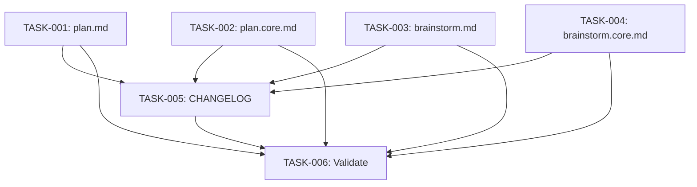

# Technical Design: plan-mode-conflict-fix

## Metadata
- **Feature**: plan-mode-conflict-fix
- **Status**: DRAFT
- **Created**: 2026-02-13
- **Author**: MAHABHARATHA Design Mode

---

## 1. Overview

### 1.1 Summary
Replace the manual "Press Shift+Tab twice" plan mode instruction in `/z:plan` and `/z:brainstorm` with programmatic EnterPlanMode/ExitPlanMode tool calls. Add post-exit guards to prevent Claude from jumping to implementation after exiting plan mode.

### 1.2 Goals
- Pre-Flight (Bash/mkdir) runs BEFORE entering plan mode
- Read-only phases execute inside plan mode
- Write phases execute AFTER exiting plan mode
- Post-exit guards prevent implementation drift

### 1.3 Non-Goals
- Changing Claude Code's plan mode behavior (platform-level)
- Modifying other MAHABHARATHA commands (design, kurukshetra, etc.)
- Modifying `.details.md` files (reference material only)

---

## 2. Architecture

### 2.1 High-Level Design

```
┌─────────────────────────────────────────────────────┐
│                  /z:plan workflow                     │
│                                                      │
│  Pre-Flight (Bash)                                   │
│       │                                              │
│       ▼                                              │
│  TaskCreate/TaskUpdate                               │
│       │                                              │
│       ▼                                              │
│  ┌──────────────────────────────────────┐            │
│  │  PLAN MODE (read-only)              │            │
│  │  • EnterPlanMode tool call          │            │
│  │  • Phase 0: Pre-Execution Validation│ (core only)│
│  │  • Phase 1: Context Gathering       │            │
│  │  • Phase 2: Requirements Elicitation│            │
│  │  • Write plan → ExitPlanMode        │            │
│  └──────────────────────────────────────┘            │
│       │                                              │
│       ▼  ⛔ POST-EXIT GUARD                          │
│  Phase 3: Write requirements.md                      │
│  Phase 4: Infrastructure check                       │
│  Phase 5: User approval                              │
│  Phase 5.5: Handoff → STOP                           │
└─────────────────────────────────────────────────────┘
```

```
┌─────────────────────────────────────────────────────┐
│               /z:brainstorm workflow                  │
│                                                      │
│  Pre-Flight (Bash)                                   │
│       │                                              │
│       ▼                                              │
│  TaskCreate/TaskUpdate                               │
│       │                                              │
│       ▼                                              │
│  ┌──────────────────────────────────────┐            │
│  │  PLAN MODE (read-only)              │            │
│  │  • EnterPlanMode tool call          │            │
│  │  • Phase 1: Research                │            │
│  │  • Phase 2: Socratic Discovery      │            │
│  │  • Phase 2.5-2.7: Trade-offs/YAGNI │            │
│  │  • Write plan → ExitPlanMode        │            │
│  └──────────────────────────────────────┘            │
│       │                                              │
│       ▼  ⛔ POST-EXIT GUARD                          │
│  Phase 3: Issue Generation                           │
│  Phase 4: Handoff → STOP                             │
└─────────────────────────────────────────────────────┘
```

### 2.2 Component Breakdown

| Component | Responsibility | Files |
|-----------|---------------|-------|
| plan.md | Full plan command (backward compat) | `mahabharatha/data/commands/plan.md` |
| plan.core.md | Core split (workers get this) | `mahabharatha/data/commands/plan.core.md` |
| brainstorm.md | Full brainstorm command | `mahabharatha/data/commands/brainstorm.md` |
| brainstorm.core.md | Core split (workers get this) | `mahabharatha/data/commands/brainstorm.core.md` |
| CHANGELOG.md | Release notes | `CHANGELOG.md` |

### 2.3 Data Flow
No data flow changes. This feature modifies instruction text only — no code, no APIs, no data models.

---

## 3. Detailed Design

### 3.1 plan.md Changes

**A. Replace "Enter Plan Mode" section** (lines 52-58):

Old:
```markdown
## Enter Plan Mode

**Press Shift+Tab twice** to enter plan mode (Opus 4.5 for reasoning).

Plan mode gives you read-only tools to explore the codebase without making changes.

---
```

New:
```markdown
## Enter Plan Mode

Call the **EnterPlanMode** tool to enter Claude Code plan mode.

Plan mode provides read-only tools (Glob, Grep, Read, WebSearch, AskUserQuestion) for deep
codebase exploration. You will stay in plan mode for Phases 1-2, then exit before Phase 3
when you need to write files.

⚠️ Do NOT attempt to write files or run Bash while in plan mode — those tools are restricted.

---
```

**B. Add "Exit Plan Mode" section** between Phase 2 and Phase 3 (insert after line 101, before "### Phase 3"):

```markdown
## Exit Plan Mode (Before Phase 3)

After completing Phase 2, you have gathered all requirements through read-only exploration and
user questions. You now need to write files.

Write your plan summarizing:
- Key findings from Phase 1 (codebase patterns, tech stack, existing conventions)
- Requirements gathered from Phase 2 (functional, non-functional, scope, acceptance criteria)
- Files to be created: `.gsd/specs/{feature}/requirements.md`

Then call **ExitPlanMode** to present the plan for approval.

### ⛔ POST-EXIT GUARD (NON-NEGOTIABLE)

After the user approves and plan mode exits, you are STILL inside the `/z:plan` command.

Your ONLY remaining tasks are:
1. Phase 3: Write `requirements.md` to `.gsd/specs/{feature}/`
2. Phase 4: Check infrastructure needs
3. Phase 5: Present requirements for user approval
4. Phase 5.5: Mark task complete and STOP

**DO NOT implement the feature. DO NOT write code. DO NOT invoke /z:design.**
**You are writing PLANNING DOCUMENTS, not implementing.**

---
```

### 3.2 plan.core.md Changes

Identical to plan.md changes but applied to the `.core.md` split. Same "Enter Plan Mode" replacement at lines 100-106, and same "Exit Plan Mode" insertion between Phase 2 and Phase 3.

### 3.3 brainstorm.md Changes

**A. Add "Enter Plan Mode" section** after "Track in Claude Task System" section, before "## Workflow Overview":

```markdown
## Enter Plan Mode

Call the **EnterPlanMode** tool to enter Claude Code plan mode.

Plan mode provides read-only tools for deep codebase exploration and research. You will stay
in plan mode for Phases 1-2.7 (Research through YAGNI Gate), then exit before Phase 3 when
you need to write files and create GitHub issues.

⚠️ Do NOT attempt to write files or run Bash while in plan mode — those tools are restricted.

---
```

**B. Add "Exit Plan Mode" section** between Phase 2.7 (YAGNI Gate) and Phase 3 (Issue Generation):

```markdown
## Exit Plan Mode (Before Phase 3)

After completing Phase 2.7 (YAGNI Gate), you have completed all discovery. You now need to
write files and create GitHub issues.

Write your plan summarizing:
- Research findings from Phase 1
- Discovery insights from Phase 2
- Trade-off decisions from Phase 2.5
- Validated design from Phase 2.6
- Features passing YAGNI Gate from Phase 2.7

Then call **ExitPlanMode** to present the plan for approval.

### ⛔ POST-EXIT GUARD (NON-NEGOTIABLE)

After the user approves and plan mode exits, you are STILL inside `/z:brainstorm`.

Your ONLY remaining tasks are:
1. Phase 3: Save research/transcript files, create GitHub issues
2. Phase 4: Present handoff recommendations and STOP

**DO NOT implement features. DO NOT invoke /z:plan. DO NOT write code.**
**You are completing the brainstorm workflow, not starting implementation.**

---
```

### 3.4 brainstorm.core.md Changes

Identical to brainstorm.md changes.

---

## 4. Key Decisions

### Decision: EnterPlanMode tool call vs manual Shift+Tab instruction

**Context**: The current "Press Shift+Tab twice" instruction is unreliable — Claude can't physically press keys. The instruction is interpreted as guidance, not action.

**Options Considered**:
1. Keep manual instruction with stronger wording
2. Use EnterPlanMode tool call (programmatic)
3. Remove plan mode entirely

**Decision**: Option 2 — Use EnterPlanMode tool call

**Rationale**: EnterPlanMode is a real Claude Code tool that reliably transitions to plan mode. It's deterministic and doesn't depend on interpretation.

**Consequences**: Plan mode entry is now guaranteed. ExitPlanMode must be called explicitly before write phases.

### Decision: Where to place ExitPlanMode

**Context**: ExitPlanMode needs a plan summary written to a plan file. The exit point must be after all read-only analysis but before any file writes.

**Options Considered**:
1. Immediately after Phase 2, before any markdown output
2. After Phase 2 with plan summary, then exit
3. Between each phase (enter/exit multiple times)

**Decision**: Option 2 — After Phase 2 with plan summary

**Rationale**: ExitPlanMode requires writing a plan to the plan file. Summarizing findings from Phases 1-2 provides a natural plan document. Multiple enter/exit cycles would be confusing.

**Consequences**: The plan written to the plan file doubles as a Phase 1-2 summary. The user sees and approves this summary before write tools become available.

---

## 5. Implementation Plan

### 5.1 Phase Summary

| Phase | Tasks | Parallel | Est. Time |
|-------|-------|----------|-----------|
| Foundation (L1) | 4 | Yes | 10 min |
| Quality (L2) | 2 | Yes | 5 min |

### 5.2 File Ownership

| File | Task ID | Operation |
|------|---------|-----------|
| `mahabharatha/data/commands/plan.md` | TASK-001 | modify |
| `mahabharatha/data/commands/plan.core.md` | TASK-002 | modify |
| `mahabharatha/data/commands/brainstorm.md` | TASK-003 | modify |
| `mahabharatha/data/commands/brainstorm.core.md` | TASK-004 | modify |
| `CHANGELOG.md` | TASK-005 | modify |

### 5.3 Dependency Graph



---

## 6. Risk Assessment

| Risk | Probability | Impact | Mitigation |
|------|-------------|--------|------------|
| plan.md and plan.core.md get out of sync | Low | Med | Task descriptions include exact diff specs; validation checks split pair consistency |
| brainstorm.md and brainstorm.core.md get out of sync | Low | Med | Same mitigation as above |
| EnterPlanMode tool not available in all Claude Code versions | Low | Low | Falls back to normal mode; workflow still works without plan mode |
| Post-exit guard ignored by Claude | Med | Med | Multiple redundant guards (section header, bold text, emoji warning) |

---

## 7. Testing Strategy

### 7.1 Verification Commands
- `python -m mahabharatha.validate_commands` — ensures all command files pass structural validation
- `grep -c "EnterPlanMode" mahabharatha/data/commands/plan.md` — confirms tool call present
- `grep -c "ExitPlanMode" mahabharatha/data/commands/plan.md` — confirms exit present
- `grep -c "POST-EXIT GUARD" mahabharatha/data/commands/plan.md` — confirms guard present
- Same checks for plan.core.md, brainstorm.md, brainstorm.core.md

### 7.2 Manual Validation
- Run `/z:plan test-feature` and verify EnterPlanMode is called
- Verify Phase 1-2 run in plan mode (read-only tools only)
- Verify ExitPlanMode is called before Phase 3
- Verify post-exit guard prevents implementation

---

## 8. Parallel Execution Notes

### 8.1 Safe Parallelization
- All 4 command file edits are independent — fully parallel at Level 1
- CHANGELOG and validation depend on all edits — Level 2

### 8.2 Recommended Workers
- Minimum: 1 worker (sequential)
- Optimal: 4 workers (one per file at Level 1)
- Maximum: 4 workers (only 4 independent tasks)

### 8.3 Estimated Duration
- Single worker: ~15 min
- With 4 workers: ~7 min
- Speedup: ~2x

---

## 9. Approval

| Role | Name | Date | Signature |
|------|------|------|-----------|
| Architecture | | | PENDING |
| Engineering | | | PENDING |
