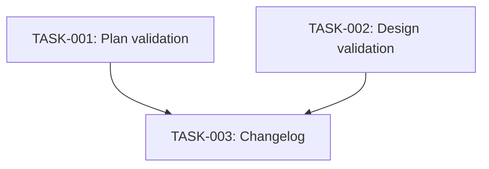

# Technical Design: plan-validation-checks

## Metadata
- **Feature**: plan-validation-checks
- **Status**: APPROVED
- **Created**: 2026-02-05
- **Author**: Factory Design Mode

---

## 1. Overview

### 1.1 Summary
Add a "Phase 0: Pre-Execution Validation" section to both `/z:plan` and `/z:design` commands that checks git history, open PRs, and codebase for conflicts before proceeding. If conflicts are detected, present the user with options to update, archive, or proceed anyway.

### 1.2 Goals
- Prevent redundant work when features are already implemented
- Catch conflicts with in-flight PRs early
- Give users explicit control via --skip-validation flag

### 1.3 Non-Goals
- Automatic conflict resolution (requires human judgment)
- Semantic code analysis (just string matching)
- Cross-repository validation

---

## 2. Architecture

### 2.1 High-Level Design

This is a **documentation-only change** — no new Python code. The validation logic is expressed as Claude prompt instructions that execute via existing tools (Bash, Grep, AskUserQuestion).

```
┌─────────────────────────────────────────────────────────────┐
│                      /z:plan or /z:design                   │
├─────────────────────────────────────────────────────────────┤
│  Phase 0: Pre-Execution Validation (NEW)                    │
│  ├─ Extract objective from requirements.md                  │
│  ├─ git log --oneline -20 | grep -i "$FEATURE"              │
│  ├─ gh pr list --state open | grep -i "$FEATURE"            │
│  ├─ Grep codebase for key identifiers                       │
│  └─ IF conflict → AskUserQuestion (update/archive/proceed)  │
├─────────────────────────────────────────────────────────────┤
│  Phase 1+ (existing flow continues)                         │
└─────────────────────────────────────────────────────────────┘
```

### 2.2 Component Breakdown

| Component | Responsibility | Files |
|-----------|---------------|-------|
| Plan Validation | Validate before planning phase | `zerg/data/commands/plan.core.md` |
| Design Validation | Validate before design phase | `zerg/data/commands/design.core.md` |

### 2.3 Data Flow

1. **Input**: Feature name from $ARGUMENTS or .gsd/.current-feature
2. **Validation**: Run 4 checks (objective, commits, PRs, codebase)
3. **Decision**: Pass (continue) or Fail (present options)
4. **Output**: Continue to existing workflow or stop per user choice

---

## 3. Detailed Design

### 3.1 Phase 0 for plan.core.md

Insert before "## Enter Plan Mode":

```markdown
## Phase 0: Pre-Execution Validation

Before proceeding, validate this plan hasn't been superseded:

1. **Extract Objective**
   - Read `.gsd/specs/$FEATURE/requirements.md` if exists
   - Identify key terms: feature name, main components, file patterns

2. **Check Recent Commits**
   ```bash
   git log --oneline -20 | grep -i "$FEATURE"
   ```
   - Flag if any commits mention the feature name

3. **Check Open PRs**
   ```bash
   gh pr list --state open | grep -i "$FEATURE"
   ```
   - Flag if any open PRs match

4. **Search Codebase**
   - Grep for key implementation patterns from the requirements
   - Flag if substantial matches found (>5 files)

5. **Validation Decision**
   IF any checks flag potential conflicts:
     STOP and present:
     ```
     ⚠️  VALIDATION WARNING

     Potential conflict detected:
     - [Commits/PRs/Code] matching "{feature}" found

     Options:
     1. Update plan - Revise spec to account for existing work
     2. Archive - Move to .gsd/specs/_archived/
     3. Proceed anyway - Override and continue
     ```

     Use AskUserQuestion to get user decision.

   IF validation passes:
     Continue to Enter Plan Mode.
```

### 3.2 Phase 0 for design.core.md

Insert before "## Load Context":

```markdown
## Phase 0: Pre-Execution Validation

Before proceeding, validate this design is still needed:

1. **Read Requirements**
   - Load `.gsd/specs/$FEATURE/requirements.md`
   - Extract key objectives and target files

2. **Check Recent Commits**
   ```bash
   git log --oneline -20
   ```
   - Compare commit messages against requirements objectives

3. **Check Open PRs**
   ```bash
   gh pr list --state open
   ```
   - Check for PRs implementing similar features

4. **Grep Targets**
   - For each file in requirements' "Files to Create/Modify":
     ```bash
     ls {target_file} 2>/dev/null && echo "EXISTS: {target_file}"
     ```
   - For key function/class names mentioned:
     ```bash
     grep -r "{identifier}" zerg/ tests/ --include="*.py" -l | head -5
     ```

5. **Validation Decision**
   IF requirements.md missing:
     ERROR: Run /z:plan first

   IF target files already exist OR key identifiers found:
     STOP and present conflict resolution options (same as plan.core.md)

   IF validation passes:
     Continue to Load Context
```

---

## 4. Key Decisions

### 4.1 Inline Instructions vs. Separate Module

**Context**: Where should validation logic live?

**Options Considered**:
1. Inline in command files: Add Phase 0 directly to markdown
2. Python module: Create validation.py with functions
3. Separate command: New /z:validate command

**Decision**: Option 1 — Inline in command files

**Rationale**:
- Validation is Claude prompt instructions, not code
- No Python needed — uses existing Bash/Grep/AskUserQuestion tools
- Keeps validation logic co-located with command it guards
- Simplest solution that meets requirements

**Consequences**: Each command file grows by ~50 lines. No new test coverage needed (prompt instructions, not code).

---

## 5. Implementation Plan

### 5.1 Phase Summary

| Phase | Tasks | Parallel | Est. Time |
|-------|-------|----------|-----------|
| Core | 2 | Yes | 10 min |
| Quality | 1 | No | 5 min |

### 5.2 File Ownership

| File | Task ID | Operation |
|------|---------|-----------|
| `zerg/data/commands/plan.core.md` | TASK-001 | modify |
| `zerg/data/commands/design.core.md` | TASK-002 | modify |
| `CHANGELOG.md` | TASK-003 | modify |

### 5.3 Dependency Graph



---

## 6. Risk Assessment

| Risk | Probability | Impact | Mitigation |
|------|-------------|--------|------------|
| Validation too aggressive | Low | Med | Threshold configurable (>5 files) |
| gh command not available | Low | Low | Graceful skip if gh fails |
| Breaks existing workflows | Low | Med | --skip-validation flag |

---

## 7. Testing Strategy

### 7.1 Unit Tests
Not applicable — this is prompt instructions, not Python code.

### 7.2 Integration Tests
Not applicable — manual testing by running `/z:plan` and `/z:design`.

### 7.3 Verification Commands
- Review the edited markdown files for correct section placement
- Ensure no syntax errors in bash code blocks

---

## 8. Parallel Execution Notes

### 8.1 Safe Parallelization
- TASK-001 and TASK-002 modify different files — fully parallel
- TASK-003 depends on both completing first

### 8.2 Recommended Workers
- Minimum: 1 worker
- Optimal: 2 workers (TASK-001 and TASK-002 in parallel)
- Maximum: 2 workers

### 8.3 Estimated Duration
- Single worker: 15 min
- With 2 workers: 10 min
- Speedup: 1.5x

---

## 9. Approval

| Role | Name | Date | Signature |
|------|------|------|-----------|
| Architecture | | | PENDING |
| Engineering | | | PENDING |
