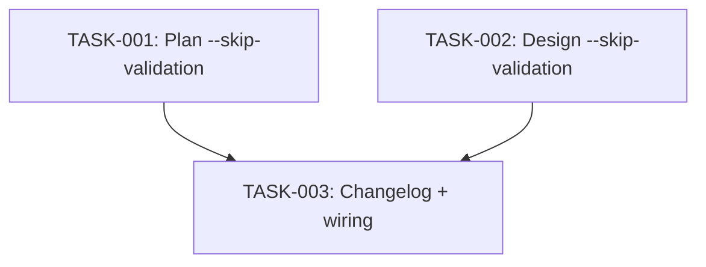

# Technical Design: plan-validation-checks

## Metadata
- **Feature**: plan-validation-checks
- **Status**: APPROVED
- **Created**: 2026-02-05
- **Updated**: 2026-02-06
- **Author**: Factory Design Mode

---

## 1. Overview

### 1.1 Summary
Phase 0 validation sections already exist in both `plan.core.md` and `design.core.md`. The remaining work is adding the `--skip-validation` flag (NFR-2) to both commands so users can bypass validation when needed.

### 1.2 Goals
- Add `--skip-validation` flag to `/z:plan` Flags section
- Add `--skip-validation` flag to `/z:design` (new Flags section + Help section update)
- Wire flag into Phase 0 conditional skip logic

### 1.3 Non-Goals
- Modifying existing Phase 0 validation logic (already correct)
- Adding Python code (prompt instructions only)
- Adding tests (markdown command files, not code)

---

## 2. Architecture

### 2.1 High-Level Design

Documentation-only change. Each command file gets 3 edits:

```
plan.core.md:
  1. Add --skip-validation to ## Flags section
  2. Add conditional skip at top of Phase 0
  3. Add --skip-validation to ## Help section

design.core.md:
  1. Add new ## Flags section with --skip-validation
  2. Add conditional skip at top of Phase 0
  3. Add --skip-validation to ## Help section
```

### 2.2 Component Breakdown

| Component | Responsibility | Files |
|-----------|---------------|-------|
| Plan skip-validation | Bypass validation in /z:plan | `mahabharatha/data/commands/plan.core.md` |
| Design skip-validation | Bypass validation in /z:design | `mahabharatha/data/commands/design.core.md` |

### 2.3 Data Flow

1. User invokes `/z:plan feature --skip-validation` or `/z:design --skip-validation`
2. Command parses $ARGUMENTS for `--skip-validation`
3. If present: skip Phase 0 entirely, continue to next phase
4. If absent: run Phase 0 as normal

---

## 3. Detailed Design

### 3.1 plan.core.md Changes

**Edit 1 — Flags section (line ~18):**
```markdown
## Flags

- `--socratic` or `-s`: Use structured 3-round discovery mode (see details file)
- `--rounds N`: Number of rounds (default: 3, max: 5)
- `--skip-validation`: Skip Phase 0 pre-execution validation checks
```

**Edit 2 — Phase 0 section (line ~45), add at start:**
```markdown
## Phase 0: Pre-Execution Validation

If `--skip-validation` is in $ARGUMENTS, skip this phase entirely and continue to Enter Plan Mode.

Before proceeding, validate this plan hasn't been superseded:
...
```

**Edit 3 — Help section (line ~200):**
```
/mahabharatha:plan — Capture complete requirements for a feature.

Flags:
  -s, --socratic        Use structured 3-round discovery mode
  --rounds N            Number of rounds (default: 3, max: 5)
  --skip-validation     Skip pre-execution validation checks
  --help                Show this help message
```

### 3.2 design.core.md Changes

**Edit 1 — Add new Flags section after Pre-Flight, before Phase 0:**
```markdown
## Flags

- `--skip-validation`: Skip Phase 0 pre-execution validation checks
```

**Edit 2 — Phase 0 section (line ~30), add at start:**
```markdown
## Phase 0: Pre-Execution Validation

If `--skip-validation` was specified, skip this phase entirely and continue to Load Context.

Before proceeding, validate this design is still needed:
...
```

**Edit 3 — Help section (line ~710):**
```
/mahabharatha:design — Generate technical architecture and prepare for parallel execution.

Flags:
  --skip-validation     Skip pre-execution validation checks
  --help                Show this help message
```

---

## 4. Key Decisions

### 4.1 Flag in $ARGUMENTS vs. Separate Mechanism

**Context**: How should --skip-validation be parsed?

**Options Considered**:
1. Check $ARGUMENTS string for "--skip-validation"
2. Environment variable ZERG_SKIP_VALIDATION
3. Config option in .mahabharatha/config.yaml

**Decision**: Option 1 — Check $ARGUMENTS

**Rationale**: Consistent with existing --socratic and --rounds flags in plan.core.md. No code needed — the Claude prompt just checks if the string is present.

**Consequences**: Simple, per-invocation control. No persistent config needed.

---

## 5. Implementation Plan

### 5.1 Phase Summary

| Phase | Tasks | Parallel | Est. Time |
|-------|-------|----------|-----------|
| Core | 2 | Yes | 5 min |
| Quality | 1 | No | 5 min |

### 5.2 File Ownership

| File | Task ID | Operation |
|------|---------|-----------|
| `mahabharatha/data/commands/plan.core.md` | TASK-001 | modify |
| `mahabharatha/data/commands/design.core.md` | TASK-002 | modify |
| `CHANGELOG.md` | TASK-003 | modify |

### 5.3 Dependency Graph



---

## 6. Risk Assessment

| Risk | Probability | Impact | Mitigation |
|------|-------------|--------|------------|
| Flag string not detected | Low | Low | Document exact string matching |
| Breaks existing workflow | Low | Low | Additive change only |

---

## 7. Testing Strategy

### 7.1 Unit Tests
N/A — prompt instruction changes, not Python code.

### 7.2 Integration Tests
Manual: run `/z:plan test-feature --skip-validation` and verify Phase 0 is skipped.

### 7.3 Verification Commands
- `grep -q 'skip-validation' mahabharatha/data/commands/plan.core.md`
- `grep -q 'skip-validation' mahabharatha/data/commands/design.core.md`

---

## 8. Parallel Execution Notes

### 8.1 Safe Parallelization
- TASK-001 and TASK-002 modify different files — fully parallel
- TASK-003 depends on both completing first

### 8.2 Recommended Workers
- Minimum: 1 worker
- Optimal: 2 workers
- Maximum: 2 workers

### 8.3 Estimated Duration
- Single worker: 10 min
- With 2 workers: 7 min
- Speedup: 1.4x

---

## 9. Approval

| Role | Name | Date | Signature |
|------|------|------|-----------|
| Architecture | | | PENDING |
| Engineering | | | PENDING |
