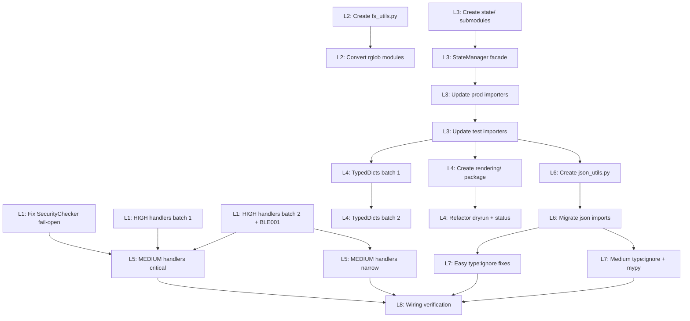

# Technical Design: quality-debt-remediation

## Metadata
- **Feature**: quality-debt-remediation
- **Status**: APPROVED
- **Created**: 2026-02-06
- **Author**: Factory Design Mode
- **Issues**: #134, #137, #139, #140, #143, #145, #146

---

## 1. Overview

### 1.1 Summary

Systematic remediation of 7 open quality-debt issues across 8 phases: security fail-open fix, exception hygiene (HIGH+MEDIUM severity), rglob single-pass optimization, StateManager decomposition, TypedDict introduction, rendering layer extraction, orjson integration, and type:ignore cleanup. Each phase produces a separate PR. Phases are serialized by dependency; parallelism occurs within phases.

### 1.2 Goals
- Fix critical fail-open security bug in SecurityChecker
- Reduce `except Exception` from 168 to <80 with proper logging/narrowing
- Consolidate 28 rglob calls via shared `fs_utils.collect_files()` utility
- Decompose 1010-line StateManager into `mahabharatha/state/` package (9 modules)
- Introduce 8+ TypedDicts, reduce `dict[str, Any]` by 50%+
- Separate rendering from business logic in dryrun.py and status.py
- Add orjson optional dependency with stdlib fallback
- Resolve 12/13 `type: ignore` comments, harden mypy config

### 1.3 Non-Goals
- New features or capabilities
- Test additions beyond what's needed for new modules
- Performance benchmarking
- Mypy strict enforcement on test files
- Refactoring files outside mahabharatha/ production code

---

## 2. Architecture

### 2.1 High-Level Design

```
Phase 1 (P0)                    Phase 6 (P2)
  Security + HIGH exceptions ──────► MEDIUM exceptions
Phase 2 (P1)
  rglob optimization ──────────────► standalone
Phase 3 (P2)                    Phase 4 (P2)
  StateManager decomp ────────────► TypedDict introduction
Phase 5 (P2)
  Rendering extraction ───────────► standalone
Phase 7 (P3)
  orjson integration ─── (after Phase 3) ──► Phase 8 (P3)
                                              type:ignore cleanup
```

### 2.2 Component Breakdown

| Component | Responsibility | Files |
|-----------|---------------|-------|
| SecurityChecker fix | Fail-closed on exception | `mahabharatha/commands/analyze.py` |
| Exception hygiene | Logging, narrowing, re-raise | ~30 files across mahabharatha/ |
| fs_utils | Single-pass file traversal | `mahabharatha/fs_utils.py` (new) |
| state/ package | Decomposed StateManager | `mahabharatha/state/` (9 new files) |
| TypedDicts | Structured dict types | `mahabharatha/types.py` + 10 files |
| rendering/ package | CLI rendering layer | `mahabharatha/rendering/` (4 new files) |
| json_utils | orjson/stdlib abstraction | `mahabharatha/json_utils.py` (new) |
| Lint hardening | BLE001, mypy config | `pyproject.toml` |

### 2.3 Data Flow

No new data flows — this is a refactoring feature. Existing data flows are preserved through facade patterns (StateManager) and backward-compatible imports.

---

## 3. Detailed Design

### 3.1 SecurityChecker Fix (Phase 1A)

```python
# BEFORE (fail-open):
except CommandValidationError:
    return AnalysisResult(check_type=CheckType.SECURITY, passed=True, issues=[], score=100.0)
except Exception:
    return AnalysisResult(check_type=CheckType.SECURITY, passed=True, issues=[], score=100.0)

# AFTER (fail-closed):
except CommandValidationError as e:
    return AnalysisResult(
        check_type=CheckType.SECURITY, passed=True,
        issues=[f"Security tool not installed ({e}) — skipped"], score=0.0,
    )
except Exception as e:
    logger.exception("Security check failed")
    return AnalysisResult(
        check_type=CheckType.SECURITY, passed=False,
        issues=[f"Security check error: {e}"], score=0.0,
    )
```

### 3.2 fs_utils API (Phase 2)

```python
# mahabharatha/fs_utils.py
def collect_files(
    root: Path,
    extensions: set[str] | None = None,
    exclude_dirs: set[str] = _DEFAULT_EXCLUDES,
) -> dict[str, list[Path]]:
    """Single rglob('*') traversal, returns files grouped by extension."""
```

### 3.3 StateManager Facade (Phase 3)

```python
# mahabharatha/state/__init__.py
from mahabharatha.state.manager import StateManager
__all__ = ["StateManager"]

# mahabharatha/state/manager.py
class StateManager:
    """Thin facade delegating to specialized repositories."""
    def __init__(self, feature: str, state_dir: str | Path | None = None):
        self._persistence = PersistenceLayer(feature, state_dir)
        self._tasks = TaskStateRepo(self._persistence)
        # ... delegates
```

### 3.4 json_utils API (Phase 7)

```python
# mahabharatha/json_utils.py
try:
    import orjson
    def loads(data): return orjson.loads(data)
    def dumps(obj, *, indent=False): ...
except ImportError:
    import json
    def loads(data): return json.loads(data)
    def dumps(obj, *, indent=False): ...
```

---

## 4. Key Decisions

### 4.1 StateManager: Facade vs Clean Break

**Context**: StateManager has 30 production importers. Breaking the API would cause massive churn.

**Options**:
1. Clean break — rename and update all 30 importers
2. Facade pattern — delegate to sub-modules, keep same import path

**Decision**: Facade pattern

**Rationale**: Zero API changes for callers. `from mahabharatha.state import StateManager` continues working via `__init__.py` re-export. Risk is minimized.

### 4.2 orjson: Required vs Optional

**Context**: orjson is 3-10x faster for JSON, but adds a compiled dependency.

**Decision**: Optional dependency in `[project.optional-dependencies]` with stdlib fallback.

**Rationale**: MAHABHARATHA runs in containers and local envs. Optional keeps install simple; users can opt into performance.

### 4.3 Exception Handler Strategy

**Context**: 168 `except Exception` handlers — not all are bugs.

**Decision**: Three-tier approach:
1. **Re-raise** in critical paths (merge, gates, verify, persistence)
2. **Narrow** to specific types where failure mode is known
3. **Annotate** with `# noqa: BLE001 — intentional` for deliberate swallows

### 4.4 Rendering Extraction Depth

**Context**: dryrun.py (671 lines, 11 render methods) and status.py (1315 lines, ~15 render functions).

**Decision**: Extract render functions into `mahabharatha/rendering/` package. Business logic stays in original files.

**Rationale**: Clean SRP separation. No Rich imports in business logic modules.

---

## 5. Implementation Plan

### 5.1 Phase Summary

| Phase | Level | Tasks | Parallel | Description |
|-------|-------|-------|----------|-------------|
| 1: Security + HIGH exceptions | L1 | 3 | Yes (3) | Fail-open fix + 59 HIGH handlers + BLE001 |
| 2: rglob optimization | L2 | 2 | Yes (2) | fs_utils.py + module conversion |
| 3: StateManager decomp | L3 | 4 | Partial | state/ package + facade + importers |
| 4: TypedDict + Phase 5: Rendering | L4 | 4 | Yes (4) | Parallel — no shared files |
| 6: MEDIUM exceptions | L5 | 2 | Yes (2) | After Phase 1 BLE001 rule |
| 7: orjson integration | L6 | 2 | Yes (2) | After Phase 3 state move |
| 8: type:ignore + wiring | L7 | 3 | Partial | After Phase 7 pyproject changes |

### 5.2 File Ownership

| File | Task ID | Operation |
|------|---------|-----------|
| `mahabharatha/commands/analyze.py` | TASK-001 | modify |
| ~15 files (HIGH handlers batch 1) | TASK-002 | modify |
| ~15 files (HIGH handlers batch 2) | TASK-003 | modify |
| `pyproject.toml` | TASK-003 | modify |
| `mahabharatha/fs_utils.py` | TASK-004 | create |
| 5 rglob modules | TASK-005 | modify |
| `mahabharatha/state/` package (7 files) | TASK-006 | create |
| `mahabharatha/state/manager.py` | TASK-007 | create |
| 15 production importers | TASK-008 | modify |
| 15 test importers | TASK-009 | modify |
| `mahabharatha/types.py` + 5 modules | TASK-010 | modify |
| 5 more TypedDict modules | TASK-011 | modify |
| `mahabharatha/rendering/` (4 files) | TASK-012 | create |
| `mahabharatha/dryrun.py` + `mahabharatha/commands/status.py` | TASK-013 | modify |
| ~20 files (MEDIUM handlers critical path) | TASK-014 | modify |
| ~20 files (MEDIUM handlers narrow/annotate) | TASK-015 | modify |
| `mahabharatha/json_utils.py` | TASK-016 | create |
| ~50 files json migration | TASK-017 | modify |
| 5 easy type:ignore fixes | TASK-018 | modify |
| 7 medium type:ignore + mypy config | TASK-019 | modify |
| Wiring verification | TASK-020 | read-only |

### 5.3 Dependency Graph



---

## 6. Risk Assessment

| Risk | Probability | Impact | Mitigation |
|------|-------------|--------|------------|
| StateManager facade breaks callers | Low | High | Exact API preservation, all 30 importers tested |
| Exception narrowing misses edge cases | Medium | Medium | Full test suite per file, conservative approach |
| orjson bytes/str mismatch | Low | Medium | Wrapper always returns str via .decode() |
| Rendering extraction changes CLI output | Medium | Low | Visual comparison before/after |
| Circular imports in state/ package | Low | High | Careful dependency ordering, TYPE_CHECKING imports |
| BLE001 rule breaks CI | Low | Medium | Fix all violations before enabling rule |

---

## 7. Testing Strategy

### 7.1 Unit Tests
- StateManager facade: all existing tests pass unchanged
- fs_utils: import verification + basic usage
- json_utils: round-trip with and without orjson
- Rendering: existing dryrun/status tests pass

### 7.2 Integration Tests
- StateManager state/ package: full state lifecycle
- json_utils: serialization/deserialization across modules

### 7.3 Verification Commands
- Phase 1: `pytest tests/ -k "analyze" --timeout=30 && ruff check mahabharatha/ --select BLE001`
- Phase 2: `python -c "from mahabharatha.fs_utils import collect_files" && pytest tests/ --timeout=120 -q`
- Phase 3: `pytest tests/unit/test_state*.py tests/integration/test_state*.py --timeout=60`
- Phase 4: `mypy mahabharatha/ --strict 2>&1 | tail -5`
- Phase 5: `pytest tests/ -k "dryrun or status" --timeout=60`
- Phase 6: `ruff check mahabharatha/ --select BLE001`
- Phase 7: `python -c "from mahabharatha.json_utils import loads, dumps" && pytest tests/ --timeout=120 -q`
- Phase 8: `mypy mahabharatha/ --strict && python -m mahabharatha.validate_commands`

---

## 8. Parallel Execution Notes

### 8.1 Safe Parallelization
- L1: 3 tasks in parallel (analyze.py, handler batch 1, handler batch 2)
- L2: 2 tasks sequential (fs_utils must exist before conversion)
- L3: 4 tasks sequential (package → facade → prod importers → test importers)
- L4: 4 tasks, 2 parallel pairs (TypedDict pair || rendering pair)
- L5-L8: 2 tasks per level, parallel within level

### 8.2 Recommended Workers
- Minimum: 1 worker (serial execution)
- Optimal: 3 workers (matches widest level at L1)
- Maximum: 4 workers (L4 has 4 tasks, 2 parallel pairs)

### 8.3 Estimated Duration
- Single worker: ~8 hours
- With 3 workers: ~4 hours
- Speedup: ~2x

---

## 9. Consumer Matrix

| Task | Creates | Consumed By | Integration Test |
|------|---------|-------------|-----------------|
| TASK-004 | `mahabharatha/fs_utils.py` | TASK-005 | via TASK-005 verification |
| TASK-006 | `mahabharatha/state/*.py` (7 files) | TASK-007 | `tests/integration/test_state_integration.py` |
| TASK-007 | `mahabharatha/state/manager.py` | TASK-008 | `tests/integration/test_state_integration.py` |
| TASK-012 | `mahabharatha/rendering/*.py` (4 files) | TASK-013 | via TASK-013 verification |
| TASK-016 | `mahabharatha/json_utils.py` | TASK-017 | via TASK-017 verification |

---

## 10. Approval

| Role | Name | Date | Signature |
|------|------|------|-----------|
| Architecture | | | PENDING |
| Engineering | | | PENDING |
