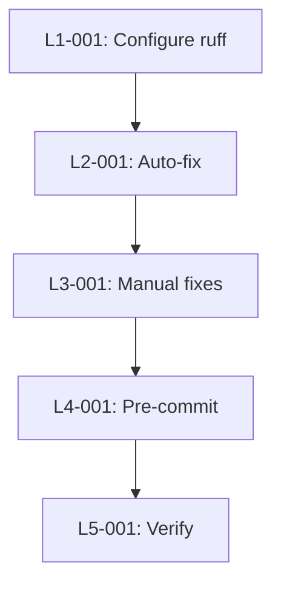

# Technical Design: quality-gates-fix

## Metadata
- **Feature**: quality-gates-fix
- **Status**: DRAFT
- **Created**: 2026-02-03
- **Author**: Factory Design Mode

---

## 1. Overview

### 1.1 Summary
Fix 943 pre-existing lint errors blocking MAHABHARATHA merge gates by configuring ruff with 120-char line limit, running auto-fixes, and adding pre-commit hooks for early enforcement.

### 1.2 Goals
- Zero lint errors from `ruff check .`
- Pre-commit hooks prevent new lint errors
- Merge quality gates pass

### 1.3 Non-Goals
- Fixing type errors (mypy)
- Fixing test failures (pytest)
- Auto-installing pre-commit in worker containers

---

## 2. Architecture

### 2.1 High-Level Design

```
┌─────────────────┐     ┌──────────────────┐     ┌─────────────────┐
│  pyproject.toml │────▶│  ruff check .    │────▶│  Quality Gate   │
│  (ruff config)  │     │  (CI + merge)    │     │  PASS/FAIL      │
└─────────────────┘     └──────────────────┘     └─────────────────┘
         │
         ▼
┌─────────────────┐     ┌──────────────────┐
│  pre-commit     │────▶│  Developer       │
│  hooks          │     │  Commit Block    │
└─────────────────┘     └──────────────────┘
```

### 2.2 Component Breakdown

| Component | Responsibility | Files |
|-----------|---------------|-------|
| Ruff Config | Line length 120, rule selection, exclusions | pyproject.toml |
| Pre-commit | Early lint enforcement before commit | .pre-commit-config.yaml |
| Quality Gate | Merge-time lint verification | .mahabharatha/config.yaml (unchanged) |

### 2.3 Data Flow
1. Developer writes code
2. Pre-commit hook runs `ruff check --fix` + `ruff format`
3. If errors remain, commit blocked
4. On merge, quality gate runs `ruff check .`
5. Gate passes (zero errors)

---

## 3. Detailed Design

### 3.1 Ruff Configuration

```toml
# pyproject.toml additions
[tool.ruff]
line-length = 120  # Up from 100
exclude = [".mahabharatha", "tests/fixtures"]

[tool.ruff.lint]
select = ["E", "F", "I", "UP"]
fixable = ["ALL"]
```

### 3.2 Pre-commit Configuration

```yaml
# .pre-commit-config.yaml
repos:
  - repo: https://github.com/astral-sh/ruff-pre-commit
    rev: v0.4.4
    hooks:
      - id: ruff
        args: [--fix]
      - id: ruff-format
```

### 3.3 Error Breakdown (Current State)

| Rule | Count | Auto-fix | Strategy |
|------|-------|----------|----------|
| F401 | 297 | Yes | `ruff check --fix` |
| E501 | 202 | No | Line length 120 resolves most |
| SIM117 | 91 | Yes | `ruff check --fix` |
| F841 | 90 | Unsafe | `--unsafe-fixes --select F841` (test files) |
| I001 | 87 | Yes | `ruff check --fix` |
| N999 | 4 | No | Exclude `.mahabharatha/` |
| Other | 172 | Mixed | Manual review |

---

## 4. Key Decisions

### 4.1 Line Length 120

**Context**: E501 (line-too-long) accounts for 202 errors at 100-char limit.

**Options Considered**:
1. Keep 100: Strict but requires extensive manual wrapping
2. 120 chars: Pragmatic, resolves most E501, still readable
3. 160+ chars: Too permissive, hard to review in PRs

**Decision**: 120 characters

**Rationale**: Modern monitors/IDEs handle 120 easily. Black uses 88, but 120 is common in industry. Resolves ~200 errors instantly.

**Consequences**: Existing long lines up to 120 become valid.

### 4.2 Unsafe Fixes for F841

**Context**: 90 F841 (unused variable) errors, all in test files (mock assignments).

**Options Considered**:
1. Manual fix each
2. `--unsafe-fixes` for F841 only
3. Ignore F841 rule

**Decision**: Use `--unsafe-fixes --select F841`

**Rationale**: All 90 F841 are in test files where unused mock variables are intentional fixtures. Safe to remove since they're not used.

**Consequences**: Some `_mock` variables will be removed. Tests should still pass.

### 4.3 Exclude .mahabharatha/ Directory

**Context**: 4 N999 (invalid module name) errors from `.mahabharatha/` being treated as a package.

**Options Considered**:
1. Rename .mahabharatha to zerg_internal
2. Exclude from linting
3. Ignore N999 globally

**Decision**: Exclude `.mahabharatha/` from ruff

**Rationale**: `.mahabharatha/` contains config/logs, not production code. N999 is correct (dotfiles aren't valid Python packages).

**Consequences**: `.mahabharatha/` Python files won't be linted (acceptable for config files).

---

## 5. Implementation Plan

### 5.1 Phase Summary

| Phase | Tasks | Parallel | Est. Time |
|-------|-------|----------|-----------|
| Foundation | 1 | No | 5 min |
| Auto-fix | 1 | No | 2 min |
| Manual-fix | 1 | No | 15 min |
| Pre-commit | 1 | No | 2 min |
| Verify | 1 | No | 2 min |

### 5.2 File Ownership

| File | Task ID | Operation |
|------|---------|-----------|
| pyproject.toml | L1-001 | modify |
| ~500 Python files | L2-001 | modify (auto-fix) |
| ~10-20 Python files | L3-001 | modify (manual) |
| .pre-commit-config.yaml | L4-001 | create |
| (verification only) | L5-001 | read |

### 5.3 Dependency Graph



---

## 6. Risk Assessment

| Risk | Probability | Impact | Mitigation |
|------|-------------|--------|------------|
| Unsafe fixes break tests | Low | Med | Run tests after L2-001 |
| Manual fixes miss errors | Low | Low | L5-001 verification |
| Pre-commit too slow | Very Low | Low | Ruff is <1s |

---

## 7. Testing Strategy

### 7.1 Unit Tests
N/A - configuration change only

### 7.2 Integration Tests
N/A - configuration change only

### 7.3 Verification Commands

| Task | Command | Expected |
|------|---------|----------|
| L1-001 | `grep "line-length = 120" pyproject.toml` | Match |
| L2-001 | `ruff check . 2>&1 \| tail -1` | Fewer errors |
| L3-001 | `ruff check . 2>&1 \| tail -1` | "Found 0 errors" |
| L4-001 | `test -f .pre-commit-config.yaml` | Exit 0 |
| L5-001 | `ruff check . && pre-commit run --all-files` | Exit 0 |

---

## 8. Parallel Execution Notes

### 8.1 Safe Parallelization
- This feature is **strictly sequential** - each level depends on the previous
- No parallel workers beneficial (tasks are atomic)

### 8.2 Recommended Workers
- Minimum: 1 worker
- Optimal: 1 worker
- Maximum: 1 worker (no parallelization benefit)

### 8.3 Estimated Duration
- Single worker: ~26 minutes total
- Bottleneck: L3-001 manual fixes

---

## 9. Approval

| Role | Name | Date | Signature |
|------|------|------|-----------|
| Architecture | | | PENDING |
| Engineering | | | PENDING |
