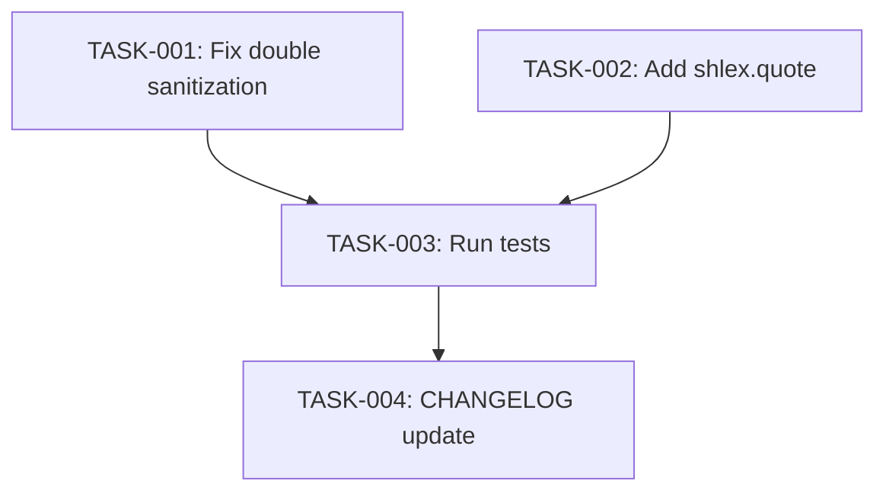

# Technical Design: review-fixes-before-merge

## Metadata
- **Feature**: review-fixes-before-merge
- **Status**: DRAFT
- **Created**: 2026-02-15
- **Author**: Factory Design Mode

---

## 1. Overview

### 1.1 Summary
Three targeted fixes to the `fix/codeql-scanning-alerts` branch: remove redundant parse-time sanitization in pr_engine.py, add shell-safe quoting to two temp script paths in history_engine.py, and verify CodeQL alert dismissals. All changes are isolated single-line edits with no cross-file dependencies.

### 1.2 Goals
- Fix double-encoding of `<`, `>`, `&` in PR bodies
- Prevent shell injection via spaces in TMPDIR paths
- Confirm CodeQL cyclic-import/undefined-export alerts resolved

### 1.3 Non-Goals
- Refactoring `_sanitize_pr_content()` itself
- Adding tests for TMPDIR edge cases
- Fixing any other CodeQL alerts

---

## 2. Architecture

### 2.1 High-Level Design

No new components. Two existing modules receive minimal edits:

```
pr_engine.py ──► Remove redundant _sanitize_pr_content() at parse time
                 (output-boundary calls remain at lines 370, 381, 401, 411)

history_engine.py ──► Add shlex.quote() to 2 GIT_SEQUENCE_EDITOR assignments
                      (lines 573, 664)
```

### 2.2 Component Breakdown

| Component | Responsibility | Files |
|-----------|---------------|-------|
| PR Engine | Generate PR bodies from commit data | `mahabharatha/git/pr_engine.py` |
| History Engine | Git rebase/rewrite operations | `mahabharatha/git/history_engine.py` |
| CHANGELOG | Release notes | `CHANGELOG.md` |

### 2.3 Data Flow

**PR body generation (current, broken):**
```
git log → parse commits → _sanitize_pr_content(message) → CommitInfo
  → format_body → _sanitize_pr_content(commit.message) → double-encoded output
```

**PR body generation (fixed):**
```
git log → parse commits → message.strip() → CommitInfo (raw)
  → format_body → _sanitize_pr_content(commit.message) → correctly-encoded output
```

**Rebase script path (current, fragile):**
```
tempfile → script_path → f"python3 {script_path}" → GIT_SEQUENCE_EDITOR
```

**Rebase script path (fixed):**
```
tempfile → script_path → f"python3 {shlex.quote(script_path)}" → GIT_SEQUENCE_EDITOR
```

---

## 3. Detailed Design

### 3.1 FR-001: Remove parse-time sanitization

**File**: `mahabharatha/git/pr_engine.py`, line 198

```python
# BEFORE:
message=_sanitize_pr_content(message.strip()),

# AFTER:
message=message.strip(),
```

The 4 output-boundary sanitization calls at lines 370, 381, 401, 411 remain unchanged. `_parse_commit_type()` at line 193 already operates on raw `message`, unaffected.

### 3.2 FR-002/FR-003: Add shlex.quote()

**File**: `mahabharatha/git/history_engine.py`, lines 573 and 664

```python
# Add import at top of file:
import shlex

# Line 573 BEFORE:
env["GIT_SEQUENCE_EDITOR"] = f"python3 {script_path}"
# AFTER:
env["GIT_SEQUENCE_EDITOR"] = f"python3 {shlex.quote(script_path)}"

# Line 664 BEFORE:
env["GIT_SEQUENCE_EDITOR"] = f"python3 {script_path}"
# AFTER:
env["GIT_SEQUENCE_EDITOR"] = f"python3 {shlex.quote(script_path)}"
```

### 3.3 FR-004: Verify CodeQL dismissals

Run `gh api repos/rocklambros/mahabharatha/code-scanning/alerts` and confirm 0 open alerts for `cyclic-import` and `undefined-export` rules. No code changes.

---

## 4. Key Decisions

### Decision: Sanitize at output boundary only

**Context**: `_sanitize_pr_content()` was called both at parse time (CommitInfo creation) and at output time (PR body formatting), causing double-encoding.

**Options Considered**:
1. Remove parse-time call, keep output-boundary calls: Minimal change, standard OWASP pattern
2. Remove output-boundary calls, keep parse-time call: Requires ensuring all consumers handle pre-sanitized data
3. Add a "sanitized" flag to CommitInfo: Over-engineered for this fix

**Decision**: Option 1 — remove parse-time call

**Rationale**: Output-boundary sanitization is the OWASP-recommended pattern. Storing raw data in CommitInfo is correct; sanitize only when rendering to user-facing output.

**Consequences**: CommitInfo.message now stores raw commit messages. Any future consumers of CommitInfo must sanitize at their own output boundary.

---

## 5. Implementation Plan

### 5.1 Phase Summary

| Phase | Tasks | Parallel | Est. Time |
|-------|-------|----------|-----------|
| Foundation (L1) | 2 | Yes | 2 min |
| Verification (L2) | 1 | No | 2 min |
| Quality (L3) | 1 | No | 2 min |

### 5.2 File Ownership

| File | Task ID | Operation |
|------|---------|-----------|
| `mahabharatha/git/pr_engine.py` | TASK-001 | modify |
| `mahabharatha/git/history_engine.py` | TASK-002 | modify |
| `CHANGELOG.md` | TASK-004 | modify |

### 5.3 Dependency Graph



---

## 6. Risk Assessment

| Risk | Probability | Impact | Mitigation |
|------|-------------|--------|------------|
| Removing sanitization breaks edge case | Low | Medium | Output-boundary calls remain; test suite validates |
| shlex.quote changes quoting behavior | Low | Low | Only affects paths with spaces/special chars (improvement) |
| Existing tests fail | Low | Medium | Run full test suite before marking complete |

---

## 7. Testing Strategy

### 7.1 Unit Tests
- Existing `tests/` suite covers pr_engine and history_engine
- No new tests needed per requirements scope

### 7.2 Verification Commands
- `python -m pytest tests/ --timeout=120` — all tests green
- `ruff check mahabharatha/git/pr_engine.py mahabharatha/git/history_engine.py` — clean

---

## 8. Parallel Execution Notes

### 8.1 Safe Parallelization
- TASK-001 and TASK-002 touch different files, fully parallel at Level 1
- TASK-003 (tests) depends on both
- TASK-004 (CHANGELOG) depends on tests passing

### 8.2 Recommended Workers
- Minimum: 1 worker (sequential)
- Optimal: 2 workers (L1 parallel)
- Maximum: 2 workers (only 2 tasks at widest level)

### 8.3 Estimated Duration
- Single worker: ~8 min
- With 2 workers: ~6 min
- Speedup: 1.3x

---

## 9. Approval

| Role | Name | Date | Signature |
|------|------|------|-----------|
| Architecture | | | PENDING |
| Engineering | | | PENDING |
