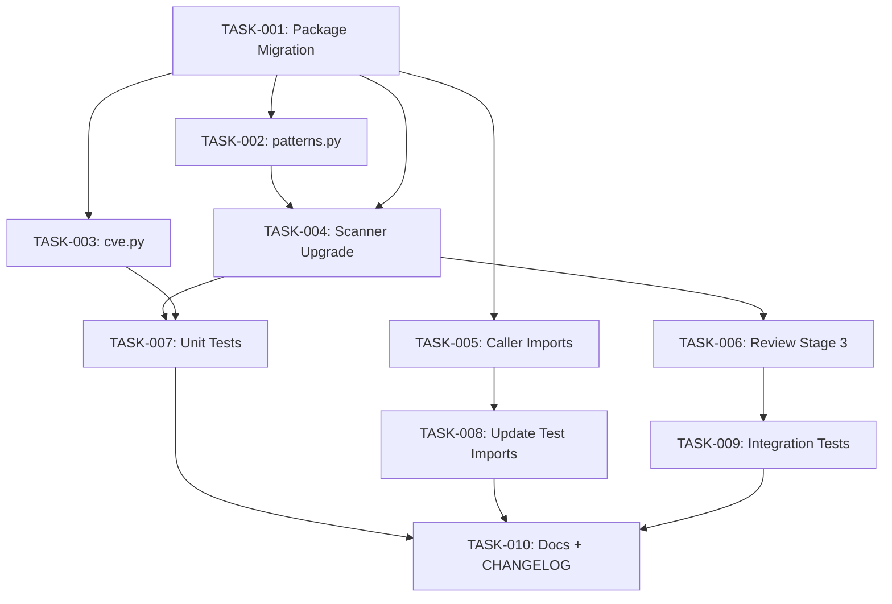

# Technical Design: review-security-integration

## Metadata
- **Feature**: review-security-integration
- **Status**: DRAFT
- **Created**: 2026-02-15
- **Author**: MAHABHARATHA Design Mode

---

## 1. Overview

### 1.1 Summary
Consolidate scattered security logic (`mahabharatha/security.py`, `mahabharatha/security_rules.py`, `CodeAnalyzer.hardcoded_secret`) into a unified `mahabharatha/security/` package with 15 capability areas, and wire it as always-on Stage 3 in `/z:review`. Both the `/z:security` slash command and `/z:review` CLI call the same `run_security_scan()` engine.

### 1.2 Goals
- Single `mahabharatha/security/` package — zero duplication of security patterns
- 15 scanning capability areas (secrets, injection, crypto, CVE, etc.)
- Stage 3 in review pipeline (Spec -> Quality -> Security)
- `--no-security` opt-out flag on review CLI and slash command
- Structured `SecurityResult` return type with CWE references

### 1.3 Non-Goals
- Replacing external tools (Snyk, Semgrep, Trivy)
- Runtime/dynamic security analysis
- Modifying `/z:kurukshetra` or `/z:worker` pipelines

---

## 2. Architecture

### 2.1 High-Level Design

```
┌────────────────────┐
│  /z:review CLI     │──┐
│  (review.py)       │  │
└────────────────────┘  │
                        │  calls run_security_scan()
┌────────────────────┐  │
│  /z:security       │──┤
│  (slash command)   │  │
└────────────────────┘  │
                        ▼
              ┌───────────────────┐
              │ mahabharatha/security/    │
              │   __init__.py     │◄── Public API
              │   scanner.py      │◄── Scan engine
              │   patterns.py     │◄── 15 capability patterns
              │   cve.py          │◄── CVE scanning
              │   rules.py        │◄── Stack detection + rule fetch
              │   hooks.py        │◄── Git hook management
              └───────────────────┘
                        │
              ┌─────────┴─────────┐
              ▼                   ▼
        SecurityResult      SecurityFinding
        (dataclass)         (dataclass)
```

### 2.2 Component Breakdown

| Component | Responsibility | Files |
|-----------|---------------|-------|
| Public API | Re-exports, backward compat | `mahabharatha/security/__init__.py` |
| Scanner Engine | Orchestrates all 15 capability scans | `mahabharatha/security/scanner.py` |
| Pattern Registry | Declarative pattern definitions per category | `mahabharatha/security/patterns.py` |
| CVE Scanner | Dependency vulnerability checking | `mahabharatha/security/cve.py` |
| Rules Manager | Stack detection, rule fetching, filtering | `mahabharatha/security/rules.py` |
| Hook Manager | Git hook install/uninstall | `mahabharatha/security/hooks.py` |
| Review Stage 3 | Security integration in review pipeline | `mahabharatha/commands/review.py` |

### 2.3 Data Flow

1. **Entry**: `ReviewCommand.run()` or `run_security_scan()` called directly
2. **File Collection**: Walk project tree, filter by extensions, resolve symlinks
3. **Pattern Scan**: Each file checked against all 15 capability pattern sets
4. **CVE Scan**: Parse dependency files, query osv.dev API (fallback to heuristics)
5. **Result Assembly**: Findings aggregated into `SecurityResult` with severity summary
6. **Output**: Review table shows Stage 3 status; findings listed by severity

---

## 3. Detailed Design

### 3.1 Data Models

```python
# mahabharatha/security/__init__.py

@dataclass
class SecurityFinding:
    category: str          # "secret", "injection", "crypto", etc.
    severity: str          # "critical", "high", "medium", "low", "info"
    file: str
    line: int
    message: str
    cwe: str | None        # "CWE-798", etc.
    remediation: str
    pattern_name: str

@dataclass
class SecurityResult:
    findings: list[SecurityFinding]
    categories_scanned: list[str]
    files_scanned: int
    scan_duration_seconds: float
    passed: bool           # True if no critical/high findings
    summary: dict[str, int]  # severity -> count
```

### 3.2 Pattern Registry Design

```python
# mahabharatha/security/patterns.py

@dataclass
class SecurityPattern:
    name: str
    category: str
    regex: re.Pattern
    severity: str
    message: str
    cwe: str | None
    remediation: str
    file_extensions: set[str] | None  # None = all files

PATTERN_REGISTRY: dict[str, list[SecurityPattern]] = {
    "secret_detection": [...],      # 1. API keys, tokens, credentials
    "injection_detection": [...],   # 2. Shell/code/SQL injection
    "deserialization_risks": [...], # 3. Unsafe deserialization
    "cryptographic_misuse": [...],  # 4. Weak crypto
    "error_handling": [...],        # 5. Bare except, fail-open
    "input_validation": [...],      # 6. Unvalidated input sinks
    "lockfile_integrity": [...],    # 8. Missing lockfiles, unpinned deps
    "license_compliance": [...],    # 9. GPL/AGPL detection
    "sensitive_files": [...],       # 11. .env, credentials in repo
    "file_permissions": [...],      # 12. World-writable files
    "env_var_leakage": [...],       # 13. Logging env vars with secrets
    "dockerfile_security": [...],   # 14. Running as root, no USER
    "symlink_escape": [...],        # 15. Path traversal via symlinks
}
```

Capabilities 7 (CVE scanning) and 10 (git history) are handled by `cve.py` and `scanner.py` respectively, not regex patterns.

### 3.3 CVE Scanning Design

```python
# mahabharatha/security/cve.py

def scan_dependencies(project_path: Path) -> list[SecurityFinding]:
    """Scan project dependencies for known CVEs.

    Strategy:
    1. Parse dependency files (requirements.txt, package.json, Cargo.toml, go.mod)
    2. Query osv.dev API with parsed packages (5s timeout)
    3. On API failure, fall back to heuristic checks:
       - Unpinned versions (>=, *, no version)
       - Missing lockfiles
       - Known-bad version ranges (hardcoded)
    """
```

### 3.4 Review Integration

```python
# Changes to mahabharatha/commands/review.py

@dataclass
class ReviewResult:
    # ... existing fields ...
    security_passed: bool = True
    security_result: SecurityResult | None = None

    @property
    def overall_passed(self) -> bool:
        return self.spec_passed and self.quality_passed and self.security_passed

# ReviewCommand.run() gains:
def _run_security_review(self, files: list[str]) -> tuple[bool, str, SecurityResult]:
    """Stage 3: Security scan."""
    result = run_security_scan(path=".", files=files)
    passed = result.passed
    details = f"Stage 3: Security Review\n{result.files_scanned} files, {len(result.findings)} findings"
    return passed, details, result
```

### 3.5 CLI Flag Addition

```python
# review command gains --no-security
@click.option("--no-security", is_flag=True, help="Skip security scan (Stage 3)")
```

---

## 4. Key Decisions

### 4.1 Package Migration Strategy

**Context**: `mahabharatha/security.py` (flat module) must become `mahabharatha/security/` (package). Git doesn't allow a file and directory with the same name.

**Options Considered**:
1. Atomic migration in a single task — creates package, moves all functions, deletes flat module
2. Gradual migration with temporary shim — create `mahabharatha/security_v2/` then rename
3. In-place expansion — convert `.py` to `__init__.py` in package dir

**Decision**: Option 1 — atomic migration in TASK-001

**Rationale**: Cleanest approach. Single task owns the structural change. `__init__.py` re-exports all old public names for backward compat. No temporary files.

**Consequences**: TASK-001 is the critical path bottleneck (~40 min). All other tasks depend on it.

### 4.2 Pattern Registry vs Inline Patterns

**Context**: Current code has patterns scattered across SECRET_PATTERNS, HOOK_PATTERNS, and CodeAnalyzer.PATTERNS.

**Decision**: Declarative `SecurityPattern` dataclass registry in `patterns.py`

**Rationale**: Single source of truth. New patterns added without modifying scanner logic. Each pattern carries metadata (CWE, remediation, severity).

### 4.3 CVE Scanning: API-First with Heuristic Fallback

**Context**: Need dependency vulnerability scanning. External tools may not be available.

**Decision**: osv.dev API first (5s timeout), heuristic fallback

**Rationale**: osv.dev is free, open, comprehensive. Heuristic fallback ensures offline functionality. No dependency on pip-audit/npm-audit being installed.

### 4.4 SecurityResult as Return Type

**Context**: Current `run_security_scan()` returns dict. Need structured output.

**Decision**: New `SecurityResult` and `SecurityFinding` dataclasses

**Rationale**: Type-safe, IDE-friendly, easy to serialize. `passed` property enables gate logic.

---

## 5. Implementation Plan

### 5.1 Phase Summary

| Phase | Level | Tasks | Parallel | Est. Time |
|-------|-------|-------|----------|-----------|
| Migration | 1 | 1 | No | 40 min |
| New Capabilities | 2 | 3 | Yes | 30 min |
| Core Wiring | 3 | 2 | Yes | 30 min |
| Integration + Testing | 4 | 2 | Yes | 35 min |
| Quality | 5 | 2 | Yes | 25 min |

### 5.2 File Ownership

| File | Task ID | Operation |
|------|---------|-----------|
| `mahabharatha/security/__init__.py` | TASK-001 (create), TASK-004 (modify) | create+modify |
| `mahabharatha/security/scanner.py` | TASK-001 (create), TASK-004 (modify) | create+modify |
| `mahabharatha/security/hooks.py` | TASK-001 | create |
| `mahabharatha/security/rules.py` | TASK-001 | create |
| `mahabharatha/security.py` | TASK-001 | delete |
| `mahabharatha/security_rules.py` | TASK-001 | delete |
| `mahabharatha/security/patterns.py` | TASK-002 | create |
| `mahabharatha/security/cve.py` | TASK-003 | create |
| `mahabharatha/commands/security_rules_cmd.py` | TASK-005 | modify |
| `mahabharatha/context_plugin.py` | TASK-005 | modify |
| `mahabharatha/commands/init.py` | TASK-005 | modify |
| `mahabharatha/commands/review.py` | TASK-006 | modify |
| `tests/unit/test_security_engine.py` | TASK-007 | create |
| `tests/unit/test_security.py` | TASK-008 | modify |
| `tests/unit/test_security_path_traversal.py` | TASK-008 | modify |
| `tests/unit/test_security_rules.py` | TASK-008 | modify |
| `tests/unit/test_security_rules_cmd.py` | TASK-008 | modify |
| `tests/integration/test_review_security.py` | TASK-009 | create |
| `tests/unit/test_review_cmd.py` | TASK-009 | modify |
| `mahabharatha/data/commands/review.md` | TASK-010 | modify |
| `mahabharatha/data/commands/security.md` | TASK-010 | modify |
| `docs/commands-quick.md` | TASK-010 | modify |
| `docs/commands-deep.md` | TASK-010 | modify |
| `CHANGELOG.md` | TASK-010 | modify |

### 5.3 Consumer Matrix

| Task | Creates | Consumed By | Integration Test |
|------|---------|-------------|-----------------|
| TASK-001 | `mahabharatha/security/__init__.py` | TASK-004, TASK-005, TASK-006 | `tests/integration/test_review_security.py` |
| TASK-001 | `mahabharatha/security/scanner.py` | TASK-004 | `tests/unit/test_security_engine.py` |
| TASK-001 | `mahabharatha/security/hooks.py` | leaf (called by hooks CLI) | -- |
| TASK-001 | `mahabharatha/security/rules.py` | TASK-005 | `tests/unit/test_security_rules.py` |
| TASK-002 | `mahabharatha/security/patterns.py` | TASK-004 | `tests/unit/test_security_engine.py` |
| TASK-003 | `mahabharatha/security/cve.py` | TASK-004 | `tests/unit/test_security_engine.py` |
| TASK-007 | `tests/unit/test_security_engine.py` | leaf | -- |
| TASK-009 | `tests/integration/test_review_security.py` | leaf | -- |

### 5.4 Dependency Graph



---

## 6. Risk Assessment

| Risk | Probability | Impact | Mitigation |
|------|-------------|--------|------------|
| Import breakage from package migration | Medium | High | __init__.py re-exports all old names; grep all imports first |
| CVE API rate limiting/timeout | Low | Low | 5s timeout with heuristic fallback |
| False positives from new patterns | Medium | Medium | Conservative regex; `info` severity for uncertain patterns |
| Performance regression from 15-category scan | Low | Medium | Budget: <5s for 50 files; patterns compiled once |
| Git merge conflicts from multi-level tasks | Low | Medium | Exclusive file ownership per level |

---

## 7. Testing Strategy

### 7.1 Unit Tests
- `test_security_engine.py`: Each of 15 capability areas tested with positive/negative cases
- Pattern registry validation: all patterns compile, have required metadata
- SecurityResult/SecurityFinding serialization
- CVE scanner with mocked API responses and fallback

### 7.2 Integration Tests
- `test_review_security.py`: Full review pipeline with Stage 3
- CLI: `mahabharatha review` shows 3-stage table
- CLI: `mahabharatha review --no-security` skips Stage 3
- Review JSON output includes security findings

### 7.3 Verification Commands

| Task | Verification Command |
|------|---------------------|
| TASK-001 | `python -c "from mahabharatha.security import run_security_scan, check_for_secrets, SECRET_PATTERNS, SENSITIVE_FILES, install_hooks; print('OK')"` |
| TASK-002 | `python -c "from mahabharatha.security.patterns import PATTERN_REGISTRY; assert len(PATTERN_REGISTRY) >= 13; print('OK')"` |
| TASK-003 | `python -c "from mahabharatha.security.cve import scan_dependencies; print('OK')"` |
| TASK-004 | `python -c "from mahabharatha.security import run_security_scan; r = run_security_scan('.'); assert hasattr(r, 'findings'); print('OK')"` |
| TASK-005 | `python -c "from mahabharatha.commands.security_rules_cmd import security_rules_group; from mahabharatha.context_plugin import ContextEngineeringPlugin; print('OK')"` |
| TASK-006 | `python -c "from mahabharatha.commands.review import ReviewResult; r = ReviewResult(files_reviewed=0, items=[], spec_passed=True, quality_passed=True); assert hasattr(r, 'security_passed'); print('OK')"` |
| TASK-007 | `python -m pytest tests/unit/test_security_engine.py -x -q` |
| TASK-008 | `python -m pytest tests/unit/test_security.py tests/unit/test_security_rules.py tests/unit/test_security_path_traversal.py -x -q` |
| TASK-009 | `python -m pytest tests/integration/test_review_security.py tests/unit/test_review_cmd.py -x -q` |
| TASK-010 | `grep -q 'no-security' mahabharatha/data/commands/review.md && grep -q 'Unreleased' CHANGELOG.md` |

---

## 8. Parallel Execution Notes

### 8.1 Safe Parallelization
- Level 1: Single task (migration bottleneck)
- Level 2: 3 tasks, fully parallel (patterns.py, cve.py, caller imports)
- Level 3: 2 tasks, parallel (scanner upgrade, test import updates)
- Level 4: 2 tasks, parallel (review Stage 3, unit tests)
- Level 5: 2 tasks, parallel (integration tests, docs)
- No two tasks in the same level modify the same file

### 8.2 Recommended Workers
- Minimum: 1 worker (sequential by level)
- Optimal: 3 workers (matches widest level)
- Maximum: 3 workers (no level exceeds 3)

### 8.3 Estimated Duration
- Single worker: ~275 min
- With 3 workers: ~160 min
- Speedup: ~1.7x

---

## 9. Approval

| Role | Name | Date | Signature |
|------|------|------|-----------|
| Architecture | | | PENDING |
| Engineering | | | PENDING |
