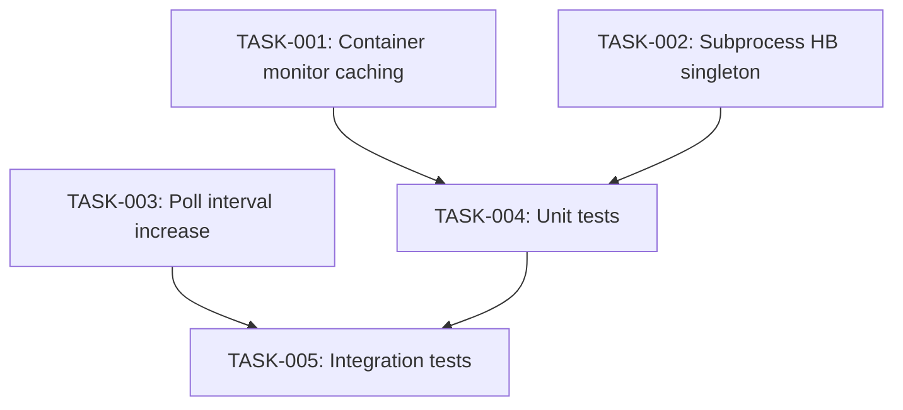

# Technical Design: Kurukshetra Performance Fix

## Metadata
- **Feature**: kurukshetra-perf-fix
- **Status**: DRAFT
- **Created**: 2026-02-04
- **Author**: Claude Opus 4.5 via /z:design

---

## 1. Overview

### 1.1 Summary
Optimize MAHABHARATHA kurukshetra performance by reducing Docker subprocess call overhead in the container monitoring loop. The primary fix adds status caching to `ContainerLauncher.monitor()` and increases the poll interval from 5s to 15s.

### 1.2 Goals
- Reduce Docker calls from 120+/min to ~20-30/min
- Reduce monitoring overhead from 20% to <5% of poll time
- Maintain existing functionality and security posture
- Achieve 15-20% kurukshetra speedup

### 1.3 Non-Goals
- Complete monitoring architecture refactor
- Docker events API integration
- Changes to container health checking mechanism

---

## 2. Architecture

### 2.1 High-Level Design

```
┌─────────────────┐
│  Orchestrator   │
│  (_poll_workers)│
└────────┬────────┘
         │ every 15s (was 5s)
         ▼
┌─────────────────┐
│ launcher.sync_  │
│     state()     │
└────────┬────────┘
         │ for each worker
         ▼
┌─────────────────┐    ┌──────────────────┐
│    monitor()    │───▶│ Check cooldown   │
│                 │    │ (10s threshold)  │
└────────┬────────┘    └────────┬─────────┘
         │                      │
         │ if cooldown elapsed  │ if cached
         ▼                      ▼
┌─────────────────┐    ┌──────────────────┐
│ docker inspect  │    │ Return cached    │
│ docker exec     │    │ handle.status    │
└─────────────────┘    └──────────────────┘
```

### 2.2 Component Breakdown

| Component | Responsibility | Files |
|-----------|---------------|-------|
| ContainerLauncher.monitor() | Check container status with caching | mahabharatha/launcher.py |
| SubprocessLauncher.monitor() | Check subprocess status with cached HB monitor | mahabharatha/launcher.py |
| Orchestrator._poll_interval | Control poll frequency | mahabharatha/orchestrator.py |
| WorkerHandle.health_check_at | Track last check timestamp | mahabharatha/launcher.py (existing) |

### 2.3 Data Flow

1. Orchestrator poll loop triggers every 15 seconds
2. `launcher.sync_state()` iterates over tracked workers
3. For each worker, `monitor(worker_id)` is called
4. **NEW**: Check if `handle.health_check_at` < 10 seconds ago
   - If yes: return cached `handle.status` immediately
   - If no: proceed with Docker calls, update timestamp
5. Return aggregated status to orchestrator

---

## 3. Detailed Design

### 3.1 ContainerLauncher.monitor() Changes

```python
# mahabharatha/launcher.py - ContainerLauncher.monitor()

# Add at class level
MONITOR_COOLDOWN_SECONDS = 10  # Skip docker calls if checked recently

def monitor(self, worker_id: int) -> WorkerStatus:
    handle = self._workers.get(worker_id)
    container_id = self._container_ids.get(worker_id)

    if not handle or not container_id:
        return WorkerStatus.STOPPED

    # FR-1: Check cooldown - skip docker calls if checked recently
    if handle.health_check_at:
        age = (datetime.now() - handle.health_check_at).total_seconds()
        if age < self.MONITOR_COOLDOWN_SECONDS:
            return handle.status

    # ... existing docker inspect/exec logic ...

    # Update timestamp after actual check
    handle.health_check_at = datetime.now()
    return handle.status
```

### 3.2 SubprocessLauncher Changes

```python
# mahabharatha/launcher.py - SubprocessLauncher

def __init__(self, config: LauncherConfig | None = None) -> None:
    super().__init__(config)
    self._processes: dict[int, subprocess.Popen[bytes]] = {}
    self._output_buffers: dict[int, list[str]] = {}
    # FR-4: Cache HeartbeatMonitor instance
    self._heartbeat_monitor: HeartbeatMonitor | None = None

@property
def heartbeat_monitor(self) -> HeartbeatMonitor:
    """Lazy singleton for HeartbeatMonitor."""
    if self._heartbeat_monitor is None:
        from mahabharatha.heartbeat import HeartbeatMonitor
        self._heartbeat_monitor = HeartbeatMonitor()
    return self._heartbeat_monitor

def monitor(self, worker_id: int) -> WorkerStatus:
    # ... existing logic ...
    if handle.status == WorkerStatus.RUNNING:
        # FR-4: Use cached instance instead of creating new one
        hb = self.heartbeat_monitor.read(worker_id)
        if hb and hb.is_stale(120):
            handle.status = WorkerStatus.STALLED
    # ...
```

### 3.3 Orchestrator Poll Interval

```python
# mahabharatha/orchestrator.py - Orchestrator.__init__()

# Change from:
self._poll_interval = 5  # seconds

# To:
self._poll_interval = 15  # seconds (FR-2: reduced monitoring overhead)
```

---

## 4. Key Decisions

### 4.1 Cooldown vs. Batch Docker Calls

**Context**: Need to reduce docker subprocess overhead. Two options: caching or batching.

**Options Considered**:
1. **Cooldown caching**: Skip docker calls if checked < N seconds ago
   - Pros: Simple, no docker CLI changes, immediate benefit
   - Cons: Slightly stale data during cooldown window
2. **Batch docker inspect**: Single call for all containers
   - Pros: Always fresh data, minimal subprocess calls
   - Cons: More complex parsing, needs docker CLI knowledge

**Decision**: Cooldown caching (Option 1)

**Rationale**: Simplest solution with highest ROI. Worker status changes are infrequent (task completion every few minutes), so 10-second staleness is acceptable.

**Consequences**: Status may be up to 10s stale. Acceptable for orchestrator decisions.

### 4.2 Poll Interval Selection

**Context**: Current 5s poll is too aggressive for the work being done.

**Options Considered**:
1. Keep 5s poll, add caching only
2. Increase to 10s
3. Increase to 15s
4. Increase to 30s

**Decision**: 15 seconds (Option 3)

**Rationale**:
- Task execution takes minutes, not seconds
- 15s provides good balance of responsiveness and efficiency
- Combined with 10s cache, max staleness is 25s (acceptable)
- 30s felt too sluggish for user perception

---

## 5. Implementation Plan

### 5.1 Phase Summary

| Phase | Tasks | Parallel | Est. Time |
|-------|-------|----------|-----------|
| Foundation | 2 | Yes | 15 min |
| Core | 2 | Yes | 20 min |
| Testing | 1 | No | 15 min |

### 5.2 File Ownership

| File | Task ID | Operation |
|------|---------|-----------|
| mahabharatha/launcher.py | TASK-001, TASK-002 | modify |
| mahabharatha/orchestrator.py | TASK-003 | modify |
| tests/unit/test_launcher.py | TASK-004 | modify |
| tests/integration/test_rush_performance.py | TASK-005 | modify |

### 5.3 Dependency Graph



---

## 6. Risk Assessment

| Risk | Probability | Impact | Mitigation |
|------|-------------|--------|------------|
| Stale status causes incorrect decisions | Low | Medium | 10s cooldown is conservative |
| Tests timing-dependent on poll interval | Medium | Low | Use mocks in unit tests |
| HeartbeatMonitor import issue | Low | Low | Lazy import preserved |

---

## 7. Testing Strategy

### 7.1 Unit Tests
- Test `ContainerLauncher.monitor()` returns cached status within cooldown
- Test `ContainerLauncher.monitor()` calls docker after cooldown expires
- Test `SubprocessLauncher.heartbeat_monitor` is singleton
- Test orchestrator poll interval is 15s

### 7.2 Integration Tests
- Verify kurukshetra completes with reduced monitoring overhead
- Verify worker status transitions still work correctly

### 7.3 Verification Commands

```bash
# Unit tests
pytest tests/unit/test_launcher.py -v -k "monitor"

# Integration tests
pytest tests/integration/test_rush_performance.py -v

# Full test suite
pytest tests/unit/ tests/integration/ -v --tb=short
```

---

## 8. Parallel Execution Notes

### 8.1 Safe Parallelization
- TASK-001 and TASK-002 modify different classes in same file (ContainerLauncher vs SubprocessLauncher)
- TASK-003 modifies different file (orchestrator.py)
- Level 1 can run 2 tasks in parallel
- Level 2 requires L1 completion for integration test accuracy

### 8.2 Recommended Workers
- Minimum: 1 worker (sequential)
- Optimal: 2 workers (parallel L1)
- Maximum: 2 workers (only 2 L1 tasks)

### 8.3 Estimated Duration
- Single worker: ~50 min
- With 2 workers: ~35 min
- Speedup: ~1.4x

---

## 9. Approval

| Role | Name | Date | Signature |
|------|------|------|-----------|
| Architecture | | | PENDING |
| Engineering | | | PENDING |
