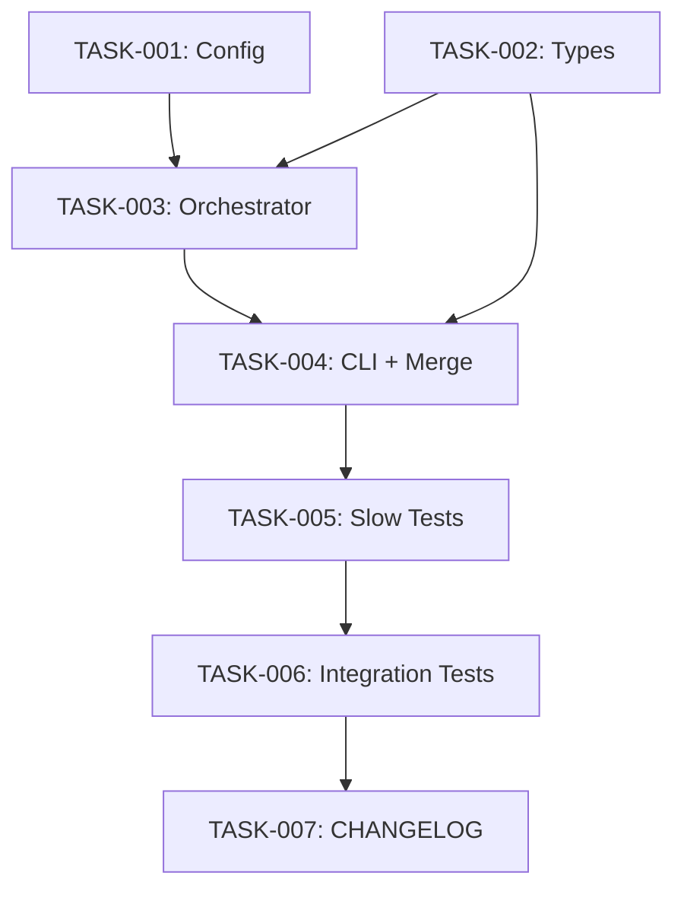

# Technical Design: kurukshetra-performance-optimization

## Metadata
- **Feature**: kurukshetra-performance-optimization
- **Status**: APPROVED
- **Created**: 2026-02-03
- **Author**: Factory Design Mode

---

## 1. Overview

### 1.1 Summary
Optimize MAHABHARATHA kurukshetra execution by reducing redundant gate runs, reusing post-merge results in improvement loops, adding a --skip-tests flag for development iterations, and marking slow tests to enable test filtering.

### 1.2 Goals
- Reduce gate runs from 15-30 per kurukshetra to 2-5
- Reduce kurukshetra time from ~6 hours to ~45 minutes
- Maintain security and quality guarantees (pre/post merge gates still run)
- Enable faster development iteration with --skip-tests flag

### 1.3 Non-Goals
- Parallelizing gate execution (future optimization)
- Reducing test count (only marking slow tests)
- Changing test implementation (only adding markers)

---

## 2. Architecture

### 2.1 High-Level Design

```
┌──────────────┐     ┌─────────────────┐     ┌──────────────────┐
│  kurukshetra.py     │────▶│  Orchestrator   │────▶│  MergeCoordinator│
│  (CLI)       │     │                 │     │                  │
└──────────────┘     └─────────────────┘     └──────────────────┘
       │                    │                        │
       │                    ▼                        ▼
       │             ┌─────────────┐          ┌───────────┐
       │             │ LoopCtrl    │          │ GateRunner│
       │             │ (reuse res) │◀─────────│           │
       │             └─────────────┘          └───────────┘
       │                                             │
       ▼                                             ▼
┌──────────────┐                            ┌───────────────────┐
│ config.yaml  │                            │  pytest           │
│ (thresholds) │                            │  (slow markers)   │
└──────────────┘                            └───────────────────┘
```

### 2.2 Component Breakdown

| Component | Responsibility | Files |
|-----------|---------------|-------|
| Config | Staleness threshold, loop iterations | `.mahabharatha/config.yaml` |
| Orchestrator | Reuse gate results in loop | `mahabharatha/orchestrator.py` |
| Kurukshetra CLI | --skip-tests flag | `mahabharatha/commands/kurukshetra.py` |
| MergeCoordinator | Respect skip-tests flag | `mahabharatha/merge.py` |
| Test Suite | @pytest.mark.slow markers | `tests/unit/test_resilience_*.py`, `tests/unit/test_state_reconciler.py`, `tests/integration/test_resilience_e2e.py` |

### 2.3 Data Flow

1. User invokes `mahabharatha kurukshetra --skip-tests`
2. kurukshetra.py passes `skip_tests=True` to Orchestrator
3. Orchestrator passes flag to MergeCoordinator
4. MergeCoordinator runs only lint gates (skips test gate)
5. After merge, MergeFlowResult.gate_results passed to LoopController
6. LoopController uses results as initial score (no re-run)
7. On final level, full test suite runs

---

## 3. Detailed Design

### 3.1 Config Changes

```yaml
# .mahabharatha/config.yaml additions
verification:
  staleness_threshold_seconds: 1800  # 30 min cache (was 300s)

improvement_loops:
  enabled: true
  max_iterations: 1  # Single iteration by default (was 5)
```

### 3.2 Orchestrator Gate Result Reuse

```python
# mahabharatha/orchestrator.py - _run_level_loop modification
def _run_level_loop(self, level: int, merge_result: MergeFlowResult | None = None) -> None:
    """Run improvement loop for a completed level.

    Args:
        level: Level that just completed.
        merge_result: Optional MergeFlowResult with gate results to reuse.
    """
    # If merge_result provided with gate results, use as initial score
    if merge_result and merge_result.gate_results:
        passed = sum(1 for r in merge_result.gate_results if r.result == GateResult.PASS)
        initial_score = passed / len(merge_result.gate_results) if merge_result.gate_results else 1.0
        if initial_score >= 1.0:
            logger.info(f"Level {level} already at perfect score from merge gates, skipping loop")
            return
    else:
        initial_score = score_level(0)  # Fallback to running gates
```

### 3.3 --skip-tests Flag

```python
# mahabharatha/commands/kurukshetra.py
@click.option("--skip-tests", is_flag=True, help="Skip test gates (lint only) until final level")

# Pass to Orchestrator
orchestrator = Orchestrator(feature, config, launcher_mode=mode, skip_tests=skip_tests)
```

### 3.4 MergeCoordinator Skip Tests

```python
# mahabharatha/merge.py - run_pre_merge_gates / run_post_merge_gates
def run_pre_merge_gates(
    self,
    cwd: str | Path | None = None,
    skip_tests: bool = False,
) -> tuple[bool, list[GateRunResult]]:
    gates = self.config.quality_gates
    if skip_tests:
        gates = [g for g in gates if g.name != "test"]
    # ...
```

### 3.5 Slow Test Markers

```python
# tests/unit/test_resilience_config.py (and others)
import pytest

pytestmark = pytest.mark.slow

class TestResilienceConfig:
    # ...
```

---

## 4. Key Decisions

### 4.1 Reuse Gate Results vs. Cache

**Context**: Need to eliminate duplicate gate runs in improvement loop.

**Options Considered**:
1. **Reuse MergeFlowResult.gate_results**: Pass results to loop, use as initial score
2. **Increase staleness cache**: Rely on GatePipeline cache to avoid re-runs
3. **Both**: Combine for maximum effect

**Decision**: Option 3 (Both)

**Rationale**: Reusing results is immediate and guaranteed. Cache provides additional protection for edge cases.

**Consequences**: Two code paths must handle gate results (merge and loop).

### 4.2 --skip-tests Scope

**Context**: Should --skip-tests apply to all levels or just non-final?

**Options Considered**:
1. Skip tests on all levels
2. Skip tests on all levels except final
3. Make it configurable per level

**Decision**: Option 2 (skip all except final)

**Rationale**: Final level catch-all ensures no regressions ship. Earlier levels still run lint for fast feedback.

**Consequences**: Final level will be slower but comprehensive.

---

## 5. Implementation Plan

### 5.1 Phase Summary

| Phase | Tasks | Parallel | Est. Time |
|-------|-------|----------|-----------|
| Foundation | 2 | Yes | 10 min |
| Core | 2 | No | 40 min |
| Integration | 1 | No | 20 min |
| Testing | 1 | No | 20 min |
| Quality | 1 | No | 10 min |

### 5.2 File Ownership

| File | Task ID | Operation |
|------|---------|-----------|
| `.mahabharatha/config.yaml` | TASK-001 | modify |
| `mahabharatha/orchestrator.py` | TASK-003 | modify |
| `mahabharatha/commands/kurukshetra.py` | TASK-004 | modify |
| `mahabharatha/merge.py` | TASK-004 | modify |
| `tests/unit/test_resilience_config.py` | TASK-005 | modify |
| `tests/unit/test_state_reconciler.py` | TASK-005 | modify |
| `tests/integration/test_resilience_e2e.py` | TASK-005 | modify |
| `CHANGELOG.md` | TASK-007 | modify |

### 5.3 Dependency Graph



---

## 6. Risk Assessment

| Risk | Probability | Impact | Mitigation |
|------|-------------|--------|------------|
| Gate results not available | Low | Medium | Fallback to running gates |
| Tests marked slow incorrectly | Low | Low | Review markers in PR |
| --skip-tests misused in CI | Medium | High | Document as dev-only |

---

## 7. Testing Strategy

### 7.1 Unit Tests
- Test skip_tests parameter flows through Orchestrator
- Test gate result reuse logic
- Test config loading with new fields

### 7.2 Integration Tests
- Test full kurukshetra with --skip-tests flag
- Verify slow markers work with pytest -m slow

### 7.3 Verification Commands
```bash
pytest tests/ -x                           # No regressions
pytest -m slow --collect-only              # Markers applied
mahabharatha kurukshetra --skip-tests --dry-run           # Flag recognized
```

---

## 8. Parallel Execution Notes

### 8.1 Safe Parallelization
- Level 1 tasks (config, types) have no dependencies, fully parallel
- Level 2+ respects dependency graph
- No two tasks modify the same file

### 8.2 Recommended Workers
- Minimum: 1 worker
- Optimal: 2 workers (widest level has 2 tasks)
- Maximum: 2 workers

### 8.3 Estimated Duration
- Single worker: ~100 min
- With 2 workers: ~75 min
- Speedup: 1.3x

---

## 9. Approval

| Role | Name | Date | Signature |
|------|------|------|-----------|
| Architecture | | | PENDING |
| Engineering | | | PENDING |
