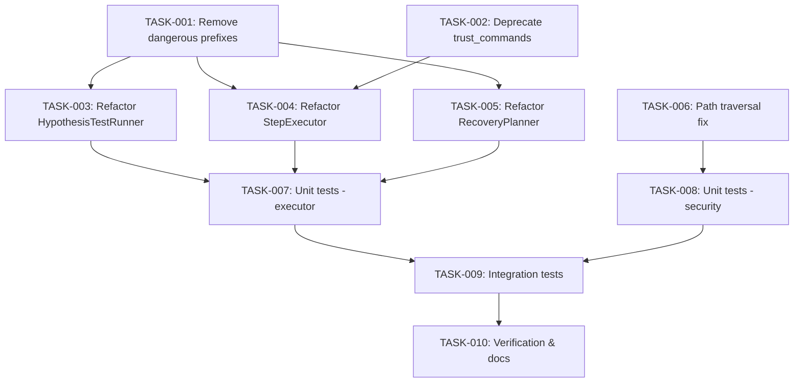

# Technical Design: Security Hardening

## Metadata
- **Feature**: security-hardening
- **Status**: APPROVED
- **Created**: 2026-02-04
- **Completed**: 2026-02-04
- **Author**: MAHABHARATHA Design Mode

---

## 1. Overview

### 1.1 Summary
Remediate three security vulnerabilities: (1) consolidate shell=True subprocess calls through CommandExecutor, (2) remove dangerous command prefixes from allowlist, (3) prevent path traversal in security scanning.

### 1.2 Goals
- Eliminate command injection vectors in hypothesis_engine, step_executor, recovery
- Harden CommandExecutor allowlist by removing `python -c`, `python3 -c`, `npx`
- Prevent symlink-based path traversal in `run_security_scan()`
- Maintain backward compatibility with existing task verification workflows

### 1.3 Non-Goals
- Full CommandExecutor redesign
- Sandboxing or containerization
- AppArmor/seccomp profiles
- Docker security configuration changes

---

## 2. Architecture

### 2.1 High-Level Design

```
┌─────────────────────────────────────────────────────────────────┐
│                      MAHABHARATHA Diagnostics                            │
│  ┌─────────────────┐  ┌─────────────────┐  ┌─────────────────┐  │
│  │ HypothesisEngine │  │  StepExecutor   │  │ RecoveryPlanner │  │
│  └────────┬────────┘  └────────┬────────┘  └────────┬────────┘  │
│           │                    │                    │            │
│           └────────────────────┼────────────────────┘            │
│                                │                                 │
│                                ▼                                 │
│                    ┌───────────────────────┐                    │
│                    │   CommandExecutor     │ ◄── Hardened       │
│                    │  (shell=False by      │     Allowlist      │
│                    │   default)            │                    │
│                    └───────────────────────┘                    │
└─────────────────────────────────────────────────────────────────┘

┌─────────────────────────────────────────────────────────────────┐
│                      Security Scanner                            │
│  ┌─────────────────────────────────────────────────────────────┐│
│  │ run_security_scan()                                          ││
│  │   └── os.walk(followlinks=False)                            ││
│  │   └── validate_path_boundary(resolved, scan_path)           ││
│  └─────────────────────────────────────────────────────────────┘│
└─────────────────────────────────────────────────────────────────┘
```

### 2.2 Component Breakdown

| Component | Responsibility | Files |
|-----------|---------------|-------|
| CommandExecutor | Secure command execution with allowlist | `mahabharatha/command_executor.py` |
| HypothesisTestRunner | Test hypothesis commands safely | `mahabharatha/diagnostics/hypothesis_engine.py` |
| StepExecutor | Execute TDD steps safely | `mahabharatha/step_executor.py` |
| RecoveryPlanner | Execute recovery commands safely | `mahabharatha/diagnostics/recovery.py` |
| SecurityScanner | Scan for secrets without traversal | `mahabharatha/security.py` |

### 2.3 Data Flow

1. **Command Execution Flow**:
   - Caller (HypothesisTestRunner/StepExecutor/RecoveryPlanner) constructs command
   - Command passed to CommandExecutor.execute()
   - CommandExecutor validates against allowlist, checks dangerous patterns
   - Command executed with shell=False (or shell=True only for trusted commands with operators)
   - Result returned with audit logging

2. **Security Scan Flow**:
   - run_security_scan(path) called
   - os.walk with followlinks=False iterates directory
   - Each file path resolved and validated against scan boundary
   - Symlinks outside boundary logged and skipped
   - Results aggregated and returned

---

## 3. Detailed Design

### 3.1 FR-1: Migrate shell=True Callers

#### 3.1.1 HypothesisTestRunner (hypothesis_engine.py:194-200)

**Current code** (vulnerable):
```python
result = subprocess.run(
    hypothesis.test_command,
    shell=True,  # CWE-78: Command Injection
    capture_output=True,
    timeout=timeout,
    text=True,
)
```

**New design**:
```python
from mahabharatha.command_executor import CommandExecutor, get_executor

class HypothesisTestRunner:
    def __init__(self) -> None:
        self._executor = get_executor()  # Uses default executor

    def test(self, hypothesis: ScoredHypothesis, timeout: int = 30) -> ScoredHypothesis:
        if not self.can_test(hypothesis):
            return hypothesis

        try:
            result = self._executor.execute(
                hypothesis.test_command,
                timeout=timeout,
            )
            if result.success:
                hypothesis.test_result = "PASSED"
                hypothesis.posterior_probability = min(0.99, hypothesis.posterior_probability * 1.5)
            else:
                hypothesis.test_result = "FAILED"
                hypothesis.posterior_probability = max(0.01, hypothesis.posterior_probability * 0.5)
        except CommandValidationError as e:
            hypothesis.test_result = f"ERROR: {e}"
        except Exception as e:
            hypothesis.test_result = f"ERROR: {e}"

        return hypothesis
```

**Changes**:
- Remove `SAFE_PREFIXES` list (redundant with CommandExecutor.ALLOWED_COMMAND_PREFIXES)
- Import and use `get_executor()` instead of direct subprocess
- Update `can_test()` to use executor's validation

#### 3.1.2 StepExecutor (step_executor.py:272-278)

**Current code** (vulnerable):
```python
result = subprocess.run(
    command,
    shell=True,  # CWE-78: Command Injection
    capture_output=True,
    text=True,
    timeout=self._default_timeout,
    cwd=self._working_dir,
)
```

**New design**:
```python
from mahabharatha.command_executor import CommandExecutor, CommandValidationError

class StepExecutor:
    def __init__(
        self,
        task_id: str,
        heartbeat_writer: HeartbeatWriter | None = None,
        working_dir: str | None = None,
        default_timeout: int = 120,
    ) -> None:
        self._task_id = task_id
        self._heartbeat_writer = heartbeat_writer
        self._working_dir = working_dir
        self._default_timeout = default_timeout
        self._step_states: list[str] = []
        # Use trust_commands=True for task-graph verification commands
        self._executor = CommandExecutor(
            working_dir=Path(working_dir) if working_dir else None,
            timeout=default_timeout,
            trust_commands=True,  # Task-graph commands are trusted
        )

    def _execute_step(self, step: Step, step_number: int) -> StepResult:
        # ... existing validation code ...

        try:
            result = self._executor.execute(
                command,
                timeout=self._default_timeout,
            )
            # ... existing verification logic ...
```

**Changes**:
- Initialize CommandExecutor in `__init__` with `trust_commands=True`
- Replace subprocess.run with executor.execute()
- Add CommandValidationError handling

#### 3.1.3 RecoveryPlanner (recovery.py:367-374)

**Current code** (vulnerable):
```python
result = subprocess.run(
    step.command,
    shell=True,  # CWE-78: Command Injection
    capture_output=True,
    text=True,
    timeout=SUBPROCESS_TIMEOUT,
)
```

**New design**:
```python
import shlex
from mahabharatha.command_executor import CommandExecutor, CommandValidationError, get_executor

class RecoveryPlanner:
    def __init__(self) -> None:
        self._executor = get_executor()

    def _get_steps(self, category: str, result: DiagnosticResult, health: MahabharathaHealthReport | None) -> list[RecoveryStep]:
        # ... existing code ...

        for tmpl in template:
            # Apply shlex.quote to template variables for safety
            cmd = tmpl.command.format(
                feature=shlex.quote(feature),
                worker_id=shlex.quote(worker_id),
                port="",
            )
            # ...

    def execute_step(self, step: RecoveryStep, confirm_fn: ...) -> dict[str, Any]:
        if confirm_fn and not confirm_fn(step):
            return {"success": False, "output": "Skipped by user", "skipped": True}

        try:
            result = self._executor.execute(
                step.command,
                timeout=SUBPROCESS_TIMEOUT,
            )
            return {
                "success": result.success,
                "output": result.stdout or result.stderr,
                "skipped": False,
            }
        except CommandValidationError as e:
            return {"success": False, "output": f"Validation error: {e}", "skipped": False}
        except Exception as e:
            return {"success": False, "output": str(e), "skipped": False}
```

**Changes**:
- Apply `shlex.quote()` to template variables in `_get_steps()`
- Replace subprocess.run with executor.execute()
- Handle CommandValidationError explicitly

### 3.2 FR-2: Harden CommandExecutor Allowlist

**Current allowlist** (vulnerable entries):
```python
ALLOWED_COMMAND_PREFIXES: dict[str, CommandCategory] = {
    # ...
    "npx": CommandCategory.SYSTEM,           # REMOVE - enables arbitrary code
    "python -c": CommandCategory.SYSTEM,     # REMOVE - enables arbitrary code
    "python3 -c": CommandCategory.SYSTEM,    # REMOVE - enables arbitrary code
    # ...
}
```

**New design**:

```python
# Remove from ALLOWED_COMMAND_PREFIXES:
# - "npx"
# - "python -c"
# - "python3 -c"

# Add deprecation warning for trust_commands flag
class CommandExecutor:
    def __init__(
        self,
        working_dir: Path | str | None = None,
        allow_unlisted: bool = False,
        custom_allowlist: dict[str, CommandCategory] | None = None,
        timeout: int = 300,
        audit_log: bool = True,
        trust_commands: bool = False,
    ):
        # ...

        if trust_commands:
            logger.warning(
                "trust_commands=True is deprecated and will be removed in a future version. "
                "Add specific command patterns to custom_allowlist instead."
            )
        # ...
```

### 3.3 FR-3: Prevent Path Traversal in Security Scan

**Current code** (vulnerable):
```python
def run_security_scan(path: str | Path = ".") -> dict[str, Any]:
    scan_path = Path(path).resolve()
    # ...

    all_files = []
    for root, dirs, files in os.walk(scan_path):  # followlinks defaults to False but implicit
        # ...
        for f in files:
            all_files.append(os.path.join(root, f))  # No boundary check
```

**New design**:
```python
def run_security_scan(path: str | Path = ".") -> dict[str, Any]:
    scan_path = Path(path).resolve()
    results: dict[str, Any] = {
        "secrets_found": [],
        "sensitive_files": [],
        "non_ascii_files": [],
        "large_files": [],
        "symlink_violations": [],  # NEW: Track symlink boundary violations
        "passed": True,
    }

    all_files = []
    # Explicit followlinks=False for defense in depth
    for root, dirs, files in os.walk(scan_path, followlinks=False):
        skip = {".git", "__pycache__", "node_modules", ".venv", "venv"}
        dirs[:] = [d for d in dirs if d not in skip]

        for f in files:
            filepath = os.path.join(root, f)

            # Validate path stays within scan boundary
            try:
                resolved = Path(filepath).resolve()
                if not resolved.is_relative_to(scan_path):
                    logger.warning(f"Symlink escape detected, skipping: {filepath}")
                    results["symlink_violations"].append(filepath)
                    continue
            except (OSError, ValueError) as e:
                logger.warning(f"Path resolution error, skipping {filepath}: {e}")
                continue

            all_files.append(str(resolved))

    # ... rest of scan logic ...
```

**Changes**:
- Explicit `followlinks=False` in os.walk()
- Validate each resolved path with `is_relative_to(scan_path)`
- Add `symlink_violations` to results for audit trail
- Catch and log OSError/ValueError during resolution

---

## 4. Key Decisions

### 4.1 Decision: Use CommandExecutor vs Custom Validation

**Context**: Three modules bypass CommandExecutor and use shell=True directly.

**Options Considered**:
1. Add validation to each module: Duplicates logic, harder to maintain
2. Migrate to CommandExecutor: Centralizes security, consistent audit trail
3. Create new secure wrapper: Adds complexity, another abstraction layer

**Decision**: Migrate to CommandExecutor (Option 2)

**Rationale**: CommandExecutor already exists with allowlist, audit logging, and dangerous pattern detection. Centralizing command execution provides defense in depth and single point of security policy enforcement.

**Consequences**: All command execution goes through one path; trust_commands flag needed for task-graph verification commands that may contain shell operators.

### 4.2 Decision: Deprecate trust_commands vs Remove Immediately

**Context**: trust_commands=True enables shell=True for trusted sources like task-graph.json.

**Options Considered**:
1. Remove immediately: Breaking change for existing task-graph commands with shell operators
2. Deprecate with warning: Maintains compatibility, encourages migration
3. Keep as-is: Maintains attack vector

**Decision**: Deprecate with warning (Option 2)

**Rationale**: Immediate removal would break existing workflows. Deprecation warning alerts users while maintaining backward compatibility. Document migration path for next major version.

**Consequences**: trust_commands remains functional with logged warning. Will be removed in future version.

### 4.3 Decision: Path Validation Strategy

**Context**: run_security_scan follows symlinks by default (Python's os.walk default is followlinks=False, but we want explicit defense).

**Options Considered**:
1. Rely on default followlinks=False: Implicit, could change
2. Explicit followlinks=False + boundary check: Defense in depth
3. Pre-scan symlink detection: Complex, slower

**Decision**: Explicit followlinks=False + boundary check (Option 2)

**Rationale**: Defense in depth - even if os.walk behavior changed or symlinks were followed accidentally, the boundary check prevents scanning outside the intended directory.

**Consequences**: Small performance overhead per file for path resolution. Symlink violations logged for audit.

---

## 5. Implementation Plan

### 5.1 Phase Summary

| Phase | Tasks | Parallel | Est. Time |
|-------|-------|----------|-----------|
| Foundation | 2 | Yes | 15 min |
| Core | 3 | Yes | 45 min |
| Integration | 1 | No | 15 min |
| Testing | 3 | Yes | 45 min |
| Quality | 1 | No | 15 min |

### 5.2 File Ownership

| File | Task ID | Operation |
|------|---------|-----------|
| mahabharatha/command_executor.py | TASK-001, TASK-002 | modify |
| mahabharatha/diagnostics/hypothesis_engine.py | TASK-003 | modify |
| mahabharatha/step_executor.py | TASK-004 | modify |
| mahabharatha/diagnostics/recovery.py | TASK-005 | modify |
| mahabharatha/security.py | TASK-006 | modify |
| tests/unit/test_command_executor_hardening.py | TASK-007 | create |
| tests/unit/test_security_path_traversal.py | TASK-008 | create |
| tests/integration/test_diagnostics_secure_execution.py | TASK-009 | create |

### 5.3 Dependency Graph



---

## 6. Risk Assessment

| Risk | Probability | Impact | Mitigation |
|------|-------------|--------|------------|
| Task-graph verification commands break | Medium | High | trust_commands=True preserves shell operator support |
| Recovery command templates fail validation | Low | Medium | Templates use safe commands (git, mahabharatha CLI) |
| Performance regression from path validation | Low | Low | O(1) per file, negligible overhead |
| Existing tests fail due to allowlist changes | Medium | Low | Run full test suite, add tests for new behavior |

---

## 7. Testing Strategy

### 7.1 Unit Tests

**CommandExecutor hardening** (test_command_executor_hardening.py):
- Test `python -c` rejected by default
- Test `python3 -c` rejected by default
- Test `npx` rejected by default
- Test trust_commands deprecation warning logged
- Test existing allowed commands still work

**Security path traversal** (test_security_path_traversal.py):
- Test os.walk uses followlinks=False
- Test symlink outside boundary is detected
- Test symlink outside boundary is skipped with warning
- Test normal files within boundary are scanned
- Test OSError during resolution is handled gracefully

### 7.2 Integration Tests

**Diagnostics secure execution** (test_diagnostics_secure_execution.py):
- Test HypothesisTestRunner uses CommandExecutor
- Test StepExecutor uses CommandExecutor
- Test RecoveryPlanner uses CommandExecutor
- Test end-to-end: hypothesis → test → result with safe commands
- Test end-to-end: recovery plan execution with template substitution

### 7.3 Verification Commands

```bash
# AC-1: shell=True only in command_executor.py
grep -rn "shell=True" mahabharatha/ | grep -v "command_executor.py"
# Expected: empty output

# AC-2: CommandExecutor imported in all three modules
grep -l "CommandExecutor\|get_executor" mahabharatha/diagnostics/hypothesis_engine.py mahabharatha/step_executor.py mahabharatha/diagnostics/recovery.py
# Expected: 3 files listed

# AC-3: Dangerous prefixes removed
grep -E "(python -c|python3 -c|npx)" mahabharatha/command_executor.py | grep -v "#"
# Expected: empty output

# AC-4: followlinks=False explicit
grep -n "os.walk" mahabharatha/security.py | grep "followlinks=False"
# Expected: 1 match

# AC-5: All tests pass
pytest tests/ -v

# AC-6: New test files exist
ls tests/unit/test_command_executor_hardening.py tests/unit/test_security_path_traversal.py tests/integration/test_diagnostics_secure_execution.py

# AC-7: bandit clean
bandit -r mahabharatha/ -ll
```

---

## 8. Parallel Execution Notes

### 8.1 Safe Parallelization
- Level 1: TASK-001, TASK-002 (no dependencies, fully parallel)
- Level 2: TASK-003, TASK-004, TASK-005, TASK-006 (depend on Level 1, parallel within level)
- Level 3: TASK-007, TASK-008 (depend on Level 2, parallel)
- Level 4: TASK-009 (depends on Level 3)
- Level 5: TASK-010 (depends on Level 4)

### 8.2 File Ownership Conflicts
- TASK-001 and TASK-002 both modify command_executor.py → **Sequential within Level 1**
- No other conflicts

### 8.3 Recommended Workers
- Minimum: 1 worker (sequential execution)
- Optimal: 3 workers (matches widest level: Level 2 with 4 tasks)
- Maximum: 4 workers (diminishing returns beyond)

### 8.4 Estimated Duration
- Single worker: ~135 min
- With 3 workers: ~75 min
- Speedup: ~1.8x

---

## 9. Approval

| Role | Name | Date | Signature |
|------|------|------|-----------|
| Architecture | | | PENDING |
| Engineering | | | PENDING |
