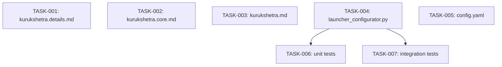

# Technical Design: task-mode-default

## Metadata
- **Feature**: task-mode-default
- **Status**: APPROVED
- **Created**: 2026-02-05
- **Author**: /mahabharatha:design

---

## 1. Overview

### 1.1 Summary
Simplify `/mahabharatha:kurukshetra` mode selection: task mode becomes the default, container mode requires explicit `--mode container`. Remove devcontainer auto-detection logic from Python code.

### 1.2 Goals
- Task mode as default (simplest mental model)
- Container mode only when explicitly requested
- Remove Docker/devcontainer auto-detection complexity

### 1.3 Non-Goals
- Removing container mode entirely
- Adding "task" as a LauncherType enum
- Changing worker.md or other commands

---

## 2. Architecture

### 2.1 High-Level Design

```
User invokes /mahabharatha:kurukshetra
         │
         ▼
    ┌─────────────────────────────┐
    │   Mode Selection Logic      │
    └─────────────────────────────┘
         │
         ├── --mode container ──▶ ContainerLauncher
         ├── --mode subprocess ──▶ SubprocessLauncher
         └── (default/auto/task) ──▶ Task tool mode
```

**Before**: Auto-detect checked devcontainer → Docker image → fallback
**After**: Explicit mode or default to subprocess (which maps to task mode in slash commands)

### 2.2 Component Breakdown

| Component | Responsibility | Files |
|-----------|---------------|-------|
| Documentation | Define mode selection rules | kurukshetra.md, kurukshetra.core.md, kurukshetra.details.md |
| Python auto-detect | Always return SUBPROCESS | launcher_configurator.py |
| Config | Document default | .mahabharatha/config.yaml |
| Unit tests | Verify new behavior | test_launcher_configurator.py |
| Integration tests | Update/remove auto-detect tests | test_container_launcher.py |

### 2.3 Data Flow

1. User runs `/mahabharatha:kurukshetra` or `mahabharatha kurukshetra`
2. Mode determined: explicit flag > "auto" (= SUBPROCESS)
3. For SUBPROCESS in slash command context → task mode (Task tool subagents)
4. For SUBPROCESS in CLI context → subprocess mode (Python processes)
5. For CONTAINER → container mode (Docker containers)

---

## 3. Detailed Design

### 3.1 Python Changes

**File**: `mahabharatha/launcher_configurator.py`

```python
def _auto_detect_launcher_type(self) -> LauncherType:
    """Auto-detect launcher type. Always returns SUBPROCESS.

    Container mode requires explicit --mode container flag.
    """
    return LauncherType.SUBPROCESS
```

Remove lines 129-155 (devcontainer check, Docker image check).

### 3.2 Documentation Changes

**File**: `kurukshetra.details.md` (lines 163-167)

From:
```markdown
Auto-detection logic:
1. If `--mode` is explicitly set → use that mode
2. If `.devcontainer/devcontainer.json` exists AND worker image is built → container mode
3. If running as Claude Code slash command → task mode
4. Otherwise → subprocess mode
```

To:
```markdown
Auto-detection logic:
1. If `--mode` is explicitly set → use that mode
2. Otherwise → task mode (default)
```

**File**: `kurukshetra.core.md` and `kurukshetra.md` help text (line ~230)

From:
```
--mode MODE           Execution mode: subprocess|container|auto (default: auto)
```

To:
```
--mode MODE           Execution mode: task|container|subprocess (default: task)
```

### 3.3 Config Changes

**File**: `.mahabharatha/config.yaml` (line 13)

Change comment to clarify task mode is implicit default:
```yaml
launcher_type: subprocess  # Python fallback; task mode is implicit default for slash commands
```

---

## 4. Key Decisions

### 4.1 Keep LauncherType.SUBPROCESS as Python Default

**Context**: Should we add LauncherType.TASK to Python?

**Options Considered**:
1. Add LauncherType.TASK enum: Requires code changes throughout
2. Keep SUBPROCESS, document task mode as prompt-only: Minimal code change

**Decision**: Option 2 — Keep SUBPROCESS as Python return value

**Rationale**: Task mode is a Claude Code concept (Task tool), not a Python concept. The orchestrator doesn't spawn "task mode" processes; it's the slash command executor that interprets SUBPROCESS as "use Task tool."

**Consequences**: Documentation must clarify the mapping: SUBPROCESS → task mode in slash commands.

---

## 5. Implementation Plan

### 5.1 Phase Summary

| Phase | Tasks | Parallel | Est. Time |
|-------|-------|----------|-----------|
| Documentation | 3 | Yes | 5 min |
| Python | 1 | Yes | 2 min |
| Config | 1 | Yes | 1 min |
| Tests | 2 | Yes | 5 min |

### 5.2 File Ownership

| File | Task ID | Operation |
|------|---------|-----------|
| mahabharatha/data/commands/kurukshetra.details.md | TASK-001 | modify |
| mahabharatha/data/commands/kurukshetra.core.md | TASK-002 | modify |
| mahabharatha/data/commands/kurukshetra.md | TASK-003 | modify |
| mahabharatha/launcher_configurator.py | TASK-004 | modify |
| .mahabharatha/config.yaml | TASK-005 | modify |
| tests/unit/test_launcher_configurator.py | TASK-006 | modify |
| tests/integration/test_container_launcher.py | TASK-007 | modify |

### 5.3 Dependency Graph



All Level 1 tasks (TASK-001 through TASK-005) are independent.
Level 2 tasks (TASK-006, TASK-007) depend on TASK-004 (Python changes).

---

## 6. Risk Assessment

| Risk | Probability | Impact | Mitigation |
|------|-------------|--------|------------|
| Breaking explicit --mode container | Low | High | Preserve explicit mode handling |
| Tests fail | Low | Medium | Update tests to expect new behavior |
| Documentation inconsistency | Low | Low | Update all 3 kurukshetra files together |

---

## 7. Testing Strategy

### 7.1 Unit Tests

Update `test_launcher_configurator.py`:
- `test_auto_detect_no_devcontainer` → keep (expects SUBPROCESS)
- `test_auto_detect_with_devcontainer_and_image` → change to expect SUBPROCESS
- `test_auto_detect_docker_failure_falls_back` → remove (no longer relevant)
- `test_create_launcher_auto_falls_back_on_network_failure` → update (still relevant for explicit container mode fallback)

### 7.2 Integration Tests

Update `test_container_launcher.py`:
- `TestAutoDetectLauncherMode` class → simplify (devcontainer presence no longer matters)

### 7.3 Verification Commands

```bash
# Unit tests
pytest tests/unit/test_launcher_configurator.py -v

# Integration tests
pytest tests/integration/test_container_launcher.py -v

# Full test suite
pytest tests/ -x --timeout=60
```

---

## 8. Parallel Execution Notes

### 8.1 Safe Parallelization
- Level 1: 5 tasks (docs + Python + config), fully parallel
- Level 2: 2 tasks (tests), parallel after TASK-004

### 8.2 Recommended Workers
- Minimum: 1 worker (sequential)
- Optimal: 5 workers (all Level 1 in parallel)
- Maximum: 5 workers (no benefit beyond widest level)

### 8.3 Estimated Duration
- Single worker: ~15 min
- With 5 workers: ~7 min
- Speedup: 2x

---

## 9. Approval

| Role | Name | Date | Signature |
|------|------|------|-----------|
| Architecture | | | PENDING |
| Engineering | | | PENDING |
