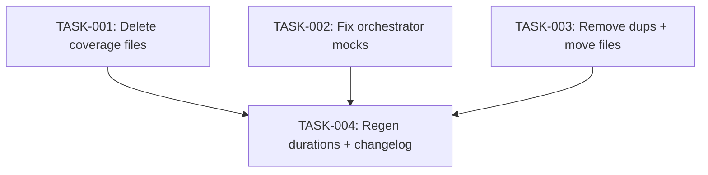

# Technical Design: test-suite-cleanup

## Metadata
- **Feature**: test-suite-cleanup
- **Status**: APPROVED
- **Created**: 2026-02-06
- **Author**: Factory Design Mode

---

## 1. Overview

### 1.1 Summary
Fix 25 CI test failures by deleting 2 broken coverage-padding files and fixing 2 test files with stale mocks. Then consolidate all root-level test files: delete 8 pure duplicates, move 10 unique files to `tests/unit/`, and regenerate `.test_durations`.

### 1.2 Goals
- Zero CI test failures on main
- All test files organized under `tests/unit/` or `tests/integration/`
- No root-level test files (except __init__.py, conftest.py)
- Updated .test_durations for pytest-split

### 1.3 Non-Goals
- Refactoring test content or improving test quality
- Fixing e2e or pressure tests
- Changing CI workflow configuration

---

## 2. Architecture

### 2.1 High-Level Design

No new code — file operations only (delete, move, edit).

```
Phase 1: Fix Failures
  ├─ Delete test_near_complete_coverage.py (14 failures)
  ├─ Delete test_orchestrator_coverage.py (2 failures)
  ├─ Fix test_orchestrator.py mocks (4 failures)
  └─ Fix test_orchestrator_container_mode.py regex (1 failure)

Phase 2: Remove Duplicates
  └─ Delete 8 root-level files with 0 unique tests

Phase 3: Relocate Orphans
  └─ git mv 10 root-level files → tests/unit/

Phase 4: Finalize
  ├─ Regenerate .test_durations
  └─ Update CHANGELOG.md
```

### 2.2 Component Breakdown

| Component | Responsibility | Files |
|-----------|---------------|-------|
| Coverage file cleanup | Delete broken coverage-padding tests | 2 files deleted |
| Mock fixes | Update stale mock targets in orchestrator tests | 2 files edited |
| Duplicate removal | Delete root files that are subsets of unit files | 8 files deleted |
| File relocation | Move orphan root tests to tests/unit/ | 10 files moved |
| Duration regen | Update pytest-split timing data | .test_durations |

### 2.3 Data Flow

N/A — file operations only.

---

## 3. Detailed Design

### 3.1 test_orchestrator.py Mock Fixes (4 failures)

**test_start_raises_when_all_spawns_fail & test_start_records_rush_failed_event:**
- Old mock: `_spawn_workers`
- New mock: `_worker_manager.spawn_workers`

**test_poll_workers_stopped_status & test_poll_workers_checkpointing_status:**
- Old mock: `_handle_worker_exit`
- New mock: `_worker_manager.handle_worker_exit`

### 3.2 test_orchestrator_container_mode.py Regex Fix (1 failure)

- Old regex: `"explicitly requested"`
- Actual message: `"Container mode requested but Docker network creation failed."`
- New regex: `"Container mode requested"`

---

## 4. Key Decisions

### 4.1 Delete vs. Fix Coverage Files

**Context**: test_near_complete_coverage.py has 14 broken tests out of 87.

**Options**:
1. Fix the 14 broken tests
2. Delete the entire file

**Decision**: Delete. The 73 passing tests cover edge-case branches already tested by primary unit test files. These were coverage-padding files, not primary test files.

### 4.2 Parallel Grouping Strategy

**Context**: Many independent file operations can run in parallel.

**Decision**: Group by dependency, not by plan phase:
- L1: All independent operations (deletes, moves, fixes) — max parallelism
- L2: Operations that depend on L1 (duration regen, verification)

This gives wider parallelization than the sequential 4-phase plan.

---

## 5. Implementation Plan

### 5.1 Phase Summary

| Phase | Tasks | Parallel | Est. Time |
|-------|-------|----------|-----------|
| Foundation (L1) | 4 | Yes | 5 min |
| Quality (L2) | 1 | No | 5 min |

### 5.2 File Ownership

| File | Task ID | Operation |
|------|---------|-----------|
| tests/unit/test_near_complete_coverage.py | TASK-001 | delete |
| tests/unit/test_orchestrator_coverage.py | TASK-001 | delete |
| tests/unit/test_orchestrator.py | TASK-002 | modify |
| tests/unit/test_orchestrator_container_mode.py | TASK-002 | modify |
| tests/test_config.py | TASK-003 | delete |
| tests/test_context_tracker.py | TASK-003 | delete |
| tests/test_git_ops.py | TASK-003 | delete |
| tests/test_launcher.py | TASK-003 | delete |
| tests/test_orchestrator.py | TASK-003 | delete |
| tests/test_state.py | TASK-003 | delete |
| tests/test_worker_protocol.py | TASK-003 | delete |
| tests/test_worktree.py | TASK-003 | delete |
| tests/test_claude_tasks_reader.py | TASK-003 | move → tests/unit/ |
| tests/test_config_caching.py | TASK-003 | move → tests/unit/ |
| tests/test_doc_engine.py | TASK-003 | move → tests/unit/ |
| tests/test_gates.py | TASK-003 | move → tests/unit/ |
| tests/test_levels.py | TASK-003 | move → tests/unit/ |
| tests/test_log_aggregator_caching.py | TASK-003 | move → tests/unit/ |
| tests/test_repo_map_caching.py | TASK-003 | move → tests/unit/ |
| tests/test_single_traversal.py | TASK-003 | move → tests/unit/ |
| tests/test_token_counter_memory.py | TASK-003 | move → tests/unit/ |
| tests/test_types.py | TASK-003 | move → tests/unit/ |
| .test_durations | TASK-004 | regenerate |
| CHANGELOG.md | TASK-004 | modify |

### 5.3 Dependency Graph



---

## 6. Risk Assessment

| Risk | Probability | Impact | Mitigation |
|------|-------------|--------|------------|
| Moved tests have import path issues | Low | Med | git mv preserves content; imports use mahabharatha.* not relative |
| .test_durations has stale entries | Low | Low | Full regeneration overwrites all entries |
| Deleted coverage tests had unique coverage | Low | Low | Verified: 0 unique tests in duplicates, coverage files test same paths |

---

## 7. Testing Strategy

### 7.1 Verification Commands
- After L1: `pytest tests/unit/test_orchestrator.py tests/unit/test_orchestrator_container_mode.py -q --timeout=120`
- After L2: `pytest tests/ --ignore=tests/e2e --ignore=tests/pressure -m "not slow" --timeout=120 -q`

### 7.2 Structural Check
- `ls tests/test_*.py` should return nothing (only conftest.py, __init__.py remain)

---

## 8. Parallel Execution Notes

### 8.1 Safe Parallelization
- TASK-001, TASK-002, TASK-003 touch completely different files — fully parallel
- TASK-004 depends on all three completing (needs clean state for pytest)

### 8.2 Recommended Workers
- Minimum: 1 worker
- Optimal: 3 workers (one per L1 task)
- Maximum: 3 workers

### 8.3 Estimated Duration
- Single worker: 12 min
- With 3 workers: 7 min
- Speedup: 1.7x

---

## 9. Approval

| Role | Name | Date | Signature |
|------|------|------|-----------|
| Architecture | | | PENDING |
| Engineering | | | PENDING |
