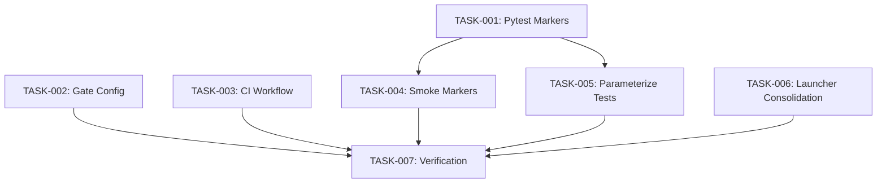

# Technical Design: test-suite-optimization

## Metadata
- **Feature**: test-suite-optimization
- **Status**: APPROVED
- **Created**: 2026-02-04
- **Author**: Factory Design Mode

---

## 1. Overview

### 1.1 Summary
Optimize the ZERG test suite (7,634 tests / 128K LOC) by implementing test tiering via pytest markers, parameterizing repetitive tests, consolidating fragmented test files, and updating quality gate configurations. Target: reduce CI time from 8-10 minutes to < 2 minutes while maintaining 80% coverage.

### 1.2 Goals
- Implement three-tier test execution (smoke < 30s, fast < 90s, full < 10min)
- Reduce test count via parameterization (~600 tests consolidated)
- Consolidate launcher test files from 8 to 4
- Update quality gates with optimized timeouts

### 1.3 Non-Goals
- E2E tests (require real Claude API, stay nightly-only)
- Smart test selection based on changed files (Phase 3, future)
- Shared fixtures library (Phase 3, future)

---

## 2. Architecture

### 2.1 High-Level Design

```
┌─────────────────────────────────────────────────────────────┐
│                    Test Tiering System                       │
├─────────────────────────────────────────────────────────────┤
│                                                              │
│  ┌──────────┐    ┌──────────┐    ┌──────────┐              │
│  │  SMOKE   │───▶│   FAST   │───▶│   FULL   │              │
│  │  < 30s   │    │  < 90s   │    │ < 10min  │              │
│  │  ~200    │    │  ~2000   │    │  ~6500   │              │
│  └──────────┘    └──────────┘    └──────────┘              │
│       │               │               │                     │
│       ▼               ▼               ▼                     │
│  Every Push      PR Open/Sync    Pre-merge/Nightly         │
│                                                              │
└─────────────────────────────────────────────────────────────┘

┌─────────────────────────────────────────────────────────────┐
│                    Quality Gates                             │
├─────────────────────────────────────────────────────────────┤
│                                                              │
│  ┌─────────┐   ┌─────────┐   ┌─────────┐   ┌─────────┐    │
│  │  lint   │──▶│  smoke  │──▶│  test   │──▶│typecheck│    │
│  │  300s   │   │   60s   │   │  180s   │   │  180s   │    │
│  └─────────┘   └─────────┘   └─────────┘   └─────────┘    │
│                                                              │
└─────────────────────────────────────────────────────────────┘
```

### 2.2 Component Breakdown

| Component | Responsibility | Files |
|-----------|---------------|-------|
| Pytest Markers | Define test tiers | pyproject.toml, conftest.py |
| Gate Config | Configure quality gates | .zerg/config.yaml |
| CI Workflow | Run tiered tests | .github/workflows/pytest.yml |
| Smoke Tests | Critical path coverage | tests/unit/test_{config,state,validation,constants}.py |
| Parameterized Tests | Consolidate repetitive tests | tests/unit/test_debug_cmd.py |
| Launcher Tests | Consolidated launcher testing | tests/unit/test_launcher{,_container}.py |

### 2.3 Data Flow

1. **Push Event** → CI triggers → Smoke gate (60s timeout) → Fast feedback
2. **PR Event** → Smoke passes → Fast tests (180s timeout) → PR status
3. **Pre-merge** → Full suite with coverage → Merge decision

---

## 3. Detailed Design

### 3.1 Pytest Marker Configuration

```toml
# pyproject.toml additions
[tool.pytest.ini_options]
markers = [
    "smoke: Critical path tests (< 30s total)",
    "slow: Slow-running tests (excluded from fast tier)",
    "docker: Tests requiring a running Docker daemon",
    "e2e: End-to-end tests requiring external services",
    "real_e2e: Tests requiring real Claude API access",
]
```

### 3.2 Smoke Test Selection

Files receiving `pytestmark = pytest.mark.smoke`:
- `test_config.py` — Configuration validation (critical)
- `test_state.py` — State management (critical)
- `test_validation.py` — Input validation (critical)
- `test_constants.py` — Constants/enums (fast, foundational)

### 3.3 Parameterization Pattern

```python
# Before: 31 separate tests in TestStackTraceAnalyzer
def test_analyze_detects_recursion(self): ...
def test_analyze_detects_memory(self): ...
# ... 29 more

# After: 1 parameterized test
@pytest.mark.parametrize("error_input,expected_pattern", [
    ("RecursionError: maximum recursion depth exceeded", "recursion"),
    ("MemoryError: unable to allocate", "memory"),
    ("TimeoutError", "timeout"),
    # ... all 31 cases
])
def test_analyze_detects_pattern(self, error_input, expected_pattern):
    analyzer = StackTraceAnalyzer()
    patterns = analyzer.analyze(error_input)
    assert expected_pattern in patterns
```

### 3.4 Launcher Test Consolidation

**Current structure (8 files, 6,427 LOC)**:
- test_launcher.py (2099 LOC) — Core subprocess launcher
- test_launcher_coverage.py (1258 LOC) — Coverage gaps
- test_launcher_errors.py (865 LOC) — Error handling
- test_launcher_extended.py (531 LOC) — Extended scenarios
- test_launcher_process.py (652 LOC) — Process management
- test_launcher_network.py (503 LOC) — Network isolation
- test_launcher_exec.py (336 LOC) — Execution modes
- test_launcher_configurator.py (183 LOC) — Configuration

**Target structure (4 files)**:
- test_launcher.py — Core subprocess launcher (merge: coverage, errors, extended)
- test_launcher_container.py — Container-specific (merge: process, network, exec)
- test_launcher_configurator.py — Keep separate (distinct responsibility)
- tests/integration/test_launcher_integration.py — Keep existing integration tests

---

## 4. Key Decisions

### 4.1 Test Tiering Strategy

**Context**: Need to provide fast feedback while maintaining comprehensive coverage.

**Options Considered**:
1. **Single tier with parallelization**: Use pytest-xdist only
   - Pros: Simple, no marker maintenance
   - Cons: Still runs everything, limited speedup
2. **Two tiers (fast/full)**: Skip slow tests by default
   - Pros: Simple marker system
   - Cons: No ultra-fast feedback path
3. **Three tiers (smoke/fast/full)**: Graduated feedback
   - Pros: < 30s feedback for critical changes, flexible
   - Cons: More marker maintenance

**Decision**: Three tiers (smoke/fast/full)

**Rationale**: Smoke tier provides immediate feedback (< 30s), fast tier covers most scenarios (< 90s), full tier ensures complete coverage. Aligns with industry best practices.

**Consequences**: Need to maintain smoke marker on ~5 critical test files.

### 4.2 Parameterization Scope

**Context**: test_debug_cmd.py has 31 identical pattern tests that can be consolidated.

**Options Considered**:
1. **Aggressive parameterization**: Parameterize everything possible
2. **Selective parameterization**: Only obvious repetition
3. **No parameterization**: Keep current structure

**Decision**: Selective parameterization (TestStackTraceAnalyzer only)

**Rationale**: 31 identical tests in TestStackTraceAnalyzer are clear candidates. Other tests may have subtle differences that make parameterization risky. Start conservative.

**Consequences**: ~1100 LOC reduction in test_debug_cmd.py, same coverage.

### 4.3 Launcher Consolidation Depth

**Context**: 8 launcher test files totaling 6,427 LOC.

**Options Considered**:
1. **Full consolidation to 2 files**: Merge everything
2. **Partial consolidation to 4 files**: Group by responsibility
3. **No consolidation**: Keep current structure

**Decision**: Partial consolidation to 4 files

**Rationale**: test_launcher_configurator.py has distinct responsibility (183 LOC). Merging everything into 2 files would create unwieldy 3000+ LOC files.

**Consequences**: 8 → 4 files, better organization, some merge effort.

---

## 5. Implementation Plan

### 5.1 Phase Summary

| Phase | Tasks | Parallel | Est. Time |
|-------|-------|----------|-----------|
| Foundation | 3 | Yes | 15 min |
| Core | 2 | Yes | 30 min |
| Integration | 2 | Yes | 20 min |
| Verification | 1 | No | 10 min |

### 5.2 File Ownership

| File | Task ID | Operation |
|------|---------|-----------|
| pyproject.toml | TASK-001 | modify |
| tests/conftest.py | TASK-001 | modify |
| .zerg/config.yaml | TASK-002 | modify |
| .github/workflows/pytest.yml | TASK-003 | modify |
| tests/unit/test_config.py | TASK-004 | modify |
| tests/unit/test_state.py | TASK-004 | modify |
| tests/unit/test_validation.py | TASK-004 | modify |
| tests/unit/test_constants.py | TASK-004 | modify |
| tests/unit/test_debug_cmd.py | TASK-005 | modify |
| tests/unit/test_launcher.py | TASK-006 | modify |
| tests/unit/test_launcher_container.py | TASK-006 | create |
| tests/unit/test_launcher_coverage.py | TASK-006 | delete |
| tests/unit/test_launcher_errors.py | TASK-006 | delete |
| tests/unit/test_launcher_extended.py | TASK-006 | delete |
| tests/unit/test_launcher_process.py | TASK-006 | delete |
| tests/unit/test_launcher_network.py | TASK-006 | delete |
| tests/unit/test_launcher_exec.py | TASK-006 | delete |

### 5.3 Dependency Graph



---

## 6. Risk Assessment

| Risk | Probability | Impact | Mitigation |
|------|-------------|--------|------------|
| Parameterization breaks edge cases | Low | Medium | Run full suite before/after, keep original tests commented |
| Launcher consolidation loses coverage | Low | High | Use coverage diff, ensure no assertions dropped |
| Smoke tier too small | Medium | Low | Start conservative, add more files later |
| CI workflow breaks | Low | High | Test in feature branch first |

---

## 7. Testing Strategy

### 7.1 Unit Tests
- Existing tests validate all functionality
- Parameterized tests maintain same assertions

### 7.2 Integration Tests
- CI workflow tested via GitHub Actions
- Quality gates tested via `/zerg:rush --dry-run`

### 7.3 Verification Commands

| Task | Verification Command |
|------|---------------------|
| TASK-001 | `pytest --markers \| grep -E "smoke\|slow"` |
| TASK-002 | `python -c "from zerg.config import ZergConfig; c=ZergConfig(); print([g.name for g in c.quality_gates])"` |
| TASK-003 | `grep -q "smoke" .github/workflows/pytest.yml && echo "OK"` |
| TASK-004 | `pytest -m smoke --collect-only \| grep "test session starts"` |
| TASK-005 | `pytest tests/unit/test_debug_cmd.py -v --collect-only \| grep -c "test_analyze"` |
| TASK-006 | `ls tests/unit/test_launcher*.py \| wc -l` (expect 3) |
| TASK-007 | `pytest -m smoke -x --timeout=5 -q` (< 30s) |

---

## 8. Parallel Execution Notes

### 8.1 Safe Parallelization
- Level 1 tasks (TASK-001, TASK-002, TASK-003) have no dependencies, fully parallel
- Level 2 tasks (TASK-004, TASK-005, TASK-006) depend on TASK-001 only
- Level 3 task (TASK-007) depends on all previous

### 8.2 Recommended Workers
- Minimum: 1 worker (sequential)
- Optimal: 3 workers (one per L1 task, then L2)
- Maximum: 3 workers (L2 has 3 parallel tasks)

### 8.3 Estimated Duration
- Single worker: ~75 min
- With 3 workers: ~45 min
- Speedup: 1.67x

---

## 9. Approval

| Role | Name | Date | Signature |
|------|------|------|-----------|
| Architecture | | | PENDING |
| Engineering | | | PENDING |
