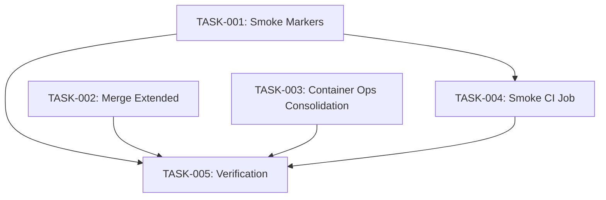

# Technical Design: test-suite-reduction

## Metadata
- **Feature**: test-suite-reduction
- **Status**: DRAFT
- **Created**: 2026-02-06
- **Author**: Factory Design Mode

---

## 1. Overview

### 1.1 Summary
Complete remaining test infrastructure work: mark smoke tests (0 -> 25), add smoke CI job, consolidate launcher tests (8 -> 4 files), deduplicate ~75 tests. Builds on cleanup (PR #155) and optimization phases 1-2.

### 1.2 Goals
- Activate smoke test tier (25-30 tests, < 30s)
- Add smoke CI gate for fast-fail before 2-min test shards
- Consolidate launcher test files from 8 to 4
- Remove ~75 duplicated test methods across launcher files

### 1.3 Non-Goals
- test_worker_protocol.py consolidation
- Further test_debug_cmd.py parameterization (already done)
- E2E/pressure test changes
- Smart test selection

---

## 2. Architecture

### 2.1 CI Pipeline (After)

```
quality -> smoke (~10s) -> test (2 shards, ~2min) + audit
```

### 2.2 Launcher Test File Mapping

```
Source Module                    Test File (After)
---------------------           ----------------------------------
launcher_types.py          -->  test_launcher.py (+ extended merge)
env_validator.py           -->  test_launcher.py
launchers/container.py     -->  test_launcher_container_ops.py (NEW)
launchers/base.py async    -->  test_launcher_coverage.py (keep)
launcher_configurator.py   -->  test_launcher_configurator.py (keep)
```

Files deleted: test_launcher_extended.py, test_launcher_errors.py, test_launcher_process.py, test_launcher_network.py, test_launcher_exec.py

---

## 3. Key Decisions

### 3.1 Smoke Test Count: 25-30

**Rationale**: Large enough for meaningful coverage of critical path (config, types, state, CLI, graph validation). Small enough to stay under 30s. Can expand later.

### 3.2 Launcher Consolidation: 4 Files (Not 3)

**Rationale**: test_launcher_coverage.py (1,253 LOC) tests async helpers and subprocess edge cases distinct from both type tests and container ops. Merging into test_launcher.py would create a ~3,400 LOC file. 4 files maps cleanly to source modules.

### 3.3 StackTraceAnalyzer Parameterization: Skipped

**Rationale**: Already done (lines 474-529 of test_debug_cmd.py). 31 cases in single @pytest.mark.parametrize.

---

## 4. Duplicate Classes Identified

| Class | Appears In | Keep In |
|-------|-----------|---------|
| TestValidateEnvVars | test_launcher, test_launcher_extended, test_command_executor | test_launcher |
| TestLauncherConfig | test_launcher, test_launcher_extended | test_launcher |
| TestSpawnResult | test_launcher, test_launcher_extended | test_launcher |
| TestWorkerHandle | test_launcher, test_launcher_extended, test_worker_lifecycle | test_launcher (keep lifecycle copy too) |
| TestLauncherType | test_launcher, test_launcher_extended | test_launcher |
| TestCleanupFailedContainer | test_launcher_process, test_launcher_network | test_launcher_container_ops |
| TestExecWorkerEntry* | test_launcher_process, test_launcher_errors | test_launcher_container_ops |
| TestVerifyWorkerProcess* | test_launcher_process, test_launcher_errors | test_launcher_container_ops |

---

## 5. Implementation Plan

### 5.1 Phase Summary

| Level | Tasks | Parallel | Est. Time |
|-------|-------|----------|-----------|
| 1 Foundation | 3 | Yes | 12 min |
| 2 CI Integration | 1 | No | 5 min |
| 3 Verification | 1 | No | 8 min |

### 5.2 File Ownership

| File | Task | Operation |
|------|------|-----------|
| tests/unit/test_config.py | TASK-001 | modify (smoke marker) |
| tests/unit/test_types.py | TASK-001 | modify (smoke marker) |
| tests/unit/test_exceptions.py | TASK-001 | modify (smoke marker) |
| tests/unit/test_graph_validation.py | TASK-001 | modify (smoke marker) |
| tests/unit/test_state.py | TASK-001 | modify (smoke marker) |
| tests/unit/test_cli.py | TASK-001 | modify (smoke marker) |
| tests/unit/test_parser.py | TASK-001 | modify (smoke marker) |
| tests/unit/test_constants.py | TASK-001 | modify (smoke marker) |
| tests/unit/test_launcher.py | TASK-001 + TASK-002 | modify (markers + merge) |
| tests/unit/test_command_executor.py | TASK-002 | modify (remove dup class) |
| tests/unit/test_launcher_extended.py | TASK-002 | delete |
| tests/unit/test_launcher_container_ops.py | TASK-003 | create |
| tests/unit/test_launcher_errors.py | TASK-003 | delete |
| tests/unit/test_launcher_process.py | TASK-003 | delete |
| tests/unit/test_launcher_network.py | TASK-003 | delete |
| tests/unit/test_launcher_exec.py | TASK-003 | delete |
| .github/workflows/ci.yml | TASK-004 | modify |
| CHANGELOG.md | TASK-005 | modify |
| .test_durations | TASK-005 | modify |

### 5.3 Dependency Graph



### 5.4 Conflict Note

TASK-001 and TASK-002 both modify test_launcher.py but in non-overlapping sections:
- TASK-001: Adds `@pytest.mark.smoke` decorators to existing TestLauncherType/TestLauncherConfig
- TASK-002: Adds new classes merged from test_launcher_extended.py

Low severity, non-conflicting edits.

---

## 6. Risk Assessment

| Risk | Probability | Impact | Mitigation |
|------|-------------|--------|------------|
| Launcher merge loses unique assertions | Low | High | Diff test counts before/after per class |
| Smoke suite > 30s | Low | Low | Use .test_durations to pick fastest tests |
| TASK-001/002 conflict on test_launcher.py | Low | Medium | Non-overlapping sections, different classes |
| CI smoke job fails on empty marker set | N/A | N/A | TASK-004 depends on TASK-001 |

---

## 7. Testing Strategy

- Each consolidation task runs pytest on modified files as verification
- TASK-005 runs full test suite with `--ignore=tests/e2e --ignore=tests/pressure -m "not slow"`
- TASK-005 runs `python -m mahabharatha.validate_commands` for wiring check
- Smoke suite verified: `pytest -m smoke -x --timeout=5 -q`

---

## 8. Parallel Execution Notes

- **Level 1**: 3 workers (TASK-001, TASK-002, TASK-003) — fully parallel
- **Level 2**: 1 worker (TASK-004) — needs smoke markers from L1
- **Level 3**: 1 worker (TASK-005) — final verification
- **Optimal workers**: 3
- **Single worker**: ~25 min
- **With 3 workers**: ~18 min

---

## 9. Expected Outcomes

| Metric | Before | After |
|--------|--------|-------|
| Launcher test files | 8 | 4 |
| Launcher test LOC | ~6,508 | ~4,500 |
| Duplicate test classes | 7+ | 0 |
| Smoke tests marked | 0 | 25-30 |
| Smoke CI job | No | Yes |
| CI fast-fail path | None | ~10s |

---

## 10. Approval

| Role | Name | Date | Signature |
|------|------|------|-----------|
| Architecture | | | PENDING |
| Engineering | | | PENDING |
