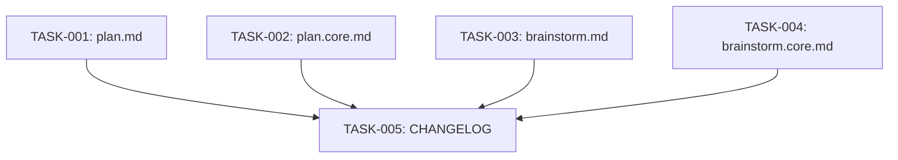

# Technical Design: wire-brainstorm-output-to-plans-phase-1

## Metadata
- **Feature**: wire-brainstorm-output-to-plans-phase-1
- **Status**: DRAFT
- **Created**: 2026-02-14
- **Author**: Factory Design Mode

---

## 1. Overview

### 1.1 Summary
Wire brainstorm-generated GitHub issues into the plan command so discovery work flows into requirements gathering without re-asking. Plan gains a `--issue N` flag that loads issue context and reduces redundant Phase 2 questions. Brainstorm's handoff suggests the flag automatically.

### 1.2 Goals
- Plan accepts `--issue N` / `#N` to load GitHub issue context (R4)
- Plan Phase 1 reads issue via `gh issue view N` when flag provided (R5)
- Plan Phase 2 reduces redundant questions when issue context present (R6)
- Brainstorm Phase 4 handoff includes issue number in suggested command (R7)

### 1.3 Non-Goals
- Pointer files or custom artifact formats
- Changes to brainstorm's issue creation (Phase 3)
- Changes to design.md or downstream commands
- Python code changes (command-file-only)
- Auto-populating requirements.md from issue data

---

## 2. Architecture

### 2.1 High-Level Design

```
┌─────────────────┐          ┌─────────────────┐
│  /z:brainstorm   │          │    /z:plan       │
│                  │          │                  │
│  Phase 3: Issues │──gh──▶  │  Phase 1: Load   │
│  (creates #42)   │  issue  │  (reads #42)     │
│                  │  ref    │                  │
│  Phase 4: Handoff│─────▶   │  Phase 2: Elicit │
│  "run /z:plan    │  CLI    │  (skip answered  │
│   --issue 42"    │  hint   │   questions)     │
└─────────────────┘          └─────────────────┘
```

The bridge is a CLI flag (`--issue N`) passed from brainstorm's handoff output to plan's invocation. No shared state files, no new infrastructure — just `gh issue view` at plan startup.

### 2.2 Component Breakdown

| Component | Responsibility | Files |
|-----------|---------------|-------|
| Plan flag parsing | Extract `--issue N` / `#N` from arguments | plan.md, plan.core.md |
| Plan issue loading | Run `gh issue view N`, parse output | plan.md, plan.core.md |
| Plan context-aware elicitation | Acknowledge issue content, reduce questions | plan.md, plan.core.md |
| Brainstorm handoff | Include issue number in suggested command | brainstorm.md, brainstorm.core.md |

### 2.3 Data Flow

1. **Brainstorm** creates GitHub issues via `gh issue create` (existing behavior)
2. **Brainstorm Phase 4** outputs: `Run /z:plan {feature} --issue {N}`
3. User manually runs `/z:plan {feature} --issue {N}`
4. **Plan Pre-Flight** extracts issue number from `--issue N` or `#N`
5. **Plan Phase 1** runs `gh issue view N` to read title, body, labels
6. **Plan Phase 2** acknowledges issue content, asks only about gaps

---

## 3. Detailed Design

### 3.1 Flag Parsing (R4)

Add to Pre-Flight section of plan.md / plan.core.md:

```bash
# Extract issue number from --issue N or #N shorthand
ISSUE_NUM=""
if [[ "$ARGUMENTS" =~ --issue[[:space:]]+([0-9]+) ]]; then
  ISSUE_NUM="${BASH_REMATCH[1]}"
elif [[ "$ARGUMENTS" =~ \#([0-9]+) ]]; then
  ISSUE_NUM="${BASH_REMATCH[1]}"
fi
```

Add `--issue N` to the Flags section and Help section.

### 3.2 Issue Loading (R5)

New first step in Phase 1 — Context Gathering:

```markdown
0. **Check for issue context** — If `--issue N` or `#N` was provided:
   - Run `gh issue view $ISSUE_NUM` to read the issue
   - Parse title, body, labels, and acceptance criteria
   - Store as issue context for Phase 2
   - Output: "Found GitHub issue #N: '{title}'. Loading brainstorm context..."
   - If `--issue` not provided, skip this step (backward compatible)
```

### 3.3 Context-Aware Elicitation (R6)

Advisory paragraph added to Phase 2:

When issue context is loaded, plan should:
- Summarize what the issue already captured
- Output: "Issue #N already covers: [list]. Asking about gaps only."
- Focus on areas the issue didn't cover

This is advisory (model uses judgment), not prescriptive.

### 3.4 Brainstorm Handoff (R7)

Update Phase 4 AskUserQuestion to include `--issue {top-issue-number}` in the suggested `/z:plan` command, and update the response output string.

---

## 4. Key Decisions

### Decision: CLI Flag vs. Shared State File

**Context**: Need to pass context from brainstorm to plan.

**Options Considered**:
1. CLI flag (`--issue N`): User passes issue number explicitly
2. Shared state file: Brainstorm writes a pointer file that plan reads
3. Auto-detection: Plan searches for recent issues automatically

**Decision**: CLI flag (`--issue N`)

**Rationale**: Simplest approach. No new state files. User has full control. Backward compatible. The `gh` CLI is already a brainstorm dependency.

**Consequences**: User must copy the issue number from brainstorm output. This is acceptable since brainstorm's handoff will suggest the exact command.

### Decision: Mirror Changes Across Split Files

**Context**: plan.md/plan.core.md and brainstorm.md/brainstorm.core.md are split pairs with identical core content.

**Options Considered**:
1. Edit parent only, regenerate core: Requires split tooling
2. Edit both files independently: More tasks but straightforward
3. Edit parent, manually sync core: Risk of inconsistency

**Decision**: Edit both files independently with identical spec

**Rationale**: Each worker gets an explicit spec describing exact changes. Verification commands diff the files to catch inconsistencies.

**Consequences**: 4 tasks instead of 2, but each is small and all run in parallel.

---

## 5. Implementation Plan

### 5.1 Phase Summary

| Phase | Tasks | Parallel | Est. Time |
|-------|-------|----------|-----------|
| Foundation (L1) | 4 | Yes | 10 min |
| Quality (L2) | 1 | No | 5 min |

### 5.2 File Ownership

| File | Task ID | Operation |
|------|---------|-----------|
| mahabharatha/data/commands/plan.md | TASK-001 | modify |
| mahabharatha/data/commands/plan.core.md | TASK-002 | modify |
| mahabharatha/data/commands/brainstorm.md | TASK-003 | modify |
| mahabharatha/data/commands/brainstorm.core.md | TASK-004 | modify |
| CHANGELOG.md | TASK-005 | modify |

### 5.3 Dependency Graph



---

## 6. Risk Assessment

| Risk | Probability | Impact | Mitigation |
|------|-------------|--------|------------|
| plan.md / plan.core.md drift out of sync | Low | Med | Verification diffs the two files' shared sections |
| brainstorm.md / brainstorm.core.md drift | Low | Med | Same diff-based verification |
| `gh` CLI not installed | Low | Low | Already handled by brainstorm pre-flight; plan adds same check |

---

## 7. Testing Strategy

### 7.1 Verification Commands
Each task has a verification command that checks the edits are present:
- TASK-001/002: grep for `--issue` in plan files
- TASK-003/004: grep for `--issue` in brainstorm files
- TASK-005: grep for `[Unreleased]` entries in CHANGELOG

### 7.2 Consistency Check
After all L1 tasks complete, diff plan.md vs plan.core.md shared sections and brainstorm.md vs brainstorm.core.md shared sections.

---

## 8. Parallel Execution Notes

### 8.1 Safe Parallelization
- All 4 L1 tasks modify different files — fully parallel
- L2 task (CHANGELOG) depends on all L1 tasks

### 8.2 Recommended Workers
- Minimum: 1 worker (sequential)
- Optimal: 4 workers (widest level = 4)
- Maximum: 4 workers (only 4 L1 tasks)

### 8.3 Estimated Duration
- Single worker: ~15 min
- With 4 workers: ~7 min
- Speedup: ~2x

---

## 9. Approval

| Role | Name | Date | Signature |
|------|------|------|-----------|
| Architecture | | | PENDING |
| Engineering | | | PENDING |
