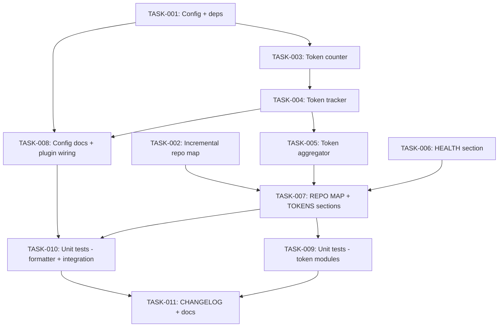

# Technical Design: worker-observability

## Metadata
- **Feature**: worker-observability
- **Status**: APPROVED
- **Created**: 2026-02-02
- **Author**: MAHABHARATHA Design Mode

---

## 1. Overview

### 1.1 Summary
Close remaining gaps on issues #27 (worker health) and #30 (repo map), then build the token usage metrics subsystem (#24). PR #95 delivered heartbeat, escalation, verification tiers, and repo map modules. This feature wires them into `/mahabharatha:status` display, adds incremental repo map indexing, and creates token counting/tracking/aggregation with an optional Anthropic SDK integration.

### 1.2 Goals
- Per-worker HEALTH, REPO MAP, and TOKEN USAGE dashboard sections in `/mahabharatha:status`
- Token counting with optional Anthropic SDK (off by default, heuristic fallback)
- Incremental repo map re-indexing (hash-based staleness)
- Close issues #27, #30, #24

### 1.3 Non-Goals
- Runtime token tracking inside worker subprocess (only pre-flight estimation)
- Auto-generating CHANGELOG content
- TUI dashboard implementation (#32 — separate issue)

---

## 2. Architecture

### 2.1 High-Level Design

```
┌──────────────┐     ┌──────────────┐     ┌──────────────────┐
│ TokenCounter │────▶│ TokenTracker │────▶│ TokenAggregator  │
│ (count/est)  │     │ (per-worker) │     │ (cumulative)     │
└──────────────┘     └──────────────┘     └──────────────────┘
                                                   │
       ┌───────────────┐    ┌──────────────┐       │
       │ HeartbeatMon  │    │ RepoMap      │       │
       │ (existing)    │    │ +Incremental │       │
       └───────┬───────┘    └──────┬───────┘       │
               │                   │               │
               ▼                   ▼               ▼
         ┌─────────────────────────────────────────────┐
         │           StatusFormatter                    │
         │  format_health_table()                       │
         │  format_repo_map_stats()                     │
         │  format_token_table() + format_savings()     │
         └──────────────────┬──────────────────────────┘
                            │
                            ▼
                  ┌──────────────────┐
                  │ status.core.md   │
                  │ (dashboard tmpl) │
                  └──────────────────┘
```

### 2.2 Component Breakdown

| Component | Responsibility | Files |
|-----------|---------------|-------|
| TokenMetricsConfig | Config for token counting mode, cache, heuristic | `mahabharatha/config.py` |
| TokenCounter | Count tokens via API or heuristic, with caching | `mahabharatha/token_counter.py` |
| TokenTracker | Per-worker token state files | `mahabharatha/token_tracker.py` |
| TokenAggregator | Aggregate across workers, calculate savings | `mahabharatha/token_aggregator.py` |
| IncrementalIndex | Hash-based repo map re-indexing | `mahabharatha/repo_map.py` |
| StatusFormatter | ASCII table formatting for all dashboard sections | `mahabharatha/status_formatter.py` |

### 2.3 Data Flow
1. Context plugin builds worker context (command template + task context + repo map + security rules)
2. TokenCounter estimates token count (API with cache or heuristic)
3. TokenTracker writes per-task breakdown to `.mahabharatha/state/tokens-{worker_id}.json`
4. TokenAggregator reads all worker files, computes totals and savings
5. StatusFormatter reads heartbeat, escalation, repo map index, and token data
6. `/mahabharatha:status` displays formatted sections

---

## 3. Key Decisions

### 3.1 Token Counting Mode

**Context**: Anthropic SDK count_tokens() is an API call requiring ANTHROPIC_API_KEY.

**Decision**: Optional, off by default. Three modes:
1. `api_counting=False` (default): heuristic (chars / 4.0), marked "(estimated)"
2. `api_counting=True` + anthropic installed: API with SHA256 cache, marked "(exact)"
3. `api_counting=True` + anthropic missing: log warning once, heuristic fallback

**Rationale**: Never block execution. Token metrics are informational. Users opt in.

### 3.2 Optional Dependency

**Context**: Adding anthropic as a hard dependency would require API keys for basic MAHABHARATHA usage.

**Decision**: `pip install mahabharatha[metrics]` optional extra. Lazy `try: import anthropic` pattern.

**Rationale**: Core MAHABHARATHA must work without API keys. Token counting is a bonus.

### 3.3 Status Formatter as Separate Module

**Context**: status.core.md is a command template (markdown), not Python code.

**Decision**: Create `mahabharatha/status_formatter.py` with pure functions that format data into ASCII tables. The status command template references these formatters.

**Rationale**: Testable Python code. Reusable across CLI and slash command.

---

## 4. Implementation Plan

### 4.1 Phase Summary

| Phase | Tasks | Parallel |
|-------|-------|----------|
| Foundation (L1) | 2 | Yes |
| Core (L2) | 3 | Partially (003→004→005 sequential) |
| Integration (L3) | 3 | Partially (006→007 sequential, 008 parallel) |
| Testing (L4) | 2 | Yes |
| Quality (L5) | 1 | No |

### 4.2 File Ownership

| File | Task ID | Operation |
|------|---------|-----------|
| `pyproject.toml` | TASK-001 | modify |
| `requirements.txt` | TASK-001 | modify |
| `mahabharatha/config.py` | TASK-001 | modify |
| `mahabharatha/repo_map.py` | TASK-002 | modify |
| `mahabharatha/token_counter.py` | TASK-003 | create |
| `mahabharatha/token_tracker.py` | TASK-004 | create |
| `mahabharatha/token_aggregator.py` | TASK-005 | create |
| `mahabharatha/status_formatter.py` | TASK-006 | create (TASK-007 extends) |
| `mahabharatha/data/commands/status.core.md` | TASK-006 | modify (TASK-007 extends) |
| `mahabharatha/context_plugin.py` | TASK-008 | modify |
| `docs/configuration.md` | TASK-008 | modify |
| `tests/unit/test_token_counter.py` | TASK-009 | create |
| `tests/unit/test_token_tracker.py` | TASK-009 | create |
| `tests/unit/test_token_aggregator.py` | TASK-009 | create |
| `tests/unit/test_status_formatter.py` | TASK-010 | create |
| `tests/integration/test_token_metrics_wiring.py` | TASK-010 | create |
| `tests/integration/test_repo_map_incremental_wiring.py` | TASK-010 | create |
| `CHANGELOG.md` | TASK-011 | modify |
| `docs/commands.md` | TASK-011 | modify |
| `README.md` | TASK-011 | modify |

### 4.3 Consumer Matrix

| Task | Creates | Consumed By | Integration Test |
|------|---------|-------------|-----------------|
| TASK-001 | TokenMetricsConfig in config.py | TASK-003, TASK-008 | tests/integration/test_token_metrics_wiring.py |
| TASK-002 | IncrementalIndex in repo_map.py | TASK-007 | tests/integration/test_repo_map_incremental_wiring.py |
| TASK-003 | mahabharatha/token_counter.py | TASK-004 | tests/integration/test_token_metrics_wiring.py |
| TASK-004 | mahabharatha/token_tracker.py | TASK-005, TASK-008 | tests/integration/test_token_metrics_wiring.py |
| TASK-005 | mahabharatha/token_aggregator.py | TASK-007 | tests/integration/test_token_metrics_wiring.py |
| TASK-006 | mahabharatha/status_formatter.py | TASK-007 | tests/unit/test_status_formatter.py |
| TASK-007 | — (extends status_formatter) | leaf | — |
| TASK-008 | — (wiring only) | leaf | — |
| TASK-009 | test files | leaf | — |
| TASK-010 | test files | leaf | — |
| TASK-011 | docs | leaf | — |

### 4.4 Dependency Graph



---

## 5. Risk Assessment

| Risk | Probability | Impact | Mitigation |
|------|-------------|--------|------------|
| Anthropic SDK API changes | Low | Low | Wrapped in TokenCounter abstraction, lazy import |
| Token count heuristic inaccuracy | Medium | Low | Informational only, labeled "(estimated)" |
| status.core.md conflict (006→007 sequential) | Low | Medium | Enforced sequential execution in task graph |

---

## 6. Testing Strategy

### 6.1 Unit Tests
- TokenCounter: mock anthropic, test 3 modes, cache hit/miss, error handling
- TokenTracker: atomic writes, per-task breakdown, file corruption handling
- TokenAggregator: multi-worker aggregation, savings math, empty data
- StatusFormatter: table formatting, column alignment, empty/missing data

### 6.2 Integration Tests
- Token metrics pipeline: count → track → aggregate → format
- Repo map incremental: initial index → modify file → re-index → verify selective parse

### 6.3 Verification Commands
- `pytest tests/unit/ -v`
- `pytest tests/integration/ -v`
- `python -m mahabharatha.validate_commands`
