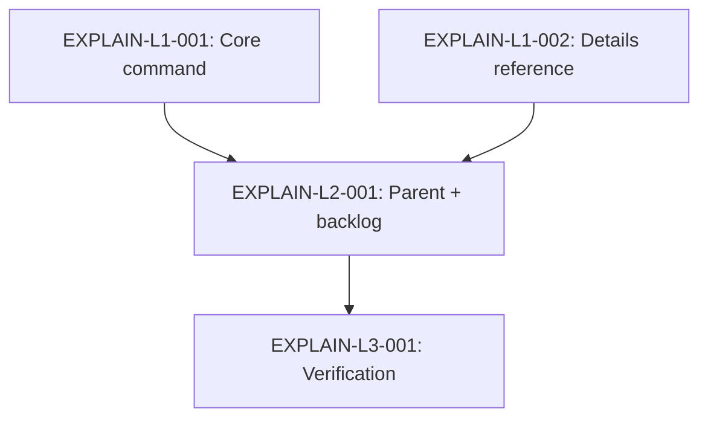

# Technical Design: mahabharatha-explain

## Metadata
- **Feature**: mahabharatha-explain
- **Status**: APPROVED
- **Created**: 2026-01-31
- **Author**: Factory Design Mode

---

## 1. Overview

### 1.1 Summary
Create `/mahabharatha:explain` as a split command (core + details + parent) that produces 4-layer educational code explanations. Leverages existing `mahabharatha/doc_engine/` extractors (SymbolExtractor, DependencyMapper, ComponentDetector, MermaidGenerator) via `python -c` snippets for structured AST data. All 4 layers always displayed. Optional `--save` writes markdown to `claudedocs/explanations/`.

### 1.2 Goals
- 4-layer explanations: Summary, Logic Flow, Implementation Details, Design Decisions
- Progressive scope auto-detection: function → file → module → system
- Reuse doc_engine extractors for AST-powered analysis
- Mermaid diagrams for logic flow visualization
- Optional save to markdown files

### 1.3 Non-Goals
- No new Python modules (command-file only)
- No git history analysis for design decisions
- No interactive/REPL mode

---

## 2. Architecture

### 2.1 High-Level Design

```
User invokes /mahabharatha:explain target
        │
        ▼
┌─────────────────┐
│  Pre-Flight     │  Parse target, detect scope, set vars
└────────┬────────┘
         │
         ▼
┌─────────────────┐
│  python -c      │  Extract symbols, deps, component type
│  (doc_engine)   │  via SymbolExtractor, DependencyMapper,
└────────┬────────┘  ComponentDetector
         │
         ▼
┌─────────────────┐
│  Claude Analysis│  Generate 4-layer explanation using
│  (native)       │  extracted data + source code reading
└────────┬────────┘
         │
         ▼
┌─────────────────┐
│  Output         │  Terminal display + optional --save
└─────────────────┘
```

### 2.2 Component Breakdown

| Component | Responsibility | Files |
|-----------|---------------|-------|
| Core command | Flags, pre-flight, workflow, task tracking | `mahabharatha:explain.core.md` |
| Details reference | Templates, snippets, schemas, edge cases | `mahabharatha:explain.details.md` |
| Parent command | Backward-compat entry point (= core) | `mahabharatha:explain.md` |

### 2.3 Data Flow
1. User provides target (file path, function ref, module)
2. Pre-flight detects scope and resolves target to file path(s)
3. `python -c` extracts structured data (symbols, deps, component type)
4. Claude reads source code + structured data
5. Claude generates 4-layer explanation with Mermaid diagrams
6. Output to terminal; if `--save`, also write to `claudedocs/explanations/`

---

## 3. Key Decisions

### 3.1 All Layers Always Shown
**Context**: Could show layers progressively or all at once.
**Decision**: Always show all 4 layers.
**Rationale**: User preference. Avoids repeated invocations. Each layer is distinct enough to scan independently.

### 3.2 Command-File Only
**Context**: Could create new Python module or use existing `.mahabharatha/explain.py`.
**Decision**: Command-file only, reusing doc_engine via `python -c`.
**Rationale**: Follows mahabharatha:estimate pattern. doc_engine already has all needed extractors. No new code to maintain.

### 3.3 Code Patterns for Design Decisions (L4)
**Context**: Could use git history, comments/docstrings, or code patterns.
**Decision**: Code patterns only.
**Rationale**: No git dependency. Patterns (ABC, Protocol, generics, decorators) are visible in AST data. More reliable than commit messages.

---

## 4. Implementation Plan

### 4.1 Phase Summary

| Phase | Tasks | Parallel | Description |
|-------|-------|----------|-------------|
| Foundation (L1) | 2 | Yes | Core + details command files |
| Integration (L2) | 1 | No | Parent file + backlog update |
| Verification (L3) | 1 | No | Drift detection + consistency checks |

### 4.2 File Ownership

| File | Task ID | Operation |
|------|---------|-----------|
| `mahabharatha/data/commands/mahabharatha:explain.core.md` | EXPLAIN-L1-001 | create |
| `mahabharatha/data/commands/mahabharatha:explain.details.md` | EXPLAIN-L1-002 | create |
| `mahabharatha/data/commands/mahabharatha:explain.md` | EXPLAIN-L2-001 | create |
| `claudedocs/backlog.md` | EXPLAIN-L2-001 | modify |

### 4.3 Dependency Graph



---

## 5. Risk Assessment

| Risk | Probability | Impact | Mitigation |
|------|-------------|--------|------------|
| doc_engine import failure in python -c | Low | Medium | Fallback: Claude reads source directly |
| Output too verbose for terminal | Medium | Low | Structured sections make scanning easy |

---

## 6. Parallel Execution Notes

### 6.1 Safe Parallelization
- L1: T1 and T2 create different files, fully parallel
- L2: Single task, depends on both L1 tasks
- L3: Single task, depends on L2

### 6.2 Recommended Workers
- Optimal: 2 workers (L1 parallelism)
- Maximum useful: 2 (only 2 tasks at widest level)

---

## 7. Approval

| Role | Name | Date | Signature |
|------|------|------|-----------|
| Architecture | Factory Design | 2026-01-31 | APPROVED |
