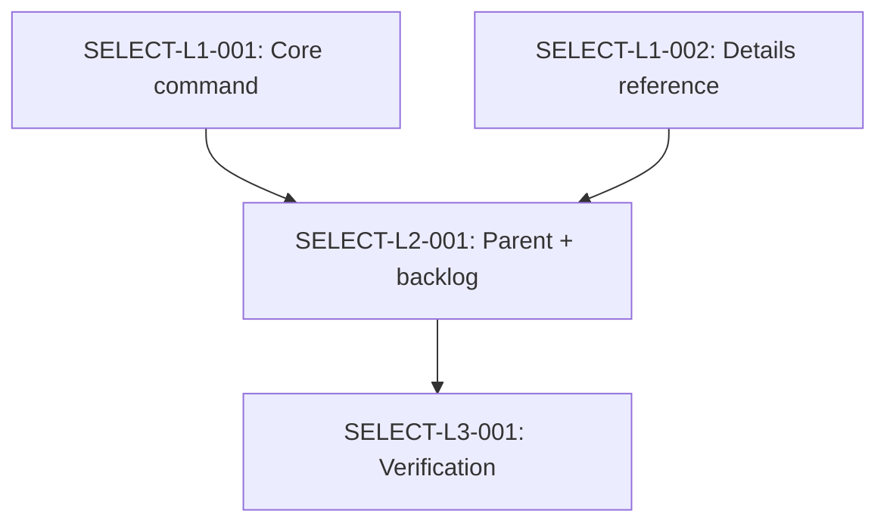

# Technical Design: mahabharatha-select-tool

## Metadata
- **Feature**: mahabharatha-select-tool
- **Status**: APPROVED
- **Created**: 2026-01-31
- **Author**: Factory Design Mode

---

## 1. Overview

### 1.1 Summary
Create `/mahabharatha:select-tool` as a split command (core + details + parent) that provides intelligent tool routing across MCP servers, native Claude tools, and Task agent subtypes. Multi-dimensional complexity scoring (5 axes) produces ranked recommendations with fallbacks. Tool capability database loaded from `.mahabharatha/config.yaml` with hardcoded defaults as fallback.

### 1.2 Goals
- Multi-dimensional scoring: file_count, analysis_depth, domain, parallelism, interactivity
- Ranked recommendations with confidence percentages and rationale
- Fallback chains when preferred tools unavailable
- Coverage of MCP servers + native tools + Task agent subtypes
- Config-driven tool capability database

### 1.3 Non-Goals
- No new Python modules (command-file only)
- No runtime tool availability checking
- No automatic tool invocation (recommendations only)

---

## 2. Architecture

### 2.1 High-Level Design

```
User invokes /mahabharatha:select-tool [task description]
        │
        ▼
┌─────────────────┐
│  Pre-Flight     │  Parse task description, detect domain, set flags
└────────┬────────┘
         │
         ▼
┌─────────────────┐
│  Score Task     │  Rate 5 axes (0.0-1.0), compute weighted composite
└────────┬────────┘
         │
         ▼
┌─────────────────┐
│  Match Tools    │  Map composite score + domain to tool candidates
└────────┬────────┘
         │
         ▼
┌─────────────────┐
│  Rank & Output  │  Ranked list with confidence, rationale, fallbacks
└─────────────────┘
```

### 2.2 Component Breakdown

| Component | Responsibility | Files |
|-----------|---------------|-------|
| Core command | Flags, pre-flight, scoring workflow, output format, task tracking | `mahabharatha:select-tool.core.md` |
| Details reference | Tool matrix, scoring formulas, agent guide, config schema, examples | `mahabharatha:select-tool.details.md` |
| Parent command | Backward-compat entry point (= core) | `mahabharatha:select-tool.md` |

### 2.3 Data Flow
1. User provides task description + optional flags
2. Pre-flight parses description, auto-detects domain from keywords
3. Score each of 5 axes based on task characteristics
4. Compute weighted composite: `(file×0.2) + (depth×0.3) + (domain×0.2) + (parallel×0.15) + (interactive×0.15)`
5. Map score tiers to tool categories, rank candidates by fit
6. Output ranked list with rationale; if `--verbose`, show scoring breakdown

---

## 3. Key Decisions

### 3.1 Multi-Dimensional Over Single Score
**Context**: Could use a single complexity number or multiple axes.
**Decision**: 5 independent axes with weighted composite.
**Rationale**: Different tool strengths map to different dimensions. A high-interactivity task needs Playwright regardless of file count.

### 3.2 Command-File Only
**Context**: Could create Python scoring module or use command-file.
**Decision**: Command-file only, Claude applies scoring natively.
**Rationale**: Follows mahabharatha:explain/estimate pattern. No new code to maintain. Claude can evaluate the scoring matrix from markdown instructions.

### 3.3 Config With Hardcoded Fallback
**Context**: Could require config, hardcode everything, or use config with fallback.
**Decision**: Load from `.mahabharatha/config.yaml` if available, fall back to hardcoded defaults.
**Rationale**: Works out-of-box without config. Config allows customization for projects with specific MCP setups.

---

## 4. Implementation Plan

### 4.1 Phase Summary

| Phase | Tasks | Parallel | Description |
|-------|-------|----------|-------------|
| Foundation (L1) | 2 | Yes | Core + details command files |
| Integration (L2) | 1 | No | Parent file + backlog update |
| Verification (L3) | 1 | No | Drift detection + consistency checks |

### 4.2 File Ownership

| File | Task ID | Operation |
|------|---------|-----------|
| `mahabharatha/data/commands/mahabharatha:select-tool.core.md` | SELECT-L1-001 | create |
| `mahabharatha/data/commands/mahabharatha:select-tool.details.md` | SELECT-L1-002 | create |
| `mahabharatha/data/commands/mahabharatha:select-tool.md` | SELECT-L2-001 | create |
| `claudedocs/backlog.md` | SELECT-L2-001 | modify |

### 4.3 Dependency Graph



---

## 5. Risk Assessment

| Risk | Probability | Impact | Mitigation |
|------|-------------|--------|------------|
| Scoring formulas too rigid | Medium | Low | Claude interprets flexibly; users can override with --domain |
| Config schema not present | Low | Low | Hardcoded defaults cover all standard MCP servers |

---

## 6. Parallel Execution Notes

### 6.1 Safe Parallelization
- L1: T1 and T2 create different files, fully parallel
- L2: Single task, depends on both L1 tasks
- L3: Single task, depends on L2

### 6.2 Recommended Workers
- Optimal: 2 workers (L1 parallelism)
- Maximum useful: 2 (only 2 tasks at widest level)

---

## 7. Approval

| Role | Name | Date | Signature |
|------|------|------|-----------|
| Architecture | Factory Design | 2026-01-31 | APPROVED |
