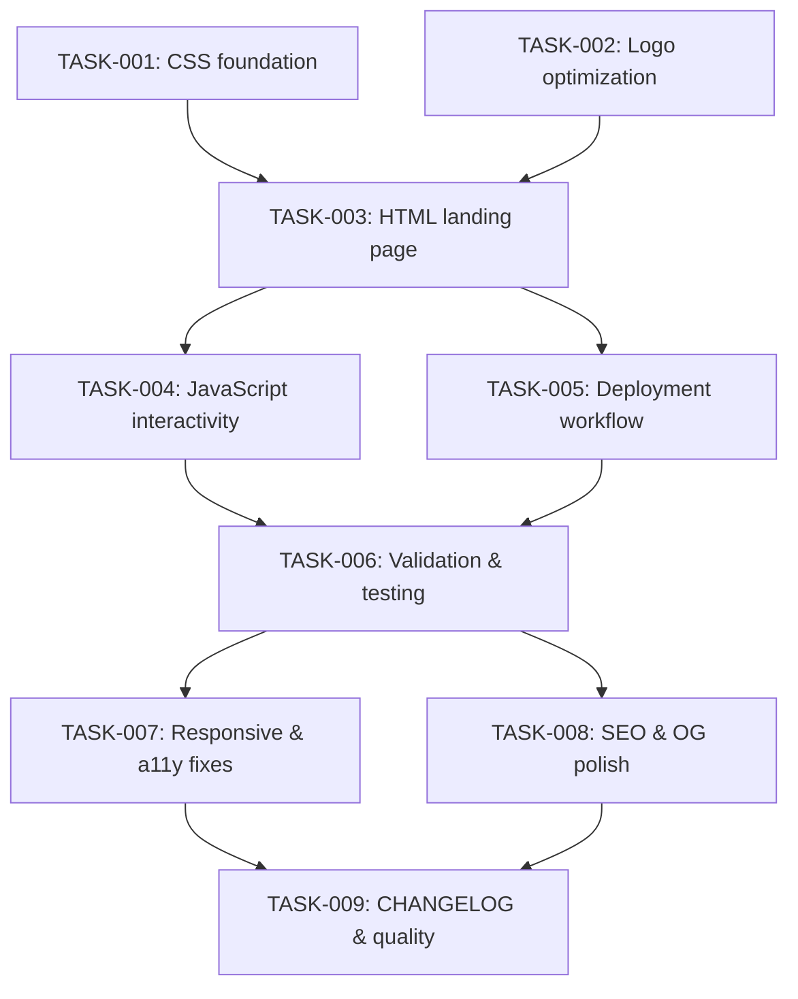

# Technical Design: mahabharatha-website

## Metadata
- **Feature**: mahabharatha-website
- **Status**: DRAFT
- **Created**: 2026-02-07
- **Author**: Factory Design Mode
- **Epic**: #204

---

## 1. Overview

### 1.1 Summary
Single-page landing site replacing the MkDocs homepage at `rocklambros.github.io/mahabharatha/`. Pure HTML + Tailwind CDN + vanilla JS. Dark-first with light mode toggle. 9 sections (sticky nav, hero + 4 glass pillars, why, how, commands, quick start, stats, FAQ, footer). Deployed via modified GitHub Actions workflow. Existing markdown docs preserved at sub-paths.

### 1.2 Goals
- Visually compelling landing page communicating MAHABHARATHA's value proposition
- All 26 commands in a cheat sheet table
- Dark/light mode with localStorage persistence
- Mobile-responsive (320px-2560px)
- Lighthouse Performance >90, Accessibility >95
- Zero build step, zero npm dependencies

### 1.3 Non-Goals
- Blog or dynamic content
- User accounts / analytics
- JavaScript frameworks
- Custom domain configuration (future)
- Build step / bundler

---

## 2. Architecture

### 2.1 High-Level Design

```
docs/
├── index.html              ← NEW: Landing page (replaces index.md as homepage)
├── assets/
│   ├── css/
│   │   └── custom.css      ← NEW: Glassmorphism, animations, dark/light vars
│   ├── js/
│   │   └── main.js         ← NEW: Toggle, copy, FAQ, scroll, nav, counters
│   └── img/
│       ├── mahabharatha-logo-web.png  ← NEW: Optimized logo (<200KB)
│       └── og-image.png       ← NEW: Open Graph 1200x630
├── commands-quick.md       (preserved)
├── commands-deep.md        (preserved)
├── tutorial-minerals-store.md  (preserved)
├── configuration.md        (preserved)
├── ...other existing .md   (preserved)
└── wiki/                   (preserved)
```

```
┌──────────────────────────────────────────────────────┐
│                  GitHub Pages CDN                     │
│    rocklambros.github.io/mahabharatha/                       │
├──────────────────────────────────────────────────────┤
│  index.html ──→ Tailwind Play CDN (pinned v3.4.17)  │
│       │                                               │
│       ├── assets/css/custom.css                       │
│       ├── assets/js/main.js                          │
│       └── assets/img/mahabharatha-logo-web.png               │
├──────────────────────────────────────────────────────┤
│  *.md files ──→ Served raw (no MkDocs build)         │
│  (GitHub renders .md natively, or link to wiki)      │
└──────────────────────────────────────────────────────┘
```

### 2.2 Component Breakdown

| Component | Responsibility | Files |
|-----------|---------------|-------|
| Landing Page | HTML structure, SEO meta, OG tags, all 9 sections | `docs/index.html` |
| Custom Styles | CSS variables for dark/light, glassmorphism, animations, responsive overrides | `docs/assets/css/custom.css` |
| Interactivity | Dark/light toggle, copy-to-clipboard, FAQ accordion, scroll animations, mobile nav, stat counters | `docs/assets/js/main.js` |
| Optimized Logo | Web-sized logo (<200KB) + OG image (1200x630) | `docs/assets/img/` |
| Deployment | GitHub Actions workflow uploading `docs/` directly | `.github/workflows/docs.yml` |

### 2.3 Data Flow

1. User visits `rocklambros.github.io/mahabharatha/` → GitHub Pages serves `docs/index.html`
2. Browser loads Tailwind Play CDN (pinned version) → applies utility classes
3. Browser loads `custom.css` → applies glassmorphism, CSS variables, animations
4. Browser loads `main.js` → initializes dark/light from localStorage, registers IntersectionObservers, binds event listeners
5. User interactions (scroll, click, toggle) handled entirely client-side
6. Existing doc links (`commands-quick.md`, etc.) served directly by GitHub Pages as raw markdown (GitHub renders these natively)

---

## 3. Detailed Design

### 3.1 HTML Structure (index.html)

```html
<!DOCTYPE html>
<html lang="en" class="dark scroll-smooth">
<head>
  <!-- SEO meta, OG tags, favicon, Tailwind CDN, custom.css -->
</head>
<body class="bg-slate-950 text-white transition-colors">
  <nav id="navbar"><!-- Sticky nav: logo, links, toggle, GitHub --></nav>
  <main>
    <section id="hero"><!-- Headline, subheadline, CTA, 4 glass cards --></section>
    <section id="why"><!-- Pain→solution pairs --></section>
    <section id="how"><!-- Plan→Design→Kurukshetra→Merge pipeline --></section>
    <section id="commands"><!-- 26-command cheat sheet table --></section>
    <section id="quickstart"><!-- 4-step code block --></section>
    <section id="stats"><!-- Animated counter cards --></section>
    <section id="faq"><!-- Accordion with details/summary --></section>
  </main>
  <footer><!-- Links, attribution, copyright --></footer>
  <script src="assets/js/main.js"></script>
</body>
</html>
```

### 3.2 CSS Architecture (custom.css)

```css
/* CSS Custom Properties for theming */
:root { /* light mode vars */ }
.dark { /* dark mode vars — default */ }

/* Glassmorphism card component */
.glass-card { backdrop-filter: blur(12px); ... }

/* Scroll animations */
.fade-in { opacity: 0; transform: translateY(20px); transition: ... }
.fade-in.visible { opacity: 1; transform: translateY(0); }

/* Pipeline visualization */
.pipeline { /* horizontal desktop, vertical mobile */ }

/* Code blocks with copy button */
.code-block { /* dark bg, syntax coloring, relative for copy btn */ }
```

### 3.3 JavaScript Modules (main.js)

```javascript
// Single IIFE, no modules needed
(function() {
  // 1. Dark/light toggle — reads/writes localStorage('theme')
  // 2. Mobile hamburger menu — toggle nav visibility
  // 3. Copy-to-clipboard — clipboard API with fallback
  // 4. FAQ accordion — toggle details open/close with animation
  // 5. Scroll animations — IntersectionObserver on .fade-in elements
  // 6. Stat counters — animate numbers on scroll into view
  // 7. Smooth scroll — anchor click handler with offset for sticky nav
  // 8. Active nav highlighting — IntersectionObserver on sections
})();
```

### 3.4 Deployment (docs.yml)

```yaml
# Key changes:
# - Remove python setup + mkdocs install + mkdocs build
# - Upload docs/ directly (not site/)
# - Keep path triggers on docs/**
# - Add trigger on .github/workflows/docs.yml itself
```

### 3.5 Logo Optimization

Using macOS `sips` (available locally):
- Resize to max 400px width: `sips -Z 400 --out docs/assets/img/mahabharatha-logo-web.png logo/zerg_logo.png`
- OG image: create 1200x630 dark bg with centered logo (can use sips + python PIL, or manual)

---

## 4. Key Decisions

### Decision: Tailwind Play CDN vs Local Tailwind

**Context**: Need CSS framework without build step.

**Options**:
1. Tailwind Play CDN: Zero build, pinned version, ~100KB gzipped
2. Local compiled CSS: Requires build step, smaller output, offline
3. No framework, raw CSS: Full control, more code, slower development

**Decision**: Tailwind Play CDN (pinned to v3.4.17)

**Rationale**: Zero build step is a hard requirement. CDN is reliable and fast via jsDelivr. Pin version to avoid breaking changes.

**Consequences**: Slight FOUC risk (mitigated with preload), dependency on CDN uptime (acceptable for docs site).

### Decision: Dark Mode Implementation

**Context**: Dark-first design with toggle.

**Options**:
1. Tailwind `dark:` class strategy with `.dark` on `<html>`
2. CSS custom properties only
3. `prefers-color-scheme` media query only

**Decision**: Tailwind `dark:` classes + CSS custom properties for glassmorphism colors

**Rationale**: Tailwind's dark variant handles most styling. Custom properties fill gaps (glassmorphism borders, glow effects). localStorage persistence for user choice.

**Consequences**: Need to set `darkMode: 'class'` via Tailwind config script tag.

### Decision: Existing Docs Access

**Context**: Markdown docs currently built by MkDocs need to remain accessible.

**Options**:
1. Keep MkDocs build for sub-paths, custom index.html for root
2. Drop MkDocs entirely, serve raw .md files (GitHub renders them)
3. Convert all .md to HTML pages

**Decision**: Drop MkDocs, serve raw .md + link to GitHub wiki for formatted docs

**Rationale**: GitHub renders .md natively when served from Pages. Eliminates MkDocs dependency. Wiki already has formatted versions. Simplifies deployment.

**Consequences**: Direct .md URLs work but render as plain markdown (no nav chrome). Wiki links provide the polished experience.

### Decision: FAQ Implementation

**Context**: Need expandable/collapsible FAQ section.

**Options**:
1. Native `<details>`/`<summary>` elements
2. Custom JS accordion
3. CSS-only accordion

**Decision**: Native `<details>`/`<summary>` with JS-enhanced animation

**Rationale**: Works without JS (graceful degradation). Semantic HTML. JS adds smooth height transitions.

**Consequences**: Slightly limited animation control vs custom implementation. Acceptable tradeoff.

---

## 5. Implementation Plan

### 5.1 Phase Summary

| Phase | Tasks | Parallel | Est. Time |
|-------|-------|----------|-----------|
| Foundation (L1) | 3 | Yes | 15 min |
| Core (L2) | 2 | Yes | 40 min |
| Integration (L3) | 2 | Yes | 30 min |
| Testing (L4) | 1 | No | 20 min |
| Quality (L5) | 1 | No | 15 min |
| **Total** | **9** | | **Single: ~120 min, 3 workers: ~55 min** |

### 5.2 File Ownership

| File | Task ID | Operation |
|------|---------|-----------|
| `docs/assets/css/custom.css` | TASK-001 | create |
| `docs/assets/img/mahabharatha-logo-web.png` | TASK-002 | create |
| `docs/assets/img/og-image.png` | TASK-002 | create |
| `docs/index.html` | TASK-003 | create |
| `docs/assets/js/main.js` | TASK-004 | create |
| `.github/workflows/docs.yml` | TASK-005 | modify |
| `docs/index.md` | TASK-005 | delete |
| `mkdocs.yml` | TASK-005 | delete |
| (Lighthouse/validation) | TASK-006 | read-only |
| (responsive/a11y fixes) | TASK-007 | modify index.html, custom.css |
| (SEO/OG + final fixes) | TASK-008 | modify index.html |
| `CHANGELOG.md` | TASK-009 | modify |

### 5.3 Dependency Graph



---

## 6. Risk Assessment

| Risk | Probability | Impact | Mitigation |
|------|-------------|--------|------------|
| Tailwind CDN slow/unavailable | Low | High | Pin CDN version, add `<link rel="preload">`, minimal critical CSS inline |
| GitHub Pages caches stale content | Medium | Low | Cache-busting query params on CSS/JS assets |
| Existing doc URLs break | Medium | High | Keep all .md files in docs/, add links from landing page |
| 7.3MB logo causes slow load | High | Medium | Optimize to <200KB with sips, lazy-load below fold |
| FOUC from Tailwind CDN load | Medium | Low | Preload hint, inline critical dark-mode CSS |
| .md files render unstyled | Low | Low | Link to wiki for formatted docs, acceptable for direct .md access |

---

## 7. Testing Strategy

### 7.1 Manual Validation
- Open `docs/index.html` locally in browser
- Verify all 9 sections render
- Test dark/light toggle + persistence
- Test copy-to-clipboard buttons
- Test FAQ accordion
- Test mobile hamburger menu (responsive resize)
- Verify scroll animations fire
- Check all 26 commands in table

### 7.2 Lighthouse Audit
- Performance >90
- Accessibility >95
- Best Practices >90
- SEO >90

### 7.3 Verification Commands
- HTML validity: `python3 -c "from html.parser import HTMLParser; HTMLParser().feed(open('docs/index.html').read()); print('Valid HTML')"`
- CSS syntax: file exists and is non-empty
- JS syntax: `node --check docs/assets/js/main.js`
- Logo size: `test $(stat -f%z docs/assets/img/mahabharatha-logo-web.png) -lt 204800`
- Workflow YAML: `python3 -c "import yaml; yaml.safe_load(open('.github/workflows/docs.yml')); print('Valid YAML')"`
- 26 commands in table: `grep -c '/mahabharatha:' docs/index.html` should be >=26

---

## 8. Parallel Execution Notes

### 8.1 Safe Parallelization
- Level 1 (TASK-001, TASK-002) have no dependencies — fully parallel
- Level 2 (TASK-003) depends on L1 outputs — runs after L1 merge
- Level 3 (TASK-004, TASK-005) depend on TASK-003 — parallel within level
- Level 4 (TASK-006) validates everything — sequential gate
- Level 5 (TASK-007, TASK-008) apply fixes — parallel within level
- No two tasks modify the same file (except TASK-007 which modifies index.html/custom.css post-validation)

### 8.2 Recommended Workers
- Minimum: 1 worker (sequential, ~120 min)
- Optimal: 3 workers (matches widest level, ~55 min)
- Maximum: 3 workers (only 2 parallel tasks per level max)

### 8.3 Estimated Duration
- Single worker: ~120 minutes
- With 3 workers: ~55 minutes
- Speedup: ~2.2x

---

## 9. Approval

| Role | Name | Date | Signature |
|------|------|------|-----------|
| Architecture | | | PENDING |
| Engineering | | | PENDING |
