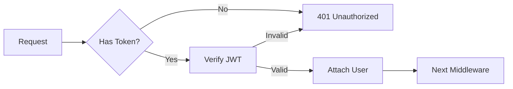

# L5-TASK-001: /mahabharatha:explain Command

## Objective

Implement code and concept explanation with audience targeting.

## Context

**Depends on**: L4-TASK-004 (Index Command)

Explain provides context-aware explanations of code or concepts, using the project index for accurate references.

## Files to Create

```
.claude/commands/
└── mahabharatha:explain.md

.mahabharatha/
└── explain.py
```

## Target Types

### Code
```bash
/mahabharatha:explain --target src/auth/middleware.ts
              [--audience beginner|intermediate|expert]
              [--depth summary|detailed|comprehensive]
```

### Function
```bash
/mahabharatha:explain --target src/auth/middleware.ts:authenticate
              [--include-callers]
              [--include-callees]
```

### Concept
```bash
/mahabharatha:explain --concept "JWT authentication"
              [--examples]
              [--tradeoffs]
```

## Output Features

1. **Data Flow Diagrams**: Mermaid flowcharts
2. **Call Graphs**: Who calls what
3. **Security Notes**: Highlight sensitive operations
4. **Audience Adaptation**: Adjust terminology and depth

## Example Output

```markdown
# authenticate() Function

## Summary
Validates JWT tokens from Authorization header and attaches user to request.

## Data Flow


## Security Considerations
- Token expiry checked
- Signature verification uses RS256
- User permissions loaded from DB

## Used By
- `src/routes/api.ts:protectedRoute`
- `src/routes/admin.ts:adminRoute`
```

---

# L5-TASK-002: /mahabharatha:research Command

## Objective

Implement external research and context gathering via MCP.

## Context

**Depends on**: None

Research fetches external information to inform development decisions, using MCP integrations.

## Files to Create

```
.claude/commands/
└── mahabharatha:research.md

.mahabharatha/
└── research.py
```

## Source Types

1. **docs**: Official documentation (Context7 MCP)
2. **web**: General web search (Tavily MCP)
3. **code**: Code examples (GitHub search)
4. **papers**: Academic papers (if MCP available)

## Usage

```bash
/mahabharatha:research "How to implement OAuth2 PKCE flow"
               [--sources docs,web,code]
               [--depth quick|standard|deep]
               [--save research/oauth.md]
```

## Research Report

```markdown
# Research: OAuth2 PKCE Flow

## Quick Answer
PKCE (Proof Key for Code Exchange) prevents authorization code interception...

## Sources

### Official Documentation
1. [OAuth 2.0 RFC 7636](https://tools.ietf.org/html/rfc7636)
   - PKCE specification
   - Code verifier/challenge explained

### Code Examples
1. [github.com/auth0/auth0-spa-js](...)
   - Production implementation
   - 2.3k stars

### Web Articles
1. [Auth0 Blog: PKCE Explained](...)
   - Step-by-step walkthrough

## Implementation Notes
- Generate 43-128 character code verifier
- Use SHA256 for code challenge
- Store verifier securely during flow

## Citations
[1] RFC 7636, Section 4.1
[2] Auth0 Documentation
```

---

# L5-TASK-003: /mahabharatha:estimate Command

## Objective

Implement development estimation with confidence intervals.

## Context

**Depends on**: L0-TASK-003 (Task Graph), L1-TASK-005 (Metrics)

Estimate analyzes task graphs and historical data to project completion time and cost.

## Files to Create

```
.claude/commands/
└── mahabharatha:estimate.md

.mahabharatha/
└── estimate.py
```

## Analysis Components

1. **Complexity Analysis**: Task graph depth, breadth
2. **Historical Velocity**: From past executions
3. **Confidence Intervals**: 50%, 80%, 95%
4. **Resource Requirements**: Workers, tokens
5. **Cost Projection**: API costs

## Usage

```bash
/mahabharatha:estimate [--graph path/to/task-graph.json]
               [--workers 5]
               [--confidence 80]
               [--include-cost]
```

## Output

```markdown
# Estimation: auth-system Feature

## Task Analysis
- Total tasks: 47
- Levels: 5
- Critical path: 8 tasks
- Max parallelization: 10 tasks (Level 3)

## Time Estimates

| Confidence | Duration | Sessions |
|------------|----------|----------|
| 50% | 2h 30m | 3 |
| 80% | 4h 15m | 5 |
| 95% | 6h 45m | 8 |

## Resource Requirements
- Optimal workers: 5
- Estimated tokens: 850k
- API cost: ~$7.65

## Risks
- Level 3 has complex integration tasks
- Security review may require iteration
```

---

# L5-TASK-004: /mahabharatha:spawn Command

## Objective

Implement meta-orchestration with adaptive task decomposition.

## Context

**Depends on**: L2-TASK-002 (Kurukshetra), L2-TASK-006 (Design)

Spawn is the highest-level command: give it a goal, and it plans, designs, and executes automatically.

## Files to Create

```
.claude/commands/
└── mahabharatha:spawn.md

.mahabharatha/
└── spawn.py
```

## Capabilities

1. **Goal Decomposition**: Break high-level request into sub-goals
2. **Recursive Planning**: Sub-goals become task graphs
3. **Dependency Inference**: Figure out ordering automatically
4. **Strategy Selection**: Conservative vs aggressive decomposition
5. **Validation**: Verify breakdown before execution

## Strategies

| Strategy | Task Size | Risk Tolerance |
|----------|-----------|----------------|
| conservative | Small (5-15 min) | Low |
| balanced | Medium (15-30 min) | Medium |
| aggressive | Large (30-60 min) | High |

## Usage

```bash
/mahabharatha:spawn "Add OAuth2 authentication with Google and GitHub providers"
            [--strategy balanced]
            [--max-depth 3]
            [--validate-only]
```

## Decomposition Example

**Input**: "Add OAuth2 authentication with Google and GitHub providers"

**Output**:
```
Goal Analysis:
├── Sub-goal 1: OAuth infrastructure
│   ├── TASK-001: Create OAuth types (L0)
│   ├── TASK-002: Create OAuth config (L0)
│   └── TASK-003: Create OAuth middleware (L1)
├── Sub-goal 2: Google provider
│   ├── TASK-004: Google OAuth strategy (L2)
│   ├── TASK-005: Google callback handler (L2)
│   └── TASK-006: Google profile mapper (L2)
├── Sub-goal 3: GitHub provider
│   ├── TASK-007: GitHub OAuth strategy (L2)
│   ├── TASK-008: GitHub callback handler (L2)
│   └── TASK-009: GitHub profile mapper (L2)
├── Sub-goal 4: User integration
│   ├── TASK-010: Link OAuth to users (L3)
│   ├── TASK-011: Account linking UI (L3)
│   └── TASK-012: Session management (L3)
└── Sub-goal 5: Testing & docs
    ├── TASK-013: Integration tests (L4)
    ├── TASK-014: E2E tests (L4)
    └── TASK-015: Documentation (L4)

Total: 15 tasks across 5 levels
Estimated: 3-4 sessions with 5 workers
```

## Workflow

```python
def spawn(goal: str, strategy: str = "balanced") -> SpawnResult:
    # 1. Analyze goal
    analysis = analyze_goal(goal)

    # 2. Decompose into sub-goals
    sub_goals = decompose(analysis, max_depth=3)

    # 3. Generate task graph for each sub-goal
    task_graphs = [design_tasks(sg) for sg in sub_goals]

    # 4. Merge and order
    combined = merge_task_graphs(task_graphs)

    # 5. Validate
    errors = combined.validate()
    if errors:
        return SpawnResult(success=False, errors=errors)

    # 6. Execute (unless validate-only)
    return orchestrator.start(combined)
```

## Safety

- Max recursion depth: 3 levels
- Validates complete graph before execution
- Shows breakdown for approval before running
- Tracks parent-child goal relationships
