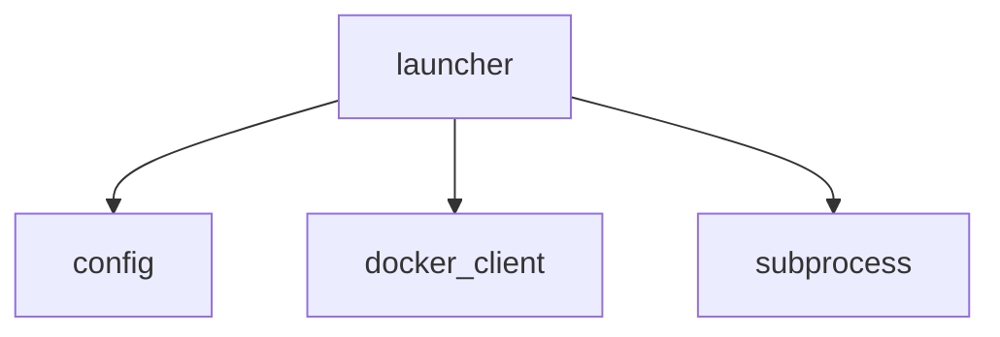
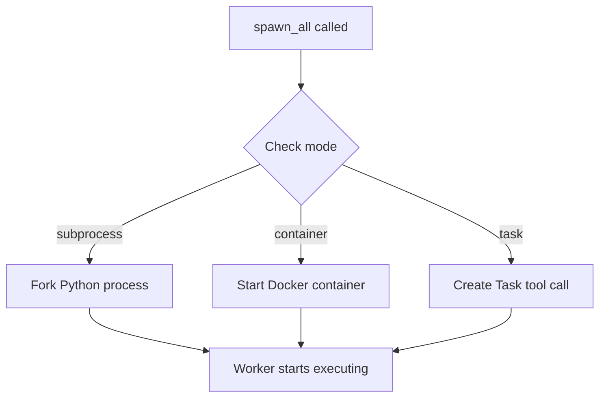

# Command Reference

Complete documentation for all ZERG slash commands. Each command includes plain-language explanations, visual diagrams, and practical examples to help you understand not just how to use them, but why they exist.

This guide assumes you know basic programming and git but are new to AI coding assistants and distributed task execution. Every command is explained with:

1. **What Is It?** - The concept in plain language
2. **Why Use It?** - The problem it solves
3. **How It Works** - Visual diagram of the flow
4. **Using It** - Command examples with expected output

Commands can be invoked in two ways:
- **Slash command**: `/zerg:rush --workers=5` (inside Claude Code)
- **CLI**: `zerg rush --workers=5` (from the terminal)

---

## Table of Contents

- [Global Flags](#global-flags)
- [Core Workflow](#core-workflow)
  - [/zerg:brainstorm](#zergbrainstorm)
  - [/zerg:design](#zergdesign)
  - [/zerg:init](#zerginit)
  - [/zerg:plan](#zergplan)
  - [/zerg:rush](#zergrush)
- [Monitoring and Control](#monitoring-and-control)
  - [/zerg:cleanup](#zergcleanup)
  - [/zerg:logs](#zerglogs)
  - [/zerg:merge](#zergmerge)
  - [/zerg:retry](#zergretry)
  - [/zerg:status](#zergstatus)
  - [/zerg:stop](#zergstop)
- [Quality and Analysis](#quality-and-analysis)
  - [/zerg:analyze](#zerganalyze)
  - [/zerg:build](#zergbuild)
  - [/zerg:refactor](#zergrefactor)
  - [/zerg:review](#zergreview)
  - [/zerg:security](#zergsecurity)
  - [/zerg:test](#zergtest)
- [Utilities](#utilities)
  - [/zerg:create-command](#zergcreate-command)
  - [/zerg:debug](#zergdebug)
  - [/zerg:git](#zerggit)
  - [/zerg:plugins](#zergplugins)
  - [/zerg:worker](#zergworker)
- [Documentation and AI](#documentation-and-ai)
  - [/zerg:document](#zergdocument)
  - [/zerg:estimate](#zergestimate)
  - [/zerg:explain](#zergexplain)
  - [/zerg:index](#zergindex)
  - [/zerg:select-tool](#zergselect-tool)
- [Exit Codes](#exit-codes)

---

## Global Flags

These flags apply to all ZERG commands when invoked via the CLI.

### Analysis Depth

Control how deeply ZERG thinks about your request. Higher depth means more thorough analysis but uses more tokens.

| Flag | Token Budget | When to Use |
|------|-------------|-------------|
| `--quick` | ~1K tokens | Simple, routine tasks |
| `--think` | ~4K tokens | Multi-step analysis |
| `--think-hard` | ~10K tokens | Architectural decisions |
| `--ultrathink` | ~32K tokens | Complex system design |

### Output and Efficiency

| Flag | Default | Description |
|------|---------|-------------|
| `--no-compact` | false | Disable compact output (verbose mode) |

### Behavioral Mode

| Flag | Default | Description |
|------|---------|-------------|
| `--mode` | auto | Override mode: `precision`, `speed`, `exploration`, `refactor`, `debug` |

### MCP Routing

| Flag | Default | Description |
|------|---------|-------------|
| `--mcp` | true | Enable MCP server auto-routing |
| `--no-mcp` | false | Disable all MCP server recommendations |

### Improvement Loops

| Flag | Default | Description |
|------|---------|-------------|
| `--no-loop` | false | Disable improvement loops |
| `--iterations` | config | Set max loop iterations |

### TDD Enforcement

| Flag | Default | Description |
|------|---------|-------------|
| `--tdd` | false | Enable red-green-refactor protocol |

### Standard Flags

| Flag | Short | Description |
|------|-------|-------------|
| `--verbose` | `-v` | Enable verbose output |
| `--quiet` | `-q` | Suppress non-essential output |
| `--version` | | Show version and exit |
| `--help` | | Show help message and exit |

---

## Core Workflow

The core workflow commands take you from an empty idea to working code through a structured process: initialize your project, discover what to build, capture requirements, design the architecture, and execute with parallel workers.

---

### /zerg:brainstorm

#### What Is It?

The brainstorm command helps you figure out what to build before you commit to building it. It is a structured discovery process that researches competitors, asks probing questions, and helps you crystallize vague ideas into concrete requirements.

Imagine you know you want to improve your authentication system but you are not sure exactly what needs fixing. Brainstorm researches how other systems handle authentication, asks you questions to uncover hidden requirements, and ultimately produces a prioritized list of features with GitHub issues ready to go.

#### Why Use It?

Starting to code without clear requirements leads to wasted effort. You build something, realize it is not what users need, and throw away work. Brainstorm front-loads the thinking so you build the right thing the first time.

The command also performs competitive research. It searches the web for how similar products solve the problem, identifies market gaps, and brings back insights you might not have discovered on your own. This is not just planning - it is strategic planning.

#### How It Works

```
+---------------------------------------------------------------------+
|                      /zerg:brainstorm                               |
+---------------------------------------------------------------------+
                              |
        Phase 1               v
    +-------------------------------------+
    |           RESEARCH                  |
    |  - Search competitors               |
    |  - Find market gaps                 |
    |  - Identify trends                  |
    +-------------------------------------+
                              |
        Phase 2               v
    +-------------------------------------+
    |       SOCRATIC DISCOVERY            |
    |  Round 1: Problem Space             |
    |  Round 2: Solution Space            |
    |  Round 3: Implementation Space      |
    +-------------------------------------+
                              |
        Phase 2.5-2.7         v
    +-------------------------------------+
    |         VALIDATION                  |
    |  - Trade-off exploration            |
    |  - Design checkpoints               |
    |  - YAGNI gate (filter extras)       |
    +-------------------------------------+
                              |
        Phase 3               v
    +-------------------------------------+
    |       ISSUE GENERATION              |
    |  - Create GitHub issues             |
    |  - Add acceptance criteria          |
    |  - Apply priority labels            |
    +-------------------------------------+
                              |
                              v
    +-------------------------------------+
    |  Output: Ranked recommendations     |
    |  -> /zerg:plan for top pick         |
    +-------------------------------------+
```

**What YAGNI gate means:** "You Aren't Gonna Need It" - features that sound nice but are not essential for the first version get deferred. This keeps scope tight.

#### Using It

**Basic brainstorm:**
```
/zerg:brainstorm user-authentication
```

ZERG researches and then asks questions:
```
ZERG: I found these patterns in competitor auth systems:
      - OAuth 2.0 with social login (Google, GitHub)
      - Magic link authentication (passwordless)
      - Hardware key support (WebAuthn)

ZERG: What authentication challenges are your users facing today?
YOU:  Password fatigue - they forget passwords and reset flows are slow.

ZERG: What's your user base like? Technical vs non-technical?
YOU:  Mix of both. Developers use our API directly, non-devs use the web app.

ZERG: What compliance requirements do you have?
YOU:  SOC 2 certification is coming up. We need audit logs.
```

**Single-question Socratic mode:**
```
/zerg:brainstorm user-auth --socratic
```

Instead of multiple questions at once, ZERG asks one question at a time and goes deeper:
```
ZERG: Let's start with the problem. What specific authentication
      issue is causing the most user friction right now?
YOU:  Password resets. Users do 50+ resets per day.

ZERG: That's significant. When users reset passwords, what's the
      longest step in your current flow?
YOU:  Email delivery. Sometimes takes 5+ minutes.
```

**Preview without creating issues:**
```
/zerg:brainstorm api-redesign --skip-research --dry-run
```

Output shows what would be created:
```
Would create 4 GitHub issues:

[P0] Implement rate limiting on public endpoints
     Labels: security, api

[P1] Add pagination to list endpoints
     Labels: api, breaking-change

[P2] Deprecate v1 endpoints
     Labels: api, maintenance
```

**Flags:**

| Flag | Type | Default | Description |
|------|------|---------|-------------|
| `--rounds` | integer | 3 | Number of Socratic discovery rounds (max: 5) |
| `--socratic` | boolean | false | Enable single-question mode |
| `--skip-research` | boolean | false | Skip competitive analysis |
| `--skip-issues` | boolean | false | Ideate only, don't create issues |
| `--dry-run` | boolean | false | Preview issues without creating |
| `--resume` | boolean | false | Resume previous session |

---

### /zerg:design

#### What Is It?

The design command transforms approved requirements into a technical architecture and a task graph that workers can execute in parallel. It is the bridge between "what to build" (requirements) and "how to build it" (implementation).

Think of it as an architect drawing blueprints from a client's wish list. The requirements say "I want a house with 3 bedrooms." The design specifies exactly which walls go where, how the plumbing connects, and in what order contractors should work so they do not step on each other.

#### Why Use It?

Parallel execution requires careful planning. If two workers try to edit the same file, you get merge conflicts. If a worker tries to use a function that does not exist yet, the task fails. The design command solves this by:

1. Breaking work into tasks with clear boundaries
2. Assigning exclusive file ownership (no conflicts possible)
3. Organizing tasks into dependency levels (Level 1 completes before Level 2 starts)

The output (task-graph.json) is what `/zerg:rush` executes. Good design means smooth execution.

#### How It Works

```
+---------------------------------------------------------------------+
|                         /zerg:design                                |
+---------------------------------------------------------------------+
                              |
        Phase 1               v
    +-------------------------------------+
    |      ARCHITECTURE DESIGN            |
    |  - Component analysis               |
    |  - Data flow mapping                |
    |  - Interface definitions            |
    |  - Key decisions documented         |
    +-------------------------------------+
                              |
        Phase 2               v
    +---------------------------------------------------------------------+
    |                   IMPLEMENTATION PLAN                               |
    |                                                                     |
    |  Level 1: Foundation     Level 2: Core      Level 3: Integration   |
    |  +------------------+   +--------------+   +-------------------+   |
    |  | types.ts         |   | auth.service |   | auth.routes       |   |
    |  | schema.py        |   | user.service |   | user.routes       |   |
    |  | config.ts        |   | session.svc  |   | middleware        |   |
    |  +------------------+   +--------------+   +-------------------+   |
    |                                                                     |
    |  Level 4: Testing        Level 5: Quality                          |
    |  +------------------+   +--------------+                           |
    |  | auth.test.ts     |   | docs/auth.md |                           |
    |  | user.test.ts     |   | cleanup      |                           |
    |  | e2e.test.ts      |   |              |                           |
    |  +------------------+   +--------------+                           |
    +---------------------------------------------------------------------+
                              |
        Phase 3               v
    +-------------------------------------+
    |      TASK GRAPH GENERATION          |
    |  - Exclusive file ownership         |
    |  - Verification commands            |
    |  - Dependency chains                |
    |  -> task-graph.json                 |
    +-------------------------------------+
                              |
        Phase 4               v
    +-------------------------------------+
    |      VALIDATION                     |
    |  - No circular dependencies         |
    |  - No file ownership conflicts      |
    |  - All files have exactly one owner |
    +-------------------------------------+
```

**What exclusive file ownership means:** Each file can only be created or modified by one task per level. If `auth.service.ts` is assigned to TASK-005, no other task in Level 2 can touch it. This eliminates merge conflicts by design.

#### Using It

```
/zerg:design
```

ZERG reads the approved requirements and generates architecture:
```
Architecture Design:

COMPONENTS:
+-- auth/
|   +-- types.ts          (Level 1: TASK-001)
|   +-- auth.service.ts   (Level 2: TASK-004)
|   +-- auth.routes.ts    (Level 3: TASK-007)
+-- user/
|   +-- types.ts          (Level 1: TASK-002)
|   +-- user.service.ts   (Level 2: TASK-005)
|   +-- user.routes.ts    (Level 3: TASK-008)
+-- tests/
    +-- auth.test.ts      (Level 4: TASK-010)
    +-- user.test.ts      (Level 4: TASK-011)

KEY DECISIONS:
- Using JWT for session tokens (stateless, scales horizontally)
- Storing refresh tokens in database (allows revocation)
- Password hashing with bcrypt cost factor 12

Task graph validated: 12 tasks, 5 levels, no conflicts.
Ready for /zerg:rush
```

**Flags:**

| Flag | Type | Default | Description |
|------|------|---------|-------------|
| `--help` | boolean | false | Show help message |

---

### /zerg:init

#### What Is It?

The init command sets up ZERG for your project. Think of it as the foundation work before building a house - you need the infrastructure in place before construction can begin.

ZERG operates in one of two modes depending on what it finds. If you run it in an empty directory, it starts an interactive wizard to help you build a new project from scratch (Inception Mode). If you run it in an existing codebase, it analyzes what you have and configures ZERG to work with your stack (Discovery Mode).

#### Why Use It?

Without initialization, ZERG has no idea what your project looks like. It does not know which programming languages you use, what frameworks are involved, or how to run your build and test commands. The init command discovers all of this and creates configuration files so every other ZERG command works correctly.

It also sets up security rules specific to your stack. If you are writing Python, you get Python security rules. If you are writing JavaScript, you get JavaScript rules. This means Claude Code automatically follows secure coding practices relevant to your actual codebase.

#### How It Works

```
+---------------------------------------------------------------------+
|                         /zerg:init                                  |
+---------------------------------------------------------------------+
                              |
                              v
                    +-----------------+
                    | Check directory |
                    +-----------------+
                              |
              +---------------+---------------+
              v                               v
     +----------------+              +----------------+
     | Empty: Wizard  |              | Existing: Scan |
     | - What to build|              | - Find files   |
     | - Tech stack   |              | - Detect lang  |
     | - Git init     |              | - Find infra   |
     +----------------+              +----------------+
              |                               |
              +---------------+---------------+
                              v
              +-------------------------------+
              |      Generate Files           |
              |  - .zerg/config.yaml          |
              |  - .devcontainer/             |
              |  - .gsd/PROJECT.md            |
              |  - .claude/rules/security/    |
              +-------------------------------+
```

**What the files mean:**
- `.zerg/config.yaml` - Main configuration: worker counts, timeouts, quality gates
- `.devcontainer/` - Docker configuration for isolated worker execution
- `.gsd/PROJECT.md` - High-level project description for ZERG to reference
- `.claude/rules/security/` - Language-specific security rules that Claude Code auto-loads

#### Using It

**New project (empty directory):**
```
mkdir my-api && cd my-api
zerg init
```

ZERG asks questions about what you want to build:
```
ZERG: What kind of project are you creating?
YOU:  A REST API for managing inventory

ZERG: Which languages/frameworks?
YOU:  Python with FastAPI

ZERG: Any specific infrastructure needs?
YOU:  PostgreSQL database, Redis for caching
```

**Existing project:**
```
cd my-existing-project
zerg init
```

ZERG scans and reports:
```
Detected:
  Languages: Python 3.11, TypeScript 5.0
  Frameworks: FastAPI, React
  Infrastructure: Docker, PostgreSQL
  Build: pyproject.toml, package.json

Created:
  .zerg/config.yaml
  .gsd/PROJECT.md
  .gsd/INFRASTRUCTURE.md
  .claude/rules/security/languages/python/CLAUDE.md
  .claude/rules/security/languages/javascript/CLAUDE.md
```

**With options:**
```
# Skip security rules (faster, less secure)
zerg init --no-security-rules

# Set strict security and 3 workers
zerg init --workers 3 --security strict

# Build Docker container after init
zerg init --with-containers
```

**Flags:**

| Flag | Type | Default | Description |
|------|------|---------|-------------|
| `--workers` | integer | 5 | Set default worker count |
| `--security` | string | "" | Security level (e.g., `strict`) |
| `--no-security-rules` | boolean | false | Skip fetching security rules |
| `--with-containers` | boolean | false | Build devcontainer after init |

---

### /zerg:plan

#### What Is It?

The plan command captures detailed requirements for a specific feature. While brainstorm helps you figure out what to build, plan documents exactly how it should work. It produces a requirements document that serves as the contract for the implementation.

Think of it as writing a detailed spec before coding. The plan command asks questions about your feature until it has enough information to write unambiguous requirements that any developer (or AI) could implement correctly.

#### Why Use It?

Vague requirements produce vague code. When you tell an AI "build user authentication," you might get basic username/password, or you might get a full OAuth implementation. The plan command eliminates ambiguity by forcing you to specify exactly what you want.

The output (requirements.md) becomes the single source of truth for the design and implementation phases. Workers read this document and implement exactly what it says. If requirements are clear, implementation is straightforward.

#### How It Works

```
+---------------------------------------------------------------------+
|                         /zerg:plan                                  |
+---------------------------------------------------------------------+
                              |
        Phase 1               v
    +-------------------------------------+
    |        CONTEXT GATHERING            |
    |  - Read PROJECT.md                  |
    |  - Read INFRASTRUCTURE.md           |
    |  - Search codebase for patterns     |
    +-------------------------------------+
                              |
        Phase 2               v
    +-------------------------------------+
    |     REQUIREMENTS ELICITATION        |
    |  - Problem space questions          |
    |  - Functional requirements          |
    |  - Non-functional requirements      |
    |  - Scope boundaries                 |
    |  - Acceptance criteria              |
    +-------------------------------------+
                              |
        Phase 3               v
    +-------------------------------------+
    |      GENERATE requirements.md       |
    |  -> .gsd/specs/{feature}/           |
    +-------------------------------------+
                              |
        Phase 4               v
    +-------------------------------------+
    |      APPROVAL CHECKPOINT            |
    |  Status: DRAFT -> REVIEW -> APPROVED|
    +-------------------------------------+
                              |
                              v
              User says "APPROVED"
              -> Ready for /zerg:design
```

**What the status markers mean:**
- `DRAFT` - Requirements captured but not yet reviewed
- `REVIEW` - Under review, may have questions
- `APPROVED` - Ready for design phase
- `REJECTED` - Needs revision

#### Using It

**Plan a feature:**
```
/zerg:plan user-authentication
```

ZERG asks targeted questions:
```
ZERG: Let me understand the scope. What authentication methods should
      this feature support?
YOU:  Email/password and OAuth with Google.

ZERG: For the email/password flow:
      - Should users verify their email before accessing the app?
      - What are the password complexity requirements?
YOU:  Yes, email verification required. Password must be 12+ chars
      with at least one number and symbol.

ZERG: For OAuth:
      - Which Google scopes do you need (email, profile, etc)?
      - What happens if a Google user already has an email/password account?
YOU:  Just email and profile. Link accounts if email matches.

ZERG: Non-functional requirements:
      - What's the expected login volume (logins per second)?
      - Session duration? Token refresh policy?
YOU:  ~10 logins/sec peak. 1-hour sessions, refresh if active.
```

ZERG generates `requirements.md` and asks for approval:
```
Requirements generated. Key points:

FUNCTIONAL:
- FR-1: Email/password authentication with verification
- FR-2: Google OAuth with account linking
- FR-3: Session management with 1-hour expiry

NON-FUNCTIONAL:
- NFR-1: Handle 10 logins/second
- NFR-2: Sub-200ms login latency

Please review and reply APPROVED or REJECTED with feedback.
```

**Structured Socratic mode:**
```
/zerg:plan user-authentication --socratic --rounds 5
```

Five structured rounds of one question at a time, going deeper into problem space, solution space, and implementation details.

**Flags:**

| Flag | Short | Type | Default | Description |
|------|-------|------|---------|-------------|
| `--socratic` | `-s` | boolean | false | Use structured discovery mode |
| `--rounds` | | integer | 3 | Number of Socratic rounds (max: 5) |

---

### /zerg:rush

#### What Is It?

The rush command is ZERG's execution engine. It takes your approved design and turns it into action by launching multiple Claude Code instances that work on different parts of your feature simultaneously.

Think of it like a construction site manager: you have the blueprints (from /zerg:design), and now rush assigns workers to different rooms so they can all build at once instead of waiting for one worker to finish each room.

#### Why Use It?

Without parallelization, building a feature with 20 files takes a single Claude Code instance hours of sequential work. Rush spawns multiple workers, each handling their assigned files, reducing build time by 3-5x.

The command also handles the complexity you would otherwise manage manually: coordinating workers, running quality checks between levels, retrying failed tasks, and merging changes back together. You launch rush and watch progress instead of babysitting individual tasks.

#### How It Works

```
+---------------------------------------------------------------------+
|                        ORCHESTRATOR                                 |
|  Reads task-graph.json, assigns tasks to workers by level           |
+---------------------------------------------------------------------+
                              |
                              | Level 1 Start
         +--------------------+--------------------+
         v                    v                    v
    +---------+          +---------+          +---------+
    | Worker 0|          | Worker 1|          | Worker 2|
    | TASK-001|          | TASK-002|          | TASK-003|
    | types.ts|          | schema.ts|         | config.ts|
    +---------+          +---------+          +---------+
         |                    |                    |
         v                    v                    v
    +-----------------------------------------------------+
    |                   LEVEL 1 COMPLETE                  |
    |  Merge branches, run quality gates (lint, test)     |
    +-----------------------------------------------------+
                              |
                              | Level 2 Start
         +--------------------+--------------------+
         v                    v                    v
    +---------+          +---------+          +---------+
    | Worker 0|          | Worker 1|          | Worker 2|
    | TASK-004|          | TASK-005|          | TASK-006|
    | auth.svc|          | user.svc|          | session |
    +---------+          +---------+          +---------+
         |                    |                    |
         v                    v                    v
    +-----------------------------------------------------+
    |                   LEVEL 2 COMPLETE                  |
    |  ... and so on through all levels ...               |
    +-----------------------------------------------------+
```

**What "level by level" means:** All workers must complete Level 1 before any worker starts Level 2. This ensures that when workers build services (Level 2), the types they depend on (Level 1) already exist.

**What quality gates mean:** Between levels, rush automatically runs lint, type checking, and tests. If anything fails, execution pauses so you can fix issues before they propagate.

#### Using It

**Basic launch with 5 workers:**
```
/zerg:rush --workers=5
```

Output shows real-time progress:
```
Rush started: user-authentication
Workers: 5 | Mode: task

Level 1 (Foundation):
  [Worker 0] TASK-001 types.ts .......... DONE
  [Worker 1] TASK-002 schema.ts ......... DONE
  [Worker 2] TASK-003 config.ts ......... DONE

Quality gates: lint OK | typecheck OK | tests OK

Level 2 (Core):
  [Worker 0] TASK-004 auth.service ...... RUNNING
  [Worker 1] TASK-005 user.service ...... RUNNING
  [Worker 2] TASK-006 session.service ... RUNNING
```

**Resume after interruption:**
```
/zerg:rush --resume
```

ZERG loads state from the checkpoint file and continues where it left off:
```
Resuming user-authentication from Level 2
Completed: 3/12 tasks
Remaining: 9 tasks across 4 levels
```

**Preview execution plan:**
```
/zerg:rush --dry-run
```

Shows what would happen without starting:
```
Dry run: user-authentication

Level 1: 3 tasks -> 3 workers (1 task each)
Level 2: 3 tasks -> 3 workers (1 task each)
Level 3: 3 tasks -> 3 workers (1 task each)
Level 4: 2 tasks -> 2 workers
Level 5: 1 task  -> 1 worker

Estimated time: 45 minutes with 5 workers
Estimated cost: ~$2.50 API credits
```

**Container mode for full isolation:**
```
/zerg:rush --mode container
```

Each worker runs in its own Docker container with a separate git worktree. Complete isolation means no chance of workers interfering with each other.

**Flags:**

| Flag | Short | Type | Default | Description |
|------|-------|------|---------|-------------|
| `--workers` | `-w` | integer | 5 | Number of parallel workers (max: 10) |
| `--feature` | `-f` | string | auto | Feature name |
| `--level` | `-l` | integer | 1 | Start from specific level |
| `--task-graph` | `-g` | string | auto | Path to task-graph.json |
| `--mode` | `-m` | string | task | Execution mode: `subprocess`, `container`, `task` |
| `--dry-run` | | boolean | false | Show execution plan |
| `--resume` | | boolean | false | Continue from previous run |
| `--timeout` | | integer | 3600 | Max execution time in seconds |

---

## Monitoring and Control

These commands help you observe what is happening during execution and take action when things go wrong.

---

### /zerg:cleanup

#### What Is It?

The cleanup command removes ZERG artifacts after a feature is complete or when you want to start fresh. It cleans up worktrees, branches, containers, and state files while preserving your actual code and spec documents.

Think of it as clearing the construction site after building is done. Remove the scaffolding, clean up debris, but leave the finished building intact.

#### Why Use It?

ZERG creates many temporary artifacts: git worktrees for each worker, state files for checkpointing, log files for debugging, and Docker containers for isolation. After a feature is complete, these just take up space.

Cleanup also helps when something goes wrong. If state becomes corrupt or you want to restart fresh, cleanup resets everything to a clean state.

#### How It Works

```
+---------------------------------------------------------------------+
|                         /zerg:cleanup                               |
+---------------------------------------------------------------------+
                              |
                              v
    +-----------------------------------------------------+
    |                  PRESERVED (NOT DELETED)            |
    |  - Source code on main branch                       |
    |  - Merged commits                                   |
    |  - Spec files (.gsd/specs/)                         |
    |  - Task history (archived first)                    |
    +-----------------------------------------------------+
                              |
                              v
    +-----------------------------------------------------+
    |                     REMOVED                         |
    |  - Worktrees (.zerg/worktrees/)                     |
    |  - State files (.zerg/state/)                       |
    |  - Log files (.zerg/logs/) [unless --keep-logs]     |
    |  - Git branches [unless --keep-branches]            |
    |  - Docker containers                                |
    +-----------------------------------------------------+
                              |
                              v
    +-----------------------------------------------------+
    |                 ARCHIVE TASK HISTORY                |
    |  -> .zerg/archive/{feature}/tasks-{timestamp}.json  |
    +-----------------------------------------------------+
```

**Why specs are preserved:** The spec files in `.gsd/specs/` serve as documentation of what was built and why. They are valuable for future reference and should not be deleted.

#### Using It

**Clean specific feature:**
```
zerg cleanup --feature user-auth
```

Output:
```
Cleaning up user-auth:

Archived task history to .zerg/archive/user-auth/tasks-20260204.json

Removing:
  [x] Worktrees: 5 removed
  [x] State files: 3 removed
  [x] Log files: 12 removed
  [x] Git branches: 6 removed
  [x] Docker containers: 5 removed

Preserved:
  [v] Source code on main
  [v] Spec files in .gsd/specs/user-auth/
  [v] 23 commits in git history

Delete task history from Task system? [y/N]: n
Task history preserved.

Cleanup complete.
```

**Preview cleanup plan:**
```
zerg cleanup --all --dry-run
```

Shows what would be deleted without actually deleting.

**Keep logs for debugging:**
```
zerg cleanup --feature user-auth --keep-logs
```

**Keep branches for inspection:**
```
zerg cleanup --feature user-auth --keep-branches
```

**Flags:**

| Flag | Short | Type | Default | Description |
|------|-------|------|---------|-------------|
| `--feature` | `-f` | string | "" | Feature to clean (required unless `--all`) |
| `--all` | | boolean | false | Clean all ZERG features |
| `--keep-logs` | | boolean | false | Preserve log files |
| `--keep-branches` | | boolean | false | Preserve git branches |
| `--dry-run` | | boolean | false | Show cleanup plan |

---

### /zerg:logs

#### What Is It?

The logs command gives you access to the detailed output from workers. While status shows high-level progress, logs show exactly what each worker said and did. This is essential for debugging when something goes wrong.

Think of it as reading a contractor's detailed work journal instead of just knowing they finished. If a task failed, logs tell you why.

#### Why Use It?

When a task fails, you need to understand what happened. Did the verification command fail? Was there a compilation error? Did the worker misunderstand the requirements? Logs contain the full context including Claude's reasoning, command output, and error messages.

Logs also help with optimization. If a task took much longer than expected, logs reveal where time was spent.

#### How It Works

```
+---------------------------------------------------------------------+
|                          /zerg:logs                                 |
+---------------------------------------------------------------------+
                              |
         +--------------------+--------------------+
         v                    v                    v
    +------------+      +------------+      +------------+
    |  Worker 0  |      |  Worker 1  |      |  Worker 2  |
    | worker.jsonl|     | worker.jsonl|     | worker.jsonl|
    +------------+      +------------+      +------------+
         |                    |                    |
         +--------------------+--------------------+
                              | --aggregate
                              v
    +-----------------------------------------------------+
    |            MERGED TIMELINE (by timestamp)           |
    |                                                     |
    |  10:00:01 [W0] Task TASK-001 started               |
    |  10:00:02 [W1] Task TASK-002 started               |
    |  10:00:03 [W2] Task TASK-003 started               |
    |  10:02:34 [W0] Task TASK-001 verification passed   |
    |  10:02:35 [W0] Task TASK-001 committed             |
    |  ...                                                |
    +-----------------------------------------------------+

    Task Artifacts (.zerg/logs/tasks/TASK-001/):
    +-- execution.jsonl      # Step-by-step execution log
    +-- claude_output.txt    # Full Claude Code output
    +-- verification_output.txt  # Test/lint output
    +-- git_diff.patch       # Changes made
```

**What artifacts mean:** Each task saves detailed artifacts including Claude's full output, verification results, and the git diff of changes. This lets you reconstruct exactly what happened after the fact.

#### Using It

**Recent logs from all workers:**
```
zerg logs
```

Output:
```
[10:15:32] [W0] TASK-004 started: auth.service.ts
[10:15:33] [W1] TASK-005 started: user.service.ts
[10:18:45] [W0] TASK-004 verification started
[10:18:47] [W0] TASK-004 verification PASSED
[10:18:48] [W0] TASK-004 committed: "feat(auth): implement auth service"
[10:19:01] [W1] TASK-005 verification started
[10:19:15] [W1] TASK-005 verification FAILED: type error
```

**Logs from specific worker:**
```
zerg logs 1
```

**Filter by log level:**
```
zerg logs --level error
```

Only shows errors:
```
[10:19:15] [W1] ERROR: TASK-005 verification failed
           Type 'string' is not assignable to type 'User'
           at src/user/user.service.ts:45:12
```

**Show task artifacts:**
```
zerg logs --artifacts TASK-005
```

Output shows the saved files:
```
Task TASK-005 artifacts:

=== execution.jsonl ===
{"phase":"claim","timestamp":"10:15:33"}
{"phase":"execute","timestamp":"10:15:34","step":"reading_spec"}
{"phase":"execute","timestamp":"10:17:20","step":"writing_code"}
{"phase":"verify","timestamp":"10:19:01","result":"failed"}

=== verification_output.txt ===
src/user/user.service.ts:45:12 - error TS2322
Type 'string' is not assignable to type 'User'

=== git_diff.patch ===
+++ b/src/user/user.service.ts
@@ -42,6 +42,10 @@
+  async getUser(id: string): User {  // Bug: should return Promise<User>
+    return this.db.query('SELECT * FROM users WHERE id = ?', [id]);
+  }
```

**Aggregate all logs by timestamp:**
```
zerg logs --aggregate
```

Merges all worker logs into a single chronological timeline.

**Flags:**

| Flag | Short | Type | Default | Description |
|------|-------|------|---------|-------------|
| `WORKER_ID` | | integer | all | Filter to specific worker (positional) |
| `--feature` | `-f` | string | auto | Feature name |
| `--tail` | `-n` | integer | 100 | Number of lines to show |
| `--follow` | | boolean | false | Stream logs continuously |
| `--level` | `-l` | string | all | Filter: `debug`, `info`, `warn`, `error` |
| `--aggregate` | | boolean | false | Merge all worker logs |
| `--task` | | string | "" | Filter to specific task ID |
| `--artifacts` | | string | "" | Show artifact contents |

---

### /zerg:merge

#### What Is It?

The merge command combines completed work from multiple workers into a single branch. Each worker creates code on its own branch, and merge brings those branches together after a level completes.

Think of it as combining work from multiple contractors into the final building. Each contractor worked on their own section, and now we join them together and run inspections (quality gates).

#### Why Use It?

Normally, rush handles merging automatically after each level. But sometimes you need manual control - maybe automatic merge failed due to a conflict, or you want to skip quality gates temporarily, or you are debugging a merge issue.

Merge gives you direct control over the level merge process when automatic handling is not enough.

#### How It Works

```
+---------------------------------------------------------------------+
|                         /zerg:merge                                 |
+---------------------------------------------------------------------+
                              |
                              v
    +-----------------------------------------------------+
    |         CHECK LEVEL COMPLETION                      |
    |  All tasks at level must be DONE                    |
    +-----------------------------------------------------+
                              |
                              v
    +-----------------------------------------------------+
    |         COLLECT WORKER BRANCHES                     |
    |  zerg/{feature}/worker-0                            |
    |  zerg/{feature}/worker-1                            |
    |  zerg/{feature}/worker-2                            |
    +-----------------------------------------------------+
                              |
                              v
    +-----------------------------------------------------+
    |         CREATE STAGING BRANCH                       |
    |  zerg/{feature}/staging-level-2                     |
    +-----------------------------------------------------+
                              |
                              v
    +-----------------------------------------------------+
    |         MERGE EACH WORKER BRANCH                    |
    |  worker-0 -> staging                                |
    |  worker-1 -> staging                                |
    |  worker-2 -> staging                                |
    +-----------------------------------------------------+
                              |
                              v
    +-----------------------------------------------------+
    |         RUN QUALITY GATES                           |
    |  - Lint                                             |
    |  - Type check                                       |
    |  - Tests                                            |
    +-----------------------------------------------------+
                              |
               +--------------+--------------+
               v                             v
          GATES PASS                    GATES FAIL
               |                             |
               v                             v
    +------------------+          +------------------+
    | Tag merge point  |          | Abort merge      |
    | Rebase workers   |          | Report failures  |
    | Continue to L+1  |          | (unless --force) |
    +------------------+          +------------------+
```

**What staging branch means:** A temporary branch where merges happen. This keeps the main branch clean until all gates pass. If something fails, the staging branch is discarded without affecting main.

#### Using It

**Merge current level:**
```
zerg merge
```

Output:
```
Merging Level 2 (Core):
  Collecting branches: worker-0, worker-1, worker-2
  Creating staging branch...

  Merging worker-0... OK
  Merging worker-1... OK
  Merging worker-2... OK

  Running quality gates:
    Lint............ PASS
    Type check...... PASS
    Tests........... PASS

  Tagging: zerg/user-auth/level-2-complete
  Rebasing worker branches onto merged result...

Level 2 merged successfully.
```

**Preview merge plan:**
```
zerg merge --dry-run
```

**Force merge despite failures:**
```
zerg merge --force
```

Use when you know why gates are failing and want to proceed anyway:
```
WARNING: Quality gates failed but --force specified.
Proceeding with merge...
```

**Abort in-progress merge:**
```
zerg merge --abort
```

Cleans up staging branch and resets state.

**Flags:**

| Flag | Short | Type | Default | Description |
|------|-------|------|---------|-------------|
| `--level` | `-l` | integer | current | Merge specific level |
| `--force` | `-f` | boolean | false | Force merge despite failures |
| `--abort` | | boolean | false | Abort in-progress merge |
| `--dry-run` | | boolean | false | Show merge plan |
| `--skip-gates` | | boolean | false | Skip quality gate checks |
| `--no-rebase` | | boolean | false | Don't rebase after merge |

---

### /zerg:retry

#### What Is It?

The retry command re-executes failed tasks. When verification fails, a worker crashes, or something goes wrong, retry resets the task and assigns it to a new worker for another attempt.

Think of it as asking a contractor to redo their work after a failed inspection. The task goes back to "pending" status and gets picked up again.

#### Why Use It?

Failures happen. Maybe a worker hit a timeout, made an incorrect assumption, or encountered a transient error. Rather than manually investigating and fixing, retry often succeeds on the second attempt because:

1. The error message from the first attempt provides context
2. Transient issues (network, resources) may have resolved
3. A different worker might approach the problem differently

Retry also tracks attempt counts to prevent infinite loops - by default, a task only gets 3 tries before you must investigate manually.

#### How It Works

```
+---------------------------------------------------------------------+
|                         /zerg:retry                                 |
+---------------------------------------------------------------------+
                              |
                              v
    +-----------------------------------------------------+
    |            IDENTIFY FAILED TASKS                    |
    |  - Check Task System for failed status              |
    |  - Read error logs and failure cause                |
    +-----------------------------------------------------+
                              |
                              v
    +-----------------------------------------------------+
    |            CHECK RETRY LIMITS                       |
    |  - Default: 3 attempts per task                     |
    |  - --force bypasses this limit                      |
    +-----------------------------------------------------+
                              |
                              v
    +-----------------------------------------------------+
    |            RESET TASK STATE                         |
    |  - Mark as PENDING in Task System                   |
    |  - Clear previous worker assignment                 |
    |  - Preserve error context for new worker            |
    +-----------------------------------------------------+
                              |
                              v
    +-----------------------------------------------------+
    |            REASSIGN TO WORKER                       |
    |  - Next available worker picks up task              |
    |  - Worker sees previous error for context           |
    +-----------------------------------------------------+
```

**Why error context matters:** When retrying, the new worker sees what went wrong before. This helps it avoid the same mistake. For example, if the previous attempt had a type error, the retry worker knows to pay extra attention to types.

#### Using It

**Retry specific task:**
```
zerg retry TASK-005
```

Output:
```
Retrying TASK-005: user.service.ts
  Previous failure: Type error at line 45
  Attempt: 2 of 3

Reassigned to Worker 0
```

**Retry all failed tasks:**
```
zerg retry --all
```

Output:
```
Found 3 failed tasks:
  TASK-005: Type error (attempt 2/3)
  TASK-007: Timeout (attempt 2/3)
  TASK-009: Verification failed (attempt 1/3)

Retrying all...
```

**Retry all failed tasks in a level:**
```
zerg retry --level 2
```

**Force retry (bypass limit):**
```
zerg retry --force TASK-005
```

Output:
```
WARNING: TASK-005 has failed 3 times.
Force retrying (attempt 4)...

Consider investigating root cause if this retry also fails.
```

**Preview what would be retried:**
```
zerg retry --dry-run
```

**Flags:**

| Flag | Short | Type | Default | Description |
|------|-------|------|---------|-------------|
| `TASK_IDS` | | string[] | [] | Specific task IDs (positional) |
| `--level` | `-l` | integer | 0 | Retry all failed tasks in level |
| `--all` | `-a` | boolean | false | Retry all failed tasks |
| `--force` | `-f` | boolean | false | Bypass retry limit |
| `--timeout` | `-t` | integer | config | Override timeout |
| `--reset` | | boolean | false | Reset retry counters |
| `--dry-run` | | boolean | false | Show what would be retried |

---

### /zerg:status

#### What Is It?

The status command shows you exactly what is happening across all workers and tasks. It is your dashboard into the parallel execution, answering questions like: How many tasks are done? Which workers are active? Are there any failures?

Think of it as a project management dashboard that updates in real-time. Instead of asking each contractor individually what they are working on, you look at a single screen that shows everyone's progress.

#### Why Use It?

When five workers are running simultaneously, you need visibility. Without status, you would have to read individual log files to understand what is happening. Status aggregates all that information into a single, readable view.

It also helps you catch problems early. If a worker has been stuck on the same task for 10 minutes, status shows that so you can investigate before wasting more time.

#### How It Works

```
+---------------------------------------------------------------------+
|                         /zerg:status                                |
+---------------------------------------------------------------------+
                              |
         +--------------------+--------------------+
         v                    v                    v
    +---------+          +---------+          +---------+
    |  Task   |          |  State  |          |   Git   |
    | System  |          |  JSON   |          | Branches|
    |(primary)|          |(backup) |          | Commits |
    +---------+          +---------+          +---------+
         |                    |                    |
         +--------------------+--------------------+
                              v
    +-----------------------------------------------------+
    |                    STATUS VIEW                      |
    |                                                     |
    |  FEATURE: user-authentication                       |
    |  PROGRESS: [=========>          ] 45%  (5/12 tasks) |
    |                                                     |
    |  LEVEL 2 OF 5                                       |
    |  +--------+--------+-----------+----------+         |
    |  | Worker | Status |   Task    | Duration |         |
    |  +--------+--------+-----------+----------+         |
    |  |   0    | RUNNING| TASK-004  |  3:45    |         |
    |  |   1    | RUNNING| TASK-005  |  2:30    |         |
    |  |   2    |  DONE  | TASK-006  |  4:12    |         |
    |  +--------+--------+-----------+----------+         |
    |                                                     |
    |  FAILED: 0 | BLOCKED: 0 | REMAINING: 7              |
    +-----------------------------------------------------+
```

**Data sources explained:**
- **Task System** (primary) - The Claude Code Task system tracks all work across sessions
- **State JSON** (backup) - Local file with checkpoint data
- **Git Branches** - Each worker commits to its own branch, showing actual code progress

If Task System and State JSON disagree, status flags the mismatch so you can investigate.

#### Using It

**Show overall status:**
```
/zerg:status
```

Output:
```
FEATURE: user-authentication
PROGRESS: ########............ 42% (5/12 tasks)

CURRENT LEVEL: 2 (Core)
+--------+----------+-----------+----------+---------+
| Worker |  Status  |   Task    | Duration | Files   |
+--------+----------+-----------+----------+---------+
|   0    | RUNNING  | TASK-004  |   3:45   | 2       |
|   1    | RUNNING  | TASK-005  |   2:30   | 1       |
|   2    |  IDLE    |    -      |    -     | -       |
|   3    | RUNNING  | TASK-006  |   4:12   | 2       |
|   4    | RUNNING  | TASK-007  |   1:15   | 1       |
+--------+----------+-----------+----------+---------+

COMPLETED LEVELS: 1 (Foundation)
REMAINING: 7 tasks across 3 levels
ESTIMATED TIME: 25 minutes
```

**Watch mode (auto-refresh every 5 seconds):**
```
/zerg:status --watch --interval 5
```

**Show all tasks with details:**
```
/zerg:status --tasks
```

Output includes task-level detail:
```
TASK-001 types.ts        v DONE      Worker 0   2:34
TASK-002 schema.ts       v DONE      Worker 1   1:58
TASK-003 config.ts       v DONE      Worker 2   2:12
TASK-004 auth.service    o RUNNING   Worker 0   3:45
TASK-005 user.service    o RUNNING   Worker 1   2:30
TASK-006 session.service v DONE      Worker 3   4:12
TASK-007 routes          o RUNNING   Worker 4   1:15
...
```

**Live TUI dashboard (CLI only):**
```
zerg status --dashboard
```

Opens a terminal user interface with real-time updates, colored status indicators, and keyboard navigation.

**Flags:**

| Flag | Short | Type | Default | Description |
|------|-------|------|---------|-------------|
| `--feature` | `-f` | string | auto | Feature to show |
| `--watch` | `-w` | boolean | false | Continuous update mode |
| `--interval` | `-i` | integer | 5 | Watch refresh interval |
| `--level` | `-l` | integer | all | Filter to specific level |
| `--json` | | boolean | false | Output as JSON |
| `--dashboard` | `-d` | boolean | false | Real-time TUI |
| `--tasks` | | boolean | false | Show all tasks |
| `--workers` | | boolean | false | Detailed per-worker info |
| `--commits` | | boolean | false | Recent commits per branch |

---

### /zerg:stop

#### What Is It?

The stop command halts worker execution, either gracefully (with checkpoints) or forcefully (immediate termination). Use it when you need to pause work, fix an issue, or free up resources.

Think of it as telling contractors to stop for lunch (graceful) versus pulling the fire alarm (force). Graceful stop lets workers finish their current step and save progress. Force stop just terminates everything immediately.

#### Why Use It?

Sometimes you need to stop mid-execution. Maybe you spotted a problem in the design, need to step away, or want to adjust worker count. Stop allows you to pause without losing progress.

Graceful stop is important because it preserves work-in-progress. Workers commit their current state before stopping, so when you resume, they pick up exactly where they left off instead of restarting the task from scratch.

#### How It Works

```
+---------------------------------------------------------------------+
|                         /zerg:stop                                  |
+---------------------------------------------------------------------+
                              |
              +---------------+---------------+
              v                               v
     +-----------------+             +-----------------+
     |  GRACEFUL STOP  |             |   FORCE STOP    |
     |  (default)      |             |   (--force)     |
     +-----------------+             +-----------------+
              |                               |
              v                               v
     +-----------------+             +-----------------+
     | Send checkpoint |             | Kill processes  |
     | signal          |             | immediately     |
     +-----------------+             +-----------------+
              |                               |
              v                               |
     +-----------------+                      |
     | Workers commit  |                      |
     | WIP changes     |                      |
     +-----------------+                      |
              |                               |
              v                               v
     +-----------------+             +-----------------+
     | Task marked     |             | Task marked     |
     | PAUSED          |             | FORCE STOPPED   |
     +-----------------+             +-----------------+
              |                               |
              +---------------+---------------+
                              v
                    Resume with /zerg:rush --resume
```

**What WIP commit means:** Work-in-progress. The worker commits whatever code it has written so far, even if incomplete, so nothing is lost. The commit message notes the progress percentage.

#### Using It

**Graceful stop (recommended):**
```
zerg stop
```

Output:
```
Stopping workers gracefully...
  Worker 0: Checkpointing TASK-004 (75% complete)...
  Worker 1: Checkpointing TASK-005 (50% complete)...
  Worker 2: Idle, stopping immediately

All workers stopped. State saved.
Resume with: zerg rush --resume
```

**Stop specific worker:**
```
zerg stop --worker 2
```

Only stops Worker 2; others continue:
```
Stopping Worker 2...
  Worker 2: Checkpointing TASK-006 (90% complete)...

Worker 2 stopped. Other workers continuing.
```

**Force stop (emergency):**
```
zerg stop --force
```

Immediate termination:
```
Force stopping all workers...
  Worker 0: Terminated (TASK-004 may have uncommitted changes)
  Worker 1: Terminated (TASK-005 may have uncommitted changes)
  Worker 2: Terminated

WARNING: Force stop may result in lost work.
Check task status before resuming.
```

**Flags:**

| Flag | Short | Type | Default | Description |
|------|-------|------|---------|-------------|
| `--feature` | `-f` | string | auto | Feature to stop |
| `--worker` | `-w` | integer | all | Stop specific worker |
| `--force` | | boolean | false | Immediate termination |
| `--timeout` | | integer | 30 | Graceful shutdown timeout |

---

## Quality and Analysis

These commands help you maintain code quality through analysis, testing, review, and security scanning.

---

### /zerg:analyze

#### What Is It?

The analyze command runs multiple quality checks on your code: linting, complexity analysis, coverage reporting, and security scanning. It gives you a comprehensive view of code health in one command.

Think of it as a comprehensive health checkup for your code. Instead of running separate tools for different concerns, analyze runs them all and presents a unified report.

#### Why Use It?

Code quality degrades over time without active monitoring. Functions get too complex, test coverage drops, security vulnerabilities sneak in. Analyze catches these issues before they become problems.

The SARIF output format integrates with IDEs and GitHub, so issues appear directly in your editor or PR reviews. This creates a tight feedback loop where problems are visible immediately.

#### How It Works

```
+---------------------------------------------------------------------+
|                         /zerg:analyze                               |
+---------------------------------------------------------------------+
                              |
         +--------------------+--------------------+
         v                    v                    v
    +---------+          +---------+          +---------+
    |  LINT   |          |COVERAGE |          |SECURITY |
    |  ruff   |          | pytest  |          | bandit  |
    |  eslint |          | jest    |          | semgrep |
    +---------+          +---------+          +---------+
         |                    |                    |
         +--------------------+--------------------+
                              v
                    +-----------------+
                    |   COMPLEXITY    |
                    |   cyclomatic    |
                    |   cognitive     |
                    +-----------------+
                              |
                              v
    +-----------------------------------------------------+
    |                    UNIFIED REPORT                   |
    |                                                     |
    |  Lint:       23 warnings, 2 errors                  |
    |  Coverage:   78% (target: 80%)                      |
    |  Complexity: 3 functions exceed threshold           |
    |  Security:   1 high, 4 medium findings              |
    +-----------------------------------------------------+
```

**What cyclomatic complexity means:** A measure of how many paths through a function exist. High complexity (>10) means the function is hard to test and understand. Analyze flags functions that exceed the threshold.

#### Using It

**Run all checks:**
```
/zerg:analyze --check all
```

Output:
```
Running analysis...

LINT (ruff + eslint):
  src/auth/auth.service.ts:45 - prefer-const
  src/user/user.service.ts:12 - no-unused-vars
  2 warnings, 0 errors

COMPLEXITY:
  src/auth/auth.service.ts:validateToken - 15 (threshold: 10) !
  src/user/user.service.ts:processUser - 12 (threshold: 10) !

COVERAGE:
  Overall: 78.5%
  src/auth/ - 92%
  src/user/ - 65% !

SECURITY:
  HIGH: src/auth/auth.service.ts:89 - Hardcoded secret
  MEDIUM: src/user/user.routes.ts:34 - SQL injection risk

Summary: 2 errors require attention
```

**Lint only with JSON output:**
```
/zerg:analyze --check lint --format json
```

**Custom thresholds:**
```
/zerg:analyze --check complexity --threshold complexity=15
```

**SARIF for IDE integration:**
```
/zerg:analyze --check all --format sarif > results.sarif
```

**Flags:**

| Flag | Type | Default | Description |
|------|------|---------|-------------|
| `--check` | string | all | Check type: `lint`, `complexity`, `coverage`, `security`, `all` |
| `--format` | string | text | Output format: `text`, `json`, `sarif` |
| `--threshold` | string | defaults | Custom thresholds |
| `--files` | string | all | Restrict to specific files |

---

### /zerg:build

#### What Is It?

The build command runs your project's build process with intelligent error handling. It detects which build system you use (npm, cargo, make, etc.) and runs the appropriate commands with automatic retry and error recovery.

Think of it as a smart build assistant that knows how to fix common problems. Missing dependency? It installs it. Type error? It suggests a fix. Timeout? It retries with backoff.

#### Why Use It?

Build errors are often recoverable. A missing package just needs to be installed. A network timeout just needs a retry. Build handles these automatically instead of failing and making you run commands manually.

Auto-detection means you do not need to configure anything. ZERG looks at your project files and figures out which build commands to run.

#### How It Works

```
+---------------------------------------------------------------------+
|                         /zerg:build                                 |
+---------------------------------------------------------------------+
                              |
                              v
    +-----------------------------------------------------+
    |              DETECT BUILD SYSTEM                    |
    |  package.json -> npm                                |
    |  Cargo.toml   -> cargo                              |
    |  go.mod       -> go                                 |
    |  Makefile     -> make                               |
    |  pyproject.toml -> pip/poetry                       |
    +-----------------------------------------------------+
                              |
                              v
    +-----------------------------------------------------+
    |                   RUN BUILD                         |
    +-----------------------------------------------------+
                              |
               +--------------+--------------+
               v                             v
          SUCCESS                        FAILURE
               |                             |
               v                             v
    +------------------+          +------------------+
    | Report success   |          | Analyze error    |
    +------------------+          | - Missing dep?   |
                                  | - Type error?    |
                                  | - Timeout?       |
                                  +------------------+
                                          |
                                          v
                                  +------------------+
                                  | AUTO-RECOVER     |
                                  | - Install dep    |
                                  | - Suggest fix    |
                                  | - Retry          |
                                  +------------------+
```

#### Using It

**Build with defaults:**
```
/zerg:build
```

Output:
```
Detected build system: npm (package.json)

Running: npm run build

Building...
  [1/3] Compiling TypeScript...
  [2/3] Bundling...
  [3/3] Optimizing...

Build successful in 23.4s
```

**Production build:**
```
/zerg:build --mode prod
```

**Clean build (remove artifacts first):**
```
/zerg:build --clean
```

**Watch mode (rebuild on changes):**
```
/zerg:build --watch
```

Output:
```
Watching for changes...

[10:15:32] File changed: src/auth.ts
[10:15:34] Rebuild complete in 1.2s

[10:16:45] File changed: src/user.ts
[10:16:47] Rebuild complete in 0.8s

Press Ctrl+C to stop
```

**Flags:**

| Flag | Type | Default | Description |
|------|------|---------|-------------|
| `--target` | string | all | Build target |
| `--mode` | string | dev | Build mode: `dev`, `staging`, `prod` |
| `--clean` | boolean | false | Clean build |
| `--watch` | boolean | false | Watch mode |
| `--retry` | integer | 3 | Number of retries |

---

### /zerg:refactor

#### What Is It?

The refactor command applies automated code improvements and cleanup. It can remove dead code, simplify expressions, strengthen types, apply design patterns, and improve naming.

Think of it as having an experienced developer clean up your code. They know the patterns, spot the issues, and fix them consistently across the entire codebase.

#### Why Use It?

Manual refactoring is tedious and error-prone. You might miss some dead code, or forget to simplify an expression in one file while cleaning up another. Refactor applies changes consistently everywhere.

The dry-run and interactive modes let you review changes before they happen. You see exactly what will change and can approve or reject each suggestion.

#### How It Works

```
+---------------------------------------------------------------------+
|                         /zerg:refactor                              |
+---------------------------------------------------------------------+
                              |
                              v
    +-----------------------------------------------------+
    |              ANALYZE CODEBASE                       |
    |  - Find dead code (unused imports, vars, functions) |
    |  - Find simplifiable expressions                    |
    |  - Find weak type annotations                       |
    |  - Find pattern opportunities                       |
    |  - Find poor naming                                 |
    +-----------------------------------------------------+
                              |
                              v
    +-----------------------------------------------------+
    |              GENERATE TRANSFORMS                    |
    |  Each transform = what + where + why                |
    +-----------------------------------------------------+
                              |
               +--------------+--------------+
               v                             v
          --dry-run                     --interactive
               |                             |
               v                             v
    +------------------+          +------------------+
    | Show all changes |          | Present each one |
    | Don't apply      |          | Ask for approval |
    +------------------+          +------------------+
                              |
                              v
                         Apply approved
```

#### Using It

**Preview all changes:**
```
/zerg:refactor --dry-run
```

Output:
```
Would apply 15 transforms:

DEAD-CODE:
  src/utils.ts:5 - Remove unused import 'lodash'
  src/auth.ts:23 - Remove unused function 'deprecated_login'

SIMPLIFY:
  src/user.ts:45 - Simplify 'if (x == true)' to 'if (x)'
  src/auth.ts:67 - Remove redundant parentheses

TYPES:
  src/api.ts:12 - Add return type annotation
  src/db.ts:34 - Replace 'any' with 'User | null'

PATTERNS:
  src/validator.ts:78 - Convert to guard clause (early return)

NAMING:
  src/utils.ts:90 - Rename 'x' to 'userCount'
```

**Interactive mode (approve each change):**
```
/zerg:refactor --interactive
```

Presents each suggestion for approval:
```
[1/15] DEAD-CODE: src/utils.ts:5
       Remove unused import 'lodash'

       - import { debounce } from 'lodash';
       + (removed)

       Apply? [y/n/a/q]: y
       Applied.

[2/15] SIMPLIFY: src/user.ts:45
       Simplify 'if (x == true)' to 'if (x)'
       ...
```

**Apply specific transforms only:**
```
/zerg:refactor --transforms dead-code,simplify
```

**Flags:**

| Flag | Type | Default | Description |
|------|------|---------|-------------|
| `--transforms` | string | all | Transforms: `dead-code`, `simplify`, `types`, `patterns`, `naming` |
| `--dry-run` | boolean | false | Preview without applying |
| `--interactive` | boolean | false | Approve changes one by one |

---

### /zerg:review

#### What Is It?

The review command implements a two-stage code review workflow. It checks both spec compliance (are we building what was asked?) and code quality (is the code well-written?).

Think of it as having two reviewers: one who checks if you followed the requirements, and one who checks if your code is clean and maintainable.

#### Why Use It?

Before creating a PR, you want to catch issues. Review runs a self-check that catches common problems: missing tests, hardcoded secrets, unhandled errors, edge cases. It is faster than waiting for human reviewers to find these issues.

The receive mode helps when you get feedback on a PR. It parses comments, tracks which you have addressed, and helps you respond systematically.

#### How It Works

```
+---------------------------------------------------------------------+
|                         /zerg:review                                |
+---------------------------------------------------------------------+
                              |
                              v
    +-----------------------------------------------------+
    |              STAGE 1: SPEC COMPLIANCE               |
    |  - Read requirements.md                             |
    |  - Check each FR is implemented                     |
    |  - Check each NFR is met                            |
    |  - Flag gaps                                        |
    +-----------------------------------------------------+
                              |
                              v
    +-----------------------------------------------------+
    |              STAGE 2: CODE QUALITY                  |
    |  - Code compiles?                                   |
    |  - Tests pass?                                      |
    |  - No secrets committed?                            |
    |  - Error handling complete?                         |
    |  - Edge cases covered?                              |
    |  - Code readable?                                   |
    +-----------------------------------------------------+
                              |
                              v
    +-----------------------------------------------------+
    |              GENERATE REVIEW REPORT                 |
    |  - Checklist of passed/failed items                 |
    |  - Suggestions for improvement                      |
    |  - Ready for PR? Yes/No                             |
    +-----------------------------------------------------+
```

#### Using It

**Full two-stage review:**
```
/zerg:review
```

Output:
```
STAGE 1: SPEC COMPLIANCE

Requirements: .gsd/specs/user-auth/requirements.md

[v] FR-1: Email/password authentication
    - Found: src/auth/auth.service.ts:login()
    - Test: tests/auth.test.ts:45

[v] FR-2: Google OAuth
    - Found: src/auth/oauth.ts:googleCallback()
    - Test: tests/oauth.test.ts:12

[!] FR-3: Session management
    - Found: src/auth/session.ts
    - MISSING: Token refresh not implemented

STAGE 2: CODE QUALITY

[v] Code compiles
[v] Tests pass (45/45)
[v] No secrets detected
[!] Error handling incomplete
    - src/auth/oauth.ts:34 - unhandled rejection
[v] Edge cases covered
[v] Code readable

SUMMARY:
  Spec compliance: 2/3 (67%)
  Code quality: 5/6 (83%)

NOT READY FOR PR - Address flagged items first
```

**Self-review checklist:**
```
/zerg:review --mode self
```

Quick pre-commit check:
```
Self-review checklist:
[v] Code compiles
[v] Tests pass
[v] No secrets
[!] Error handling - review oauth.ts
[v] Edge cases
[v] Readable

1 item needs attention
```

**Process review feedback:**
```
/zerg:review --mode receive
```

Parses PR comments and tracks addressed items.

**Flags:**

| Flag | Type | Default | Description |
|------|------|---------|-------------|
| `--mode` | string | full | Review mode: `prepare`, `self`, `receive`, `full` |

---

### /zerg:security

#### What Is It?

The security command scans your code for vulnerabilities and checks compliance with security frameworks like OWASP, PCI-DSS, HIPAA, and SOC 2. It also manages the security rules that Claude Code uses.

Think of it as a security auditor who checks your code for common vulnerabilities: hardcoded secrets, SQL injection, weak encryption, missing authentication, and more.

#### Why Use It?

Security vulnerabilities are expensive to fix after deployment. Finding them during development is much cheaper. Security scans for known vulnerability patterns and flags them before they reach production.

The compliance presets help if you need to meet specific standards. Running a PCI scan before a payment feature ensures you do not introduce violations.

#### How It Works

```
+---------------------------------------------------------------------+
|                         /zerg:security                              |
+---------------------------------------------------------------------+
                              |
                              v
    +-----------------------------------------------------+
    |              SECRET DETECTION                       |
    |  - API keys                                         |
    |  - Passwords                                        |
    |  - Private keys                                     |
    |  - AWS/GitHub/OpenAI credentials                    |
    +-----------------------------------------------------+
                              |
                              v
    +-----------------------------------------------------+
    |              DEPENDENCY CVE SCAN                    |
    |  - Python (pip-audit)                               |
    |  - Node.js (npm audit)                              |
    |  - Rust (cargo audit)                               |
    |  - Go (govulncheck)                                 |
    +-----------------------------------------------------+
                              |
                              v
    +-----------------------------------------------------+
    |              CODE ANALYSIS                          |
    |  - Injection (SQL, command, XSS)                    |
    |  - Authentication flaws                             |
    |  - Access control issues                            |
    |  - Cryptographic weaknesses                         |
    +-----------------------------------------------------+
                              |
                              v
    +-----------------------------------------------------+
    |              COMPLIANCE CHECK (if preset)           |
    |  - OWASP Top 10 2025                                |
    |  - PCI-DSS                                          |
    |  - HIPAA                                            |
    |  - SOC 2                                            |
    +-----------------------------------------------------+
```

#### Using It

**Run OWASP scan (default):**
```
/zerg:security
```

Output:
```
Security Scan: OWASP Top 10 2025

SECRET DETECTION:
  [HIGH] src/config.ts:12 - Hardcoded API key detected
         AWS_KEY = "AKIA..."

DEPENDENCY VULNERABILITIES:
  [HIGH] lodash@4.17.19 - CVE-2021-23337 (Command Injection)
         Fix: upgrade to 4.17.21

CODE ANALYSIS:
  [HIGH] src/db.ts:45 - SQL Injection
         query = "SELECT * FROM users WHERE id = " + userId
         Fix: Use parameterized queries

  [MEDIUM] src/auth.ts:23 - Weak password hashing
         Using MD5 instead of bcrypt

OWASP COMPLIANCE:
  [x] A01: Broken Access Control - 1 issue
  [v] A02: Cryptographic Failures
  [x] A03: Injection - 1 issue
  ...

Summary: 2 HIGH, 1 MEDIUM
```

**PCI compliance check:**
```
/zerg:security --preset pci
```

**With auto-fix suggestions:**
```
/zerg:security --autofix
```

Generates suggested fixes for each vulnerability.

**SARIF for IDE integration:**
```
/zerg:security --format sarif > security.sarif
```

**Flags:**

| Flag | Type | Default | Description |
|------|------|---------|-------------|
| `--preset` | string | owasp | Compliance: `owasp`, `pci`, `hipaa`, `soc2` |
| `--autofix` | boolean | false | Generate fix suggestions |
| `--format` | string | text | Output: `text`, `json`, `sarif` |

---

### /zerg:test

#### What Is It?

The test command runs your project's test suite with enhancements like coverage reporting, parallel execution, and watch mode. It auto-detects which test framework you use and runs the appropriate commands.

Think of it as your test runner with superpowers. It not only runs tests but also tells you which code is not tested and can even generate test stubs for uncovered functions.

#### Why Use It?

Running tests manually is tedious. Test handles the details: parallel execution for speed, coverage to identify gaps, watch mode for continuous feedback during development. It integrates with your existing test framework without requiring configuration.

The stub generation feature is particularly useful - it creates test file skeletons for uncovered code, so you just need to fill in the assertions.

#### How It Works

```
+---------------------------------------------------------------------+
|                          /zerg:test                                 |
+---------------------------------------------------------------------+
                              |
                              v
    +-----------------------------------------------------+
    |              DETECT TEST FRAMEWORK                  |
    |  pytest.ini / conftest.py -> pytest                 |
    |  jest.config.js -> jest                             |
    |  Cargo.toml -> cargo test                           |
    |  go.mod -> go test                                  |
    +-----------------------------------------------------+
                              |
         +--------------------+--------------------+
         v                    v                    v
    +---------+          +---------+          +---------+
    | Worker 1|          | Worker 2|          | Worker 3|
    | tests/a |          | tests/b |          | tests/c |
    +---------+          +---------+          +---------+
         |                    |                    |
         +--------------------+--------------------+
                              v
    +-----------------------------------------------------+
    |                   TEST RESULTS                      |
    |  Passed: 145 | Failed: 2 | Skipped: 3               |
    |  Coverage: 78% (65 files)                           |
    +-----------------------------------------------------+
```

#### Using It

**Run all tests:**
```
/zerg:test
```

Output:
```
Detected test framework: pytest

Running tests with 4 workers...

tests/auth/test_login.py ............ PASSED (12 tests)
tests/auth/test_oauth.py ............. PASSED (15 tests)
tests/user/test_profile.py .......... PASSED (10 tests)
tests/user/test_settings.py .F...... 1 FAILED

================== FAILURES ====================
test_update_email - AssertionError
  Expected: "updated@example.com"
  Got: "old@example.com"

================== SUMMARY =====================
Passed: 36/37 (97%)
Failed: 1
Time: 4.5s
```

**Run with coverage:**
```
/zerg:test --coverage
```

Output:
```
Running tests with coverage...

...test output...

COVERAGE REPORT:
Name                      Stmts   Miss  Cover
---------------------------------------------
src/auth/auth.py            120     12    90%
src/auth/oauth.py            85     20    76%
src/user/profile.py          95      5    95%
src/user/settings.py         60     25    58%  <-- low
---------------------------------------------
TOTAL                       360     62    83%

Uncovered lines:
  src/auth/oauth.py:45-52 (error handling)
  src/user/settings.py:30-55 (email update)
```

**Watch mode:**
```
/zerg:test --watch
```

Rebuilds and re-runs tests on file changes.

**Generate test stubs for uncovered code:**
```
/zerg:test --generate
```

Creates skeleton test files for functions without tests.

**Flags:**

| Flag | Type | Default | Description |
|------|------|---------|-------------|
| `--generate` | boolean | false | Generate test stubs |
| `--coverage` | boolean | false | Report coverage |
| `--watch` | boolean | false | Watch mode |
| `--parallel` | integer | auto | Parallel workers |
| `--framework` | string | auto | Force framework |

---

## Utilities

These commands provide specialized functionality for git operations, debugging, plugin management, and command creation.

---

### /zerg:create-command

#### What Is It?

The create-command scaffolds new ZERG slash commands with all required components: command file, pressure tests, and documentation. It ensures new commands follow the established patterns and include Task ecosystem integration.

Think of it as a command factory that produces complete, well-structured commands ready for implementation.

#### Why Use It?

Creating a ZERG command from scratch is tedious. You need the markdown command file with the right sections, a pressure test to ensure it does not break under load, documentation, and proper Task tracking. Create-command generates all of this with sensible defaults.

The scaffolded command passes validation immediately, so you can focus on implementing the actual functionality instead of boilerplate.

#### How It Works

```
+---------------------------------------------------------------------+
|                    /zerg:create-command                             |
+---------------------------------------------------------------------+
                              |
                              v
    +-----------------------------------------------------+
    |              VALIDATE NAME                          |
    |  - Lowercase letters, numbers, hyphens only         |
    |  - Must start with letter                           |
    |  - No existing command with same name               |
    +-----------------------------------------------------+
                              |
                              v
    +-----------------------------------------------------+
    |              GENERATE FILES                         |
    |  - zerg/data/commands/{name}.md                     |
    |  - tests/pressure/test_{name}.py                    |
    |  - docs/commands/{name}.md                          |
    +-----------------------------------------------------+
                              |
                              v
    +-----------------------------------------------------+
    |              UPDATE INDEX                           |
    |  - Add to docs/commands.md                          |
    +-----------------------------------------------------+
                              |
                              v
    +-----------------------------------------------------+
    |              VALIDATE                               |
    |  - Run python -m zerg.validate_commands             |
    |  - Confirm new command passes                       |
    +-----------------------------------------------------+
```

#### Using It

**Quick scaffold:**
```
/zerg:create-command my-command
```

Output:
```
Creating command: my-command

Generated:
  [v] zerg/data/commands/my-command.md
  [v] tests/pressure/test_my_command.py
  [v] docs/commands/my-command.md
  [v] Updated docs/commands.md index

Validating...
  [v] Command passes validation

Next steps:
  1. Edit zerg/data/commands/my-command.md
  2. Implement the command logic
  3. Write pressure test cases
  4. Run: python -m zerg.validate_commands
```

**Interactive wizard:**
```
/zerg:create-command my-command --interactive
```

Prompts for description and flags before scaffolding.

**Flags:**

| Flag | Type | Default | Description |
|------|------|---------|-------------|
| `--interactive` | boolean | false | Enable wizard |

---

### /zerg:debug

#### What Is It?

The debug command performs deep diagnostic investigation when things go wrong with ZERG execution. It analyzes logs, correlates events across workers, tests hypotheses about failures, and generates recovery plans.

Think of it as a detective that investigates ZERG failures. It gathers evidence, forms theories about what went wrong, and recommends fixes based on the evidence.

#### Why Use It?

When workers crash or tasks fail mysteriously, you need to understand why. Debug does the investigative work: parsing error messages, correlating events across workers and timestamps, testing hypotheses, and identifying root causes.

The recovery plans include risk levels so you know which fixes are safe versus potentially destructive.

#### How It Works

```
+---------------------------------------------------------------------+
|                         /zerg:debug                                 |
+---------------------------------------------------------------------+
                              |
                              v
    +-----------------------------------------------------+
    |      Phase 1: CONTEXT GATHERING                     |
    |  - Read ZERG state                                  |
    |  - Read logs                                        |
    |  - Read task-graph, design doc                      |
    |  - Check git state                                  |
    +-----------------------------------------------------+
                              |
                              v
    +-----------------------------------------------------+
    |      Phase 2: ERROR INTELLIGENCE                    |
    |  - Multi-language error parsing                     |
    |  - Error fingerprinting                             |
    |  - Chain analysis                                   |
    |  - Semantic classification                          |
    +-----------------------------------------------------+
                              |
                              v
    +-----------------------------------------------------+
    |      Phase 3: SYMPTOM CLASSIFICATION                |
    |  - WORKER_FAILURE                                   |
    |  - TASK_FAILURE                                     |
    |  - STATE_CORRUPTION                                 |
    |  - INFRASTRUCTURE                                   |
    |  - CODE_ERROR                                       |
    |  - DEPENDENCY                                       |
    |  - MERGE_CONFLICT                                   |
    +-----------------------------------------------------+
                              |
                              v
    +-----------------------------------------------------+
    |      Phase 4: HYPOTHESIS TESTING                    |
    |  - Form hypotheses                                  |
    |  - Bayesian probability scoring                     |
    |  - Evidence collection                              |
    +-----------------------------------------------------+
                              |
                              v
    +-----------------------------------------------------+
    |      Phase 5: ROOT CAUSE + RECOVERY PLAN            |
    |  - Confidence level                                 |
    |  - [SAFE] / [MODERATE] / [DESTRUCTIVE] actions      |
    +-----------------------------------------------------+
```

#### Using It

**Auto-detect and diagnose:**
```
/zerg:debug
```

Output:
```
ZERG Debug Report

SYMPTOM CLASSIFICATION: TASK_FAILURE

EVIDENCE COLLECTED:
  [1] TASK-005 failed verification at 10:19:15
  [2] Error: Type 'string' is not assignable to type 'User'
  [3] Worker 1 was healthy at time of failure
  [4] Previous task TASK-002 completed successfully

HYPOTHESIS TESTING:
  H1: Type error in generated code     [92% confidence]
      Evidence: Error message explicitly states type mismatch
  H2: Missing dependency               [5% confidence]
      Evidence: No import errors in logs
  H3: Worker failure                   [3% confidence]
      Evidence: Worker heartbeat was healthy

ROOT CAUSE: Type error in user.service.ts:45
  The return type should be Promise<User>, not User

RECOVERY PLAN:
  [SAFE] Fix return type annotation in task-graph.json
  [SAFE] Retry TASK-005 with corrected type
```

**Describe the problem:**
```
/zerg:debug workers keep crashing
```

**Focus on specific worker:**
```
/zerg:debug --worker 2
```

**Full diagnostics with recovery:**
```
/zerg:debug --deep --env --fix
```

Runs system-level diagnostics and generates a recovery plan with option to execute fixes.

**Flags:**

| Flag | Short | Type | Default | Description |
|------|-------|------|---------|-------------|
| `--feature` | `-f` | string | auto | Feature to investigate |
| `--worker` | `-w` | integer | all | Focus on specific worker |
| `--deep` | | boolean | false | System-level diagnostics |
| `--fix` | | boolean | false | Generate and execute recovery |
| `--error` | `-e` | string | "" | Specific error message |
| `--env` | | boolean | false | Environment diagnostics |
| `--interactive` | `-i` | boolean | false | Interactive wizard |
| `--report` | | string | "" | Write report to file |

---

### /zerg:git

#### What Is It?

The git command provides intelligent git operations with enhanced features like automatic commit message generation, PR creation, AI-powered bug bisection, and one-shot delivery pipelines.

Think of it as git with an AI assistant. It generates meaningful commit messages from your changes, creates well-documented PRs, and can even help find which commit introduced a bug.

#### Why Use It?

Git workflows involve repetitive tasks: writing commit messages, creating PR descriptions, updating changelogs. Git automates these with intelligent generation based on your actual changes.

The bisect action is particularly powerful - it uses AI to analyze each commit and determine if a bug is present, finding the culprit much faster than manual bisection.

#### How It Works

```
+---------------------------------------------------------------------+
|                          /zerg:git                                  |
+---------------------------------------------------------------------+
                              |
            +--------+--------+--------+--------+
            v        v        v        v        v
        commit    branch    merge    pr      bisect
            |        |        |        |        |
            v        v        v        v        v
    +----------+ +--------+ +-------+ +------+ +--------+
    | Analyze  | | Create | | Merge | |Create| | AI     |
    | changes  | | branch | | with  | | PR   | | bisect |
    | Generate | |        | |detect | | with | |        |
    | message  | |        | |       | | docs | |        |
    +----------+ +--------+ +-------+ +------+ +--------+
```

#### Using It

**Intelligent commit:**
```
/zerg:git --action commit
```

Analyzes changes and generates a conventional commit message:
```
Analyzing changes...

Modified files:
  src/auth/auth.service.ts (+45, -12)
  src/auth/types.ts (+8, -0)
  tests/auth.test.ts (+23, -5)

Generated commit message:
  feat(auth): add token refresh functionality

  - Implement automatic token refresh before expiry
  - Add RefreshToken type with expiry timestamp
  - Add tests for refresh flow

Commit? [y/n]: y
[main abc1234] feat(auth): add token refresh functionality
```

**Create PR with full context:**
```
/zerg:git --action pr --reviewer octocat
```

Creates PR with summary, test plan, and reviewer assignment.

**AI-powered bisect:**
```
/zerg:git --action bisect --symptom "login returns 500" --test-cmd "pytest tests/auth" --good v1.0.0
```

Uses AI to analyze each commit and find when the bug was introduced:
```
Bisecting between v1.0.0 and HEAD...

Testing abc1234... GOOD (tests pass)
Testing def5678... GOOD (tests pass)
Testing ghi9012... BAD (login returns 500)
Testing jkl3456... GOOD (tests pass)

Found culprit: ghi9012
  Author: developer@example.com
  Message: refactor: simplify auth middleware

  Changes:
    - Removed session validation (this broke login)
```

**Ship (full pipeline):**
```
/zerg:git --action ship
```

Runs commit, push, PR create, merge, and cleanup in one shot.

**Flags:**

| Flag | Short | Type | Default | Description |
|------|-------|------|---------|-------------|
| `--action` | `-a` | string | commit | Action type |
| `--push` | `-p` | boolean | false | Push after commit |
| `--base` | `-b` | string | main | Base branch |
| `--name` | `-n` | string | "" | Branch name |
| `--branch` | | string | "" | Branch to merge |
| `--strategy` | | string | squash | Merge: `merge`, `squash`, `rebase` |
| `--draft` | | boolean | false | Create draft PR |
| `--reviewer` | | string | "" | PR reviewer |
| `--symptom` | | string | "" | Bug symptom (bisect) |
| `--test-cmd` | | string | "" | Test command (bisect) |
| `--good` | | string | "" | Known good ref (bisect) |
| `--dry-run` | | boolean | false | Preview without executing |

---

### /zerg:plugins

#### What Is It?

The plugins command documents and manages ZERG's extension system. You can extend ZERG with custom quality gates, lifecycle hooks, and worker launchers without modifying core code.

Think of it as a plugin manager that lets you customize ZERG's behavior. Add custom validation, send notifications on events, or even run workers on Kubernetes.

#### Why Use It?

Every team has different needs. Maybe you need a custom linter, want Slack notifications when tasks complete, or run workers on a custom infrastructure. Plugins let you add these capabilities without forking ZERG.

The YAML-based configuration makes simple plugins easy - just specify a shell command and when to run it.

#### How It Works

```
+---------------------------------------------------------------------+
|                        PLUGIN SYSTEM                                |
+---------------------------------------------------------------------+
                              |
         +--------------------+--------------------+
         v                    v                    v
    +----------+         +----------+         +----------+
    | Quality  |         | Lifecycle|         | Launcher |
    | Gates    |         | Hooks    |         | Plugins  |
    +----------+         +----------+         +----------+
         |                    |                    |
         v                    v                    v
    Run after            React to              Custom worker
    merges               events                environments
```

**Extension Points:**

1. **QualityGatePlugin** - Runs validation after merges (lint, security, benchmarks)
2. **LifecycleHookPlugin** - Reacts to events (task starts, level completes)
3. **LauncherPlugin** - Custom worker execution (Kubernetes, SSH)

#### Using It

**View plugin documentation:**
```
/zerg:plugins
```

**Configure YAML hook (in config.yaml):**
```yaml
plugins:
  hooks:
    - event: task_completed
      command: echo "Task {task_id} completed"
      timeout: 60
    - event: level_complete
      command: slack-notify "Level {level} done"
      timeout: 30
```

**Configure quality gate:**
```yaml
plugins:
  quality_gates:
    - name: security-scan
      command: bandit -r src/
      required: false
      timeout: 300
    - name: benchmark
      command: pytest tests/benchmark --benchmark-only
      required: true
      timeout: 600
```

**Available events:**
- `task_started`
- `task_completed`
- `level_complete`
- `merge_complete`
- `worker_spawned`
- `quality_gate_run`
- `rush_started`
- `rush_finished`

**Variable substitution:**
- `{level}` - Current level number
- `{feature}` - Feature name
- `{task_id}` - Task identifier
- `{worker_id}` - Worker number

---

### /zerg:worker

#### What Is It?

The worker command is the internal protocol that individual zerglings follow when executing tasks. You do not invoke this directly - the orchestrator launches workers automatically.

Think of it as the instruction manual that each contractor follows. It defines how to claim tasks, execute work, run verification, and report results.

#### Why Use It?

You do not invoke this command. It is documented here so you understand what workers do internally when debugging issues or extending ZERG.

#### How It Works

```
+---------------------------------------------------------------------+
|                         WORKER PROTOCOL                             |
+---------------------------------------------------------------------+
                              |
                              v
    +-----------------------------------------------------+
    |      Step 1: LOAD CONTEXT                           |
    |  - Read requirements.md                             |
    |  - Read design.md                                   |
    |  - Read task-graph.json                             |
    |  - Read worker-assignments.json                     |
    +-----------------------------------------------------+
                              |
                              v
    +-----------------------------------------------------+
    |      Step 2: IDENTIFY TASKS                         |
    |  - Find assigned tasks for this level               |
    |  - Check dependencies are complete                  |
    +-----------------------------------------------------+
                              |
                              v
    +-----------------------------------------------------+
    |      Step 3: EXECUTE TASK LOOP                      |
    |                                                     |
    |  For each task:                                     |
    |    1. Claim task (TaskUpdate: in_progress)          |
    |    2. Load task details and context                 |
    |    3. Create/modify files                           |
    |    4. Run verification command                      |
    |    5. Commit on success                             |
    |    6. Update Task status                            |
    +-----------------------------------------------------+
                              |
                              v
    +-----------------------------------------------------+
    |      Step 4: LEVEL COMPLETION                       |
    |  - Wait for all workers at level                    |
    |  - Proceed to next level                            |
    +-----------------------------------------------------+
```

**Exit Codes:**
- `0` - All assigned tasks completed
- `2` - Context limit reached, needs restart
- `4` - Worker escalated an ambiguous failure

**Worker Intelligence:**
- Heartbeat monitoring (15-second updates)
- Progress reporting
- Escalation protocol for ambiguous failures

---

## Documentation and AI

These commands help you understand, document, and work more effectively with your codebase.

---

### /zerg:document

#### What Is It?

The document command generates structured documentation for a specific file, module, or component. It analyzes the code structure, extracts symbols, maps dependencies, and produces formatted documentation with diagrams.

Think of it as a documentation generator that understands your code. It reads the structure, understands the relationships, and writes documentation that actually reflects what the code does.

#### Why Use It?

Writing documentation is tedious and it quickly becomes stale. Document generates accurate documentation from the code itself. When the code changes, regenerate the docs and they are up to date.

The depth levels let you choose how detailed you want the output - shallow for public API reference, deep for internal architecture documentation.

#### How It Works

```
+---------------------------------------------------------------------+
|                        /zerg:document                               |
+---------------------------------------------------------------------+
                              |
                              v
    +-----------------------------------------------------+
    |      Step 1: DETECT COMPONENT TYPE                  |
    |  - Module (.py, .ts)                                |
    |  - Command (.md)                                    |
    |  - Config (.yaml, .json)                            |
    |  - API (routes, endpoints)                          |
    +-----------------------------------------------------+
                              |
                              v
    +-----------------------------------------------------+
    |      Step 2: EXTRACT SYMBOLS (AST)                  |
    |  - Classes and methods                              |
    |  - Functions and parameters                         |
    |  - Types and interfaces                             |
    +-----------------------------------------------------+
                              |
                              v
    +-----------------------------------------------------+
    |      Step 3: MAP DEPENDENCIES                       |
    |  - Imports and exports                              |
    |  - Call graph                                       |
    |  - Type references                                  |
    +-----------------------------------------------------+
                              |
                              v
    +-----------------------------------------------------+
    |      Step 4: GENERATE                               |
    |  - Mermaid diagrams                                 |
    |  - Type-specific template                           |
    |  - Cross-references                                 |
    +-----------------------------------------------------+
```

#### Using It

**Document a module:**
```
/zerg:document zerg/launcher.py
```

Output:
```
# zerg/launcher.py

## Overview

The launcher module manages worker spawning across different execution
environments (subprocess, container, task mode).

## Classes

### WorkerLauncher

Main class for spawning and managing workers.

**Methods:**

| Method | Description |
|--------|-------------|
| spawn_worker(id, feature) | Spawn a single worker |
| spawn_all(count, feature) | Spawn multiple workers |
| stop_worker(id) | Stop a specific worker |
| stop_all() | Stop all workers |

## Dependencies



## Usage Example

```python
launcher = WorkerLauncher(config)
launcher.spawn_all(5, "user-auth")
```
```

**Deep documentation to file:**
```
/zerg:document zerg/launcher.py --depth deep --output docs/launcher.md
```

**Update existing docs:**
```
/zerg:document zerg/launcher.py --output docs/launcher.md --update
```

Preserves manual edits outside auto-generated sections.

**Flags:**

| Flag | Type | Default | Description |
|------|------|---------|-------------|
| `--type` | string | auto | Component type |
| `--output` | string | stdout | Output path |
| `--depth` | string | standard | Depth: `shallow`, `standard`, `deep` |
| `--update` | boolean | false | Update existing docs |

---

### /zerg:estimate

#### What Is It?

The estimate command projects effort and cost before execution, and compares actual vs estimated after execution. It uses PERT (Program Evaluation and Review Technique) to provide confidence intervals on time estimates.

Think of it as a project estimator that learns from experience. It estimates how long tasks will take, and after execution, compares predictions to reality to improve future estimates.

#### Why Use It?

Before launching a rush, you want to know how long it will take and how much it will cost. Estimate analyzes the task graph and projects time and cost with confidence intervals.

After execution, the post-estimate comparison helps calibrate future estimates. If estimates are consistently 20% low, the calibration factor adjusts future projections.

#### How It Works

```
+---------------------------------------------------------------------+
|                        /zerg:estimate                               |
+---------------------------------------------------------------------+
                              |
         +--------------------+--------------------+
         v                                         v
    PRE-EXECUTION                           POST-EXECUTION
         |                                         |
         v                                         v
    +----------------+                    +----------------+
    | Analyze tasks  |                    | Load pre-est   |
    | Score complex  |                    | Load actuals   |
    | PERT calc      |                    | Compare        |
    | Project time   |                    | Flag outliers  |
    | Project cost   |                    | Update calib   |
    +----------------+                    +----------------+
```

**PERT Estimates:**
- P50: 50% confidence (most likely)
- P80: 80% confidence (conservative)
- P95: 95% confidence (worst case)

#### Using It

**Estimate before launching:**
```
/zerg:estimate user-auth
```

Output:
```
ESTIMATE: user-auth

TASK BREAKDOWN:
+----------+------------+-------+-------+-------+
| Task     | Complexity | P50   | P80   | P95   |
+----------+------------+-------+-------+-------+
| TASK-001 | Low        | 2m    | 3m    | 5m    |
| TASK-002 | Low        | 2m    | 3m    | 5m    |
| TASK-003 | Medium     | 5m    | 8m    | 12m   |
| TASK-004 | High       | 15m   | 20m   | 30m   |
| ...      | ...        | ...   | ...   | ...   |
+----------+------------+-------+-------+-------+

TOTAL (5 workers):
  P50: 45 minutes
  P80: 65 minutes
  P95: 90 minutes

ESTIMATED COST: $2.50 - $4.50 API credits

Saved to .gsd/estimates/user-auth-estimate.json
```

**Compare actual vs estimated:**
```
/zerg:estimate user-auth --post
```

Output:
```
POST-EXECUTION COMPARISON: user-auth

+----------+----------+--------+------------+
| Task     | Estimated| Actual | Accuracy   |
+----------+----------+--------+------------+
| TASK-001 | 2m       | 2m     | 100%       |
| TASK-002 | 2m       | 4m     | 50% (!)    |
| TASK-003 | 5m       | 6m     | 83%        |
| TASK-004 | 15m      | 12m    | 125%       |
+----------+----------+--------+------------+

OUTLIERS (>50% deviation):
  TASK-002: Took 2x longer than estimated
            Reason: Unexpected type complexity

OVERALL ACCURACY: 87%

Calibration factor updated: 1.15
(Future estimates will be 15% higher)
```

**Flags:**

| Flag | Type | Default | Description |
|------|------|---------|-------------|
| `--pre` | boolean | auto | Force pre-execution mode |
| `--post` | boolean | auto | Force post-execution mode |
| `--calibrate` | boolean | false | Show historical accuracy |
| `--workers` | integer | config | Worker count |
| `--format` | string | text | Output: `text`, `json`, `md` |
| `--verbose` | boolean | false | Per-task breakdown |

---

### /zerg:explain

#### What Is It?

The explain command generates educational explanations of code at any scope, from a single function to an entire system. It produces layered explanations that progressively reveal more detail.

Think of it as a patient teacher who explains code at your level. It starts with the big picture, then digs into logic, implementation details, and design decisions as needed.

#### Why Use It?

Understanding unfamiliar code takes time. Explain accelerates onboarding by generating structured explanations. Instead of reading through files trying to piece together what happens, you get a clear narrative.

The four-layer structure means you can read just the summary for a quick overview, or dive deep into implementation details when needed.

#### How It Works

```
+---------------------------------------------------------------------+
|                         /zerg:explain                               |
+---------------------------------------------------------------------+
                              |
                              v
    +-----------------------------------------------------+
    |      LAYER 1: SUMMARY                               |
    |  - What the code does                               |
    |  - Who calls it                                     |
    |  - Why it exists                                    |
    +-----------------------------------------------------+
                              |
                              v
    +-----------------------------------------------------+
    |      LAYER 2: LOGIC FLOW                            |
    |  - Step-by-step execution                           |
    |  - Flowchart diagram                                |
    |  - Key decision points                              |
    +-----------------------------------------------------+
                              |
                              v
    +-----------------------------------------------------+
    |      LAYER 3: IMPLEMENTATION DETAILS                |
    |  - Data structures used                             |
    |  - Algorithms employed                              |
    |  - Edge cases handled                               |
    +-----------------------------------------------------+
                              |
                              v
    +-----------------------------------------------------+
    |      LAYER 4: DESIGN DECISIONS                      |
    |  - Patterns applied                                 |
    |  - Abstractions chosen                              |
    |  - Trade-offs made                                  |
    |  - Integration points                               |
    +-----------------------------------------------------+
```

#### Using It

**Explain a file:**
```
/zerg:explain zerg/launcher.py
```

Output:
```
# Understanding zerg/launcher.py

## Layer 1: Summary

The launcher module is the heart of ZERG's parallel execution system.
It spawns worker processes or containers that execute tasks independently.

**Who calls it:** The orchestrator (rush command)
**Why it exists:** To abstract away the complexity of different
                   execution environments (subprocess, Docker, task mode)

## Layer 2: Logic Flow

When you call `launcher.spawn_all(5, "user-auth")`:



## Layer 3: Implementation Details

**Data Structures:**
- `WorkerState` dataclass tracks each worker's status
- `LauncherConfig` holds execution parameters
- Worker map (dict) for quick lookup by ID

**Key Algorithm:**
Level-by-level execution with barrier synchronization...

## Layer 4: Design Decisions

**Why separate execution modes?**
Different environments need different isolation. Subprocess is fast
for local dev, containers provide full isolation for production...
```

**Explain a specific function:**
```
/zerg:explain zerg/launcher.py:spawn_worker
```

**Explain a directory as a module:**
```
/zerg:explain zerg/doc_engine/ --scope module
```

**Save explanation:**
```
/zerg:explain zerg/launcher.py --save
```

Writes to `claudedocs/explanations/launcher.md`.

**Flags:**

| Flag | Type | Default | Description |
|------|------|---------|-------------|
| `--scope` | string | auto | Override: `function`, `file`, `module`, `system` |
| `--save` | boolean | false | Write to claudedocs/explanations/ |
| `--format` | string | text | Output: `text`, `md`, `json` |
| `--no-diagrams` | boolean | false | Skip Mermaid diagrams |

---

### /zerg:index

#### What Is It?

The index command generates a complete documentation wiki for the ZERG project. It discovers all components, generates pages for each, builds cross-references, and produces a navigable wiki with sidebar.

Think of it as a documentation factory that produces an entire wiki. It scans the codebase, understands the structure, and generates interconnected pages covering everything.

#### Why Use It?

Keeping documentation in sync with code is nearly impossible manually. Index generates the entire wiki from code, so documentation stays accurate. Run it after major changes and the wiki updates automatically.

The GitHub wiki push feature makes publishing painless - generate locally, push with one command.

#### How It Works

```
+---------------------------------------------------------------------+
|                          /zerg:index                                |
+---------------------------------------------------------------------+
                              |
                              v
    +-----------------------------------------------------+
    |      DISCOVER COMPONENTS                            |
    |  - Python modules (zerg/*.py)                       |
    |  - Commands (zerg/data/commands/*.md)               |
    |  - Config files                                     |
    |  - Type definitions                                 |
    +-----------------------------------------------------+
                              |
                              v
    +-----------------------------------------------------+
    |      GENERATE PAGES                                 |
    |  - Home.md (overview)                               |
    |  - Getting-Started.md                               |
    |  - Tutorial.md                                      |
    |  - Command-Reference/*.md                           |
    |  - Architecture/*.md                                |
    |  - Configuration/*.md                               |
    +-----------------------------------------------------+
                              |
                              v
    +-----------------------------------------------------+
    |      BUILD CROSS-REFERENCES                         |
    |  - Link related pages                               |
    |  - Generate glossary                                |
    |  - Create _Sidebar.md                               |
    +-----------------------------------------------------+
```

#### Using It

**Generate full wiki:**
```
/zerg:index --full
```

Output:
```
Generating wiki...

Discovering components...
  Found: 45 Python modules
  Found: 26 commands
  Found: 8 config files

Generating pages...
  [v] Home.md
  [v] Getting-Started.md
  [v] Tutorial.md
  [v] Command-Reference/init.md
  [v] Command-Reference/plan.md
  ... (26 more command pages)
  [v] Architecture/Overview.md
  [v] Architecture/Task-System.md
  [v] Configuration/config-yaml.md
  [v] Troubleshooting.md
  [v] Contributing.md
  [v] Glossary.md
  [v] _Sidebar.md

Building cross-references...
  Linked: 156 internal references
  Glossary: 42 terms defined

Generated 45 pages in .gsd/wiki/
```

**Preview changes:**
```
/zerg:index --dry-run
```

**Generate and push to GitHub Wiki:**
```
/zerg:index --full --push
```

**Incremental update (only changed files):**
```
/zerg:index
```

**Flags:**

| Flag | Type | Default | Description |
|------|------|---------|-------------|
| `--full` | boolean | false | Regenerate all pages |
| `--push` | boolean | false | Push to GitHub Wiki |
| `--dry-run` | boolean | false | Preview without writing |
| `--output` | string | .gsd/wiki/ | Output directory |

---

### /zerg:select-tool

#### What Is It?

The select-tool command analyzes a task description and recommends the optimal combination of tools (MCP servers, native tools, Task agents) to complete it efficiently.

Think of it as a tool advisor that knows when to use what. It understands your task, scores it across multiple dimensions, and recommends the best approach.

#### Why Use It?

ZERG has access to many tools: native Claude Code tools, MCP servers like Context7 and Sequential, and Task agents. Knowing which combination to use for a given task is not obvious.

Select-tool analyzes your task and recommends tools based on file count, analysis depth, domain, parallelization opportunity, and interactivity needs.

#### How It Works

```
+---------------------------------------------------------------------+
|                       /zerg:select-tool                             |
+---------------------------------------------------------------------+
                              |
                              v
    +-----------------------------------------------------+
    |      PARSE TASK DESCRIPTION                         |
    |  - Extract keywords                                 |
    |  - Identify domain                                  |
    |  - Estimate scope                                   |
    +-----------------------------------------------------+
                              |
                              v
    +-----------------------------------------------------+
    |      SCORE ACROSS 5 AXES (0.0 - 1.0)                |
    |  - file_count: How many files involved?             |
    |  - analysis_depth: How deep is the analysis?        |
    |  - domain: What technical domain?                   |
    |  - parallelism: Can work be parallelized?           |
    |  - interactivity: Does it need interaction?         |
    +-----------------------------------------------------+
                              |
                              v
    +-----------------------------------------------------+
    |      COMPUTE COMPOSITE SCORE                        |
    |  file(0.2) + depth(0.3) + domain(0.2)               |
    |  + parallel(0.15) + interactive(0.15)               |
    +-----------------------------------------------------+
                              |
                              v
    +-----------------------------------------------------+
    |      RECOMMEND TOOLS BY TIER                        |
    |  0.0-0.3: Native tools only                         |
    |  0.3-0.6: Single MCP or Task agent                  |
    |  0.6-0.8: MCP + agent combo                         |
    |  0.8-1.0: Multi-MCP + delegation                    |
    +-----------------------------------------------------+
```

#### Using It

**Get recommendations:**
```
/zerg:select-tool "refactor the authentication module across 12 files"
```

Output:
```
Task Analysis: refactor the authentication module across 12 files

SCORING:
  file_count:    0.7 (12 files = substantial)
  analysis_depth: 0.6 (refactor requires understanding)
  domain:        0.5 (backend/auth)
  parallelism:   0.4 (some files can be done in parallel)
  interactivity: 0.2 (minimal interaction needed)

COMPOSITE: 0.54 (Tier 2: Single MCP or Task agent)

RECOMMENDATIONS:
  Primary:   Morphllm MCP
             (pattern-based edits across multiple files)

  Secondary: Sequential MCP
             (if refactor requires deep analysis first)

  Workflow:
    1. Use Sequential to understand auth module structure
    2. Use Morphllm to apply refactoring patterns

ALTERNATIVE:
  If files are independent, use Task agent with
  parallel file processing for 2x speedup
```

**Force domain:**
```
/zerg:select-tool "optimize the query layer" --domain perf
```

**Detailed scoring:**
```
/zerg:select-tool "add a responsive navbar with accessibility" --verbose
```

**Flags:**

| Flag | Type | Default | Description |
|------|------|---------|-------------|
| `--domain` | string | auto | Override: `ui`, `backend`, `infra`, `docs`, `test`, `security`, `perf` |
| `--format` | string | text | Output: `text`, `json`, `md` |
| `--verbose` | boolean | false | Show per-axis scoring |
| `--no-agents` | boolean | false | Exclude Task agent recommendations |
| `--no-mcp` | boolean | false | Exclude MCP recommendations |

---

## Exit Codes

All ZERG commands follow a consistent exit code convention:

| Code | Meaning |
|------|---------|
| 0 | Success |
| 1 | Failure (check output for details) |
| 2 | Configuration error or special state (checkpoint for workers) |
| 4 | Worker escalated an ambiguous failure (escalation protocol) |
