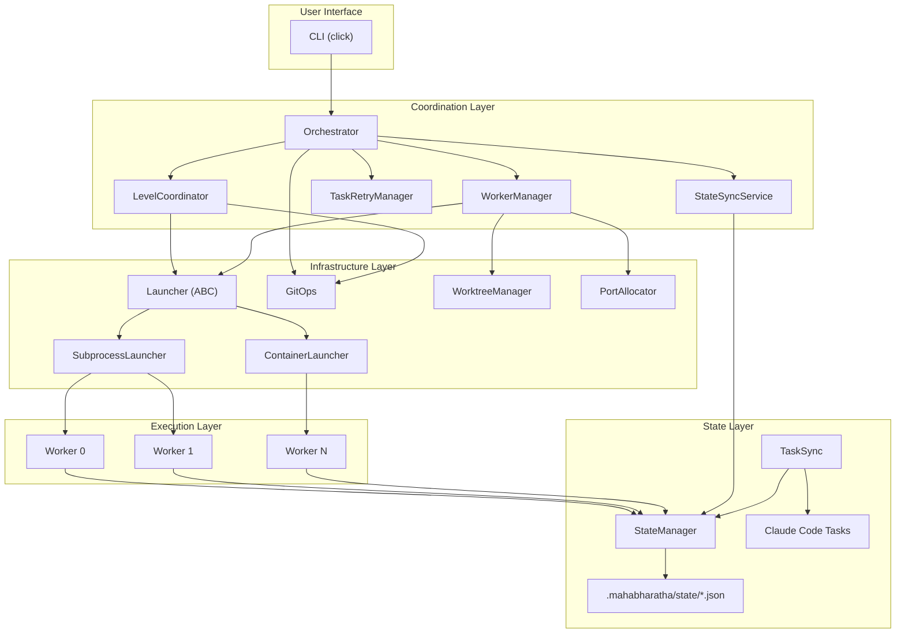
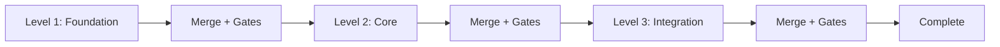

# Architecture Overview

MAHABHARATHA is a parallel Claude Code execution system that coordinates multiple worker instances to implement features concurrently. This page describes the high-level architecture, core abstractions, and design principles that govern the system.

## System Architecture

The system follows a layered architecture where the CLI accepts user commands, the orchestrator coordinates execution, launchers spawn workers, and workers execute tasks in isolated git worktrees.

## Core Concepts

### Task Graph

Every feature begins with a **task graph** (`task-graph.json`) produced by the `design` phase. The task graph defines:

- **Tasks**: Atomic units of work, each with a unique ID, title, description, file ownership, dependencies, and a verification command.
- **Levels**: Tasks are grouped into dependency levels. Level 1 tasks have no dependencies. Level 2 tasks depend only on Level 1 tasks, and so on.
- **File Ownership**: Each task declares the files it creates and modifies. No two tasks at the same level may own the same file, which eliminates merge conflicts within a level.

### Level-Based Execution

MAHABHARATHA enforces a strict execution order by level:

1. All workers execute their assigned Level 1 tasks in parallel.
2. When every Level 1 task completes, the orchestrator merges all worker branches into a staging branch and runs quality gates.
3. Workers pull the merged result and begin Level 2 tasks.
4. This repeats until all levels are complete.

This guarantees that downstream tasks always see a consistent, merged codebase from prior levels.

### File Ownership

File ownership is the mechanism that prevents merge conflicts. The design phase assigns each file to exactly one task per level. Workers operating on different files can proceed in parallel without coordination beyond level boundaries.

| Concept | Scope | Purpose |
|---------|-------|---------|
| Task | Single unit of work | Owns specific files, has verification command |
| Level | Group of independent tasks | All tasks at a level run concurrently |
| Worker | Claude Code instance | Executes assigned tasks in an isolated worktree |
| Worktree | Git worktree per worker | Provides filesystem isolation |

### Worker Isolation

Each worker runs in its own git worktree on a dedicated branch. Workers do not share a working directory. Communication between workers happens exclusively through:

- The shared **state JSON** file (with file-level locking via `fcntl.flock`).
- The **Claude Code Task system** (the authoritative source of truth for task status).

### Launcher Backends

Workers can be spawned via two backends:

- **SubprocessLauncher**: Runs Claude Code as a local subprocess. Suitable for development and single-machine execution.
- **ContainerLauncher**: Runs Claude Code inside Docker containers with bind-mounted worktrees. Required for production isolation and multi-user scenarios.

Both backends implement the `WorkerLauncher` abstract base class defined in `launcher.py`.

## Configuration

System behavior is controlled by `.mahabharatha/config.yaml`, which configures:

- Worker count and timeout limits
- Launcher type (subprocess or container)
- Quality gate commands
- Port allocation ranges
- Plugin and context engineering settings
- Retry and backpressure thresholds

See [[Architecture-State-Management]] for details on configuration and state files.

## Related Pages

- [[Architecture-Execution-Flow]] -- Step-by-step walkthrough of the plan-to-merge lifecycle.
- [[Architecture-Module-Reference]] -- Complete reference of all Python modules.
- [[Architecture-State-Management]] -- State files, Claude Tasks integration, and persistence.
- [[Architecture-Dependency-Graph]] -- Module import relationships visualized.
