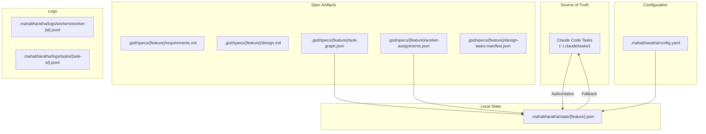
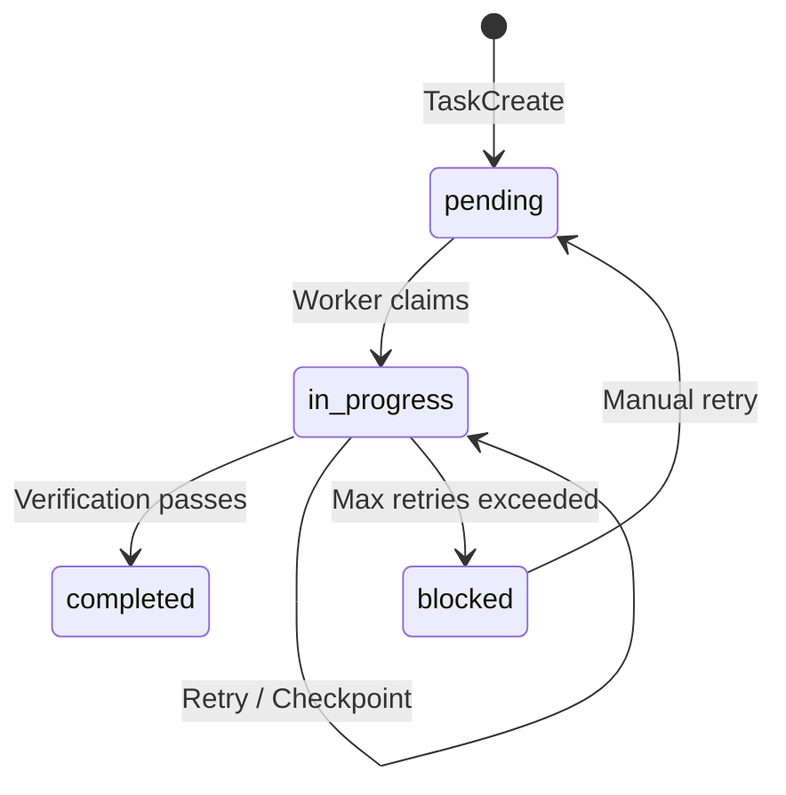

# Architecture: State Management

MAHABHARATHA manages state across multiple concurrent processes. This page documents the state storage locations, the role of the Claude Code Task system as the source of truth, and how state flows between components.

## State Hierarchy

MAHABHARATHA uses a layered state model. The Claude Code Task system is authoritative; JSON state files provide fast local access and act as a fallback when the Task system is unavailable.



## Storage Locations

### `.gsd/specs/<feature>/` -- Spec Directory

This directory holds the design-time artifacts for a feature. These files are created during the `plan` and `design` phases and are read-only during execution.

| File | Created By | Purpose |
|------|-----------|---------|
| `requirements.md` | `mahabharatha plan` | Feature requirements in prose |
| `design.md` | `mahabharatha design` | Architecture document |
| `task-graph.json` | `mahabharatha design` | Task definitions, levels, dependencies, file ownership |
| `worker-assignments.json` | `mahabharatha kurukshetra` | Task-to-worker mapping with ports and worktree paths |
| `design-tasks-manifest.json` | `mahabharatha design` | Bridge file for Claude Task registration |

### `.mahabharatha/state/<feature>.json` -- Runtime State

The `StateManager` class manages this file. It stores the current execution state for a feature, including task statuses, worker states, level completion, and timestamps.

**Concurrency model**: Multiple worker processes may read and write this file concurrently. `StateManager` uses `fcntl.flock` for cross-process exclusive file locking and a reentrant `threading.RLock` for in-process thread safety. All mutations go through the `_atomic_update` context manager, which acquires the lock, reloads state from disk, yields for the caller to mutate, saves to disk, and releases the lock.

```python
# Simplified state structure
{
  "feature": "my-feature",
  "status": "in_progress",
  "current_level": 2,
  "tasks": {
    "TASK-001": {
      "status": "complete",
      "worker_id": 0,
      "started_at": "2026-01-31T10:00:00",
      "completed_at": "2026-01-31T10:05:00"
    },
    "TASK-002": {
      "status": "in_progress",
      "worker_id": 1,
      "started_at": "2026-01-31T10:06:00"
    }
  },
  "workers": {
    "0": {"status": "running", "current_task": null},
    "1": {"status": "running", "current_task": "TASK-002"}
  },
  "levels": {
    "1": {"status": "merged", "completed_at": "2026-01-31T10:05:30"},
    "2": {"status": "in_progress"}
  }
}
```

### `.mahabharatha/config.yaml` -- Configuration

Loaded by `MahabharathaConfig` (Pydantic model) at startup. Controls all runtime behavior.

```yaml
project:
  name: my-project
  description: Project description

workers:
  count: 5
  timeout_minutes: 60
  context_threshold: 0.7

launcher:
  type: subprocess  # or "container"

quality_gates:
  - name: lint
    command: "ruff check ."
    timeout: 120
  - name: typecheck
    command: "mypy ."
    timeout: 180
  - name: test
    command: "pytest tests/"
    timeout: 300

ports:
  range_start: 49152
  range_end: 65535
  per_worker: 1

retry:
  max_attempts: 3
  strategy: exponential
  base_seconds: 5
  max_seconds: 60

plugins:
  context_engineering:
    enabled: true
    command_splitting: true
    security_rule_filtering: true
    task_context_budget_tokens: 4000
```

### Claude Code Tasks (`~/.claude/tasks/`) -- Source of Truth

The Claude Code Task system is the authoritative coordination layer. Tasks persist across session restarts and are visible to all workers sharing the same `CLAUDE_CODE_TASK_LIST_ID`.

**Task subject convention**: All MAHABHARATHA tasks use bracketed prefixes for discoverability:
- `[Plan] Capture requirements: my-feature`
- `[Design] Architecture for my-feature`
- `[L1] Create data models`
- `[L2] Implement API endpoints`

**Lifecycle**: Every task follows a strict status progression:



### `.mahabharatha/logs/` -- Structured Logs

Workers write structured JSONL logs to individual files. The `LogAggregator` merges these at read time by timestamp, so there is no single aggregated file on disk.

| Directory | File Pattern | Content |
|-----------|-------------|---------|
| `.mahabharatha/logs/workers/` | `worker-{id}.jsonl` | Per-worker execution log |
| `.mahabharatha/logs/tasks/` | `{task-id}.jsonl` | Per-task detailed log |

## State Synchronization

### JSON-to-Tasks Sync

The `TaskSync` module provides a one-way sync from JSON state to Claude Tasks. The orchestrator calls this after state changes to keep the Task system updated. Workers update both state JSON (directly) and Claude Tasks (via TaskUpdate calls in the worker protocol).

### StateSyncService

The `StateSyncService` keeps the in-memory `LevelController` synchronized with on-disk state. It runs periodically in the orchestrator loop and handles:

- Reloading task statuses from disk after workers update them.
- Detecting tasks stranded on stopped or crashed workers.
- Reassigning stranded tasks to available workers.

### Conflict Resolution

When the Claude Code Task system and state JSON disagree, the Task system wins. This is enforced in `mahabharatha status` and the orchestrator's sync loop. The `status` command cross-references both sources and flags mismatches.

## State During Failure Scenarios

| Scenario | State JSON | Claude Tasks | Recovery |
|----------|-----------|--------------|----------|
| Worker crash | Task remains `in_progress` | Task remains `in_progress` | `StateSyncService` detects stale worker, reassigns task |
| Worker checkpoint | Task stays `in_progress` with checkpoint note | Task updated with `CHECKPOINT:` description | New worker reads checkpoint and continues |
| Orchestrator restart | State file persists on disk | Tasks persist in `~/.claude/tasks/` | `mahabharatha kurukshetra --resume` reads both, skips completed tasks |
| Merge conflict | Level marked as failed | Tasks remain at current status | Manual resolution, then `mahabharatha merge --retry` |

## Related Pages

- [[Architecture-Overview]] -- High-level architecture and core concepts.
- [[Architecture-Execution-Flow]] -- How state changes flow through the execution lifecycle.
- [[Architecture-Module-Reference]] -- Modules that manage state: `state.py`, `task_sync.py`, `state_sync_service.py`.
- [[Architecture-Dependency-Graph]] -- Import relationships between state modules.
