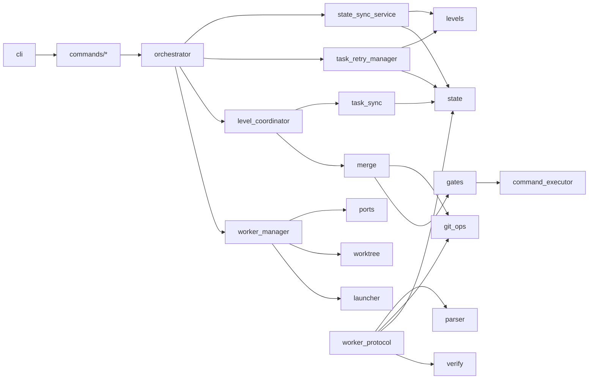
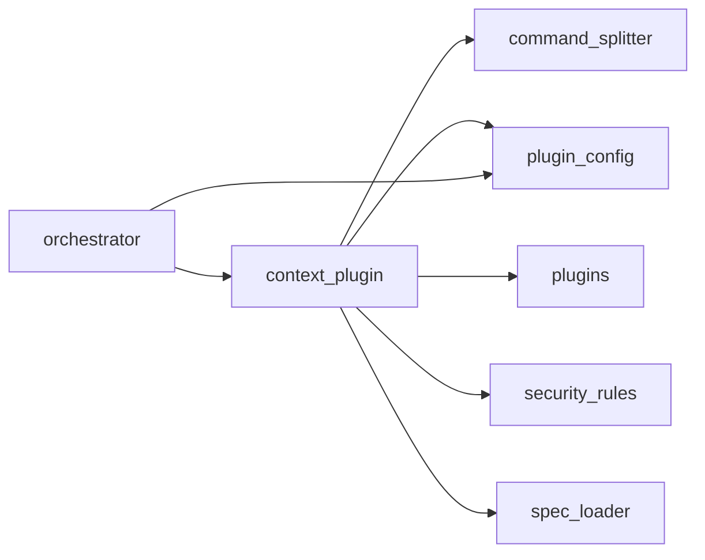

# Architecture: Dependency Graph

This page visualizes the import relationships between MAHABHARATHA Python modules. Understanding these relationships clarifies which modules are foundational, which are high-level coordinators, and where coupling exists.

## Dependency Layers

The codebase follows a layered dependency structure. Lower layers have fewer dependencies and are imported by many modules. Higher layers compose lower-layer modules to implement complex workflows.

```mermaid
graph TB
    subgraph "Layer 0: Foundation"
        constants
        exceptions
        logging["logging"]
    end

    subgraph "Layer 1: Types and Config"
        types --> constants
        plugin_config
        config --> constants
        config --> plugin_config
    end

    subgraph "Layer 2: Core Services"
        state --> constants
        state --> exceptions
        state --> logging
        state --> types
        levels --> constants
        levels --> exceptions
        levels --> logging
        levels --> types
        git_ops --> exceptions
        git_ops --> logging
        worktree --> constants
        worktree --> exceptions
        worktree --> logging
        assign --> logging
        assign --> types
        parser --> exceptions
        parser --> logging
        parser --> types
        parser --> validation
        validation --> exceptions
        ports --> constants
        ports --> logging
        command_executor --> logging
        log_writer --> constants
        retry_backoff
    end

    subgraph "Layer 3: Infrastructure"
        launcher --> constants
        launcher --> logging
        plugins --> constants
        plugins --> types
        verify --> command_executor
        verify --> exceptions
        verify --> logging
        verify --> types
        gates --> command_executor
        gates --> config
        gates --> constants
        gates --> exceptions
        gates --> logging
        gates --> plugins
        gates --> types
        spec_loader --> constants
        spec_loader --> logging
        security_rules --> logging
    end

    subgraph "Layer 4: Coordination"
        merge --> config
        merge --> constants
        merge --> exceptions
        merge --> gates
        merge --> git_ops
        merge --> logging
        merge --> types
        task_sync --> constants
        task_sync --> logging
        task_sync --> state
        state_sync_service --> constants
        state_sync_service --> levels
        state_sync_service --> logging
        state_sync_service --> state
        task_retry_manager --> config
        task_retry_manager --> constants
        task_retry_manager --> levels
        task_retry_manager --> log_writer
        task_retry_manager --> logging
        task_retry_manager --> retry_backoff
        task_retry_manager --> state
        backpressure --> logging
        circuit_breaker --> logging
    end

    subgraph "Layer 5: Managers"
        worker_manager --> assign
        worker_manager --> config
        worker_manager --> constants
        worker_manager --> launcher
        worker_manager --> levels
        worker_manager --> log_writer
        worker_manager --> logging
        worker_manager --> metrics
        worker_manager --> parser
        worker_manager --> plugins
        worker_manager --> ports
        worker_manager --> state
        worker_manager --> types
        worker_manager --> worktree
        level_coordinator --> assign
        level_coordinator --> config
        level_coordinator --> constants
        level_coordinator --> levels
        level_coordinator --> log_writer
        level_coordinator --> logging
        level_coordinator --> merge
        level_coordinator --> metrics
        level_coordinator --> parser
        level_coordinator --> plugins
        level_coordinator --> state
        level_coordinator --> task_sync
        level_coordinator --> types
        launcher_configurator --> config
        launcher_configurator --> constants
        launcher_configurator --> launcher
        launcher_configurator --> logging
        launcher_configurator --> plugins
        launcher_configurator --> types
    end

    subgraph "Layer 6: Orchestrator"
        orchestrator --> assign
        orchestrator --> backpressure
        orchestrator --> circuit_breaker
        orchestrator --> config
        orchestrator --> constants
        orchestrator --> containers
        orchestrator --> context_plugin
        orchestrator --> gates
        orchestrator --> launcher
        orchestrator --> launcher_configurator
        orchestrator --> level_coordinator
        orchestrator --> levels
        orchestrator --> log_writer
        orchestrator --> logging
        orchestrator --> merge
        orchestrator --> metrics
        orchestrator --> parser
        orchestrator --> plugin_config
        orchestrator --> plugins
        orchestrator --> ports
        orchestrator --> state
        orchestrator --> state_sync_service
        orchestrator --> task_retry_manager
        orchestrator --> task_sync
        orchestrator --> types
        orchestrator --> worker_manager
        orchestrator --> worktree
    end
```

## Simplified View

The full graph above is dense. This simplified view shows only the primary relationships between major components:

## Module Dependency Counts

This table lists modules ordered by the number of internal imports they consume (dependencies) and the number of other modules that import them (dependents). Modules with many dependents and few dependencies are foundational. Modules with many dependencies are coordinators.

| Module | Dependencies | Dependents | Role |
|--------|:------------:|:----------:|------|
| `constants` | 0 | 30+ | Foundation -- enumerations and constants |
| `exceptions` | 0 | 10+ | Foundation -- error hierarchy |
| `logging` | 0 | 25+ | Foundation -- structured logging |
| `types` | 1 | 15+ | Foundation -- data structures |
| `plugin_config` | 0 | 3 | Foundation -- plugin configuration models |
| `retry_backoff` | 0 | 1 | Utility -- backoff calculation |
| `validation` | 1 | 2 | Core -- task graph validation |
| `state` | 4 | 7 | Core -- state persistence |
| `levels` | 4 | 5 | Core -- level execution control |
| `git_ops` | 2 | 3 | Infrastructure -- git operations |
| `launcher` | 2 | 4 | Infrastructure -- worker spawning |
| `assign` | 2 | 4 | Core -- task assignment |
| `parser` | 4 | 4 | Core -- task graph parsing |
| `gates` | 7 | 2 | Quality -- gate execution |
| `merge` | 7 | 2 | Coordination -- branch merging |
| `worker_manager` | 14 | 1 | Manager -- worker lifecycle |
| `level_coordinator` | 14 | 1 | Manager -- level workflows |
| `orchestrator` | 26 | 1 | Top-level -- system coordination |

## Import Relationship Rules

The codebase follows these dependency rules:

1. **Foundation modules import nothing from `mahabharatha`** (except `constants` which imports nothing). This ensures a stable base layer.
2. **No circular imports**. The layered structure prevents cycles: higher layers depend on lower layers, never the reverse.
3. **The orchestrator is the only module that imports from all layers.** It is the composition root that wires everything together.
4. **Worker modules (`worker_protocol`, `worker_main`) do not import orchestrator modules.** Workers are independent processes that communicate through state files and the Task system, not through in-process function calls.
5. **Command modules** in `mahabharatha/commands/` import from the core and infrastructure layers but do not import the orchestrator directly (the `kurukshetra` command invokes it through the configured entry point).

## Context Engineering Dependencies

The context engineering subsystem has its own dependency chain:

`ContextEngineeringPlugin` composes three strategies:
- `CommandSplitter` for splitting large command files into core and detail sections.
- `SpecLoader` for extracting relevant spec excerpts per task.
- `security_rules` for filtering coding rules by file extension.

## Related Pages

- [[Architecture-Overview]] -- High-level architecture and core concepts.
- [[Architecture-Module-Reference]] -- Detailed description of each module.
- [[Architecture-Execution-Flow]] -- How modules interact during execution.
- [[Architecture-State-Management]] -- State flow between persistence modules.
