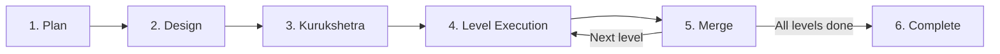
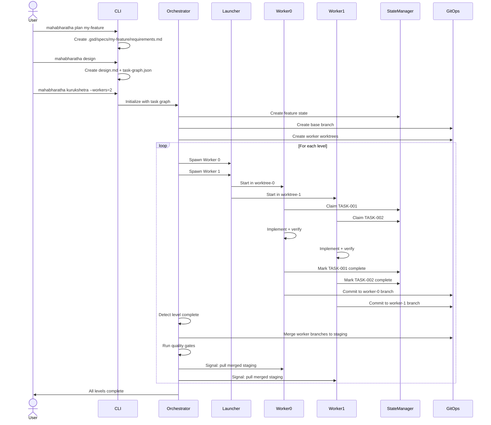

# Architecture: Execution Flow

This page describes the complete lifecycle of a MAHABHARATHA feature, from initial planning through parallel execution and final merge. Each phase produces artifacts that feed into the next.

## Phase Overview



| Phase | Command | Input | Output |
|-------|---------|-------|--------|
| Plan | `mahabharatha plan <feature>` | User description | `requirements.md` |
| Design | `mahabharatha design` | Requirements | `design.md`, `task-graph.json` |
| Kurukshetra | `mahabharatha kurukshetra` | Task graph | Worker assignments, worktrees |
| Execute | (workers) | Assignments | Code changes, commits |
| Merge | `mahabharatha merge` / auto | Worker branches | Merged staging branch |

## Sequence Diagram



## Phase Details

### 1. Plan

The `plan` command captures requirements from the user and writes them to `.gsd/specs/<feature>/requirements.md`. This file serves as the source of truth for what the feature should accomplish. The plan phase also records the feature name in `.gsd/.current-feature`.

**Artifacts produced:**
- `.gsd/specs/<feature>/requirements.md`
- `.gsd/.current-feature`

### 2. Design

The `design` command reads the requirements and produces an architecture document and a task graph. The task graph is the critical artifact: it defines every task, its file ownership, dependencies, level assignment, and verification command.

**Artifacts produced:**
- `.gsd/specs/<feature>/design.md`
- `.gsd/specs/<feature>/task-graph.json`
- `.gsd/specs/<feature>/design-tasks-manifest.json` (bridge for Claude Tasks registration)

**Task graph structure:**

```json
{
  "feature": "my-feature",
  "total_tasks": 8,
  "max_parallelization": 4,
  "tasks": [
    {
      "id": "TASK-001",
      "title": "Create data models",
      "level": 1,
      "files": {
        "create": ["src/models.py"],
        "modify": [],
        "read": ["src/types.py"]
      },
      "dependencies": [],
      "verification": {
        "command": "python -m pytest tests/test_models.py",
        "timeout_seconds": 30
      }
    }
  ]
}
```

### 3. Kurukshetra (Launch)

The `kurukshetra` command is the main entry point for parallel execution. It performs several steps in sequence:

1. **Pre-flight checks** (`preflight.py`): Validates Docker availability, authentication, ports, disk space, and git worktree support.
2. **Task graph parsing** (`parser.py`): Loads and validates the task graph. Checks file ownership uniqueness, dependency correctness, and structural integrity.
3. **Worker assignment** (`assign.py`): Distributes tasks across workers. Balances load by estimated duration and respects level boundaries.
4. **Worktree creation** (`worktree.py`): Creates isolated git worktrees, one per worker, each on a dedicated branch (`mahabharatha/<feature>/worker-N`).
5. **Port allocation** (`ports.py`): Assigns available ports to workers to avoid conflicts.
6. **State initialization** (`state.py`): Creates the feature state file in `.mahabharatha/state/<feature>.json`.
7. **Task registration** (`task_sync.py`): Registers all tasks in the Claude Code Task system with `[L<level>] <title>` subject prefixes.
8. **Worker spawning** (`launcher.py`): Launches workers via the configured backend (subprocess or container).
9. **Orchestration loop** (`orchestrator.py`): Monitors workers, coordinates level transitions, triggers merges.

### 4. Level Execution (Workers)

Each worker follows the protocol defined in `mahabharatha:worker.core.md`:

1. **Load context**: Read requirements, design, task graph, and worker assignments.
2. **Identify tasks**: Filter assigned tasks for the current level.
3. **Claim task**: Update the Claude Code Task system to `in_progress`.
4. **Execute**: Read dependency files, create/modify owned files.
5. **Verify**: Run the task's verification command.
6. **Commit**: Stage and commit changes to the worker branch.
7. **Report**: Update task status to `completed` in both state JSON and Claude Tasks.

Workers monitor their context usage and checkpoint at 70% capacity, allowing the orchestrator to restart a fresh instance that resumes from the checkpoint.

### 5. Merge

When all tasks at a level complete, the `LevelCoordinator` triggers the merge flow:

1. **Collect branches**: Identify all worker branches with commits for this level.
2. **Sequential merge**: Merge each worker branch into the staging branch (`mahabharatha/<feature>/staging`).
3. **Conflict resolution**: If a merge conflict occurs (should not happen with correct file ownership), the merge is aborted and the level is marked as failed.
4. **Quality gates**: Run configured quality gate commands (lint, typecheck, test) against the merged staging branch.
5. **Distribute**: Workers pull the merged staging branch and rebase before starting the next level.

### 6. Completion

After the final level is merged and passes quality gates, the orchestrator:

- Writes a completion summary to state.
- Verifies all tasks are marked `completed` in the Claude Task system.
- Cleans up worktrees (optional, based on configuration).
- Reports results to the user.

## Error Handling

### Task Failure

When a task's verification command fails, the worker retries up to 3 times with different approaches. After exhausting retries, the task is marked `BLOCKED` and the worker moves to the next assigned task. The `TaskRetryManager` in the orchestrator tracks retry counts and applies exponential backoff.

### Worker Crash

If a worker process exits unexpectedly, the orchestrator detects the lost heartbeat and reassigns uncompleted tasks to other workers or spawns a replacement worker. The `CircuitBreaker` prevents repeated spawning of workers that fail immediately.

### Context Exhaustion

Workers monitor their context window usage via `context_tracker.py`. At 70% capacity, they commit work-in-progress, write a checkpoint to the task description, and exit with code 2. The orchestrator interprets this exit code as a checkpoint signal and spawns a fresh worker instance that reads the checkpoint and continues.

## Related Pages

- [[Architecture-Overview]] -- High-level architecture and core concepts.
- [[Architecture-Module-Reference]] -- Detailed module reference.
- [[Architecture-State-Management]] -- How state flows through the system.
- [[Architecture-Dependency-Graph]] -- Module import relationships.
