# Mahabharatha Architecture

**Zero-Effort Rapid Growth** - Parallel Claude Code Execution System

Mahabharatha is a distributed software development system that coordinates multiple Claude Code instances to build features in parallel. It combines spec-driven development (GSD methodology), level-based task execution, and git worktrees for isolated execution.

---

## Table of Contents

- [Core Principles](#core-principles)
- [System Layers](#system-layers)
- [Execution Flow](#execution-flow)
- [Module Reference](#module-reference)
- [Cross-Cutting Capabilities](#cross-cutting-capabilities)
- [Warrior Execution Model](#warrior-execution-model)
- [Resilience](#resilience)
- [State Management](#state-management)
- [Claude Code Task Integration](#claude-code-task-integration)
- [Context Engineering](#context-engineering)
- [Diagnostics Engine](#diagnostics-engine)
- [Quality Gates](#quality-gates)
- [Pre-commit Hooks](#pre-commit-hooks)
- [Security Model](#security-model)
- [Configuration](#configuration)

---

## Core Principles

### Spec as Memory

Warriors do not share conversation context. They share:
- `requirements.md` — what to build
- `design.md` — how to build it
- `task-graph.json` — atomic work units

This makes warriors **stateless**. Any warrior can pick up any task. Crash recovery is trivial.

### Exclusive File Ownership

Each task declares which files it creates or modifies. The design phase ensures no overlap within a level. This eliminates merge conflicts without runtime locking.

```json
{
  "id": "TASK-001",
  "files": {
    "create": ["src/models/user.py"],
    "modify": [],
    "read": ["src/config.py"]
  }
}
```

### Level-Based Execution

Tasks are organized into dependency levels:

| Level | Name | Description |
|-------|------|-------------|
| 1 | Foundation | Types, schemas, config |
| 2 | Core | Business logic, services |
| 3 | Integration | Wiring, endpoints |
| 4 | Testing | Unit and integration tests |
| 5 | Quality | Docs, cleanup |

All warriors complete Level N before any proceed to N+1. The orchestrator merges all branches, runs quality gates, then signals warriors to continue.

### Git Worktrees for Isolation

Each warrior operates in its own git worktree with its own branch:

```
.mahabharatha-worktrees/{feature}/worker-0/  ->  branch: mahabharatha/{feature}/worker-0
.mahabharatha-worktrees/{feature}/worker-1/  ->  branch: mahabharatha/{feature}/worker-1
```

Warriors commit independently. No filesystem conflicts.

---

## System Layers

### What Are System Layers?

Think of Mahabharatha like a factory assembly line. Raw materials (your requirements) enter at one end, and finished software comes out the other. But unlike a physical factory, you can't just dump everything in at once—each stage transforms the work before passing it to the next.

Mahabharatha organizes this transformation into four distinct layers, each with a specific job. Understanding these layers helps you know what's happening at any point in the build process and where to look when something goes wrong.

### Why Do Layers Exist?

Without clear boundaries, parallel workers would step on each other's toes. Imagine five cooks trying to simultaneously shop for ingredients, prep vegetables, and plate dishes—chaos. Layers enforce order: you finish planning before you start designing, and you finish designing before workers start building.

Each layer also serves as a checkpoint. If requirements are unclear, you find out during planning—not after three workers have already built the wrong thing. This "fail early" philosophy saves hours of wasted work.

### Layer Architecture

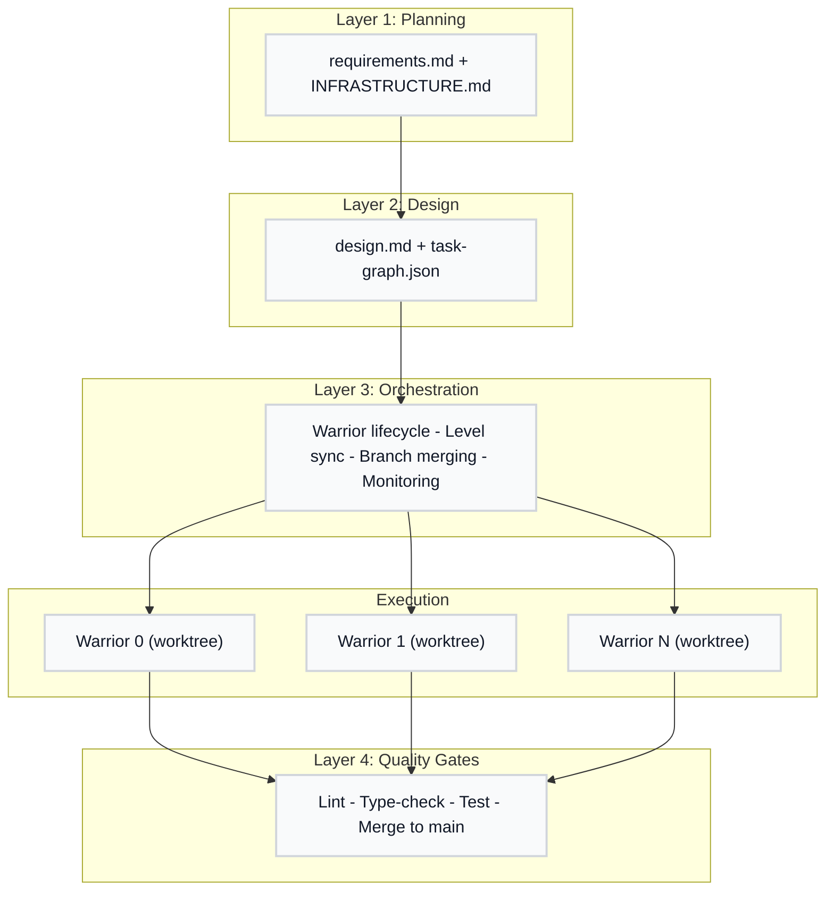

### How the Layers Connect

**Layer 1 (Planning)** captures what you want to build. The `/mahabharatha:plan` command guides you through discovery and produces `requirements.md`—a document that workers will read to understand their mission.

**Layer 2 (Design)** breaks requirements into buildable pieces. The `/mahabharatha:design` command analyzes your requirements and produces both an architecture document (`design.md`) and a task graph (`task-graph.json`) that lists every atomic piece of work.

**Layer 3 (Orchestration)** manages the actual building. It spawns workers (warriors), assigns them tasks, monitors progress, and coordinates the merge dance at level boundaries. This is where the parallel magic happens.

**Layer 4 (Quality Gates)** ensures nothing broken reaches your main branch. After each level completes, gates run linting, type checking, and tests. Only code that passes all gates gets merged—protecting your codebase from half-finished work.

### Plugin System

### What Is the Plugin System?

Mahabharatha's plugin system lets you extend the build process without modifying Mahabharatha's core code. Think of it like adding apps to your phone—the phone works fine out of the box, but plugins let you customize it for your specific needs.

Plugins come in three flavors: quality gates (add new validation checks), lifecycle hooks (react to events like "task completed"), and launchers (change how workers run). Each type has a clear contract defining what it can do and what information it receives.

### Why Does the Plugin System Exist?

Every team has unique requirements. Maybe you need to run security scans, post Slack notifications, or deploy workers to Kubernetes instead of local Docker. Rather than bloating Mahabharatha with every possible feature, the plugin system lets you add exactly what you need.

This separation also makes Mahabharatha more maintainable. Core orchestration logic stays simple while specialized behaviors live in plugins that can be developed, tested, and updated independently.

### Plugin Architecture

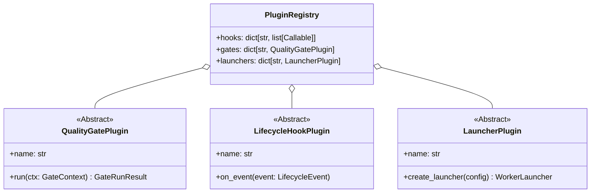

### How Plugins Connect

The `PluginRegistry` is the central catalog—it knows every plugin that's loaded. When the orchestrator needs to run quality gates, it asks the registry for all registered gate plugins. When a task completes, the registry dispatches the event to all lifecycle hooks.

**PluginHookEvent** lifecycle (8 events): `TASK_STARTED`, `TASK_COMPLETED`, `LEVEL_COMPLETE`, `MERGE_COMPLETE`, `RUSH_FINISHED`, `QUALITY_GATE_RUN`, `WORKER_SPAWNED`, `WORKER_EXITED`

**Integration points**:
- `orchestrator.py` — emits lifecycle events, runs plugin gates after merge
- `worker_protocol.py` — emits `TASK_STARTED`/`TASK_COMPLETED` events
- `gates.py` — delegates to plugin gates registered in the registry
- `launcher.py` — resolves launcher plugins by name via `get_plugin_launcher()`

**Discovery**: Plugins are loaded via `importlib.metadata` entry points (group: `mahabharatha.plugins`) or YAML-configured shell command hooks in `.mahabharatha/config.yaml`.

Configuration models: `PluginsConfig` -> `HookConfig`, `PluginGateConfig`, `LauncherPluginConfig` (see `mahabharatha/plugin_config.py`).

---

## Execution Flow

Understanding how Mahabharatha executes a feature build is like understanding how a relay race works. Each phase hands off to the next, and workers run their legs in parallel within each level. Let's trace the entire journey from "I have an idea" to "the feature is merged."

### Planning Phase (`/mahabharatha:plan`)

#### What Is Planning?

Planning is the conversation phase where Mahabharatha helps you articulate what you want to build. Rather than accepting vague requirements and guessing wrong, Mahabharatha asks probing questions until both you and the system have a shared understanding.

#### Why Does Planning Exist?

The most expensive bugs are requirements bugs—building the wrong thing entirely. By investing time upfront in clarifying what you want, Mahabharatha avoids the frustration of workers building features you didn't actually need. The output is a `requirements.md` file that workers will read as their mission brief.

#### Planning Flow


### Design Phase (`/mahabharatha:design`)

#### What Is Design?

Design is where Mahabharatha transforms "what to build" into "how to build it." The design phase analyzes your requirements, proposes an architecture, and breaks the work into atomic tasks that can be executed in parallel without stepping on each other.

#### Why Does Design Exist?

Parallel execution requires careful coordination. If two workers both try to modify the same file, you get merge conflicts. If a worker starts building a feature that depends on code that doesn't exist yet, it fails. Design solves both problems by assigning exclusive file ownership and organizing tasks into dependency levels.

#### Design Flow

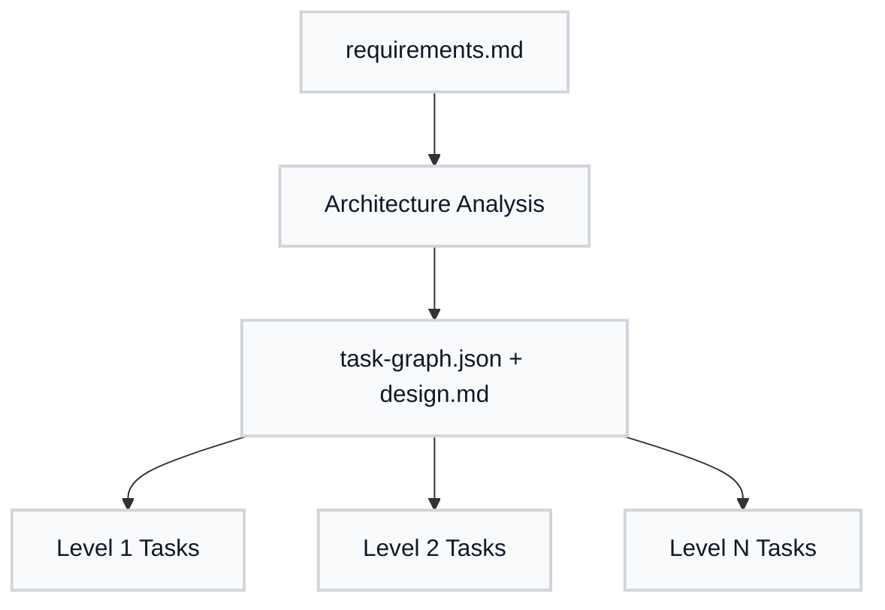

### Kurukshetra Phase (`/mahabharatha:Kurukshetra`)

#### What Is Kurukshetra?

Kurukshetra is the execution phase—when workers actually write code. The orchestrator spawns multiple Claude Code instances (warriors), each in its own isolated workspace, and coordinates their work through level-based execution.

#### Why Does Kurukshetra Exist This Way?

Traditional development is sequential: one developer finishes, then another starts. Mahabharatha flips this by running workers in parallel wherever possible. But parallelism needs coordination. Kurukshetra implements that coordination: spawning workers, assigning tasks, monitoring progress, merging results, and running quality gates.

The level-based approach ensures dependencies are respected. All Level 1 tasks (foundations like types and schemas) complete and merge before any Level 2 tasks (business logic that uses those types) can start.

#### Kurukshetra Flow

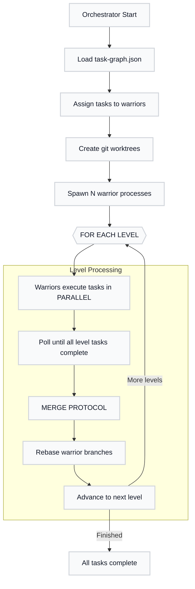

### How the Phases Connect

The phases form a pipeline: planning feeds design, design feeds Kurukshetra. But it's not just data flow—it's also quality gates between each transition. You must approve the requirements before design starts. You must approve the task graph before Kurukshetra starts. This prevents expensive mistakes from propagating through the pipeline.

### Warrior Protocol

Each warrior:

1. Loads `requirements.md`, `design.md`, `task-graph.json`
2. Reads `worker-assignments.json` for its tasks
3. For each level:
   - Pick next assigned task at current level
   - Read all dependency files
   - Implement the task
   - Run verification command
   - On pass: commit, mark complete
   - On fail: retry 3x, then mark blocked
4. After level complete: wait for merge signal
5. Pull merged changes
6. Continue to next level
7. At 70% context: commit WIP, exit (orchestrator restarts)

---

## Module Reference

Mahabharatha is composed of 80+ Python modules organized into functional groups.

### Core Modules (`mahabharatha/`)

| Module | Purpose |
|--------|---------|
| `orchestrator.py` | Fleet management, level transitions, merge triggers |
| `levels.py` | Level-based execution control, dependency enforcement |
| `state.py` | Thread-safe file-based state persistence |
| `worker_protocol.py` | Warrior-side execution, Claude Code invocation |
| `launcher.py` | Abstract worker spawning (subprocess/container) |
| `launcher_configurator.py` | Launcher mode detection and configuration |
| `worker_manager.py` | Worker lifecycle management, health tracking |
| `level_coordinator.py` | Cross-level coordination and synchronization |

### Task Management

| Module | Purpose |
|--------|---------|
| `assign.py` | Task-to-warrior assignment with load balancing |
| `parser.py` | Parse and validate task graphs |
| `verify.py` | Execute task verification commands |
| `task_sync.py` | ClaudeTask model, TaskSyncBridge (JSON state to Claude Tasks) |
| `task_retry_manager.py` | Retry policy and management for failed tasks |
| `backlog.py` | Backlog generation and tracking |
| `dependency_checker.py` | Validate task dependencies before claiming |
| `graph_validation.py` | Task graph structure validation |

### Resilience & Flow Control

| Module | Purpose |
|--------|---------|
| `backpressure.py` | Load shedding and flow control under pressure |
| `circuit_breaker.py` | Circuit breaker pattern for failing operations |
| `retry_backoff.py` | Exponential backoff for retry strategies |
| `risk_scoring.py` | Risk assessment for task and merge operations |
| `whatif.py` | What-if analysis for execution planning |
| `preflight.py` | Pre-execution validation checks |
| `heartbeat.py` | Worker heartbeat monitoring for stall detection |
| `escalation.py` | Worker escalation and human-in-the-loop requests |
| `progress_reporter.py` | Real-time progress reporting from workers |

### Cross-Cutting Capabilities

| Module | Purpose |
|--------|---------|
| `capability_resolver.py` | Resolve CLI flags + config into ResolvedCapabilities |
| `depth_tiers.py` | Analysis depth tiers (quick/standard/think/think-hard/ultrathink) |
| `modes.py` | Behavioral modes (precision/speed/exploration/refactor/debug) |
| `loops.py` | Iterative improvement loop controller |
| `efficiency.py` | Token efficiency zones and compact formatting |
| `mcp_router.py` | MCP server auto-routing based on task signals |
| `mcp_telemetry.py` | MCP routing telemetry and analytics |
| `tdd.py` | TDD enforcement and test-first workflow |
| `verification_tiers.py` | Verification gate tier configuration |
| `verification_gates.py` | Per-level verification gate runner |

### Git & Merge

| Module | Purpose |
|--------|---------|
| `git_ops.py` | Low-level git operations |
| `worktree.py` | Git worktree management for warrior isolation |
| `merge.py` | Branch merging after each level |

### Quality & Security

| Module | Purpose |
|--------|---------|
| `gates.py` | Execute quality gates (lint, typecheck, test) |
| `security.py` | Security validation, hook patterns |
| `validation.py` | Task graph and ID validation |
| `command_executor.py` | Safe command execution with argument parsing |

### Configuration & Types

| Module | Purpose |
|--------|---------|
| `config.py` | Pydantic configuration management |
| `constants.py` | Enumerations (TaskStatus, WorkerStatus, GateResult) |
| `types.py` | TypedDict and dataclass definitions |
| `schemas/` | JSON schema definitions |

### Plugin System

| Module | Purpose |
|--------|---------|
| `plugins.py` | Plugin ABCs (QualityGatePlugin, LifecycleHookPlugin, LauncherPlugin, ContextPlugin), PluginRegistry |
| `plugin_config.py` | Pydantic models for plugin YAML configuration |
| `context_plugin.py` | ContextEngineeringPlugin for token-budgeted task context |
| `command_splitter.py` | Split large command files into .core.md + .details.md |

### Logging & Metrics

| Module | Purpose |
|--------|---------|
| `log_writer.py` | StructuredLogWriter (per-worker JSONL), TaskArtifactCapture |
| `log_aggregator.py` | Read-side aggregation, time-sorted queries across workers |
| `logging.py` | Logging setup, Python logging bridge, LogPhase/LogEvent enums |
| `metrics.py` | Duration, percentile calculations, metric type definitions |
| `worker_metrics.py` | Per-task execution metrics (timing, context usage, retries) |
| `render_utils.py` | Output formatting and display utilities |
| `status_formatter.py` | Format status output for CLI display |
| `event_emitter.py` | Event streaming for real-time status updates |
| `token_tracker.py` | Track token usage across sessions |
| `token_counter.py` | Estimate token counts for text |
| `token_aggregator.py` | Aggregate token usage statistics |

### Container Management

| Module | Purpose |
|--------|---------|
| `containers.py` | ContainerManager, ContainerInfo for Docker lifecycle |

### Context & Execution

| Module | Purpose |
|--------|---------|
| `context_tracker.py` | Heuristic token counting, checkpoint decisions |
| `spec_loader.py` | Load and truncate GSD specs (requirements.md, design.md) |
| `dryrun.py` | Dry-run simulation for `/mahabharatha:Kurukshetra --dry-run` |
| `worker_main.py` | Worker process entry point |
| `ports.py` | Port allocation for worker processes (range 49152-65535) |
| `exceptions.py` | Exception hierarchy (MahabharathaError -> Task/Worker/Git/Gate errors) |
| `state_sync_service.py` | State synchronization across distributed workers |
| `state_reconciler.py` | Reconcile state conflicts between workers |
| `adaptive_detail.py` | Adaptive detail levels based on context pressure |
| `step_generator.py` | Generate execution steps from task specs |
| `step_executor.py` | Execute generated steps |
| `claude_tasks_reader.py` | Read Claude Code Task system state |

### Project Initialization

| Module | Purpose |
|--------|---------|
| `charter.py` | Project charter generation |
| `inception.py` | Inception mode (empty directory -> project scaffold) |
| `tech_selector.py` | Technology stack recommendation |
| `devcontainer_features.py` | Devcontainer feature configuration |
| `security_rules.py` | Security rules fetching from TikiTribe |
| `architecture.py` | Project architecture analysis |
| `architecture_gate.py` | Architecture compliance quality gate |
| `repo_map.py` | Generate repository structure maps |
| `repo_map_js.py` | JavaScript-specific repo mapping |
| `ast_analyzer.py` | AST analysis for code understanding |
| `ast_cache.py` | Cache AST analysis results |
| `test_scope.py` | Determine test scope for changes |
| `formatter_detector.py` | Detect code formatters in project |

### Diagnostics (`mahabharatha/diagnostics/`)

| Module | Purpose |
|--------|---------|
| `error_intel.py` | Multi-language error parsing, fingerprinting, chain analysis |
| `hypothesis_engine.py` | Bayesian hypothesis testing with prior/posterior scoring |
| `knowledge_base.py` | 30+ known failure patterns with calibrated probabilities |
| `log_correlator.py` | Cross-worker log correlation, temporal clustering |
| `log_analyzer.py` | Log pattern analysis and trend detection |
| `code_fixer.py` | Code-aware fix suggestions, import chain analysis |
| `recovery.py` | Recovery plan generation with risk-rated steps |
| `env_diagnostics.py` | Environment checks (Python, Docker, resources, config) |
| `state_introspector.py` | Deep state file analysis and corruption detection |
| `system_diagnostics.py` | System-level checks (disk, ports, worktrees) |
| `types.py` | Diagnostic type definitions |

### Performance Analysis (`mahabharatha/performance/`)

| Module | Purpose |
|--------|---------|
| `stack_detector.py` | Auto-detect project language and framework |
| `tool_registry.py` | Registry of available analysis tools |
| `catalog.py` | Tool catalog with install instructions |
| `aggregator.py` | Combine results from multiple analysis tools |
| `formatters.py` | Format analysis output (markdown, SARIF, JSON) |
| `types.py` | Performance analysis type definitions |

#### Tool Adapters (`mahabharatha/performance/adapters/`)

| Adapter | Tool | Analysis Type |
|---------|------|---------------|
| `radon_adapter.py` | radon | Cyclomatic complexity |
| `lizard_adapter.py` | lizard | Multi-language complexity |
| `vulture_adapter.py` | vulture | Dead code detection |
| `jscpd_adapter.py` | jscpd | Copy-paste detection |
| `cloc_adapter.py` | cloc | Lines of code counting |
| `semgrep_adapter.py` | semgrep | Semantic code analysis |
| `trivy_adapter.py` | trivy | Vulnerability scanning |
| `deptry_adapter.py` | deptry | Dependency health |
| `pipdeptree_adapter.py` | pipdeptree | Dependency tree analysis |
| `hadolint_adapter.py` | hadolint | Dockerfile linting |
| `dive_adapter.py` | dive | Docker image analysis |

### CLI

| Module | Purpose |
|--------|---------|
| `cli.py` | CLI entry point (`mahabharatha` command), install/uninstall subcommands |
| `__main__.py` | Package entry point for `python -m mahabharatha` |

### CLI Commands (`mahabharatha/commands/`)

Commands are implemented as Python modules in `mahabharatha/commands/` and/or as markdown spec files in `mahabharatha/data/commands/`. Some commands (marked "spec only") have no Python implementation and are interpreted directly by Claude Code.

| Command | Module | Purpose |
|---------|--------|---------|
| `/mahabharatha:init` | `init.py` | Project initialization (Inception/Discovery modes) |
| `/mahabharatha:brainstorm` | (spec only) | Feature discovery and GitHub issue creation |
| `/mahabharatha:plan` | `plan.py` | Capture requirements (Socratic discovery) |
| `/mahabharatha:design` | `design.py` | Generate architecture and task graph |
| `/mahabharatha:Kurukshetra` | `Kurukshetra.py` | Launch parallel warriors |
| `/mahabharatha:status` | `status.py` | Progress monitoring dashboard |
| `/mahabharatha:stop` | `stop.py` | Stop warriors (graceful/force) |
| `/mahabharatha:retry` | `retry.py` | Retry failed tasks |
| `/mahabharatha:logs` | `logs.py` | View and aggregate warrior logs |
| `/mahabharatha:merge` | `merge_cmd.py` | Manual merge control |
| `/mahabharatha:cleanup` | `cleanup.py` | Remove artifacts |
| `/mahabharatha:debug` | `debug.py` | Deep diagnostic investigation |
| `/mahabharatha:build` | `build.py` | Build orchestration with error recovery |
| `/mahabharatha:test` | `test_cmd.py` | Test execution with coverage |
| `/mahabharatha:analyze` | `analyze.py` | Static analysis and metrics |
| `/mahabharatha:review` | `review.py` | Code review (spec compliance + quality) |
| `/mahabharatha:security` | `security_rules_cmd.py` | Vulnerability scanning |
| `/mahabharatha:refactor` | `refactor.py` | Automated code improvement |
| `/mahabharatha:git` | `git_cmd.py` | Intelligent git operations |
| `/mahabharatha:plugins` | (spec only) | Plugin system management |
| `/mahabharatha:document` | `document.py` | Documentation generation for components |
| `/mahabharatha:estimate` | (spec only) | Effort estimation with PERT intervals |
| `/mahabharatha:explain` | (spec only) | Educational code explanations |
| `/mahabharatha:index` | (spec only) | Project documentation wiki generation |
| `/mahabharatha:select-tool` | (spec only) | Intelligent tool routing |
| `/mahabharatha:worker` | `worker_protocol.py` | Warrior execution protocol |
| `/mahabharatha:wiki` | `wiki.py` | Generate wiki documentation pages |
| `install_commands.py` | | Install/uninstall slash commands |
| `loop_mixin.py` | | Shared improvement loop mixin for commands |

---

## Warrior Execution Model

### What Is a Warrior?

A warrior is a single Claude Code worker instance—an AI that reads the spec files and writes code to complete its assigned tasks. The name comes from the idea of overwhelming a feature with many small, focused workers rather than one monolithic process.

Each warrior operates independently. It doesn't share memory with other warriors, doesn't have access to their conversation history, and works in its own isolated directory. This independence is a feature, not a limitation—it makes the system robust against crashes and easy to scale.

### Why Independent Execution?

If warriors shared state, a crash in one could corrupt data for all others. Shared conversation history would mean workers waiting for context windows to sync. Shared file systems would mean merge conflicts constantly.

By keeping warriors fully isolated, Mahabharatha achieves: crash recovery (just restart the failed worker), horizontal scaling (add more workers without coordination overhead), and deterministic behavior (same inputs always produce same outputs).

### Isolation Strategy

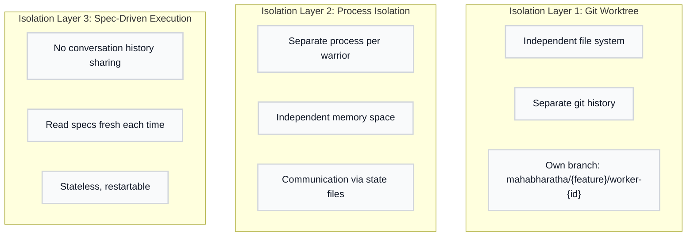

### How Isolation Layers Work Together

**Layer 1 (Git Worktree)** gives each worker its own copy of the codebase. Git worktrees are a built-in feature that creates independent working directories sharing the same repository. Worker 0 can edit files in its worktree while Worker 1 edits different files in its worktree—no conflicts possible.

**Layer 2 (Process Isolation)** means each worker runs as a separate OS process. If Worker 2 crashes, Workers 0, 1, and 3 keep running. Communication happens through files on disk (the state JSON), not shared memory.

**Layer 3 (Spec-Driven Execution)** is the key to restartability. Workers don't remember previous conversations—they read the spec files fresh every time. If a worker crashes mid-task, just restart it. It will read the specs, see the task is incomplete, and pick up where it left off.

### Launcher Abstraction

#### What Is a Launcher?

A launcher is the mechanism that starts and manages worker processes. Mahabharatha supports multiple execution environments: local processes (subprocess), Docker containers, or plugin-provided environments like Kubernetes. The launcher abstraction hides these differences so the orchestrator doesn't need to know how workers run—just that they do.

#### Why Abstract the Launcher?

Different environments have different requirements. During development, you might run workers as local processes for fast iteration. In CI, you might run them in containers for reproducibility. In production, you might use Kubernetes for scaling.

Rather than hard-coding one approach, Mahabharatha lets you swap launchers. Your orchestration logic stays the same; only the "how workers run" changes.

#### Launcher Architecture

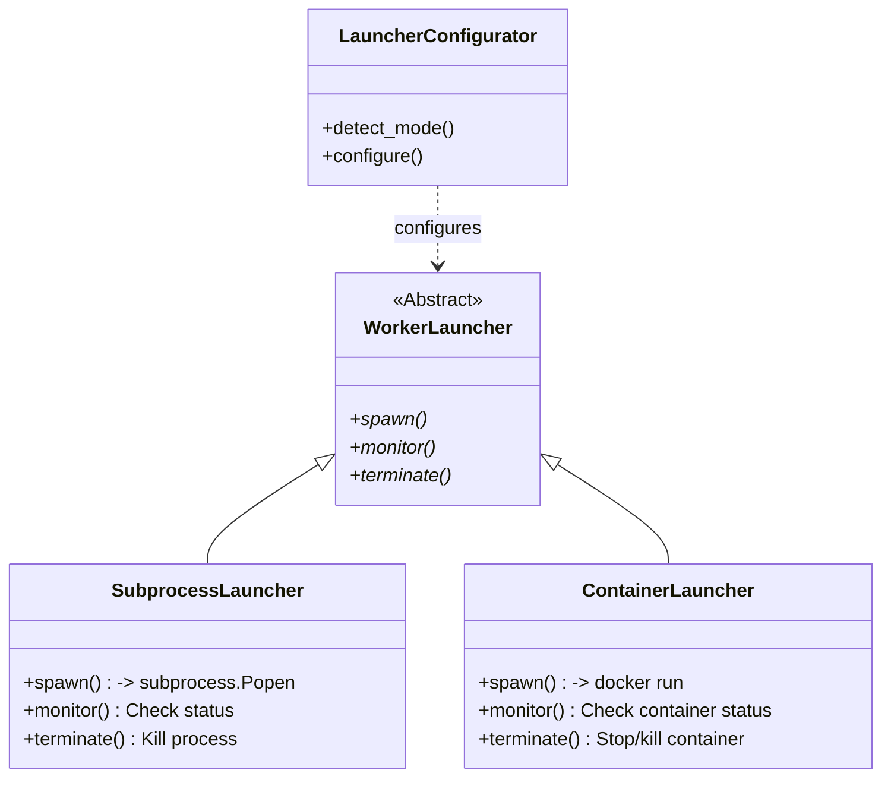

#### How Launchers Connect

The `LauncherConfigurator` decides which launcher to use based on your environment and CLI flags. If you have Docker and a devcontainer, it picks `ContainerLauncher`. Otherwise, it defaults to `SubprocessLauncher`. You can override this with `--mode subprocess` or `--mode container`.

Each launcher implements the same interface: `spawn()`, `monitor()`, `terminate()`. The orchestrator calls these methods without knowing whether it's managing processes or containers underneath.

### Execution Modes

| Mode | Launcher Class | How Workers Run |
|------|---------------|-----------------|
| `subprocess` | `SubprocessLauncher` | Local processes running `mahabharatha.worker_main` |
| `container` | `ContainerLauncher` | Docker containers with mounted worktrees |
| `task` | Plugin-provided | Claude Code Task sub-agents (slash command context) |

**Auto-detection logic** (in `launcher_configurator.py`):
1. If `--mode` is explicitly set -> use that mode
2. If `.devcontainer/devcontainer.json` exists AND Docker is available -> `container`
3. If running inside a Claude Code slash command context -> `task`
4. Otherwise -> `subprocess`

Plugin launchers are resolved via `get_plugin_launcher(name, registry)` which delegates to a `LauncherPlugin.create_launcher()` call.

### Context Management

- Monitor token usage via `ContextTracker`
- Checkpoint at 70% context threshold (configurable)
- Warrior exits gracefully (code 2)
- Orchestrator restarts warrior from checkpoint

---

## Cross-Cutting Capabilities

### What Are Cross-Cutting Capabilities?

Cross-cutting capabilities are behaviors that affect the entire system, not just one module. Think of them as dials and switches that tune how Mahabharatha operates. Want workers to think more deeply? Turn up the analysis depth. Need faster iteration? Enable speed mode. Want test-driven development? Flip the TDD switch.

These capabilities "cut across" all phases and all workers—hence the name. A capability like "compact output" affects planning, design, and Kurukshetra equally.

### Why Do Cross-Cutting Capabilities Exist?

Different situations call for different approaches. A quick prototype needs speed, not exhaustive analysis. A critical production feature needs deep thinking and full verification. Rather than building separate tools for each scenario, Mahabharatha provides one tool with tunable behavior.

This also enables progressive enhancement. Start with defaults, then turn up verification as you approach release. The same command works for both; only the capability settings change.

### Capability Architecture

Mahabharatha includes 8 cross-cutting capabilities that influence worker behavior across all phases:

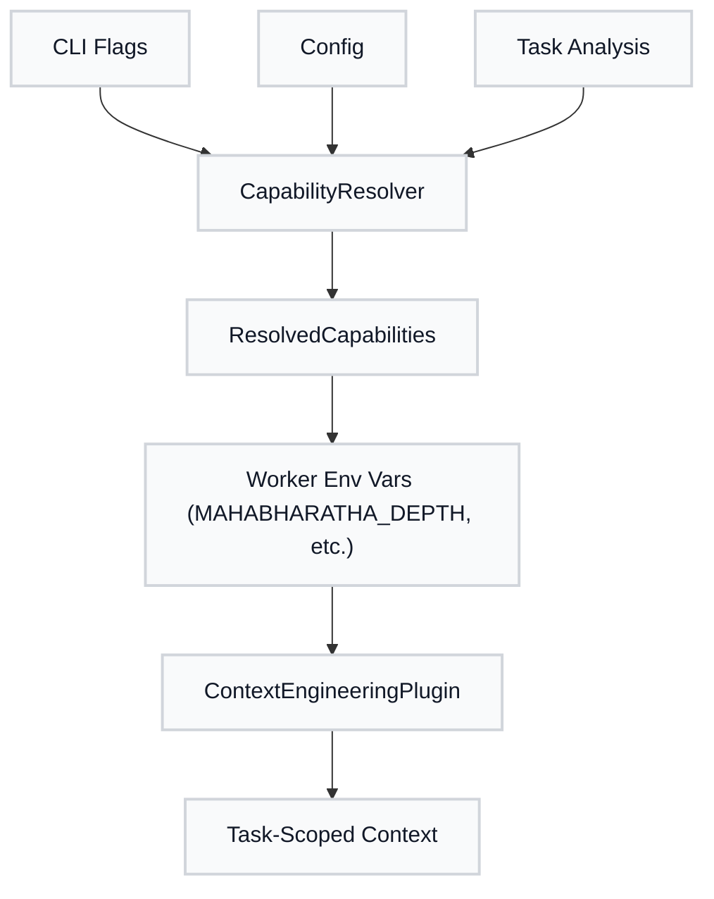

### How Capabilities Flow

CLI flags and configuration merge in the `CapabilityResolver`, which produces a `ResolvedCapabilities` object. This gets translated into environment variables that workers inherit. Workers then use these settings to adjust their behavior: how deeply they analyze, which MCP servers they enable, whether they run improvement loops, etc.

The `ContextEngineeringPlugin` uses these resolved capabilities to build task-scoped context. A task running with `--ultrathink` gets more context budget than one running with `--quick`.

### Capability Matrix

| Capability | CLI Flag | Config Section | Module |
|------------|----------|---------------|--------|
| **Analysis Depth** | `--quick/--think/--think-hard/--ultrathink` | — | `depth_tiers.py` |
| **Token Efficiency** | `--no-compact` (ON by default) | `efficiency` | `efficiency.py` |
| **Behavioral Modes** | `--mode` | `behavioral_modes` | `modes.py` |
| **MCP Auto-Routing** | `--mcp/--no-mcp` | `mcp_routing` | `mcp_router.py` |
| **Engineering Rules** | — | `rules` | (config-driven) |
| **Improvement Loops** | `--no-loop/--iterations` (ON by default) | `improvement_loops` | `loops.py` |
| **Verification Gates** | — | `verification` | `verification_tiers.py` |
| **TDD Enforcement** | `--tdd` | `tdd` | `tdd.py` |

### Analysis Depth Tiers

| Tier | Token Budget | MCP Servers | Use Case |
|------|-------------|-------------|----------|
| `quick` | ~1,000 | None | Fast, surface-level analysis |
| `standard` | ~2,000 | None | Balanced default |
| `think` | ~4,000 | sequential | Structured multi-step analysis |
| `think-hard` | ~10,000 | sequential, context7 | Deep architectural analysis |
| `ultrathink` | ~32,000 | sequential, context7, playwright, morphllm | Maximum depth |

### Behavioral Modes

| Mode | Description | Verification Level |
|------|-------------|-------------------|
| `precision` | Careful, thorough execution | Full |
| `speed` | Fast iteration, minimal overhead | Minimal |
| `exploration` | Broad discovery and analysis | None |
| `refactor` | Code transformation focus | Full |
| `debug` | Diagnostic, verbose logging | Verbose |

### Improvement Loops

#### What Is an Improvement Loop?

An improvement loop is an automated "make it better" cycle. After a worker completes a task, the loop runs quality gates (tests, linting, type checks), measures the quality score, and if the score isn't good enough, asks the worker to improve the code. This repeats until quality converges or the loop detects it's not making progress.

#### Why Do Improvement Loops Exist?

First drafts are rarely perfect. A human developer naturally iterates: write code, run tests, fix issues, repeat. Improvement loops automate this cycle. Instead of hoping the first attempt is good enough, Mahabharatha keeps refining until quality gates pass.

Loops also detect dead ends. If the quality score stops improving (plateau) or gets worse (regression), the loop stops rather than wasting time on fruitless iteration.

#### Loop Architecture

The `LoopController` enables iterative refinement:

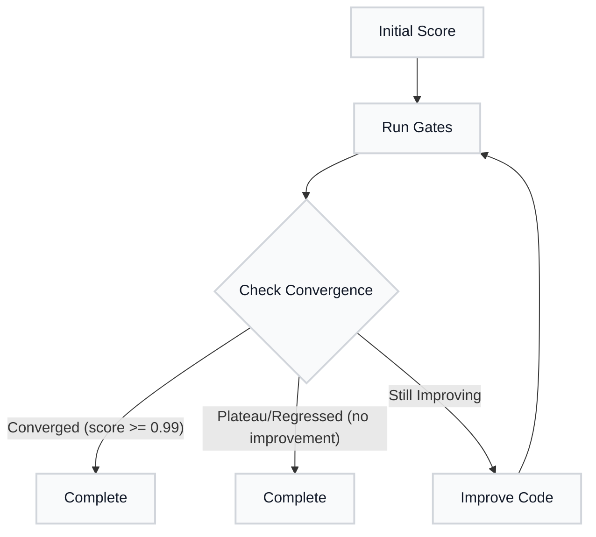

Loop status values: `RUNNING`, `CONVERGED`, `PLATEAU`, `REGRESSED`, `MAX_ITERATIONS`, `ABORTED`

#### How Loops Connect to Workers

Improvement loops wrap worker execution. When loops are enabled (default), each task execution enters the loop. The loop runs quality gates, records the score, and decides: improve or complete? This happens transparently—workers don't need special loop-awareness.

---

## Resilience

### What Is Resilience?

Resilience is the system's ability to handle failures gracefully. In a distributed system with multiple workers, things will go wrong: API rate limits hit, workers crash, verification commands time out. Resilient systems anticipate these failures and have strategies to recover automatically.

### Why Does Resilience Matter?

Without resilience, a single failure can cascade. One worker fails, retries endlessly, consumes all the API quota, and causes all other workers to fail too. Soon you have ten workers all failing, retrying, and making things worse.

Mahabharatha's resilience mechanisms—circuit breakers, backpressure, and intelligent retry—prevent these cascades. Failures get contained, the system adapts, and progress continues even when some components struggle.

Mahabharatha includes comprehensive resilience mechanisms for fault tolerance:

### Circuit Breaker Pattern

#### What Is a Circuit Breaker?

A circuit breaker stops calling a failing service before it can cause more damage. Just like an electrical circuit breaker trips to prevent fires, a software circuit breaker "trips" when too many failures occur, giving the failing component time to recover.

#### Why Do Circuit Breakers Exist?

When an external service (like the Claude API) has a temporary outage, repeatedly retrying makes things worse. You waste time, consume quota, and potentially trigger rate limits. Circuit breakers recognize "this is broken" and stop trying for a cooldown period, then test with a single request to see if recovery happened.

#### Circuit Breaker Flow

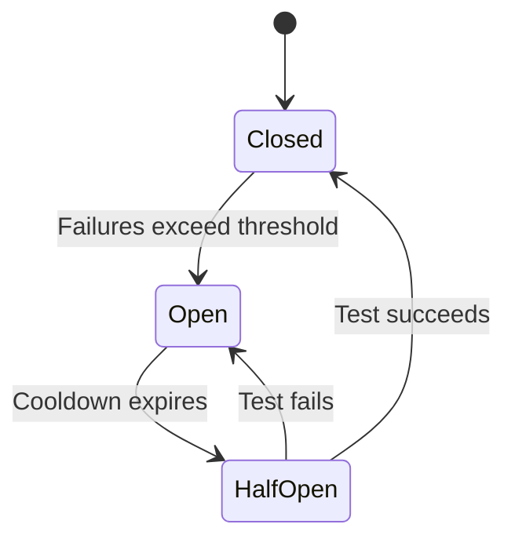

In the **Closed** state, requests flow normally. After enough failures hit the threshold, the breaker **Opens**—all requests fail fast without even trying. After a cooldown period, it goes **Half-Open** and allows one test request. If that succeeds, back to Closed. If it fails, back to Open.

**Configuration** (`.mahabharatha/config.yaml`):
```yaml
error_recovery:
  circuit_breaker:
    enabled: true
    failure_threshold: 5
    cooldown_seconds: 60
```

### Backpressure Control

The `BackpressureController` monitors failure rates and applies flow control:

- **Green zone** (0-50% failure rate): Normal operation
- **Yellow zone** (50-75%): Reduced concurrency, longer delays
- **Red zone** (75%+): Load shedding, reject new work

### Retry Strategies

| Strategy | Description | Use Case |
|----------|-------------|----------|
| Exponential | Base × 2^attempt (capped) | Transient failures |
| Linear | Base × attempt | Predictable recovery |
| Fixed | Constant delay | Rate limiting |

**Configuration**:
```yaml
error_recovery:
  backpressure:
    enabled: true
    failure_rate_threshold: 0.5
    window_size: 100
```

### Worker Crash Recovery

#### What Is Crash Recovery?

When a worker process dies unexpectedly (crash, killed, out of memory), the system needs to detect this and reassign the work. Crash recovery is the mechanism that detects dead workers and returns their tasks to the queue for another worker to pick up.

#### Why Distinguish Crashes from Failures?

A task failing verification (the code doesn't work) is different from a worker crashing (the process died). If verification fails, maybe the task is genuinely hard—incrementing the retry count makes sense. But if the process just crashed (computer restarted, network dropped), that's not the task's fault. Counting crashes against retry limits would unfairly penalize tasks for infrastructure issues.

#### Crash Recovery Flow

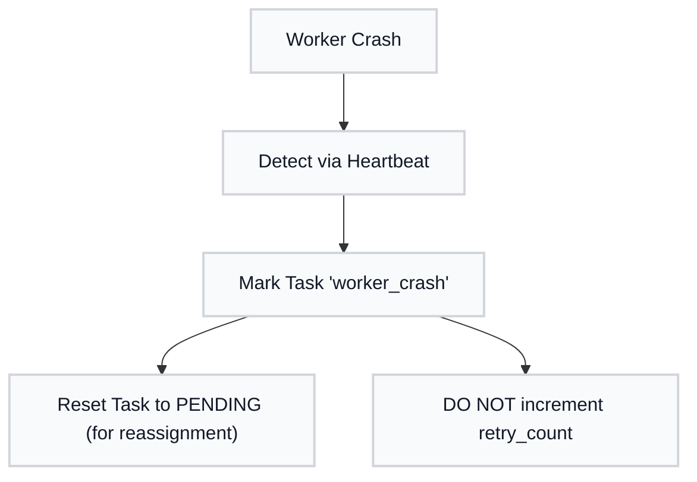

The heartbeat monitor periodically checks whether workers are alive. When a worker stops responding, the orchestrator marks the task status as `worker_crash`, which distinguishes it from `failed` (verification failure). The task returns to PENDING status and gets reassigned—but crucially, the retry count stays the same.

**Key distinction**: Worker crashes do not count against task retry limits. Only verification failures increment retry counts.

### Preflight Checks

Before execution, `preflight.py` validates:
- Git state (clean working directory, correct branch)
- Dependencies (Python version, required packages)
- Resources (disk space, available ports)
- Configuration (valid config.yaml, task-graph.json)

### Escalation System

Workers can escalate to human-in-the-loop via `escalation.py`:
- Unresolvable errors
- Ambiguous requirements
- Security-sensitive operations

---

## State Management

### What Is State Management?

State management tracks the current status of everything: which tasks are complete, which workers are running, which levels have merged. This information lives in JSON files that all components can read. It's the system's shared memory.

### Why Is State Critical?

Without state, the orchestrator can't answer basic questions: "What's left to do? Which worker should take this task? Is it safe to start Level 2?" State provides the answers.

State also enables crash recovery. If the entire system restarts, reading the state file tells us exactly where we left off. No progress is lost, no work is duplicated.

### State File Structure

Location: `.mahabharatha/state/{feature}.json`

```json
{
  "feature": "user-auth",
  "started_at": "2026-01-26T10:00:00",
  "current_level": 2,

  "tasks": {
    "TASK-001": {
      "status": "complete",
      "worker_id": 0,
      "started_at": "...",
      "completed_at": "...",
      "retry_count": 0
    }
  },

  "workers": {
    "0": {
      "status": "running",
      "current_task": "TASK-003",
      "tasks_completed": 2,
      "branch": "mahabharatha/user-auth/worker-0"
    }
  },

  "levels": {
    "1": { "status": "complete", "merge_status": "complete" },
    "2": { "status": "running", "merge_status": "pending" }
  }
}
```

### How State Gets Updated

Every state mutation goes through the `StateManager` class, which holds a lock to prevent concurrent writes from corrupting the file. When a worker claims a task, the state updates. When a task completes, the state updates. When a level merges, the state updates. Each update is atomic—the entire file gets replaced, ensuring we never have a half-written state.

### Task Status Transitions

#### What Are Status Transitions?

Each task moves through a series of states from creation to completion. These states provide visibility: at any moment, you can see exactly where every task stands. Status transitions are also enforcement mechanisms—a task can't be verified before it's in progress.

#### Why Define Status Transitions?

Clear states prevent ambiguity. "Is this task done? Can I claim it? Has it been verified?" The state machine answers these questions definitively. It also catches bugs: if a task tries to transition from `pending` directly to `complete`, something's wrong.

#### Status Flow

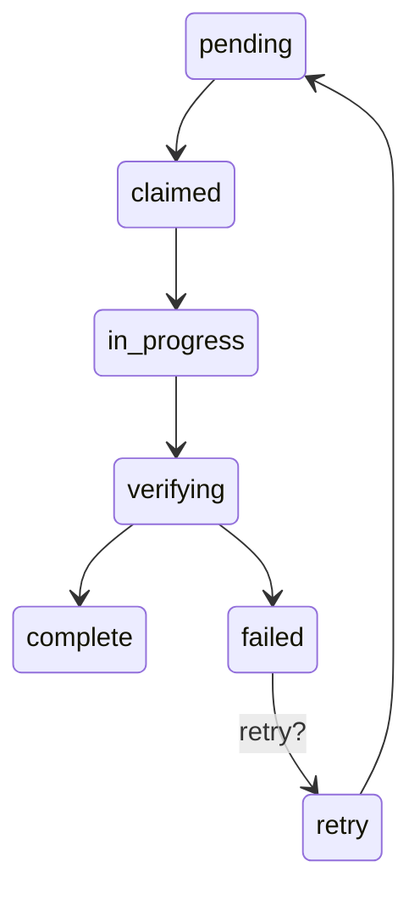

**Pending**: The task exists but no worker has picked it up yet.
**Claimed**: A worker has reserved this task; other workers should not touch it.
**In Progress**: The worker is actively writing code for this task.
**Verifying**: The code is written; now running the verification command.
**Complete**: Verification passed; the task is done.
**Failed**: Verification failed; depending on retry count, might try again.

### Thread Safety

- **RLock**: Guards all state mutations
- **Atomic writes**: Full file replacement
- **Timestamps**: Enable recovery and debugging

### State Synchronization

The `state_sync_service.py` module keeps distributed state consistent across workers. It bridges the file-based state JSON with the Claude Code Task system, ensuring both remain synchronized. When conflicts arise, the Claude Code Task system is authoritative.

---

## Claude Code Task Integration

### What Is the Task System?

The Claude Code Task system is a built-in feature of Claude Code that tracks work items across sessions. Mahabharatha leverages this as its coordination backbone—every Mahabharatha task maps to a Claude Code Task, enabling status tracking, dependency management, and cross-session persistence.

### Why Use Claude Code Tasks?

Mahabharatha workers are separate Claude Code instances. They don't share conversation history. How do they know what work exists and what's been completed? The Task system provides that shared view. When Worker 0 marks a task complete, Worker 1 can query the Task system and see that update.

Using the built-in Task system also means Mahabharatha benefits from Claude Code's native features: task persistence across sessions, dependency tracking, and integration with the `/task` command that users already know.

The Claude Code Task system is the **authoritative backbone** for all Mahabharatha task coordination.

### How Tasks Flow

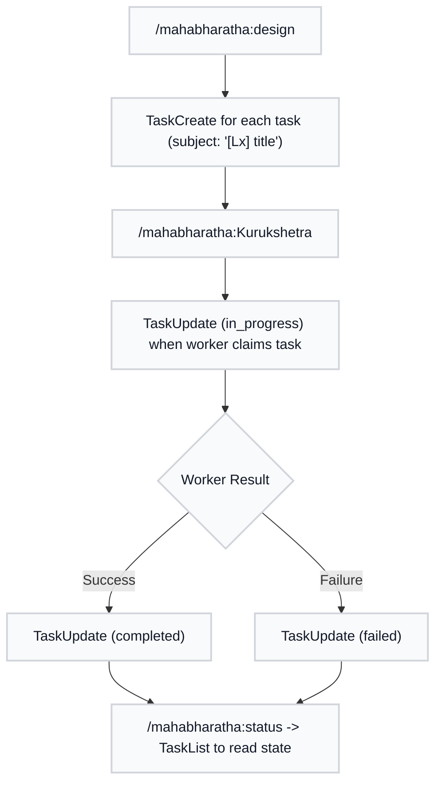

### How Task Integration Works

When `/mahabharatha:design` runs, it creates Claude Code Tasks for every task in the task graph. The subject line uses a bracketed prefix (like `[L2]`) so tasks are easily filterable. When `/mahabharatha:Kurukshetra` launches workers, each worker claims tasks by calling `TaskUpdate` to set status to `in_progress`.

This creates a feedback loop: the orchestrator creates tasks, workers update them, and `/mahabharatha:status` reads them to report progress. Everyone reads from and writes to the same Task system, ensuring a consistent view of the world.

### Subject Convention

All Mahabharatha tasks use bracketed prefixes for discoverability:

| Prefix | Used By | Example |
|--------|---------|---------|
| `[Plan]` | `/mahabharatha:plan` | `[Plan] Capture requirements: user-auth` |
| `[Design]` | `/mahabharatha:design` | `[Design] Architecture for user-auth` |
| `[L1]`..`[L5]` | `/mahabharatha:Kurukshetra` | `[L2] Implement auth service` |
| `[Init]` | `/mahabharatha:init` | `[Init] Initialize project` |
| `[Debug]` | `/mahabharatha:debug` | `[Debug] Diagnose WORKER_FAILURE` |
| `[Build]` | `/mahabharatha:build` | `[Build] Build project` |
| `[Test]` | `/mahabharatha:test` | `[Test] Run test suite` |
| `[Review]` | `/mahabharatha:review` | `[Review] Code review` |
| `[Security]` | `/mahabharatha:security` | `[Security] Vulnerability scan` |
| `[Cleanup]` | `/mahabharatha:cleanup` | `[Cleanup] Remove artifacts` |

### Task Dependencies

Dependencies from `task-graph.json` are wired into the Claude Code Task system using `blocks` and `blockedBy` fields via `TaskUpdate`. This enables `/mahabharatha:status` to show dependency state without reading the task graph.

### State JSON as Fallback

State JSON files (`.mahabharatha/state/{feature}.json`) supplement the Task system. They provide:
- Worker-level state not tracked by Tasks (context usage, branch names)
- Fast local reads without Task API calls
- Backup coordination if the Task system is temporarily unavailable

If Task system and state JSON disagree, the **Task system wins**.

---

## Context Engineering

### What Is Context Engineering?

Context engineering is the practice of giving workers exactly the information they need—no more, no less. AI models have limited context windows (the amount of text they can "see" at once). Stuffing in irrelevant information wastes this precious space and can confuse the model.

Mahabharatha's context engineering system automatically selects relevant spec excerpts, security rules, and command instructions for each task. A task creating Python files gets Python security rules; a task modifying JavaScript gets JavaScript rules. This targeted approach saves 30-50% of context tokens per worker.

### Why Does Context Engineering Matter?

Context is expensive. Larger context means slower responses and higher API costs. But worse, irrelevant context dilutes the signal. A worker implementing a database model doesn't need to read about UI components—that information competes for the model's attention.

By engineering context carefully, workers get focused instructions and complete tasks faster with fewer errors. It's like the difference between giving someone a 500-page manual versus a 10-page guide for exactly what they need to do.

Mahabharatha includes a context engineering plugin that reduces per-worker token usage by 30-50%. See [Context Engineering](docs/context-engineering.md) for configuration details.

### Context Architecture

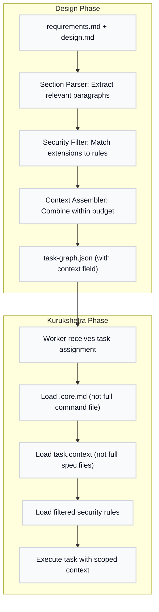

### How Context Gets Built

During design, the system analyzes each task: what files will it touch? What does its description mention? It then extracts only the relevant sections from spec files and only the applicable security rules. This pre-computed context gets stored in the task graph.

During Kurukshetra, workers load this pre-computed context instead of reading entire spec files. They also load split command files (`.core.md` instead of the full file) further reducing token usage. The result: workers start with focused, relevant context rather than drowning in irrelevant information.

### Three Subsystems

| Subsystem | What It Does | Savings |
|-----------|-------------|---------|
| **Command Splitting** | Split 9 large commands into `.core.md` (~30%) + `.details.md` (~70%) | ~2,000-5,000 tokens/worker |
| **Security Rule Filtering** | Load only rules matching task file extensions | ~1,000-4,000 tokens/task |
| **Task-Scoped Context** | Spec excerpts + dependency context per task | ~2,000-5,000 tokens/task |

### Fallback Strategy

If context engineering fails for any reason and `fallback_to_full: true` (default), workers load full files. A worker with full context is better than a worker that fails to load instructions.

---

## Diagnostics Engine

### What Is the Diagnostics Engine?

The diagnostics engine is Mahabharatha's troubleshooting brain. When something goes wrong—a task fails, a worker crashes, a merge conflicts—the diagnostics engine investigates. It parses error messages, correlates logs across workers, generates hypotheses about root causes, and proposes recovery plans.

### Why Build a Diagnostics Engine?

Debugging distributed systems is hard. Errors in worker logs might be symptoms, not causes. The real problem might be a race condition between workers, a misconfigured environment, or a cascading failure that started hours ago. Human developers struggle to correlate all this information.

The diagnostics engine automates what an expert developer would do: gather evidence, form hypotheses, test them against observations, and rank likely causes by probability. It turns "something broke" into "here's what broke, here's why, and here's how to fix it."

The `mahabharatha/diagnostics/` package powers `/mahabharatha:debug` with intelligent failure investigation:

### Diagnostic Flow

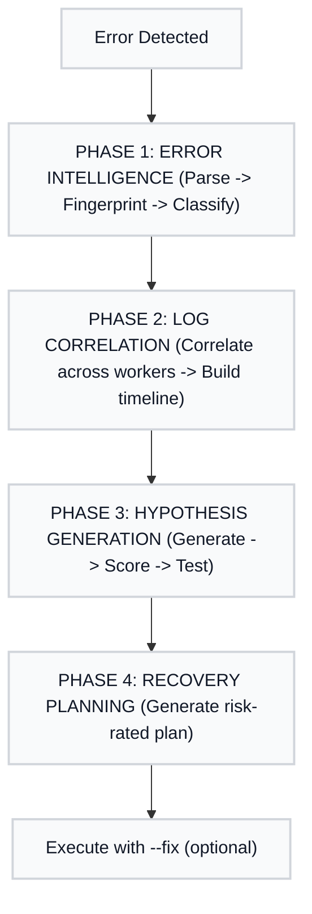

### How Diagnostics Phases Connect

The phases form an investigation pipeline. **Error Intelligence** (Phase 1) parses the raw error and creates a structured representation. **Log Correlation** (Phase 2) looks beyond the immediate error to find related events across workers. **Hypothesis Generation** (Phase 3) proposes explanations and ranks them by probability using Bayesian reasoning. **Recovery Planning** (Phase 4) turns the most likely hypothesis into actionable fix steps.

Each phase builds on the previous. You can't generate good hypotheses without correlated logs. You can't plan recovery without a likely root cause.

### Diagnostic Components

| Component | Module | Capability |
|-----------|--------|------------|
| Error Intelligence | `error_intel.py` | Multi-language error parsing, fingerprinting |
| Hypothesis Engine | `hypothesis_engine.py` | Bayesian hypothesis testing and scoring |
| Knowledge Base | `knowledge_base.py` | 30+ known failure patterns with calibrated probabilities |
| Log Correlator | `log_correlator.py` | Cross-worker log correlation, temporal clustering |
| Log Analyzer | `log_analyzer.py` | Pattern analysis and trend detection |
| Code Fixer | `code_fixer.py` | Import chain analysis, fix templates, git blame |
| Recovery | `recovery.py` | Risk-rated recovery plan generation |
| Environment | `env_diagnostics.py` | Python, Docker, resources, config validation |
| State Introspector | `state_introspector.py` | State file analysis and corruption detection |
| System Diagnostics | `system_diagnostics.py` | Disk, ports, worktrees, Docker health |

### Known Failure Patterns

The knowledge base includes patterns for:
- Import errors (missing module, circular import)
- Git conflicts (merge failure, detached HEAD)
- Docker issues (image not found, container crash)
- API failures (rate limit, authentication)
- Resource exhaustion (disk full, port in use)
- Configuration errors (invalid YAML, missing required field)

---

## Quality Gates

### What Are Quality Gates?

Quality gates are automated checkpoints that verify work meets standards before proceeding. Think of them as bouncers at a club—only code that passes inspection gets in. Mahabharatha uses two types: per-task verification (checking individual tasks) and per-level gates (checking the merged result of all tasks in a level).

### Why Do Quality Gates Exist?

Without quality gates, broken code could accumulate through multiple levels before anyone notices. Imagine five workers all building on a flawed foundation—by the time tests run, the bug is deeply embedded and expensive to fix.

Gates catch problems early. A task that can't even import its own module fails immediately, not after other workers have built upon it. A level that breaks linting doesn't get merged, protecting downstream levels from inheriting problems.

### Task Verification (Per-Task)

Each task includes a verification command that must pass for the task to be considered complete. This is typically an import check or a simple test that proves the code exists and is syntactically valid.

```json
{
  "id": "TASK-001",
  "verification": {
    "command": "python -c \"from src.models.user import User\"",
    "timeout_seconds": 60
  }
}
```

The verification command should be fast (under a minute) and focused on the task's output. It's not a full test suite—just a sanity check that the task produced something usable.

### Level Quality Gates (Per-Level)

After all tasks in a level complete and merge, level-wide quality gates run. These are more comprehensive: linting, type checking, and tests.

Configuration in `.mahabharatha/config.yaml`:

```yaml
quality_gates:
  lint:
    command: "ruff check ."
    required: true
  typecheck:
    command: "mypy ."
    required: false
  test:
    command: "pytest"
    required: true
```

**Required gates** block progression to the next level if they fail. **Optional gates** run and report but don't block. This lets you enforce critical checks (lint, test) while still gathering information from slower or less reliable checks (typecheck).

### Gate Results

| Result | Description | Action |
|--------|-------------|--------|
| `pass` | Exit code 0 | Continue |
| `fail` | Non-zero exit | Block if required |
| `timeout` | Exceeded limit | Treat as failure |
| `error` | Could not run | Pause for intervention |

---

## Pre-commit Hooks

Mahabharatha includes comprehensive pre-commit hooks at `.mahabharatha/hooks/pre-commit`.

### Security Checks (Block Commit)

| Check | Description |
|-------|-------------|
| AWS Keys | Detects AWS Access Key ID patterns |
| GitHub PATs | Detects Personal Access Tokens |
| OpenAI Keys | Detects OpenAI API Key patterns |
| Anthropic Keys | Detects Anthropic API Key patterns |
| Private Keys | Detects PEM key file headers |
| Dangerous subprocess usage | Detects unsafe process spawning patterns |
| Dynamic code patterns | Detects unsafe dynamic code invocation |
| Unsafe deserialization | Detects risky deserialization calls |
| Sensitive Files | Blocks `.env`, `credentials.json` from commits |

### Quality Checks (Warn Only)

| Check | Description |
|-------|-------------|
| Ruff Lint | Style issues in Python files |
| Debugger | Leftover breakpoints and debugger calls |
| Merge Markers | Unresolved conflict markers |
| Large Files | Files over 5MB |

### Mahabharatha-Specific Checks (Warn Only)

| Check | Validation |
|-------|------------|
| Branch Naming | `mahabharatha/{feature}/worker-{N}` format |
| Print Statements | print calls in `mahabharatha/` directory |
| Hardcoded URLs | `localhost:PORT` outside tests |

### Exempt Paths

- `tests/`, `fixtures/`
- `*_test.py`, `test_*.py`
- `conftest.py`

---

## Security Model

### What Is the Security Model?

The security model defines how Mahabharatha protects against accidental and malicious harm. Workers execute code, run commands, and modify files—all potentially dangerous operations. The security model establishes guardrails: what workers can access, what commands they can run, and what patterns are blocked.

### Why Is Security Critical?

Workers are AI agents executing in your codebase. Without security controls, a confused or compromised worker could leak environment variables, execute malicious commands, or write files outside allowed directories. The security model implements defense in depth: multiple layers of protection that each reduce risk.

Even unintentional mistakes need containment. A worker shouldn't accidentally read your SSH keys because someone passed `$HOME` in an environment variable.

### Environment Variable Filtering

Workers receive a controlled set of environment variables. This prevents credential leaks and environment manipulation attacks.

**Allowed**: `Mahabharatha_WORKER_ID`, `Mahabharatha_FEATURE`, `Mahabharatha_WORKTREE`, `ANTHROPIC_API_KEY`, `OPENAI_API_KEY`, `CI`, `DEBUG`, `LOG_LEVEL`

**Blocked**: `LD_PRELOAD`, `DYLD_INSERT_LIBRARIES`, `PYTHONPATH`, `HOME`, `USER`, `SHELL`

The blocked variables are particularly dangerous. `LD_PRELOAD` could inject malicious code into every process. `PYTHONPATH` could redirect imports to attacker-controlled modules. By allowlisting rather than blocklisting, we ensure workers only see what they need.

### Command Execution Safety

Commands are executed with multiple protections:

| Protection | Implementation |
|------------|----------------|
| No direct shell invocation | Commands parsed with shlex, no shell passthrough |
| Allowlist | Commands checked against config |
| Timeout | Every command has max duration |
| Output capture | Separate stdout/stderr |

**Why no shell?** Shell interpretation allows injection attacks. A task ID like `foo; rm -rf /` could be catastrophic. By using `shlex.split()` and passing argument lists directly to subprocess, shell metacharacters are treated as literal characters.

### Task ID Validation

Task IDs are validated against a strict pattern to prevent injection attacks:

```
Pattern: [A-Za-z][A-Za-z0-9_-]{0,63}

Rejects:
  - Shell metacharacters
  - Path traversal sequences
  - Excessive length (>64 chars)
```

Since task IDs appear in branch names, file paths, and log messages, a malicious task ID could cause damage in multiple places. Strict validation catches these at the earliest point.

---

## Logging Architecture

### What Is the Logging Architecture?

The logging architecture captures what happens during execution: which tasks ran, what they outputted, how long they took, and whether they succeeded. This information enables debugging, monitoring, and post-mortem analysis.

Mahabharatha uses structured logging (JSON Lines format) because it's both human-readable and machine-parseable. You can read the logs directly or write scripts to analyze them.

### Why Structured Logging?

Plain text logs are hard to analyze. When five workers run in parallel, their logs interleave. Finding all messages from Worker 2 about TASK-005 means grep gymnastics.

Structured logs solve this. Each entry is a JSON object with fields like `worker_id` and `task_id`. Filtering becomes trivial: "show me all entries where worker_id=2 AND task_id=TASK-005." The diagnostics engine relies on this structure to correlate events across workers.

Mahabharatha uses structured JSONL logging with two complementary outputs:

### Per-Worker Logs

**Location**: `.mahabharatha/logs/workers/worker-{id}.jsonl`

Each worker writes to its own log file, avoiding contention. The log captures:
- Thread-safe writes via `StructuredLogWriter`
- Auto-rotation at 50 MB (renames to `.jsonl.1`)
- Each entry: `ts`, `level`, `worker_id`, `feature`, `message`, `task_id`, `phase`, `event`, `data`, `duration_ms`

### Per-Task Artifacts

**Location**: `.mahabharatha/logs/tasks/{task-id}/`

Each task gets a directory with detailed artifacts:
- `execution.jsonl` — structured execution events
- `claude_output.txt` — Claude CLI stdout/stderr
- `verification_output.txt` — verification command output
- `git_diff.patch` — diff of task changes

These artifacts are invaluable for debugging. When a task fails, you can see exactly what Claude outputted, what the verification command reported, and what code was written.

### How Logs Connect

**Enums**:
- `LogPhase`: CLAIM, EXECUTE, VERIFY, COMMIT, CLEANUP
- `LogEvent`: TASK_STARTED, TASK_COMPLETED, TASK_FAILED, VERIFICATION_PASSED, VERIFICATION_FAILED, ARTIFACT_CAPTURED, LEVEL_STARTED, LEVEL_COMPLETE, MERGE_STARTED, MERGE_COMPLETE

**Aggregation**: `LogAggregator` provides read-side merging of JSONL files by timestamp at query time. No pre-built aggregate file exists on disk. Supports filtering by worker, task, level, phase, event, time range, and text search.

This lazy aggregation means you don't pay storage costs for a combined log file—it's computed on demand when you query.

---

## Diagnostics Engine

The `mahabharatha/diagnostics/` package provides deep investigation capabilities for `/mahabharatha:debug`:

### Components

| Component | Module | Capability |
|-----------|--------|------------|
| Error Intelligence | `error_intel.py` | Multi-language error parsing, fingerprinting, chain analysis |
| Hypothesis Engine | `hypothesis_engine.py` | Bayesian scoring with prior/posterior probability calculation |
| Knowledge Base | `knowledge_base.py` | 30+ known failure patterns with calibrated probabilities |
| Log Correlator | `log_correlator.py` | Cross-worker correlation, temporal clustering, Jaccard similarity |
| Log Analyzer | `log_analyzer.py` | Pattern analysis and trend detection |
| Code Fixer | `code_fixer.py` | Import chain analysis, fix templates, git blame integration |
| Recovery | `recovery.py` | Risk-rated recovery plans (SAFE/MODERATE/DESTRUCTIVE) |
| Environment | `env_diagnostics.py` | Python venv, Docker, resources, config validation |
| State Introspector | `state_introspector.py` | State file analysis and corruption detection |
| System Diagnostics | `system_diagnostics.py` | Disk, ports, worktrees, Docker health |

### Diagnostic Flow

```
Error -> Parse (multi-language) -> Fingerprint -> Classify
                                                    |
                                                    v
         Correlate logs across workers -> Build timeline
                                                    |
                                                    v
         Generate hypotheses -> Bayesian scoring -> Test
                                                    |
                                                    v
         Root cause determination -> Recovery plan -> Execute (with --fix)
```

---

## Performance Analysis

### What Is Performance Analysis?

Performance analysis measures code quality beyond "does it work?" It answers questions like: How complex is this code? Are there security vulnerabilities? Is there dead code nobody uses? How tangled are the dependencies?

Mahabharatha's analysis system runs multiple specialized tools and aggregates their results into a unified report. This gives you a dashboard view of code health without manually running a dozen different tools.

### Why Pluggable Adapters?

No single tool does everything. Radon measures Python complexity, but not JavaScript. Trivy finds vulnerabilities, but not code duplication. By using a plugin architecture, Mahabharatha can leverage the best tool for each analysis type.

The adapter pattern also handles tool differences. Each tool has its own output format, installation method, and command-line interface. Adapters normalize these differences: every adapter returns a standard result format that the aggregator understands.

The `mahabharatha/performance/` package powers `/mahabharatha:analyze` with pluggable tool adapters:

### Analysis Architecture

```
Stack Detector -> Tool Registry -> Adapter Selection -> Execution -> Aggregator -> Formatter
```

**Stack Detector** figures out what languages and frameworks your project uses. A Python/Django project gets different tools than a Go/Docker project.

**Tool Registry** knows which tools are available and how to invoke them.

**Adapter Selection** picks the right adapters based on detected stack and available tools.

**Execution** runs each adapter in parallel when possible.

**Aggregator** combines results from all adapters into a unified data structure.

**Formatter** outputs the results as markdown, SARIF (for CI integration), or JSON (for programmatic use).

### Adapters

Each adapter wraps an external analysis tool:

| Adapter | Tool | Analysis |
|---------|------|----------|
| `radon_adapter` | radon | Cyclomatic complexity (Python) |
| `lizard_adapter` | lizard | Multi-language complexity |
| `vulture_adapter` | vulture | Dead code detection |
| `jscpd_adapter` | jscpd | Copy-paste / duplication |
| `cloc_adapter` | cloc | Lines of code |
| `semgrep_adapter` | semgrep | Semantic analysis |
| `trivy_adapter` | trivy | Vulnerability scanning |
| `deptry_adapter` | deptry | Dependency health |
| `pipdeptree_adapter` | pipdeptree | Dependency trees |
| `hadolint_adapter` | hadolint | Dockerfile linting |
| `dive_adapter` | dive | Docker image efficiency |

Output formats: Markdown tables, SARIF, JSON.

---

## Configuration

### Configuration File

Location: `.mahabharatha/config.yaml`

```yaml
version: "1.0"
project_type: python

workers:
  default_count: 5
  max_count: 10
  context_threshold: 0.7
  timeout_seconds: 3600

security:
  network_isolation: true
  filesystem_sandbox: true
  secrets_scanning: true

quality_gates:
  lint:
    command: "ruff check ."
    required: true
  test:
    command: "pytest"
    required: true

hooks:
  pre_commit:
    enabled: true
    security_checks:
      secrets_detection: true
      block_on_violation: true
    quality_checks:
      ruff_lint: true
      warn_on_violation: true

mcp_servers:
  - name: filesystem
    command: npx
    args: ["-y", "@anthropic/mcp-filesystem"]
```

---

## Directory Structure

```
project/
+-- .mahabharatha/
|   +-- config.yaml          # Mahabharatha configuration
|   +-- hooks/
|   |   +-- pre-commit       # Pre-commit hook script
|   +-- state/               # Runtime state
|   |   +-- {feature}.json
|   +-- logs/                # Warrior logs
|       +-- workers/         # Structured JSONL per-worker
|       |   +-- worker-{id}.jsonl
|       +-- tasks/           # Per-task artifacts
|           +-- {task-id}/
|
+-- .mahabharatha-worktrees/         # Git worktrees (gitignored)
|   +-- {feature}-worker-N/
|
+-- .gsd/
|   +-- PROJECT.md
|   +-- STATE.md             # Human-readable progress
|   +-- specs/{feature}/
|       +-- requirements.md
|       +-- design.md
|       +-- task-graph.json
|
+-- .devcontainer/
|   +-- devcontainer.json
|   +-- Dockerfile
|
+-- tests/
|   +-- unit/                # ~101 test files
|   +-- integration/         # ~41 test files
|   +-- e2e/                 # ~13 test files
|       +-- harness.py       # E2E test harness
|       +-- mock_worker.py   # Simulated worker
|
+-- mahabharatha/                    # Source code (90+ modules)
    +-- commands/            # 24 CLI command implementations
    +-- data/commands/       # 55+ slash command spec files
    +-- diagnostics/         # Debug investigation engine (12 modules)
    +-- performance/         # Analysis tool adapters (7 modules)
    +-- performance/adapters/  # Tool-specific adapters (13 adapters)
    +-- schemas/             # JSON schema definitions
    +-- plugins.py           # Plugin ABCs + registry
    +-- orchestrator.py      # Core orchestration
    +-- ...                  # See Module Reference
```

---

## Error Handling

| Scenario | Response |
|----------|----------|
| Task verification fails | Retry 3x (with backoff), then mark blocked |
| Warrior crashes | Orchestrator detects, respawns from checkpoint |
| Merge conflict | Pause for human intervention |
| All warriors blocked | Pause Mahabharatha, alert human |
| Context limit (70%) | Commit WIP, exit for restart |
| Cascading failures | Circuit breaker opens, backpressure applied |

---

## Test Infrastructure

### What Is the Test Infrastructure?

The test infrastructure is how Mahabharatha tests itself. Mahabharatha is a complex distributed system with many moving parts—orchestrator, workers, git operations, state management. The test infrastructure ensures these components work correctly individually and together.

### Why Three Tiers?

Different test types catch different bugs. Unit tests are fast and focused—they verify individual functions work correctly with mocked dependencies. Integration tests verify that modules work together—real git operations, real file I/O. E2E tests verify the entire system—from "run the command" to "feature is built."

This pyramid structure (many unit tests, fewer integration, even fewer E2E) balances coverage with speed. You don't want a 30-minute test suite when a 3-minute one catches 90% of bugs.

Mahabharatha uses a three-tier testing strategy:

| Category | Files | Scope |
|----------|-------|-------|
| Unit | ~101 | Individual modules, pure logic, mocked dependencies |
| Integration | ~41 | Module interactions, real git operations, state management |
| E2E | ~13 | Full pipeline: orchestrator -> workers -> merge -> gates |

### E2E Harness

The E2E harness (`tests/e2e/harness.py`) creates realistic test environments:
- `E2EHarness` creates real git repos with complete `.mahabharatha/` directory structure
- Supports two modes: `mock` (simulated workers via `MockWorker`) and `real` (actual Claude CLI)
- Returns `E2EResult` with tasks_completed, tasks_failed, levels_completed, merge_commits, duration

### Mock Worker

The mock worker (`tests/e2e/mock_worker.py`) simulates Claude Code for deterministic testing:
- Patches `WorkerProtocol.invoke_claude_code` for deterministic execution
- Generates syntactically valid Python for `.py` files
- Supports configurable failure via `fail_tasks` set

This lets E2E tests run without actual API calls—fast, free, and repeatable.

---

## Scaling Guidelines

| Warriors | Use Case |
|-----------|----------|
| 1-2 | Small features, learning |
| 3-5 | Medium features, balanced |
| 6-10 | Large features, max throughput |

Diminishing returns beyond the widest level's parallelizable tasks.

---

## Summary

Mahabharatha enables rapid parallel development through:

1. **Spec-driven execution** — Warriors read specifications, not conversation history
2. **Exclusive file ownership** — No merge conflicts possible within levels
3. **Level-based dependencies** — Proper sequencing guaranteed
4. **Context engineering** — 30-50% token reduction per worker via command splitting, security rule filtering, and task-scoped context
5. **Cross-cutting capabilities** — 8 capabilities (depth tiers, modes, MCP routing, loops, TDD, etc.) controlling worker behavior
6. **Resilient warriors** — Circuit breakers, backpressure, retry with backoff, heartbeat monitoring
7. **Quality gates** — Automated verification at every stage with improvement loops
8. **Deep diagnostics** — Bayesian hypothesis testing, cross-worker log correlation, recovery planning
9. **Plugin extensibility** — Custom gates, hooks, launchers, and context plugins
10. **Claude Code Task backbone** — Authoritative coordination across parallel instances
11. **Security by design** — Auto-fetched OWASP/language/Docker rules, environment filtering, pre-commit hooks
