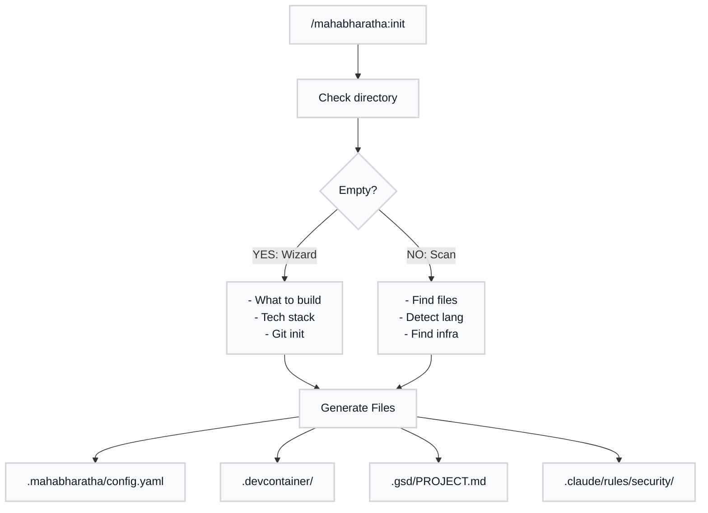
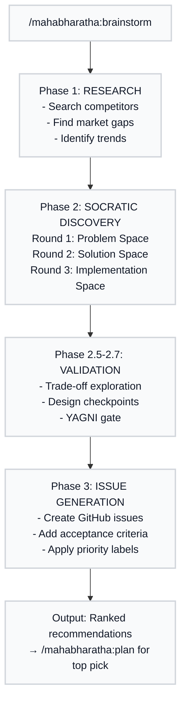
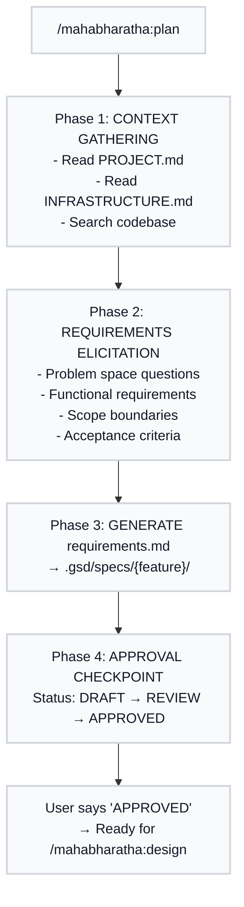
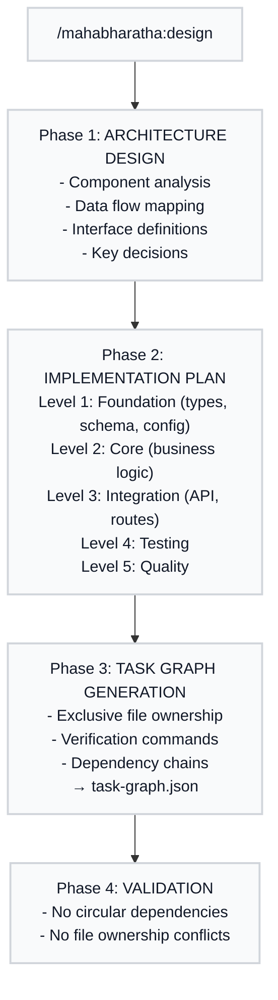
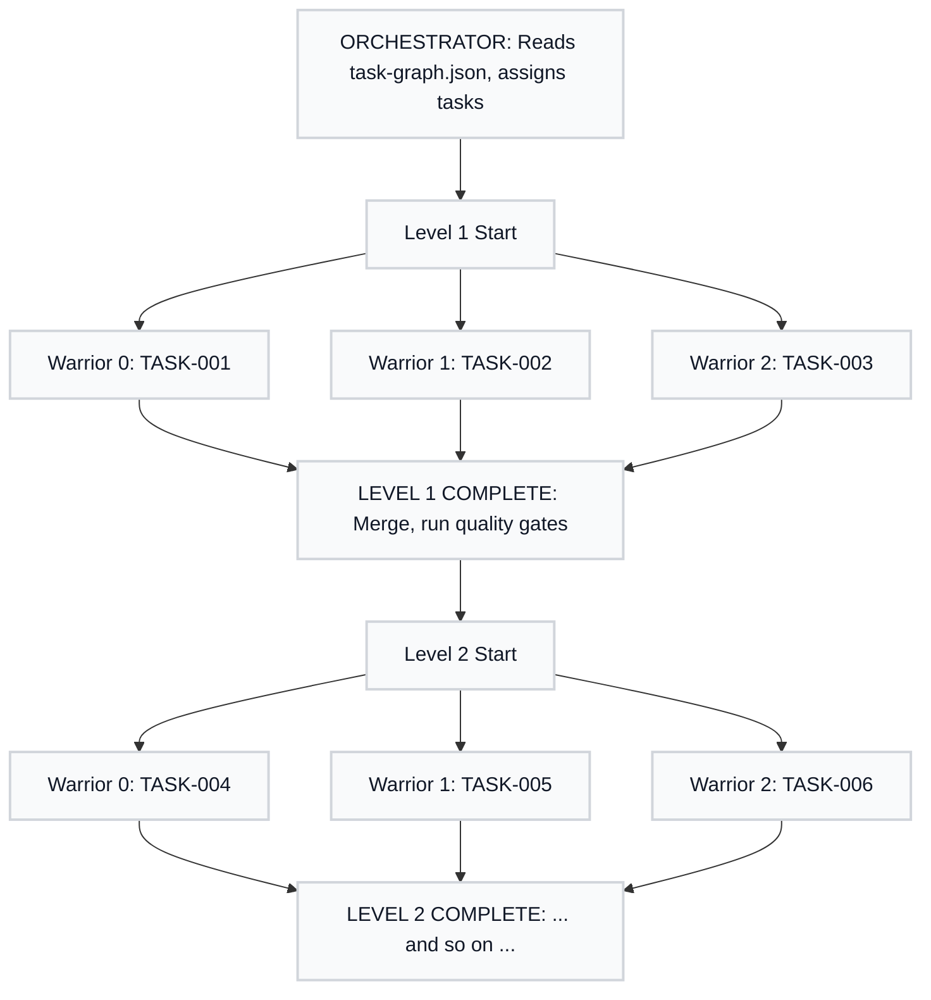
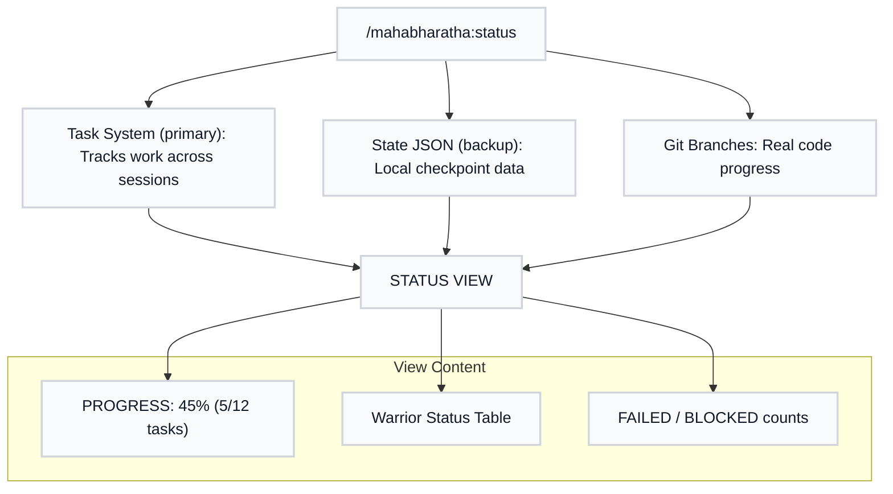
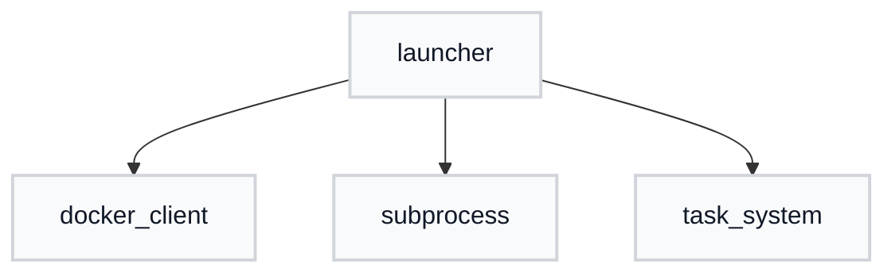

# MAHABHARATHA Command Guide

Complete documentation with explanations, diagrams, and examples. For quick lookup, see [Quick Reference](commands-quick.md).

This guide assumes you know basic programming and git (commit, branch, push) but are new to AI coding assistants and distributed task execution. Every command is explained with:

1. **What Is It?** - The concept in plain language
2. **Why Use It?** - The problem it solves
3. **How It Works** - Visual diagram of the flow
4. **Using It** - Command examples with expected output

---

## Table of Contents

- [Core Workflow](#core-workflow)
  - [/mahabharatha:init](#zerginit)
  - [/mahabharatha:brainstorm](#zergbrainstorm)
  - [/mahabharatha:plan](#zergplan)
  - [/mahabharatha:design](#zergdesign)
  - [/mahabharatha:kurukshetra](#zergrush)
- [Monitoring and Control](#monitoring-and-control)
  - [/mahabharatha:status](#zergstatus)
  - [/mahabharatha:logs](#zerglogs)
  - [/mahabharatha:stop](#zergstop)
  - [/mahabharatha:retry](#zergretry)
  - [/mahabharatha:merge](#zergmerge)
  - [/mahabharatha:cleanup](#zergcleanup)
- [Quality and Analysis](#quality-and-analysis)
  - [/mahabharatha:analyze](#zerganalyze)
  - [/mahabharatha:build](#zergbuild)
  - [/mahabharatha:test](#zergtest)
  - [/mahabharatha:review](#zergreview)
  - [/mahabharatha:refactor](#zergrefactor)
  - [/mahabharatha:security](#zergsecurity)
- [Utilities](#utilities)
  - [/mahabharatha:git](#zerggit)
  - [/mahabharatha:worker](#zergworker)
  - [/mahabharatha:plugins](#zergplugins)
  - [/mahabharatha:debug](#zergdebug)
  - [/mahabharatha:create-command](#zergcreate-command)
- [Documentation and AI](#documentation-and-ai)
  - [/mahabharatha:document](#zergdocument)
  - [/mahabharatha:explain](#zergexplain)
  - [/mahabharatha:index](#zergindex)
  - [/mahabharatha:estimate](#zergestimate)
  - [/mahabharatha:select-tool](#zergselect-tool)

---

## Core Workflow

The core workflow commands are the backbone of MAHABHARATHA. They take you from an empty idea to working code through a structured process: initialize your project, discover what to build, capture requirements, design the architecture, and execute with parallel workers.

---

### /mahabharatha:init

#### What Is It?

The init command sets up MAHABHARATHA for your project. Think of it as the foundation work before building a house - you need the infrastructure in place before construction can begin.

MAHABHARATHA operates in one of two modes depending on what it finds. If you run it in an empty directory, it starts an interactive wizard to help you build a new project from scratch (Inception Mode). If you run it in an existing codebase, it analyzes what you have and configures MAHABHARATHA to work with your stack (Discovery Mode).

#### Why Use It?

Without initialization, MAHABHARATHA has no idea what your project looks like. It does not know which programming languages you use, what frameworks are involved, or how to run your build and test commands. The init command discovers all of this and creates configuration files so every other MAHABHARATHA command works correctly.

It also sets up security rules specific to your stack. If you are writing Python, you get Python security rules. If you are writing JavaScript, you get JavaScript rules. This means Claude Code automatically follows secure coding practices relevant to your actual codebase.

#### How It Works



**What the files mean:**
- `.mahabharatha/config.yaml` - Main configuration: worker counts, timeouts, quality gates
- `.devcontainer/` - Docker configuration for isolated worker execution
- `.gsd/PROJECT.md` - High-level project description for MAHABHARATHA to reference
- `.claude/rules/security/` - Language-specific security rules that Claude Code auto-loads

#### Using It

**New project (empty directory):**
```
mkdir my-api && cd my-api
mahabharatha init
```

MAHABHARATHA asks questions about what you want to build:
```
MAHABHARATHA: What kind of project are you creating?
YOU:  A REST API for managing inventory

MAHABHARATHA: Which languages/frameworks?
YOU:  Python with FastAPI

MAHABHARATHA: Any specific infrastructure needs?
YOU:  PostgreSQL database, Redis for caching
```

**Existing project:**
```
cd my-existing-project
mahabharatha init
```

MAHABHARATHA scans and reports:
```
Detected:
  Languages: Python 3.11, TypeScript 5.0
  Frameworks: FastAPI, React
  Infrastructure: Docker, PostgreSQL
  Build: pyproject.toml, package.json

Created:
  .mahabharatha/config.yaml
  .gsd/PROJECT.md
  .gsd/INFRASTRUCTURE.md
  .claude/rules/security/languages/python/CLAUDE.md
  .claude/rules/security/languages/javascript/CLAUDE.md
```

**With options:**
```
# Skip security rules (faster, less secure)
mahabharatha init --no-security-rules

# Set strict security and 3 workers
mahabharatha init --workers 3 --security strict

# Build Docker container after init
mahabharatha init --with-containers
```

---

### /mahabharatha:brainstorm

#### What Is It?

The brainstorm command helps you figure out what to build before you commit to building it. It is a structured discovery process that researches competitors, asks probing questions, and helps you crystallize vague ideas into concrete requirements.

Imagine you know you want to improve your authentication system but you are not sure exactly what needs fixing. Brainstorm researches how other systems handle authentication, asks you questions to uncover hidden requirements, and ultimately produces a prioritized list of features with GitHub issues ready to go.

#### Why Use It?

Starting to code without clear requirements leads to wasted effort. You build something, realize it is not what users need, and throw away work. Brainstorm front-loads the thinking so you build the right thing the first time.

The command also performs competitive research. It searches the web for how similar products solve the problem, identifies market gaps, and brings back insights you might not have discovered on your own. This is not just planning - it is strategic planning.

#### How It Works



**What YAGNI gate means:** "You Aren't Gonna Need It" - features that sound nice but are not essential for the first version get deferred. This keeps scope tight.

#### Using It

**Basic brainstorm:**
```
/mahabharatha:brainstorm user-authentication
```

MAHABHARATHA researches and then asks questions:
```
MAHABHARATHA: I found these patterns in competitor auth systems:
      - OAuth 2.0 with social login (Google, GitHub)
      - Magic link authentication (passwordless)
      - Hardware key support (WebAuthn)

MAHABHARATHA: What authentication challenges are your users facing today?
YOU:  Password fatigue - they forget passwords and reset flows are slow.

MAHABHARATHA: What's your user base like? Technical vs non-technical?
YOU:  Mix of both. Developers use our API directly, non-devs use the web app.

MAHABHARATHA: What compliance requirements do you have?
YOU:  SOC 2 certification is coming up. We need audit logs.
```

**Single-question Socratic mode:**
```
/mahabharatha:brainstorm user-auth --socratic
```

Instead of multiple questions at once, MAHABHARATHA asks one question at a time and goes deeper:
```
MAHABHARATHA: Let's start with the problem. What specific authentication
      issue is causing the most user friction right now?
YOU:  Password resets. Users do 50+ resets per day.

MAHABHARATHA: That's significant. When users reset passwords, what's the
      longest step in your current flow?
YOU:  Email delivery. Sometimes takes 5+ minutes.
```

**Preview without creating issues:**
```
/mahabharatha:brainstorm api-redesign --skip-research --dry-run
```

Output shows what would be created:
```
Would create 4 GitHub issues:

[P0] Implement rate limiting on public endpoints
     Labels: security, api

[P1] Add pagination to list endpoints
     Labels: api, breaking-change

[P2] Deprecate v1 endpoints
     Labels: api, maintenance
```

---

### /mahabharatha:plan

#### What Is It?

The plan command captures detailed requirements for a specific feature. While brainstorm helps you figure out what to build, plan documents exactly how it should work. It produces a requirements document that serves as the contract for the implementation.

Think of it as writing a detailed spec before coding. The plan command asks questions about your feature until it has enough information to write unambiguous requirements that any developer (or AI) could implement correctly.

#### Why Use It?

Vague requirements produce vague code. When you tell an AI "build user authentication," you might get basic username/password, or you might get a full OAuth implementation. The plan command eliminates ambiguity by forcing you to specify exactly what you want.

The output (requirements.md) becomes the single source of truth for the design and implementation phases. Workers read this document and implement exactly what it says. If requirements are clear, implementation is straightforward.

#### How It Works



**What the status markers mean:**
- `DRAFT` - Requirements captured but not yet reviewed
- `REVIEW` - Under review, may have questions
- `APPROVED` - Ready for design phase
- `REJECTED` - Needs revision

#### Using It

**Plan a feature:**
```
/mahabharatha:plan user-authentication
```

MAHABHARATHA asks targeted questions:
```
MAHABHARATHA: Let me understand the scope. What authentication methods should
      this feature support?
YOU:  Email/password and OAuth with Google.

MAHABHARATHA: For the email/password flow:
      - Should users verify their email before accessing the app?
      - What are the password complexity requirements?
YOU:  Yes, email verification required. Password must be 12+ chars
      with at least one number and symbol.

MAHABHARATHA: For OAuth:
      - Which Google scopes do you need (email, profile, etc)?
      - What happens if a Google user already has an email/password account?
YOU:  Just email and profile. Link accounts if email matches.

MAHABHARATHA: Non-functional requirements:
      - What's the expected login volume (logins per second)?
      - Session duration? Token refresh policy?
YOU:  ~10 logins/sec peak. 1-hour sessions, refresh if active.
```

MAHABHARATHA generates `requirements.md` and asks for approval:
```
Requirements generated. Key points:

FUNCTIONAL:
- FR-1: Email/password authentication with verification
- FR-2: Google OAuth with account linking
- FR-3: Session management with 1-hour expiry

NON-FUNCTIONAL:
- NFR-1: Handle 10 logins/second
- NFR-2: Sub-200ms login latency

Please review and reply APPROVED or REJECTED with feedback.
```

**Structured Socratic mode:**
```
/mahabharatha:plan user-authentication --socratic --rounds 5
```

Five structured rounds of one question at a time, going deeper into problem space, solution space, and implementation details.

**Import from GitHub issue:**
```
/mahabharatha:plan --from-issue https://github.com/org/repo/issues/42
```

Reads the issue title, body, labels, and comments to pre-populate requirements. You still review and approve before proceeding.

---

### /mahabharatha:design

#### What Is It?

The design command transforms approved requirements into a technical architecture and a task graph that workers can execute in parallel. It is the bridge between "what to build" (requirements) and "how to build it" (implementation).

Think of it as an architect drawing blueprints from a client's wish list. The requirements say "I want a house with 3 bedrooms." The design specifies exactly which walls go where, how the plumbing connects, and in what order contractors should work so they do not step on each other.

#### Why Use It?

Parallel execution requires careful planning. If two workers try to edit the same file, you get merge conflicts. If a worker tries to use a function that does not exist yet, the task fails. The design command solves this by:

1. Breaking work into tasks with clear boundaries
2. Assigning exclusive file ownership (no conflicts possible)
3. Organizing tasks into dependency levels (Level 1 completes before Level 2 starts)

The output (task-graph.json) is what `/mahabharatha:kurukshetra` executes. Good design means smooth execution.

#### How It Works



**What exclusive file ownership means:** Each file can only be created or modified by one task per level. If `auth.service.ts` is assigned to TASK-005, no other task in Level 2 can touch it. This eliminates merge conflicts by design.

#### Using It

```
/mahabharatha:design
```

MAHABHARATHA reads the approved requirements and generates architecture:
```
Architecture Design:

COMPONENTS:
├── auth/
│   ├── types.ts          (Level 1: TASK-001)
│   ├── auth.service.ts   (Level 2: TASK-004)
│   └── auth.routes.ts    (Level 3: TASK-007)
├── user/
│   ├── types.ts          (Level 1: TASK-002)
│   ├── user.service.ts   (Level 2: TASK-005)
│   └── user.routes.ts    (Level 3: TASK-008)
└── tests/
    ├── auth.test.ts      (Level 4: TASK-010)
    └── user.test.ts      (Level 4: TASK-011)

KEY DECISIONS:
- Using JWT for session tokens (stateless, scales horizontally)
- Storing refresh tokens in database (allows revocation)
- Password hashing with bcrypt cost factor 12

Task graph validated: 12 tasks, 5 levels, no conflicts.
Ready for /mahabharatha:kurukshetra
```

The task-graph.json includes everything workers need:
```json
{
  "tasks": [
    {
      "id": "TASK-001",
      "level": 1,
      "title": "Create auth types",
      "files": {
        "create": ["src/auth/types.ts"],
        "modify": [],
        "read": ["src/shared/types.ts"]
      },
      "verification": "npx tsc --noEmit src/auth/types.ts",
      "dependencies": []
    }
  ]
}
```

---

### /mahabharatha:kurukshetra

#### What Is It?

The kurukshetra command is MAHABHARATHA's execution engine. It takes your approved design and turns it into action by launching multiple Claude Code instances that work on different parts of your feature simultaneously.

Think of it like a construction site manager: you have the blueprints (from /mahabharatha:design), and now kurukshetra assigns workers to different rooms so they can all build at once instead of waiting for one worker to finish each room.

#### Why Use It?

Without parallelization, building a feature with 20 files takes a single Claude Code instance hours of sequential work. Kurukshetra spawns multiple workers, each handling their assigned files, reducing build time by 3-5x.

The command also handles the complexity you would otherwise manage manually: coordinating workers, running quality checks between levels, retrying failed tasks, and merging changes back together. You launch kurukshetra and watch progress instead of babysitting individual tasks.

#### How It Works

#### How It Works



**What "level by level" means:** All workers must complete Level 1 before any worker starts Level 2. This ensures that when workers build services (Level 2), the types they depend on (Level 1) already exist.

**What quality gates mean:** Between levels, kurukshetra automatically runs lint, type checking, and tests. If anything fails, execution pauses so you can fix issues before they propagate.

#### Using It

**Basic launch with 5 workers:**
```
/mahabharatha:kurukshetra --workers=5
```

Output shows real-time progress:
```
Kurukshetra started: user-authentication
Workers: 5 | Mode: task

Level 1 (Foundation):
  [Worker 0] TASK-001 types.ts .......... DONE
  [Worker 1] TASK-002 schema.ts ......... DONE
  [Worker 2] TASK-003 config.ts ......... DONE

Quality gates: lint OK | typecheck OK | tests OK

Level 2 (Core):
  [Worker 0] TASK-004 auth.service ...... RUNNING
  [Worker 1] TASK-005 user.service ...... RUNNING
  [Worker 2] TASK-006 session.service ... RUNNING
```

**Resume after interruption:**
```
/mahabharatha:kurukshetra --resume
```

MAHABHARATHA loads state from the checkpoint file and continues where it left off:
```
Resuming user-authentication from Level 2
Completed: 3/12 tasks
Remaining: 9 tasks across 4 levels
```

**Preview execution plan:**
```
/mahabharatha:kurukshetra --dry-run
```

Shows what would happen without starting:
```
Dry run: user-authentication

Level 1: 3 tasks → 3 workers (1 task each)
Level 2: 3 tasks → 3 workers (1 task each)
Level 3: 3 tasks → 3 workers (1 task each)
Level 4: 2 tasks → 2 workers
Level 5: 1 task  → 1 worker

Estimated time: 45 minutes with 5 workers
Estimated cost: ~$2.50 API credits
```

**Container mode for full isolation:**
```
/mahabharatha:kurukshetra --mode container
```

Each worker runs in its own Docker container with a separate git worktree. Complete isolation means no chance of workers interfering with each other.

**Compare worker configurations before launching:**
```
/mahabharatha:kurukshetra --dry-run --what-if
```

Shows side-by-side comparison of different worker counts and modes so you can pick the optimal setup.

**Assess risk in your task graph:**
```
/mahabharatha:kurukshetra --dry-run --risk
```

Highlights risky tasks: large files, complex dependencies, or historically problematic patterns.

**Pre-validate quality gates during dry-run:**
```
/mahabharatha:kurukshetra --dry-run --check-gates
```

Runs lint, type check, and test gates against the current codebase before any workers start.

**Skip test gates for faster iteration:**
```
/mahabharatha:kurukshetra --skip-tests
```

Runs only lint gates between levels, deferring test execution to the final level. Useful during rapid prototyping.

---

## Monitoring and Control

These commands help you observe what is happening during execution and take action when things go wrong.

---

### /mahabharatha:status

#### What Is It?

The status command shows you exactly what is happening across all workers and tasks. It is your dashboard into the parallel execution, answering questions like: How many tasks are done? Which workers are active? Are there any failures?

Think of it as a project management dashboard that updates in real-time. Instead of asking each contractor individually what they are working on, you look at a single screen that shows everyone's progress.

#### Why Use It?

When five workers are running simultaneously, you need visibility. Without status, you would have to read individual log files to understand what is happening. Status aggregates all that information into a single, readable view.

It also helps you catch problems early. If a worker has been stuck on the same task for 10 minutes, status shows that so you can investigate before wasting more time.

#### How It Works

#### How It Works



**Data sources explained:**
- **Task System** (primary) - The Claude Code Task system tracks all work across sessions
- **State JSON** (backup) - Local file with checkpoint data
- **Git Branches** - Each worker commits to its own branch, showing actual code progress

If Task System and State JSON disagree, status flags the mismatch so you can investigate.

#### Using It

**Show overall status:**
```
/mahabharatha:status
```

Output:
```
FEATURE: user-authentication
PROGRESS: ████████░░░░░░░░░░░░ 42% (5/12 tasks)

CURRENT LEVEL: 2 (Core)
┌────────┬──────────┬───────────┬──────────┬─────────┐
│ Worker │  Status  │   Task    │ Duration │ Files   │
├────────┼──────────┼───────────┼──────────┼─────────┤
│   0    │ RUNNING  │ TASK-004  │   3:45   │ 2       │
│   1    │ RUNNING  │ TASK-005  │   2:30   │ 1       │
│   2    │  IDLE    │    -      │    -     │ -       │
│   3    │ RUNNING  │ TASK-006  │   4:12   │ 2       │
│   4    │ RUNNING  │ TASK-007  │   1:15   │ 1       │
└────────┴──────────┴───────────┴──────────┴─────────┘

COMPLETED LEVELS: 1 (Foundation)
REMAINING: 7 tasks across 3 levels
ESTIMATED TIME: 25 minutes
```

**Watch mode (auto-refresh every 5 seconds):**
```
/mahabharatha:status --watch --interval 5
```

**Show all tasks with details:**
```
/mahabharatha:status --tasks
```

Output includes task-level detail:
```
TASK-001 types.ts        ✓ DONE      Worker 0   2:34
TASK-002 schema.ts       ✓ DONE      Worker 1   1:58
TASK-003 config.ts       ✓ DONE      Worker 2   2:12
TASK-004 auth.service    ○ RUNNING   Worker 0   3:45
TASK-005 user.service    ○ RUNNING   Worker 1   2:30
TASK-006 session.service ✓ DONE      Worker 3   4:12
TASK-007 routes          ○ RUNNING   Worker 4   1:15
...
```

**Live TUI dashboard (CLI only):**
```
mahabharatha status --dashboard
```

Opens a terminal user interface with real-time updates, colored status indicators, and keyboard navigation.

---

### /mahabharatha:logs

#### What Is It?

The logs command gives you access to the detailed output from workers. While status shows high-level progress, logs show exactly what each worker said and did. This is essential for debugging when something goes wrong.

Think of it as reading a contractor's detailed work journal instead of just knowing they finished. If a task failed, logs tell you why.

#### Why Use It?

When a task fails, you need to understand what happened. Did the verification command fail? Was there a compilation error? Did the worker misunderstand the requirements? Logs contain the full context including Claude's reasoning, command output, and error messages.

Logs also help with optimization. If a task took much longer than expected, logs reveal where time was spent.

#### How It Works

```
┌─────────────────────────────────────────────────────────────────────┐
│                          /mahabharatha:logs                                 │
└─────────────────────────────────────────────────────────────────────┘
                              │
         ┌────────────────────┼────────────────────┐
         ▼                    ▼                    ▼
    ┌────────────┐      ┌────────────┐      ┌────────────┐
    │  Worker 0  │      │  Worker 1  │      │  Worker 2  │
    │ worker.jsonl│     │ worker.jsonl│     │ worker.jsonl│
    └────────────┘      └────────────┘      └────────────┘
         │                    │                    │
         └────────────────────┼────────────────────┘
                              │ --aggregate
                              ▼
    ┌─────────────────────────────────────────────────────┐
    │            MERGED TIMELINE (by timestamp)           │
    │                                                     │
    │  10:00:01 [W0] Task TASK-001 started               │
    │  10:00:02 [W1] Task TASK-002 started               │
    │  10:00:03 [W2] Task TASK-003 started               │
    │  10:02:34 [W0] Task TASK-001 verification passed   │
    │  10:02:35 [W0] Task TASK-001 committed             │
    │  ...                                                │
    └─────────────────────────────────────────────────────┘

    Task Artifacts (.mahabharatha/logs/tasks/TASK-001/):
    ├── execution.jsonl      # Step-by-step execution log
    ├── claude_output.txt    # Full Claude Code output
    ├── verification_output.txt  # Test/lint output
    └── git_diff.patch       # Changes made
```

**What artifacts mean:** Each task saves detailed artifacts including Claude's full output, verification results, and the git diff of changes. This lets you reconstruct exactly what happened after the fact.

#### Using It

**Recent logs from all workers:**
```
mahabharatha logs
```

Output:
```
[10:15:32] [W0] TASK-004 started: auth.service.ts
[10:15:33] [W1] TASK-005 started: user.service.ts
[10:18:45] [W0] TASK-004 verification started
[10:18:47] [W0] TASK-004 verification PASSED
[10:18:48] [W0] TASK-004 committed: "feat(auth): implement auth service"
[10:19:01] [W1] TASK-005 verification started
[10:19:15] [W1] TASK-005 verification FAILED: type error
```

**Logs from specific worker:**
```
mahabharatha logs 1
```

**Filter by log level:**
```
mahabharatha logs --level error
```

Only shows errors:
```
[10:19:15] [W1] ERROR: TASK-005 verification failed
           Type 'string' is not assignable to type 'User'
           at src/user/user.service.ts:45:12
```

**Show task artifacts:**
```
mahabharatha logs --artifacts TASK-005
```

Output shows the saved files:
```
Task TASK-005 artifacts:

=== execution.jsonl ===
{"phase":"claim","timestamp":"10:15:33"}
{"phase":"execute","timestamp":"10:15:34","step":"reading_spec"}
{"phase":"execute","timestamp":"10:17:20","step":"writing_code"}
{"phase":"verify","timestamp":"10:19:01","result":"failed"}

=== verification_output.txt ===
src/user/user.service.ts:45:12 - error TS2322
Type 'string' is not assignable to type 'User'

=== git_diff.patch ===
+++ b/src/user/user.service.ts
@@ -42,6 +42,10 @@
+  async getUser(id: string): User {  // Bug: should return Promise<User>
+    return this.db.query('SELECT * FROM users WHERE id = ?', [id]);
+  }
```

**Aggregate all logs by timestamp:**
```
mahabharatha logs --aggregate
```

Merges all worker logs into a single chronological timeline.

---

### /mahabharatha:stop

#### What Is It?

The stop command halts worker execution, either gracefully (with checkpoints) or forcefully (immediate termination). Use it when you need to pause work, fix an issue, or free up resources.

Think of it as telling contractors to stop for lunch (graceful) versus pulling the fire alarm (force). Graceful stop lets workers finish their current step and save progress. Force stop just terminates everything immediately.

#### Why Use It?

Sometimes you need to stop mid-execution. Maybe you spotted a problem in the design, need to step away, or want to adjust worker count. Stop allows you to pause without losing progress.

Graceful stop is important because it preserves work-in-progress. Workers commit their current state before stopping, so when you resume, they pick up exactly where they left off instead of restarting the task from scratch.

#### How It Works

```
┌─────────────────────────────────────────────────────────────────────┐
│                         /mahabharatha:stop                                  │
└─────────────────────────────────────────────────────────────────────┘
                              │
              ┌───────────────┴───────────────┐
              ▼                               ▼
     ┌─────────────────┐             ┌─────────────────┐
     │  GRACEFUL STOP  │             │   FORCE STOP    │
     │  (default)      │             │   (--force)     │
     └─────────────────┘             └─────────────────┘
              │                               │
              ▼                               ▼
     ┌─────────────────┐             ┌─────────────────┐
     │ Send checkpoint │             │ Kill processes  │
     │ signal          │             │ immediately     │
     └─────────────────┘             └─────────────────┘
              │                               │
              ▼                               │
     ┌─────────────────┐                      │
     │ Workers commit  │                      │
     │ WIP changes     │                      │
     └─────────────────┘                      │
              │                               │
              ▼                               ▼
     ┌─────────────────┐             ┌─────────────────┐
     │ Task marked     │             │ Task marked     │
     │ PAUSED          │             │ FORCE STOPPED   │
     └─────────────────┘             └─────────────────┘
              │                               │
              └───────────────┬───────────────┘
                              ▼
                    Resume with /mahabharatha:kurukshetra --resume
```

**What WIP commit means:** Work-in-progress. The worker commits whatever code it has written so far, even if incomplete, so nothing is lost. The commit message notes the progress percentage.

#### Using It

**Graceful stop (recommended):**
```
mahabharatha stop
```

Output:
```
Stopping workers gracefully...
  Worker 0: Checkpointing TASK-004 (75% complete)...
  Worker 1: Checkpointing TASK-005 (50% complete)...
  Worker 2: Idle, stopping immediately

All workers stopped. State saved.
Resume with: mahabharatha kurukshetra --resume
```

**Stop specific worker:**
```
mahabharatha stop --worker 2
```

Only stops Worker 2; others continue:
```
Stopping Worker 2...
  Worker 2: Checkpointing TASK-006 (90% complete)...

Worker 2 stopped. Other workers continuing.
```

**Force stop (emergency):**
```
mahabharatha stop --force
```

Immediate termination:
```
Force stopping all workers...
  Worker 0: Terminated (TASK-004 may have uncommitted changes)
  Worker 1: Terminated (TASK-005 may have uncommitted changes)
  Worker 2: Terminated

WARNING: Force stop may result in lost work.
Check task status before resuming.
```

---

### /mahabharatha:retry

#### What Is It?

The retry command re-executes failed tasks. When verification fails, a worker crashes, or something goes wrong, retry resets the task and assigns it to a new worker for another attempt.

Think of it as asking a contractor to redo their work after a failed inspection. The task goes back to "pending" status and gets picked up again.

#### Why Use It?

Failures happen. Maybe a worker hit a timeout, made an incorrect assumption, or encountered a transient error. Rather than manually investigating and fixing, retry often succeeds on the second attempt because:

1. The error message from the first attempt provides context
2. Transient issues (network, resources) may have resolved
3. A different worker might approach the problem differently

Retry also tracks attempt counts to prevent infinite loops - by default, a task only gets 3 tries before you must investigate manually.

#### How It Works

```
┌─────────────────────────────────────────────────────────────────────┐
│                         /mahabharatha:retry                                 │
└─────────────────────────────────────────────────────────────────────┘
                              │
                              ▼
    ┌─────────────────────────────────────────────────────┐
    │            IDENTIFY FAILED TASKS                    │
    │  - Check Task System for failed status              │
    │  - Read error logs and failure cause                │
    └─────────────────────────────────────────────────────┘
                              │
                              ▼
    ┌─────────────────────────────────────────────────────┐
    │            CHECK RETRY LIMITS                       │
    │  - Default: 3 attempts per task                     │
    │  - --force bypasses this limit                      │
    └─────────────────────────────────────────────────────┘
                              │
                              ▼
    ┌─────────────────────────────────────────────────────┐
    │            RESET TASK STATE                         │
    │  - Mark as PENDING in Task System                   │
    │  - Clear previous worker assignment                 │
    │  - Preserve error context for new worker            │
    └─────────────────────────────────────────────────────┘
                              │
                              ▼
    ┌─────────────────────────────────────────────────────┐
    │            REASSIGN TO WORKER                       │
    │  - Next available worker picks up task              │
    │  - Worker sees previous error for context           │
    └─────────────────────────────────────────────────────┘
```

**Why error context matters:** When retrying, the new worker sees what went wrong before. This helps it avoid the same mistake. For example, if the previous attempt had a type error, the retry worker knows to pay extra attention to types.

#### Using It

**Retry specific task:**
```
mahabharatha retry TASK-005
```

Output:
```
Retrying TASK-005: user.service.ts
  Previous failure: Type error at line 45
  Attempt: 2 of 3

Reassigned to Worker 0
```

**Retry all failed tasks:**
```
mahabharatha retry --all
```

Output:
```
Found 3 failed tasks:
  TASK-005: Type error (attempt 2/3)
  TASK-007: Timeout (attempt 2/3)
  TASK-009: Verification failed (attempt 1/3)

Retrying all...
```

**Retry all failed tasks in a level:**
```
mahabharatha retry --level 2
```

**Force retry (bypass limit):**
```
mahabharatha retry --force TASK-005
```

Output:
```
WARNING: TASK-005 has failed 3 times.
Force retrying (attempt 4)...

Consider investigating root cause if this retry also fails.
```

**Preview what would be retried:**
```
mahabharatha retry --dry-run
```

Shows the list without actually retrying.

**Assign retry to specific worker:**
```
mahabharatha retry TASK-005 --worker 2
```

Forces TASK-005 to be retried by Worker 2 specifically, useful when a particular worker has the right context cached.

---

### /mahabharatha:merge

#### What Is It?

The merge command combines completed work from multiple workers into a single branch. Each worker creates code on its own branch, and merge brings those branches together after a level completes.

Think of it as combining work from multiple contractors into the final building. Each contractor worked on their own section, and now we join them together and run inspections (quality gates).

#### Why Use It?

Normally, kurukshetra handles merging automatically after each level. But sometimes you need manual control - maybe automatic merge failed due to a conflict, or you want to skip quality gates temporarily, or you are debugging a merge issue.

Merge gives you direct control over the level merge process when automatic handling is not enough.

#### How It Works

```
┌─────────────────────────────────────────────────────────────────────┐
│                         /mahabharatha:merge                                 │
└─────────────────────────────────────────────────────────────────────┘
                              │
                              ▼
    ┌─────────────────────────────────────────────────────┐
    │         CHECK LEVEL COMPLETION                      │
    │  All tasks at level must be DONE                    │
    └─────────────────────────────────────────────────────┘
                              │
                              ▼
    ┌─────────────────────────────────────────────────────┐
    │         COLLECT WORKER BRANCHES                     │
    │  mahabharatha/{feature}/worker-0                            │
    │  mahabharatha/{feature}/worker-1                            │
    │  mahabharatha/{feature}/worker-2                            │
    └─────────────────────────────────────────────────────┘
                              │
                              ▼
    ┌─────────────────────────────────────────────────────┐
    │         CREATE STAGING BRANCH                       │
    │  mahabharatha/{feature}/staging-level-2                     │
    └─────────────────────────────────────────────────────┘
                              │
                              ▼
    ┌─────────────────────────────────────────────────────┐
    │         MERGE EACH WORKER BRANCH                    │
    │  worker-0 → staging                                 │
    │  worker-1 → staging                                 │
    │  worker-2 → staging                                 │
    └─────────────────────────────────────────────────────┘
                              │
                              ▼
    ┌─────────────────────────────────────────────────────┐
    │         RUN QUALITY GATES                           │
    │  - Lint                                             │
    │  - Type check                                       │
    │  - Tests                                            │
    └─────────────────────────────────────────────────────┘
                              │
               ┌──────────────┴──────────────┐
               ▼                             ▼
          GATES PASS                    GATES FAIL
               │                             │
               ▼                             ▼
    ┌──────────────────┐          ┌──────────────────┐
    │ Tag merge point  │          │ Abort merge      │
    │ Rebase workers   │          │ Report failures  │
    │ Continue to L+1  │          │ (unless --force) │
    └──────────────────┘          └──────────────────┘
```

**What staging branch means:** A temporary branch where merges happen. This keeps the main branch clean until all gates pass. If something fails, the staging branch is discarded without affecting main.

#### Using It

**Merge current level:**
```
mahabharatha merge
```

Output:
```
Merging Level 2 (Core):
  Collecting branches: worker-0, worker-1, worker-2
  Creating staging branch...

  Merging worker-0... OK
  Merging worker-1... OK
  Merging worker-2... OK

  Running quality gates:
    Lint............ PASS
    Type check...... PASS
    Tests........... PASS

  Tagging: mahabharatha/user-auth/level-2-complete
  Rebasing worker branches onto merged result...

Level 2 merged successfully.
```

**Preview merge plan:**
```
mahabharatha merge --dry-run
```

**Force merge despite failures:**
```
mahabharatha merge --force
```

Use when you know why gates are failing and want to proceed anyway:
```
WARNING: Quality gates failed but --force specified.
Proceeding with merge...
```

**Abort in-progress merge:**
```
mahabharatha merge --abort
```

Cleans up staging branch and resets state.

**Merge to a specific branch:**
```
mahabharatha merge --target develop
```

Merges level work into `develop` instead of the default `main` branch.

---

### /mahabharatha:cleanup

#### What Is It?

The cleanup command removes MAHABHARATHA artifacts after a feature is complete or when you want to start fresh. It cleans up worktrees, branches, containers, and state files while preserving your actual code and spec documents.

Think of it as clearing the construction site after building is done. Remove the scaffolding, clean up debris, but leave the finished building intact.

#### Why Use It?

MAHABHARATHA creates many temporary artifacts: git worktrees for each worker, state files for checkpointing, log files for debugging, and Docker containers for isolation. After a feature is complete, these just take up space.

Cleanup also helps when something goes wrong. If state becomes corrupt or you want to restart fresh, cleanup resets everything to a clean state.

#### How It Works

```
┌─────────────────────────────────────────────────────────────────────┐
│                         /mahabharatha:cleanup                               │
└─────────────────────────────────────────────────────────────────────┘
                              │
                              ▼
    ┌─────────────────────────────────────────────────────┐
    │                  PRESERVED (NOT DELETED)            │
    │  - Source code on main branch                       │
    │  - Merged commits                                   │
    │  - Spec files (.gsd/specs/)                         │
    │  - Task history (archived first)                    │
    └─────────────────────────────────────────────────────┘
                              │
                              ▼
    ┌─────────────────────────────────────────────────────┐
    │                     REMOVED                         │
    │  - Worktrees (.mahabharatha/worktrees/)                     │
    │  - State files (.mahabharatha/state/)                       │
    │  - Log files (.mahabharatha/logs/) [unless --keep-logs]     │
    │  - Git branches [unless --keep-branches]            │
    │  - Docker containers                                │
    └─────────────────────────────────────────────────────┘
                              │
                              ▼
    ┌─────────────────────────────────────────────────────┐
    │                 ARCHIVE TASK HISTORY                │
    │  → .mahabharatha/archive/{feature}/tasks-{timestamp}.json  │
    └─────────────────────────────────────────────────────┘
```

**Why specs are preserved:** The spec files in `.gsd/specs/` serve as documentation of what was built and why. They are valuable for future reference and should not be deleted.

#### Using It

**Clean specific feature:**
```
mahabharatha cleanup --feature user-auth
```

Output:
```
Cleaning up user-auth:

Archived task history to .mahabharatha/archive/user-auth/tasks-20260204.json

Removing:
  [x] Worktrees: 5 removed
  [x] State files: 3 removed
  [x] Log files: 12 removed
  [x] Git branches: 6 removed
  [x] Docker containers: 5 removed

Preserved:
  [✓] Source code on main
  [✓] Spec files in .gsd/specs/user-auth/
  [✓] 23 commits in git history

Delete task history from Task system? [y/N]: n
Task history preserved.

Cleanup complete.
```

**Preview cleanup plan:**
```
mahabharatha cleanup --all --dry-run
```

Shows what would be deleted without actually deleting.

**Keep logs for debugging:**
```
mahabharatha cleanup --feature user-auth --keep-logs
```

**Keep branches for inspection:**
```
mahabharatha cleanup --feature user-auth --keep-branches
```

---

## Quality and Analysis

These commands help you maintain code quality through analysis, testing, review, and security scanning.

---

### /mahabharatha:analyze

#### What Is It?

The analyze command runs multiple quality checks on your code: linting, complexity analysis, coverage reporting, and security scanning. It gives you a comprehensive view of code health in one command.

Think of it as a comprehensive health checkup for your code. Instead of running separate tools for different concerns, analyze runs them all and presents a unified report.

#### Why Use It?

Code quality degrades over time without active monitoring. Functions get too complex, test coverage drops, security vulnerabilities sneak in. Analyze catches these issues before they become problems.

The SARIF output format integrates with IDEs and GitHub, so issues appear directly in your editor or PR reviews. This creates a tight feedback loop where problems are visible immediately.

#### How It Works

```
┌─────────────────────────────────────────────────────────────────────┐
│                         /mahabharatha:analyze                               │
└─────────────────────────────────────────────────────────────────────┘
                              │
         ┌────────────────────┼────────────────────┐
         ▼                    ▼                    ▼
    ┌─────────┐          ┌─────────┐          ┌─────────┐
    │  LINT   │          │COVERAGE │          │SECURITY │
    │  ruff   │          │ pytest  │          │ bandit  │
    │  eslint │          │ jest    │          │ semgrep │
    └─────────┘          └─────────┘          └─────────┘
         │                    │                    │
         └────────────────────┼────────────────────┘
                              ▼
                    ┌─────────────────┐
                    │   COMPLEXITY    │
                    │   cyclomatic    │
                    │   cognitive     │
                    └─────────────────┘
                              │
                              ▼
    ┌─────────────────────────────────────────────────────┐
    │                    UNIFIED REPORT                   │
    │                                                     │
    │  Lint:       23 warnings, 2 errors                  │
    │  Coverage:   78% (target: 80%)                      │
    │  Complexity: 3 functions exceed threshold           │
    │  Security:   1 high, 4 medium findings              │
    └─────────────────────────────────────────────────────┘
```

**What cyclomatic complexity means:** A measure of how many paths through a function exist. High complexity (>10) means the function is hard to test and understand. Analyze flags functions that exceed the threshold.

#### Using It

**Run all checks:**
```
/mahabharatha:analyze --check all
```

Output:
```
Running analysis...

LINT (ruff + eslint):
  src/auth/auth.service.ts:45 - prefer-const
  src/user/user.service.ts:12 - no-unused-vars
  2 warnings, 0 errors

COMPLEXITY:
  src/auth/auth.service.ts:validateToken - 15 (threshold: 10) ⚠
  src/user/user.service.ts:processUser - 12 (threshold: 10) ⚠

COVERAGE:
  Overall: 78.5%
  src/auth/ - 92%
  src/user/ - 65% ⚠

SECURITY:
  HIGH: src/auth/auth.service.ts:89 - Hardcoded secret
  MEDIUM: src/user/user.routes.ts:34 - SQL injection risk

Summary: 2 errors require attention
```

**Lint only with JSON output:**
```
/mahabharatha:analyze --check lint --format json
```

**Custom thresholds:**
```
/mahabharatha:analyze --check complexity --threshold complexity=15
```

**SARIF for IDE integration:**
```
/mahabharatha:analyze --check all --format sarif > results.sarif
```

**Run comprehensive performance audit:**
```
/mahabharatha:analyze --performance
```

Runs all 140 performance factors including bundle size, API latency, database query analysis, and memory profiling. Produces a detailed report with actionable recommendations.

---

### /mahabharatha:build

#### What Is It?

The build command runs your project's build process with intelligent error handling. It detects which build system you use (npm, cargo, make, etc.) and runs the appropriate commands with automatic retry and error recovery.

Think of it as a smart build assistant that knows how to fix common problems. Missing dependency? It installs it. Type error? It suggests a fix. Timeout? It retries with backoff.

#### Why Use It?

Build errors are often recoverable. A missing package just needs to be installed. A network timeout just needs a retry. Build handles these automatically instead of failing and making you run commands manually.

Auto-detection means you do not need to configure anything. MAHABHARATHA looks at your project files and figures out which build commands to run.

#### How It Works

```
┌─────────────────────────────────────────────────────────────────────┐
│                         /mahabharatha:build                                 │
└─────────────────────────────────────────────────────────────────────┘
                              │
                              ▼
    ┌─────────────────────────────────────────────────────┐
    │              DETECT BUILD SYSTEM                    │
    │  package.json → npm                                 │
    │  Cargo.toml   → cargo                               │
    │  go.mod       → go                                  │
    │  Makefile     → make                                │
    │  pyproject.toml → pip/poetry                        │
    └─────────────────────────────────────────────────────┘
                              │
                              ▼
    ┌─────────────────────────────────────────────────────┐
    │                   RUN BUILD                         │
    └─────────────────────────────────────────────────────┘
                              │
               ┌──────────────┴──────────────┐
               ▼                             ▼
          SUCCESS                        FAILURE
               │                             │
               ▼                             ▼
    ┌──────────────────┐          ┌──────────────────┐
    │ Report success   │          │ Analyze error    │
    └──────────────────┘          │ - Missing dep?   │
                                  │ - Type error?    │
                                  │ - Timeout?       │
                                  └──────────────────┘
                                          │
                                          ▼
                                  ┌──────────────────┐
                                  │ AUTO-RECOVER     │
                                  │ - Install dep    │
                                  │ - Suggest fix    │
                                  │ - Retry          │
                                  └──────────────────┘
```

#### Using It

**Build with defaults:**
```
/mahabharatha:build
```

Output:
```
Detected build system: npm (package.json)

Running: npm run build

Building...
  [1/3] Compiling TypeScript...
  [2/3] Bundling...
  [3/3] Optimizing...

Build successful in 23.4s
```

**Production build:**
```
/mahabharatha:build --mode prod
```

**Clean build (remove artifacts first):**
```
/mahabharatha:build --clean
```

**Watch mode (rebuild on changes):**
```
/mahabharatha:build --watch
```

Output:
```
Watching for changes...

[10:15:32] File changed: src/auth.ts
[10:15:34] Rebuild complete in 1.2s

[10:16:45] File changed: src/user.ts
[10:16:47] Rebuild complete in 0.8s

Press Ctrl+C to stop
```

---

### /mahabharatha:test

#### What Is It?

The test command runs your project's test suite with enhancements like coverage reporting, parallel execution, and watch mode. It auto-detects which test framework you use and runs the appropriate commands.

Think of it as your test runner with superpowers. It not only runs tests but also tells you which code is not tested and can even generate test stubs for uncovered functions.

#### Why Use It?

Running tests manually is tedious. Test handles the details: parallel execution for speed, coverage to identify gaps, watch mode for continuous feedback during development. It integrates with your existing test framework without requiring configuration.

The stub generation feature is particularly useful - it creates test file skeletons for uncovered code, so you just need to fill in the assertions.

#### How It Works

```
┌─────────────────────────────────────────────────────────────────────┐
│                          /mahabharatha:test                                 │
└─────────────────────────────────────────────────────────────────────┘
                              │
                              ▼
    ┌─────────────────────────────────────────────────────┐
    │              DETECT TEST FRAMEWORK                  │
    │  pytest.ini / conftest.py → pytest                  │
    │  jest.config.js → jest                              │
    │  Cargo.toml → cargo test                            │
    │  go.mod → go test                                   │
    └─────────────────────────────────────────────────────┘
                              │
         ┌────────────────────┼────────────────────┐
         ▼                    ▼                    ▼
    ┌─────────┐          ┌─────────┐          ┌─────────┐
    │ Worker 1│          │ Worker 2│          │ Worker 3│
    │ tests/a │          │ tests/b │          │ tests/c │
    └─────────┘          └─────────┘          └─────────┘
         │                    │                    │
         └────────────────────┼────────────────────┘
                              ▼
    ┌─────────────────────────────────────────────────────┐
    │                   TEST RESULTS                      │
    │  Passed: 145 | Failed: 2 | Skipped: 3               │
    │  Coverage: 78% (65 files)                           │
    └─────────────────────────────────────────────────────┘
```

#### Using It

**Run all tests:**
```
/mahabharatha:test
```

Output:
```
Detected: pytest

Running tests...

========================= test session =========================
tests/test_auth.py::test_login PASSED
tests/test_auth.py::test_logout PASSED
tests/test_user.py::test_create_user PASSED
tests/test_user.py::test_get_user FAILED

========================= FAILURES =========================
test_get_user: AssertionError: expected User, got None

==================== 3 passed, 1 failed ====================
```

**Run with coverage:**
```
/mahabharatha:test --coverage
```

Output:
```
Running tests with coverage...

Name                      Stmts   Miss  Cover
----------------------------------------------
src/auth/auth.py            45      3    93%
src/user/user.py            62     15    76%
src/utils/helpers.py        28      0   100%
----------------------------------------------
TOTAL                      135     18    87%

Uncovered lines:
  src/user/user.py: 34-38, 52-58
```

**Watch mode:**
```
/mahabharatha:test --watch
```

**Generate test stubs:**
```
/mahabharatha:test --generate
```

Creates skeleton test files for uncovered functions.

---

### /mahabharatha:review

#### What Is It?

The review command runs a structured code review workflow. It checks that your changes align with the spec, follows coding standards, scans for security vulnerabilities, and confirms readiness for team review. Think of it as a pre-flight checklist before creating a PR.

The review happens in three stages: first checking that you built what the spec asked for, then checking code quality concerns like error handling and edge cases, and finally running the consolidated security engine against reviewed files. Use `--no-security` to skip Stage 3 if security has already been verified separately.

#### Why Use It?

Self-review catches issues before your teammates see them. The structured checklist ensures you do not forget common concerns: Are all tests passing? Any hardcoded secrets? Proper error handling?

The "receive" mode helps when you get feedback from reviewers. It parses their comments, tracks which items you have addressed, and generates response documentation.

#### How It Works

```
┌─────────────────────────────────────────────────────────────────────┐
│                  /mahabharatha:review [--no-security]                        │
└─────────────────────────────────────────────────────────────────────┘
                              │
                              ▼
              ┌───────────────────────────────┐
              │        STAGE 1: SPEC          │
              │                               │
              │  Does the code match          │
              │  requirements.md?             │
              │  - All FRs implemented?       │
              │  - All ACs satisfied?         │
              │  - Edge cases handled?        │
              └───────────────────────────────┘
                              │
                              ▼
              ┌───────────────────────────────┐
              │      STAGE 2: QUALITY         │
              │                               │
              │  Code quality checklist:      │
              │  - Compiles without errors    │
              │  - Tests pass                 │
              │  - No secrets in code         │
              │  - Error handling complete    │
              │  - Edge cases covered         │
              │  - Code is readable           │
              └───────────────────────────────┘
                              │
                              ▼
              ┌───────────────────────────────┐
              │     STAGE 3: SECURITY         │
              │                               │
              │  run_security_scan() engine:  │
              │  - 15 capability areas        │
              │  - Secrets detection          │
              │  - Injection patterns         │
              │  - Crypto misuse              │
              │  - CVE dependency scan        │
              │  - Auth & access control      │
              │  (skip with --no-security)    │
              └───────────────────────────────┘
                              │
                              ▼
              ┌───────────────────────────────┐
              │         REPORT                │
              │  Ready for PR: YES/NO         │
              │  Issues found: X              │
              │  Security findings: Y         │
              └───────────────────────────────┘
```

#### Using It

**Full two-stage review:**
```
/mahabharatha:review
```

Output:
```
Running review...

STAGE 1: Spec Compliance
  [✓] FR-1: Email/password authentication - IMPLEMENTED
  [✓] FR-2: Google OAuth - IMPLEMENTED
  [✓] FR-3: Session management - IMPLEMENTED
  [!] NFR-1: Handle 10 logins/second - NOT VERIFIED (no load test)

STAGE 2: Code Quality
  [✓] Code compiles without errors
  [✓] All tests pass (23/23)
  [✓] No secrets detected
  [✓] Error handling present
  [!] Edge case: What if Google returns no email?

STAGE 3: Security (15 capabilities)
  [✓] Secrets detection: clean
  [✓] Injection patterns: clean
  [✓] Crypto usage: clean
  [✓] CVE scan: 0 known vulnerabilities
  [!] Auth: Session cookie missing SameSite attribute (MEDIUM)

Issues: 3 items need attention before PR
```

**Self-review checklist only:**
```
/mahabharatha:review --mode self
```

**Prepare PR summary:**
```
/mahabharatha:review --mode prepare
```

**Process review feedback:**
```
/mahabharatha:review --mode receive
```

Helps track addressed feedback from reviewers.

---

### /mahabharatha:refactor

#### What Is It?

The refactor command applies automated code improvements: removing dead code, simplifying expressions, adding type hints, and improving naming. It transforms your code to be cleaner and more maintainable.

Think of it as automated housekeeping for your codebase. Instead of manually finding and fixing quality issues, refactor applies proven transformations systematically.

#### Why Use It?

Technical debt accumulates naturally. Unused imports pile up, expressions become unnecessarily complex, type hints get skipped for speed. Refactor cleans up these issues without changing functionality.

Interactive mode lets you approve each change individually, which is important when working in unfamiliar code. You see exactly what will change before it happens.

#### How It Works

```
┌─────────────────────────────────────────────────────────────────────┐
│                        /mahabharatha:refactor                               │
└─────────────────────────────────────────────────────────────────────┘
                              │
         ┌────────────────────┼────────────────────┐
         ▼                    ▼                    ▼
    ┌──────────┐         ┌──────────┐        ┌──────────┐
    │DEAD CODE │         │ SIMPLIFY │        │  TYPES   │
    │          │         │          │        │          │
    │ - Unused │         │ - if True│        │ - Add    │
    │   imports│         │ - x == 0 │        │   hints  │
    │ - Unused │         │ - nested │        │ - Replace│
    │   vars   │         │   ternary│        │   Any    │
    └──────────┘         └──────────┘        └──────────┘
         │                    │                    │
         └────────────────────┼────────────────────┘
                              ▼
                      ┌──────────────┐
                      │   PATTERNS   │
                      │              │
                      │ - Guard      │
                      │   clauses    │
                      │ - Early      │
                      │   returns    │
                      └──────────────┘
                              │
                              ▼
                      ┌──────────────┐
                      │   NAMING     │
                      │              │
                      │ - Descriptive│
                      │   vars       │
                      │ - Consistent │
                      │   style      │
                      └──────────────┘
```

**What transforms mean:**
- **dead-code**: Removes unused imports, variables, functions
- **simplify**: `if x == True:` becomes `if x:`, redundant parentheses removed
- **types**: Adds missing type hints, replaces `Any` with specific types
- **patterns**: Converts nested if/else to guard clauses with early return
- **naming**: Improves variable names like `x` to `user_count`

#### Using It

**Preview all transforms:**
```
/mahabharatha:refactor --dry-run
```

Output:
```
Preview of changes:

src/auth/auth.service.py:
  Line 5: Remove unused import 'json'
  Line 23: Simplify 'if active == True:' → 'if active:'
  Line 45: Add type hint: 'def get_user(id)' → 'def get_user(id: str) -> User'

src/user/user.service.py:
  Line 12-18: Convert to guard clause (early return)
  Line 34: Rename 'x' → 'user_count'

5 changes in 2 files
```

**Interactive mode:**
```
/mahabharatha:refactor --interactive
```

Each change requires approval:
```
src/auth/auth.service.py:5
  Remove unused import 'json'?
  [y]es / [n]o / [a]ll / [q]uit: y

src/auth/auth.service.py:23
  Simplify 'if active == True:' → 'if active:'?
  [y]es / [n]o / [a]ll / [q]uit: y
```

**Specific transforms only:**
```
/mahabharatha:refactor --transforms dead-code,simplify
```

---

### /mahabharatha:security

#### What Is It?

The security command scans your code for vulnerabilities: hardcoded secrets, injection risks, authentication flaws, and known CVEs in dependencies. It supports compliance frameworks like OWASP Top 10, PCI-DSS, and HIPAA.

Think of it as a security auditor that never sleeps. It checks your code against known vulnerability patterns and reports issues with specific remediation guidance.

**Shared Engine**: `/mahabharatha:security` and `/mahabharatha:review` (Stage 3) share the same consolidated security engine. The common API is `run_security_scan()` from the `mahabharatha/security/` package, which covers 15 capability areas and returns structured `SecurityResult`/`SecurityFinding` types. The `mahabharatha/security/` package is the single source of truth for all security scanning logic.

#### Why Use It?

Security vulnerabilities are easy to introduce accidentally. A hardcoded API key, an unparameterized SQL query, a weak password hash - these mistakes happen even to experienced developers. Security catches them before they reach production.

The preset compliance frameworks are valuable for regulated industries. If you need SOC 2 certification, running `/mahabharatha:security --preset soc2` tells you exactly which controls need attention.

#### How It Works

```
┌─────────────────────────────────────────────────────────────────────┐
│                        /mahabharatha:security                               │
└─────────────────────────────────────────────────────────────────────┘
                              │
                              ▼
    ┌─────────────────────────────────────────────────────┐
    │               SELECT COMPLIANCE PRESET              │
    │  owasp (default) | pci | hipaa | soc2               │
    └─────────────────────────────────────────────────────┘
                              │
         ┌────────────────────┼────────────────────┐
         ▼                    ▼                    ▼
    ┌──────────┐         ┌──────────┐        ┌──────────┐
    │ SECRETS  │         │ CODE     │        │   CVE    │
    │          │         │ PATTERNS │        │   SCAN   │
    │ - API    │         │          │        │          │
    │   keys   │         │ - SQL    │        │ - pip    │
    │ - Tokens │         │   inject │        │ - npm    │
    │ - Creds  │         │ - XSS    │        │ - cargo  │
    └──────────┘         │ - Auth   │        └──────────┘
                         └──────────┘
         │                    │                    │
         └────────────────────┼────────────────────┘
                              ▼
    ┌─────────────────────────────────────────────────────┐
    │                  SECURITY REPORT                    │
    │                                                     │
    │  CRITICAL: 1                                        │
    │  HIGH: 3                                            │
    │  MEDIUM: 7                                          │
    │  LOW: 12                                            │
    │                                                     │
    │  Each finding includes:                             │
    │  - Location (file:line)                             │
    │  - Description                                      │
    │  - CWE reference                                    │
    │  - Remediation guidance                             │
    └─────────────────────────────────────────────────────┘
```

**What OWASP Top 10 covers:**
1. Broken Access Control
2. Cryptographic Failures
3. Injection (SQL, Command, etc.)
4. Insecure Design
5. Security Misconfiguration
6. Vulnerable Components
7. Authentication Failures
8. Data Integrity Failures
9. Logging Failures
10. Server-Side Request Forgery (SSRF)

#### Using It

**Run OWASP scan:**
```
/mahabharatha:security
```

Output:
```
Security Scan (OWASP Top 10 2025)

CRITICAL (1):
  src/config.py:12 - Hardcoded AWS Secret Key
    CWE-798: Use of Hard-coded Credentials
    Fix: Move to environment variable or secrets manager

HIGH (3):
  src/user/routes.py:45 - SQL Injection
    CWE-89: Improper Neutralization of SQL Commands
    Fix: Use parameterized queries

  src/auth/auth.py:78 - Weak Password Hash (MD5)
    CWE-328: Reversible One-Way Hash
    Fix: Use bcrypt with cost factor >= 12

MEDIUM (7):
  ...

Summary: 23 findings (1 critical, 3 high, 7 medium, 12 low)
```

**PCI compliance check:**
```
/mahabharatha:security --preset pci
```

**With auto-fix suggestions:**
```
/mahabharatha:security --autofix
```

Each finding includes a code suggestion for how to fix it.

---

## Utilities

These commands provide supporting functionality for git operations, debugging, plugins, and internal worker execution.

---

### /mahabharatha:git

#### What Is It?

The git command provides intelligent git operations: commit with auto-generated messages, branch management, PR creation, releases, and even AI-powered bug bisection. It wraps common git workflows with MAHABHARATHA intelligence.

Think of it as git with a co-pilot. It writes commit messages based on your changes, creates PRs with full context, and can even binary-search through history to find when a bug was introduced.

#### Why Use It?

Writing good commit messages is tedious. Creating comprehensive PRs is time-consuming. Git automates these tasks while following best practices like conventional commit format.

The bisect feature is particularly powerful - it uses AI to determine if each commit is "good" or "bad" based on your symptom description, rather than requiring you to manually test each commit.

#### How It Works

```
┌─────────────────────────────────────────────────────────────────────┐
│                          /mahabharatha:git                                  │
└─────────────────────────────────────────────────────────────────────┘
                              │
                              ▼
              ┌───────────────────────────────┐
              │       SELECT ACTION           │
              └───────────────────────────────┘
                              │
    ┌─────────┬─────────┬─────────┬─────────┬─────────┐
    ▼         ▼         ▼         ▼         ▼         ▼
 commit    branch     merge      pr      release   bisect
    │         │         │         │         │         │
    ▼         ▼         ▼         ▼         ▼         ▼
 ┌──────┐ ┌──────┐ ┌──────┐ ┌──────┐ ┌──────┐ ┌────────┐
 │ Auto │ │Create│ │Merge │ │Create│ │Semver│ │AI-     │
 │commit│ │branch│ │with  │ │PR    │ │bump  │ │powered │
 │  msg │ │      │ │detect│ │+body │ │+tag  │ │bisect  │
 └──────┘ └──────┘ └──────┘ └──────┘ └──────┘ └────────┘
```

**Commit message format (Conventional Commits):**
```
type(scope): subject

body (optional)
```

Types: `feat`, `fix`, `docs`, `style`, `refactor`, `test`, `chore`

#### Using It

**Intelligent commit:**
```
/mahabharatha:git --action commit
```

MAHABHARATHA analyzes your changes and generates a message:
```
Detected changes:
  - New file: src/auth/oauth.ts
  - Modified: src/auth/auth.service.ts

Generated commit message:
  feat(auth): add Google OAuth support

  - Implement OAuth flow with PKCE
  - Add token exchange endpoint
  - Store refresh tokens in database

Commit? [Y/n]: y
[main abc1234] feat(auth): add Google OAuth support
```

**Create and push:**
```
/mahabharatha:git --action commit --push
```

**Create PR with reviewer:**
```
/mahabharatha:git --action pr --reviewer octocat
```

Output:
```
Creating PR...

Title: feat(auth): add Google OAuth support

Body:
  ## Summary
  - Implements Google OAuth for passwordless authentication
  - Adds account linking when email matches

  ## Test Plan
  - [ ] Manual test: Google login flow
  - [ ] Manual test: Account linking
  - [ ] Automated: Unit tests pass

  ## Related
  - Closes #42
  - Relates to #38

PR created: https://github.com/user/repo/pull/57
```

**AI-powered bisect:**
```
/mahabharatha:git --action bisect --symptom "login returns 500 error" --test-cmd "pytest tests/auth" --good v1.0.0
```

MAHABHARATHA binary-searches through commits:
```
Bisecting between v1.0.0 and HEAD (47 commits)

Testing commit abc1234... GOOD (login works)
Testing commit def5678... BAD (500 error)
Testing commit fed4321... BAD (500 error)
Testing commit 123abcd... GOOD (login works)

Found first bad commit:
  commit fed4321
  Author: developer@example.com
  Date: 2026-01-15

  refactor(auth): simplify token validation

This commit likely introduced the regression.
```

---

### /mahabharatha:worker

#### What Is It?

The worker command is the internal protocol that each parallel worker follows. You do not invoke this directly - the orchestrator launches workers with this command automatically.

Understanding the worker protocol helps you debug issues and understand what is happening during `/mahabharatha:kurukshetra` execution.

#### Why Use It?

You typically do not invoke `/mahabharatha:worker` directly. The orchestrator does this automatically when you run `/mahabharatha:kurukshetra`. However, understanding the protocol helps when debugging stuck workers or investigating failures.

#### How It Works

```
┌─────────────────────────────────────────────────────────────────────┐
│                 WORKER EXECUTION PROTOCOL                           │
└─────────────────────────────────────────────────────────────────────┘
                              │
    Environment variables:    │
    MAHABHARATHA_WORKER_ID=0         │
    MAHABHARATHA_FEATURE=user-auth    │
                              ▼
    ┌─────────────────────────────────────────────────────┐
    │            STEP 1: LOAD CONTEXT                     │
    │  - Read requirements.md                             │
    │  - Read design.md                                   │
    │  - Read task-graph.json                             │
    │  - Read worker-assignments.json                     │
    └─────────────────────────────────────────────────────┘
                              │
                              ▼
    ┌─────────────────────────────────────────────────────┐
    │            STEP 2: FIND MY TASKS                    │
    │  - Filter task-graph by worker ID                   │
    │  - Order by level (1, 2, 3...)                      │
    └─────────────────────────────────────────────────────┘
                              │
                              ▼
    ┌─────────────────────────────────────────────────────┐
    │            STEP 3: EXECUTE TASK LOOP                │
    │                                                     │
    │  FOR each level:                                    │
    │    FOR each task assigned to me:                    │
    │      1. Claim task (TaskUpdate → in_progress)       │
    │      2. Create/modify files                         │
    │      3. Run verification command                    │
    │      4. If pass: commit changes                     │
    │      5. Update task status (TaskUpdate → done)      │
    │    WAIT for all workers to finish level             │
    └─────────────────────────────────────────────────────┘
                              │
                              ▼
    ┌─────────────────────────────────────────────────────┐
    │            STEP 4: EXIT                             │
    │  Exit 0: All tasks completed                        │
    │  Exit 2: Context limit reached (needs restart)      │
    │  Exit 4: Escalated ambiguous failure                │
    └─────────────────────────────────────────────────────┘
```

**What "claim task" means:** Before starting work, the worker updates the Task system to mark the task as "in progress." This prevents other workers from accidentally picking up the same task.

**What context limit means:** Claude Code has a maximum context size. If a worker runs out of context mid-task, it commits work-in-progress and exits with code 2. The orchestrator restarts it with fresh context.

#### Using It

Workers are invoked automatically by the orchestrator:
```bash
# This is what the orchestrator runs (you don't do this)
MAHABHARATHA_WORKER_ID=0 MAHABHARATHA_FEATURE=user-auth claude /mahabharatha:worker
```

**Exit codes explained:**
- `0` - Success: All assigned tasks completed
- `2` - Context limit: Worker needs restart with fresh context
- `4` - Escalation: Worker encountered ambiguous failure, needs human decision

---

### /mahabharatha:plugins

#### What Is It?

The plugins command documents MAHABHARATHA's extension system. Plugins let you add custom quality gates (run after merges), lifecycle hooks (react to events), and launcher plugins (custom execution environments).

Think of plugins as the ability to customize MAHABHARATHA's behavior without modifying core code. Want to post a Slack message when a level completes? Add a webhook hook. Want to require security scans before merge? Add a quality gate.

#### Why Use It?

Every team has unique requirements. Maybe you need to run proprietary security tools, post to internal chat, or execute workers on Kubernetes instead of Docker. Plugins let you integrate MAHABHARATHA with your specific environment.

The plugin system is designed to be safe - plugins cannot mutate orchestrator state, and failures are logged but never crash the main process.

#### How It Works

```
┌─────────────────────────────────────────────────────────────────────┐
│                    PLUGIN EXTENSION POINTS                          │
└─────────────────────────────────────────────────────────────────────┘
                              │
         ┌────────────────────┼────────────────────┐
         ▼                    ▼                    ▼
    ┌──────────────┐   ┌──────────────┐   ┌──────────────┐
    │QUALITY GATES │   │  LIFECYCLE   │   │  LAUNCHER    │
    │              │   │    HOOKS     │   │   PLUGINS    │
    │ Run after    │   │              │   │              │
    │ merges       │   │ React to     │   │ Custom       │
    │              │   │ events       │   │ execution    │
    │ - Lint       │   │              │   │ environments │
    │ - Security   │   │ - Slack      │   │              │
    │ - Benchmark  │   │ - Webhook    │   │ - Kubernetes │
    │              │   │ - Log        │   │ - SSH        │
    └──────────────┘   └──────────────┘   └──────────────┘
```

**Quality Gates:** Block merge if checks fail. Examples: security scan, performance benchmark, documentation lint.

**Lifecycle Hooks:** Run on events but do not block. Examples: Slack notification, metrics collection, audit logging.

**Launcher Plugins:** Provide custom worker environments. Examples: Kubernetes pods, SSH to remote machines, custom containers.

#### Using It

View plugin documentation:
```
/mahabharatha:plugins
```

**Configure YAML hook in `.mahabharatha/config.yaml`:**
```yaml
plugins:
  hooks:
    - event: level_complete
      command: |
        curl -X POST https://slack.example.com/webhook \
          -d '{"text": "Level {level} complete for {feature}"}'
      timeout: 30
```

**Configure quality gate:**
```yaml
plugins:
  quality_gates:
    - name: security-scan
      command: bandit -r src/
      required: true   # Blocks merge if fails
      timeout: 300

    - name: performance-check
      command: ./scripts/benchmark.sh
      required: false  # Warning only
      timeout: 600
```

**Available events for hooks:**
- `task_started` - Worker begins a task
- `task_completed` - Task verification passed
- `level_complete` - All tasks at level done
- `merge_complete` - Level merge finished
- `worker_spawned` - New worker started
- `rush_started` - Execution began
- `rush_finished` - All levels complete

---

### /mahabharatha:debug

#### What Is It?

The debug command provides deep diagnostic investigation when things go wrong. It correlates logs, analyzes errors, tests hypotheses, and generates recovery plans. This is your tool when standard troubleshooting fails.

Think of it as a detective for MAHABHARATHA problems. It gathers evidence from multiple sources, classifies the problem, and proposes solutions based on what it finds.

#### Why Use It?

When workers crash or tasks fail mysteriously, you need systematic investigation. Debug gathers context you might miss manually: log correlations across workers, error fingerprints, environment issues, and git state problems.

The `--fix` flag is particularly useful - debug not only diagnoses but can also execute a recovery plan (with your confirmation).

#### How It Works

```
┌─────────────────────────────────────────────────────────────────────┐
│                         /mahabharatha:debug                                 │
└─────────────────────────────────────────────────────────────────────┘
                              │
    Phase 1                   ▼
    ┌─────────────────────────────────────────────────────┐
    │              GATHER EVIDENCE                        │
    │  - MAHABHARATHA state files                                 │
    │  - Worker logs                                      │
    │  - Task-graph.json                                  │
    │  - Git state                                        │
    │  - Docker status                                    │
    └─────────────────────────────────────────────────────┘
                              │
    Phase 2                   ▼
    ┌─────────────────────────────────────────────────────┐
    │             CLASSIFY PROBLEM                        │
    │  - WORKER_FAILURE                                   │
    │  - TASK_FAILURE                                     │
    │  - STATE_CORRUPTION                                 │
    │  - INFRASTRUCTURE                                   │
    │  - CODE_ERROR                                       │
    │  - DEPENDENCY                                       │
    │  - MERGE_CONFLICT                                   │
    └─────────────────────────────────────────────────────┘
                              │
    Phase 3                   ▼
    ┌─────────────────────────────────────────────────────┐
    │             TEST HYPOTHESES                         │
    │  Using Bayesian probability scoring                 │
    │  "Given evidence X, hypothesis Y is 85% likely"    │
    └─────────────────────────────────────────────────────┘
                              │
    Phase 4                   ▼
    ┌─────────────────────────────────────────────────────┐
    │             GENERATE RECOVERY PLAN                  │
    │  [SAFE] - Low risk, unlikely to cause damage        │
    │  [MODERATE] - Some risk, may need rollback          │
    │  [DESTRUCTIVE] - High risk, requires confirmation   │
    └─────────────────────────────────────────────────────┘
```

**What Bayesian scoring means:** Debug does not just guess - it weighs evidence. If multiple log entries point to the same cause, confidence increases. This helps prioritize which hypothesis to investigate first.

#### Using It

**Auto-detect and diagnose:**
```
/mahabharatha:debug
```

Output:
```
Gathering evidence...
  State files: OK
  Logs: Found errors in worker-1
  Git: Clean
  Docker: 2 containers stopped

Classification: TASK_FAILURE

Analysis:
  Worker 1 log shows repeated verification failures for TASK-005
  Error: "ModuleNotFoundError: No module named 'requests'"

  Hypothesis 1 (92% confidence):
    Missing dependency in container environment

  Hypothesis 2 (8% confidence):
    Import path incorrect

Recovery Plan:
  [SAFE] 1. Add 'requests' to requirements.txt
  [SAFE] 2. Rebuild container: mahabharatha init --with-containers
  [SAFE] 3. Retry task: mahabharatha retry TASK-005

Execute plan? [y/N]:
```

**Describe the problem:**
```
/mahabharatha:debug workers keep timing out
```

**Focus on specific worker:**
```
/mahabharatha:debug --worker 2
```

**Full diagnostics with auto-fix:**
```
/mahabharatha:debug --deep --env --fix
```

Runs comprehensive checks and executes approved recovery steps.

---

### /mahabharatha:create-command

#### What Is It?

The create-command scaffolds new MAHABHARATHA slash commands with all required components: the command file, tests, and documentation. It ensures new commands follow MAHABHARATHA conventions and integrate properly with the Task ecosystem.

Think of it as a command generator that enforces best practices. Instead of copying and modifying an existing command (and potentially missing required pieces), create-command generates a complete, correct skeleton.

#### Why Use It?

MAHABHARATHA commands have specific requirements: Task ecosystem integration, proper help text, pre-flight checks. Missing any of these causes issues. Create-command generates all the required pieces so you just fill in the logic.

The scaffolded tests are particularly valuable - they ensure your command works under various conditions before you ship it.

#### How It Works

```
┌─────────────────────────────────────────────────────────────────────┐
│                     /mahabharatha:create-command                            │
└─────────────────────────────────────────────────────────────────────┘
                              │
                              ▼
    ┌─────────────────────────────────────────────────────┐
    │              VALIDATE NAME                          │
    │  - Starts with lowercase letter                     │
    │  - Only lowercase, numbers, hyphens                 │
    │  - Not already taken                                │
    └─────────────────────────────────────────────────────┘
                              │
                              ▼
    ┌─────────────────────────────────────────────────────┐
    │             GENERATE FILES                          │
    │                                                     │
    │  mahabharatha/data/commands/{name}.md                       │
    │    - Pre-flight checks                              │
    │    - Task tracking (TaskCreate, TaskUpdate)         │
    │    - Help section                                   │
    │    - Main logic placeholder                         │
    │                                                     │
    │  tests/pressure/test_{name}.py                      │
    │    - Basic invocation test                          │
    │    - Flag parsing test                              │
    │    - Error handling test                            │
    │                                                     │
    │  docs/commands/{name}.md                            │
    │    - Usage section                                  │
    │    - Flags table                                    │
    │    - Examples                                       │
    └─────────────────────────────────────────────────────┘
                              │
                              ▼
    ┌─────────────────────────────────────────────────────┐
    │           UPDATE INDEX                              │
    │  Add entry to docs/commands-quick.md                │
    └─────────────────────────────────────────────────────┘
```

#### Using It

**Quick scaffold:**
```
/mahabharatha:create-command my-command
```

Output:
```
Creating command: my-command

Generated:
  mahabharatha/data/commands/my-command.md
  tests/pressure/test_my_command.py
  docs/commands/my-command.md

Updated:
  docs/commands-quick.md (added index entry)

Next steps:
  1. Edit mahabharatha/data/commands/my-command.md with your logic
  2. Run tests: pytest tests/pressure/test_my_command.py
  3. Validate: python -m mahabharatha.validate_commands
```

**Interactive wizard:**
```
/mahabharatha:create-command my-command --interactive
```

Prompts for description and flags:
```
Command name: my-command
Description: Run custom validation rules

Flags (one per line, empty to finish):
  --strict (boolean): Fail on warnings
  --config (string): Path to config file

Generating with 2 flags...
```

---

## Documentation and AI

These commands help you generate documentation, understand code, and estimate effort.

---

### /mahabharatha:document

#### What Is It?

The document command generates structured documentation for a single component: a module, command, or configuration file. It extracts symbols from the code, maps dependencies, and renders markdown with diagrams.

Think of it as automated API documentation. Point it at a file, and it produces comprehensive docs including what functions exist, how they relate, and what they do.

#### Why Use It?

Writing documentation manually is slow and often gets out of sync with code. Document generates docs directly from the source, ensuring accuracy. When code changes, re-run document to update.

The depth levels let you control how much detail is included - shallow for quick overview, deep for full implementation details.

#### How It Works

```
┌─────────────────────────────────────────────────────────────────────┐
│                        /mahabharatha:document                               │
└─────────────────────────────────────────────────────────────────────┘
                              │
                              ▼
    ┌─────────────────────────────────────────────────────┐
    │            DETECT COMPONENT TYPE                    │
    │  - module (Python/JS files)                         │
    │  - command (MAHABHARATHA command files)                     │
    │  - config (YAML/TOML/JSON)                          │
    │  - api (route definitions)                          │
    │  - types (type definitions)                         │
    └─────────────────────────────────────────────────────┘
                              │
                              ▼
    ┌─────────────────────────────────────────────────────┐
    │            EXTRACT SYMBOLS                          │
    │  - Parse AST                                        │
    │  - Find classes, functions, variables               │
    │  - Read docstrings                                  │
    └─────────────────────────────────────────────────────┘
                              │
                              ▼
    ┌─────────────────────────────────────────────────────┐
    │            MAP DEPENDENCIES                         │
    │  - Import statements                                │
    │  - Function calls                                   │
    │  - Class inheritance                                │
    └─────────────────────────────────────────────────────┘
                              │
                              ▼
    ┌─────────────────────────────────────────────────────┐
    │            GENERATE OUTPUT                          │
    │  - Markdown with Mermaid diagrams                   │
    │  - Cross-references to glossary                     │
    │  - Depth-appropriate detail                         │
    └─────────────────────────────────────────────────────┘
```

**Depth levels:**
- `shallow` - Public classes and functions only
- `standard` - Adds internal methods, imports, basic diagrams
- `deep` - All methods, usage examples, full dependency graph

**Tone options** (`--tone`):
- `educational` (default) - Concept-first documentation that explains *why* before *how*. Includes context, analogies, and background. Best for onboarding and learning.
- `reference` - Terse, scannable API reference. Minimal prose, maximum density. Focuses on signatures, parameters, return types, and examples. Best for experienced developers who need quick lookups.
- `tutorial` - Step-by-step walkthrough with numbered instructions. Assumes minimal prior knowledge. Includes prerequisites, expected output, and troubleshooting tips. Best for guides and how-to content.

#### Using It

**Document a module:**
```
/mahabharatha:document mahabharatha/launcher.py
```

Output:
```markdown
# launcher.py

Spawns and manages MAHABHARATHA worker processes.

## Classes

### WorkerLauncher

Manages worker lifecycle: spawn, monitor, terminate.

**Methods:**
- `spawn_worker(id: int) -> Worker` - Start a new worker
- `stop_worker(id: int, graceful: bool)` - Stop a worker
- `get_status(id: int) -> WorkerStatus` - Get worker state

## Functions

### spawn_in_container(worker_id: int, feature: str) -> Container
...

## Dependencies


```

**With tone control:**
```
/mahabharatha:document mahabharatha/launcher.py --tone educational   # Concept-first docs (default)
/mahabharatha:document mahabharatha/launcher.py --tone reference     # Terse API reference
/mahabharatha:document mahabharatha/launcher.py --tone tutorial       # Step-by-step walkthrough
```

**Deep documentation to file:**
```
/mahabharatha:document mahabharatha/launcher.py --depth deep --output docs/launcher.md
```

**Update existing docs:**
```
/mahabharatha:document mahabharatha/launcher.py --output docs/launcher.md --update
```

Preserves manual edits outside auto-generated sections.

---

### /mahabharatha:explain

#### What Is It?

The explain command generates educational explanations of code at any scope: a single function, a file, a module, or an entire system. It produces layered explanations from summary to design decisions.

Think of it as having a senior developer walk you through unfamiliar code. It does not just document what exists - it explains why it exists and how it fits together.

#### Why Use It?

Understanding code is often harder than writing it. Explain breaks down complex code into digestible layers: what it does, how it flows, implementation details, and design decisions.

This is different from `/mahabharatha:document` which produces reference documentation. Explain produces teaching content that helps you truly understand the code.

#### How It Works

```
┌─────────────────────────────────────────────────────────────────────┐
│                         /mahabharatha:explain                               │
└─────────────────────────────────────────────────────────────────────┘
                              │
                              ▼
              ┌───────────────────────────────┐
              │      DETECT SCOPE             │
              │  file.py → file scope         │
              │  file.py:func → function      │
              │  directory/ → module          │
              └───────────────────────────────┘
                              │
                              ▼
              ┌───────────────────────────────┐
              │      LAYER 1: SUMMARY         │
              │  What does it do?             │
              │  Who calls it?                │
              │  Why does it exist?           │
              └───────────────────────────────┘
                              │
                              ▼
              ┌───────────────────────────────┐
              │      LAYER 2: LOGIC FLOW      │
              │  Step-by-step walkthrough     │
              │  Flowchart diagram            │
              └───────────────────────────────┘
                              │
                              ▼
              ┌───────────────────────────────┐
              │      LAYER 3: DETAILS         │
              │  Data structures used         │
              │  Algorithms                   │
              │  Edge cases handled           │
              └───────────────────────────────┘
                              │
                              ▼
              ┌───────────────────────────────┐
              │      LAYER 4: DESIGN          │
              │  Patterns used                │
              │  Abstractions chosen          │
              │  Trade-offs made              │
              │  Integration points           │
              └───────────────────────────────┘
```

#### Using It

**Explain a file:**
```
/mahabharatha:explain mahabharatha/launcher.py
```

Output:
```
# Understanding launcher.py

## Layer 1: Summary

The launcher module is MAHABHARATHA's process manager. Its job is to start Claude Code
instances (called "workers"), monitor their health, and cleanly shut them down.

The orchestrator calls the launcher when it needs workers. Workers call back to
report their status. When kurukshetra completes or stops, the launcher terminates all
workers.

## Layer 2: Logic Flow

When you run `/mahabharatha:kurukshetra --workers=5`, here's what happens:

1. Orchestrator calls `launcher.spawn_workers(5)`
2. For each worker:
   ┌─────────────────────────────────────────────┐
   │ Check execution mode (container vs subprocess)
   │           │
   │           ▼
   │  container mode?
   │     YES → Create Docker container
   │           Mount worktree
   │           Start Claude Code in container
   │     NO  → Fork subprocess
   │           Set environment variables
   │           Execute Claude Code
   │           │
   │           ▼
   │  Return Worker handle
   └─────────────────────────────────────────────┘

## Layer 3: Implementation Details

The launcher uses Python's `subprocess` module for subprocess mode and
Docker SDK for container mode. Key data structures:

- `Worker`: Dataclass with id, process handle, status, feature
- `WorkerStatus`: Enum (RUNNING, IDLE, STOPPED, CRASHED)

Edge cases handled:
- Worker crash detection via process polling
- Graceful shutdown with timeout
- Port conflicts when multiple workers start simultaneously

## Layer 4: Design Decisions

**Why two execution modes?**
Container mode provides full isolation but requires Docker. Subprocess mode
is simpler and works anywhere but workers share the filesystem.

**Why poll for status instead of callbacks?**
Workers are separate processes that may crash without notification. Polling
ensures we detect crashes even if the worker dies unexpectedly.

**Trade-off: Simplicity vs Features**
The launcher is intentionally simple - it just starts and stops processes.
All coordination happens in the orchestrator. This separation makes both
components easier to understand and test.
```

**Explain a specific function:**
```
/mahabharatha:explain mahabharatha/launcher.py:spawn_worker
```

**Save explanation:**
```
/mahabharatha:explain mahabharatha/launcher.py --save
```

Saves to `claudedocs/explanations/launcher.md`

---

### /mahabharatha:index

#### What Is It?

The index command generates a complete documentation wiki for your project. It discovers all documentable components, generates pages for each, builds cross-references, and creates navigation.

Think of it as running `/mahabharatha:document` on every file and then assembling the results into a navigable wiki with a sidebar and search-friendly structure.

#### Why Use It?

Individual documentation is useful but hard to navigate. Index creates a structured wiki with:
- Home page with overview
- Getting started guide
- Command reference
- Architecture documentation
- Configuration guide
- Troubleshooting guide

The `--push` option even pushes the wiki to GitHub's wiki repository.

#### How It Works

```
┌─────────────────────────────────────────────────────────────────────┐
│                          /mahabharatha:index                                │
└─────────────────────────────────────────────────────────────────────┘
                              │
                              ▼
    ┌─────────────────────────────────────────────────────┐
    │           DISCOVER COMPONENTS                       │
    │  - Source files (Python, TypeScript, etc.)          │
    │  - Command files                                    │
    │  - Configuration files                              │
    │  - Existing documentation                           │
    └─────────────────────────────────────────────────────┘
                              │
                              ▼
    ┌─────────────────────────────────────────────────────┐
    │           GENERATE PAGES                            │
    │  - Home.md                                          │
    │  - Getting-Started.md                               │
    │  - Tutorial.md                                      │
    │  - Command-Reference/                               │
    │  - Architecture/                                    │
    │  - Configuration/                                   │
    │  - Troubleshooting.md                               │
    │  - Contributing.md                                  │
    │  - Glossary.md                                      │
    └─────────────────────────────────────────────────────┘
                              │
                              ▼
    ┌─────────────────────────────────────────────────────┐
    │           BUILD NAVIGATION                          │
    │  - _Sidebar.md (navigation tree)                    │
    │  - _Footer.md (common links)                        │
    │  - Cross-references between pages                   │
    └─────────────────────────────────────────────────────┘
                              │
               ┌──────────────┴──────────────┐
               ▼                             ▼
          LOCAL ONLY                   PUSH TO GITHUB
          (.gsd/wiki/)               ({repo}.wiki.git)
```

#### Using It

**Generate full wiki:**
```
/mahabharatha:index --full
```

Output:
```
Generating wiki...

Discovering components:
  26 commands
  12 modules
  4 config files
  8 existing docs

Generating pages:
  [1/50] Home.md ............... OK
  [2/50] Getting-Started.md .... OK
  [3/50] Tutorial.md ........... OK
  ...

Building navigation:
  _Sidebar.md .................. OK
  _Footer.md ................... OK

Generated 50 pages to .gsd/wiki/
```

**Preview changes:**
```
/mahabharatha:index --dry-run
```

**Generate and push to GitHub Wiki:**
```
/mahabharatha:index --full --push
```

**Incremental update (only changed files):**
```
/mahabharatha:index
```

Faster than `--full` for routine updates.

---

### /mahabharatha:estimate

#### What Is It?

The estimate command projects effort and cost for a feature based on the task graph. Before execution, it gives you PERT confidence intervals (P50, P80, P95). After execution, it compares actual vs estimated for calibration.

Think of it as a project estimation tool that gets smarter over time. Each completed feature teaches it to estimate more accurately.

#### Why Use It?

Knowing how long a feature will take helps planning. Estimate analyzes the task graph complexity and projects wall-clock time based on worker count. The PERT intervals give you realistic ranges, not just optimistic guesses.

Post-execution comparison is equally valuable. When estimates were off, you learn why and future estimates improve through calibration.

#### How It Works

```
┌─────────────────────────────────────────────────────────────────────┐
│                        /mahabharatha:estimate                               │
└─────────────────────────────────────────────────────────────────────┘
                              │
              ┌───────────────┴───────────────┐
              ▼                               ▼
      PRE-EXECUTION                   POST-EXECUTION
              │                               │
              ▼                               ▼
    ┌──────────────────┐          ┌──────────────────┐
    │ Analyze task     │          │ Load pre-estimate│
    │ graph:           │          │ Load actuals     │
    │ - Task count     │          │ from Task system │
    │ - Complexity     │          └──────────────────┘
    │ - Dependencies   │                    │
    └──────────────────┘                    ▼
              │               ┌──────────────────────────┐
              ▼               │ Compute accuracy:        │
    ┌──────────────────┐      │ - Per task              │
    │ Calculate PERT:  │      │ - Per level             │
    │ P50 (most likely)│      │ - Overall               │
    │ P80 (likely)     │      │ Flag outliers (>50% off)│
    │ P95 (worst case) │      └──────────────────────────┘
    └──────────────────┘                    │
              │                             ▼
              ▼               ┌──────────────────────────┐
    ┌──────────────────┐      │ Update calibration:     │
    │ Project:         │      │ - Compute bias factors  │
    │ - Wall-clock time│      │ - Save for future use   │
    │ - API cost       │      └──────────────────────────┘
    └──────────────────┘
```

**What PERT means:** Program Evaluation and Review Technique. Instead of a single estimate, PERT gives three: optimistic, most likely, and pessimistic. From these, it calculates confidence intervals.

#### Using It

**Estimate before launching:**
```
/mahabharatha:estimate user-auth
```

Output:
```
ESTIMATE: user-auth

Task Graph:
  Tasks: 12
  Levels: 5
  Complexity: Medium (0.6)

Time Estimates (with 5 workers):
  P50 (most likely): 45 minutes
  P80 (likely):      65 minutes
  P95 (worst case):  90 minutes

Cost Estimate:
  API tokens: ~2.5M
  Estimated cost: $2.50 - $4.00

Per-Level Breakdown:
  Level 1 (Foundation): 8 min
  Level 2 (Core):       15 min
  Level 3 (Integration): 12 min
  Level 4 (Testing):    7 min
  Level 5 (Quality):    3 min
```

**Compare after execution:**
```
/mahabharatha:estimate user-auth --post
```

Output:
```
POST-EXECUTION COMPARISON: user-auth

                    Estimated    Actual    Accuracy
Level 1             8 min        7 min     +14%
Level 2             15 min       18 min    -17%
Level 3             12 min       11 min    +9%
Level 4             7 min        22 min    -68% ⚠ OUTLIER
Level 5             3 min        4 min     -25%

Total               45 min       62 min    -27%

Outlier Analysis:
  Level 4 took 3x longer than estimated due to:
  - TASK-010: Retry count exceeded (verification failures)
  - TASK-011: Context limit restart

Calibration updated. Future Level 4 estimates +40%.
```

**Historical calibration:**
```
/mahabharatha:estimate --calibrate
```

Shows accuracy across all past features and computes bias corrections.

---

### /mahabharatha:select-tool

#### What Is It?

The select-tool command recommends which tools to use for a given task. Based on your task description, it scores across multiple dimensions and suggests the optimal combination of native tools, MCP servers, and Task agents.

Think of it as a tool advisor. Before starting work, ask it what tools would be most effective, and it explains why based on the task characteristics.

#### Why Use It?

MAHABHARATHA has many tools: native file operations, MCP servers for specialized tasks, Task agents for parallel work. Choosing the right combination improves efficiency. Select-tool analyzes your task and recommends based on:

- How many files are involved
- How deep the analysis needs to be
- What domain (UI, backend, security, etc.)
- Whether work can be parallelized
- How interactive the task is

#### How It Works

```
┌─────────────────────────────────────────────────────────────────────┐
│                       /mahabharatha:select-tool                             │
└─────────────────────────────────────────────────────────────────────┘
                              │
                              ▼
    ┌─────────────────────────────────────────────────────┐
    │              PARSE TASK DESCRIPTION                 │
    │  "refactor the auth module across 12 files"         │
    └─────────────────────────────────────────────────────┘
                              │
                              ▼
    ┌─────────────────────────────────────────────────────┐
    │              SCORE DIMENSIONS (0.0-1.0)             │
    │                                                     │
    │  file_count:     0.8  (12 files is high)           │
    │  analysis_depth: 0.4  (refactor is moderate)       │
    │  domain:         0.6  (backend/auth)               │
    │  parallelism:    0.7  (can parallelize)            │
    │  interactivity:  0.2  (mostly automated)           │
    └─────────────────────────────────────────────────────┘
                              │
                              ▼
    ┌─────────────────────────────────────────────────────┐
    │              COMPUTE COMPOSITE SCORE                │
    │  = 0.2*file + 0.3*depth + 0.2*domain               │
    │    + 0.15*parallel + 0.15*interactive              │
    │  = 0.56 (MCP + agent tier)                         │
    └─────────────────────────────────────────────────────┘
                              │
                              ▼
    ┌─────────────────────────────────────────────────────┐
    │              RECOMMEND TOOLS                        │
    │                                                     │
    │  Primary: Morphllm MCP                              │
    │    - Pattern-based edits across multiple files     │
    │                                                     │
    │  Supporting: Task agent                             │
    │    - Coordinate parallel file edits                │
    │                                                     │
    │  Native: Grep, Edit                                │
    │    - Search for patterns, make targeted changes    │
    └─────────────────────────────────────────────────────┘
```

**Score tiers:**
- 0.0-0.3: Native tools only (Read, Edit, Grep)
- 0.3-0.6: Single MCP or Task agent
- 0.6-0.8: MCP + agent combination
- 0.8-1.0: Multi-MCP + delegation

#### Using It

**Get recommendations:**
```
/mahabharatha:select-tool "refactor the authentication module across 12 files"
```

Output:
```
Task Analysis:

DIMENSIONS:
  File scope:      HIGH (12 files)
  Analysis depth:  MEDIUM (refactor)
  Domain:          Backend/Auth
  Parallelism:     HIGH (independent files)
  Interactivity:   LOW (automated)

COMPOSITE SCORE: 0.56 → MCP + Agent tier

RECOMMENDATIONS:

1. Primary: Morphllm MCP
   Pattern-based code transformation is ideal for consistent
   refactoring across multiple files.

2. Supporting: Task Agent (Explore)
   To parallelize analysis of all 12 files before applying
   transformations.

3. Native Tools:
   - Grep: Find all authentication patterns first
   - Edit: Make targeted changes Morphllm can't handle

WORKFLOW:
  1. Grep for auth patterns → understand scope
  2. Task agent explores all 12 files in parallel
  3. Morphllm applies consistent transformations
  4. Edit handles edge cases manually
```

**Detailed scoring:**
```
/mahabharatha:select-tool "refactor the auth module" --verbose
```

Shows per-dimension scores for transparency.

**Force domain:**
```
/mahabharatha:select-tool "optimize query performance" --domain perf
```

---

## Exit Codes

All MAHABHARATHA commands follow consistent exit codes:

| Code | Meaning | What to Do |
|------|---------|------------|
| 0 | Success | Proceed to next step |
| 1 | Failure | Check output for details, fix issue, retry |
| 2 | Configuration error | Check config files, environment variables |
| 4 | Worker escalation | Human decision needed, see `/mahabharatha:debug` |

---

## Next Steps

Now that you understand all 26 commands:

1. **Start with init**: Set up your project with `mahabharatha init`
2. **Plan your feature**: Capture requirements with `/mahabharatha:plan feature-name`
3. **Design the architecture**: Generate task graph with `/mahabharatha:design`
4. **Execute in parallel**: Launch workers with `/mahabharatha:kurukshetra --workers=5`
5. **Monitor progress**: Watch execution with `/mahabharatha:status --watch`

For quick command lookup without explanations, see [Quick Reference](commands-quick.md).
