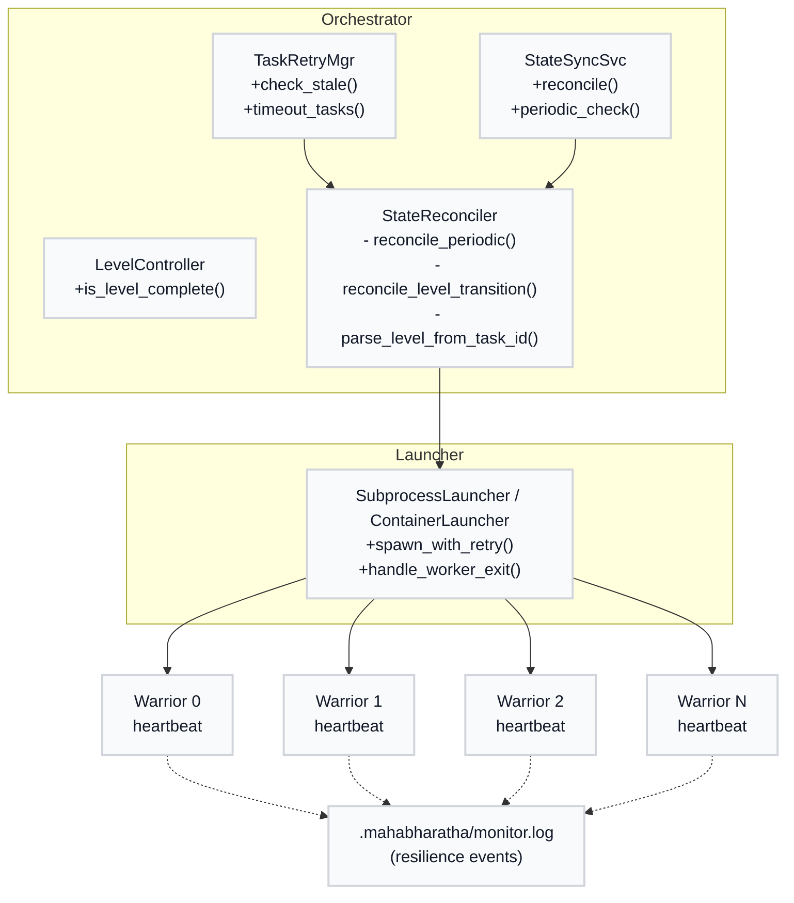
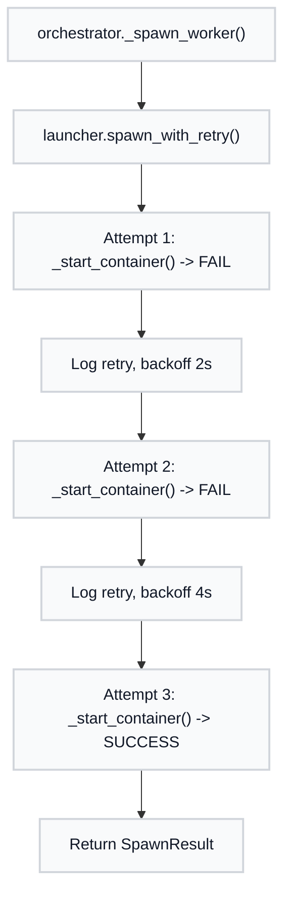
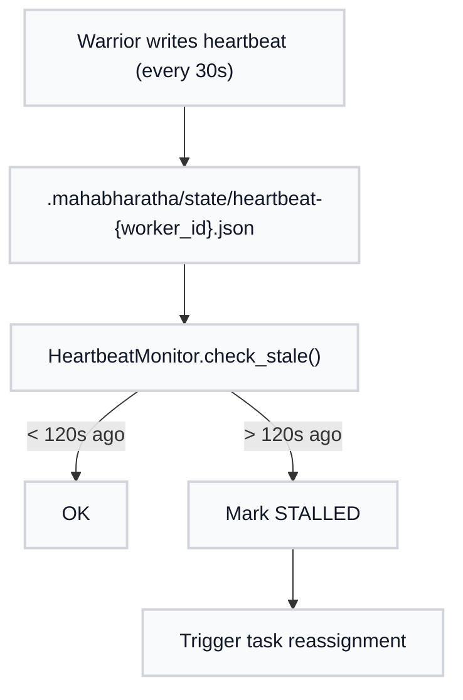
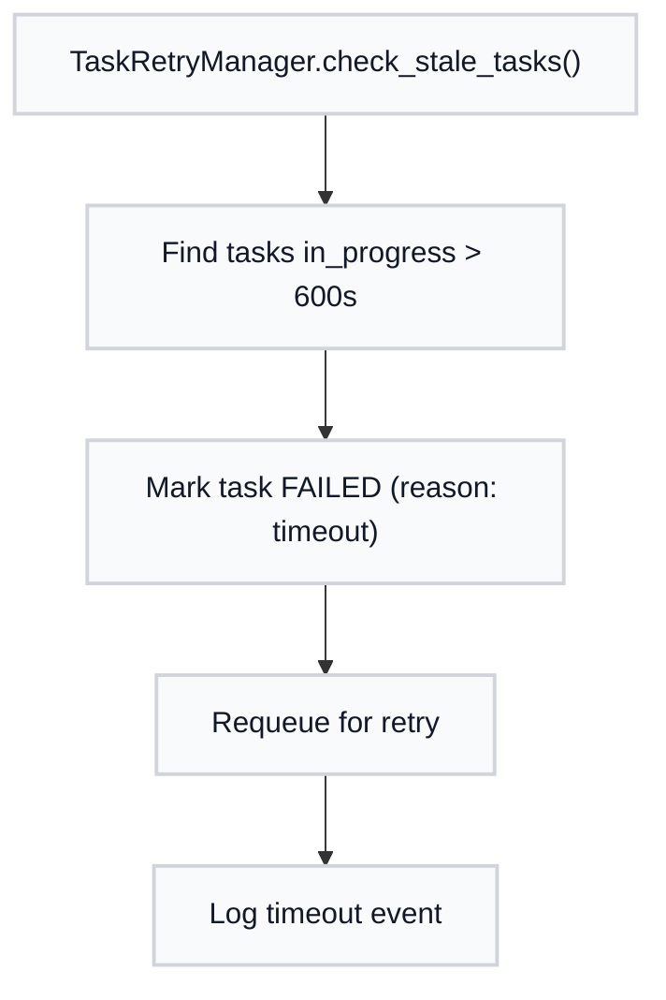
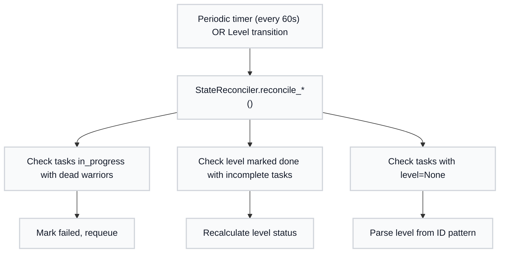
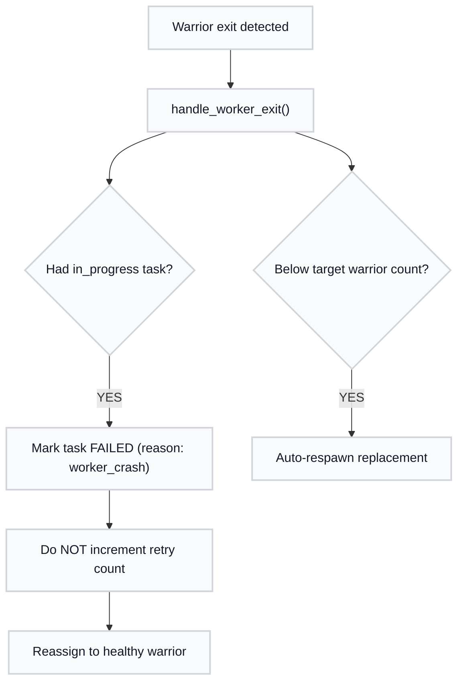

# Resilience Architecture

MAHABHARATHA's resilience system provides automatic recovery from transient failures, maintains state consistency between orchestrator and workers, and prevents task starvation during container mode execution.

---

## Overview

The resilience system addresses several failure modes observed during multi-worker container execution:

1. **Spawn failures** — Transient Docker issues causing initial spawn to fail
2. **Stuck tasks** — Workers crash mid-execution, leaving tasks in `in_progress` indefinitely
3. **State inconsistency** — Level marked "DONE" while tasks still `in_progress`
4. **Missing task context** — Task `level=None` when claimed via stub
5. **Container mount issues** — task-graph.json inaccessible inside containers
6. **No task reassignment** — Crashed worker's task never gets reassigned

The resilience system is **enabled by default** and requires no explicit flags. All behavior is configurable via `.mahabharatha/config.yaml`.

---

## Architecture Diagram



---

## Component Descriptions

### ResilienceConfig

**Location:** `mahabharatha/config.py`

Configuration fields for resilience tuning. All settings have sensible defaults.

```python
class ResilienceConfig(BaseModel):
    enabled: bool = True

class WorkersConfig(BaseModel):
    # Spawn retry
    spawn_retry_attempts: int = 3
    spawn_backoff_strategy: str = "exponential"  # exponential|linear|fixed
    spawn_backoff_base_seconds: int = 2
    spawn_backoff_max_seconds: int = 30

    # Task timeout
    task_stale_timeout_seconds: int = 600  # 10 minutes

    # Heartbeat
    heartbeat_interval_seconds: int = 30
    heartbeat_stale_threshold: int = 120  # 2 minutes

    # Worker management
    auto_respawn: bool = True
    max_respawn_attempts: int = 5
```

### SpawnRetry

**Location:** `mahabharatha/launcher.py`

Retry logic with exponential backoff for worker spawn operations.

**API:**
```python
def spawn_with_retry(
    self,
    worker_id: int,
    feature: str,
    worktree_path: Path,
    branch: str,
    max_attempts: int = 3,
    backoff_strategy: str = "exponential",
    backoff_base: int = 2,
    backoff_max: int = 30,
) -> SpawnResult:
```

**Behavior:**
- On spawn failure, retry up to N attempts (default: 3)
- Exponential backoff: `base_seconds * 2^attempt`
- Maximum delay capped at `backoff_max` seconds
- Each retry logged with timestamp and reason
- After exhausting retries, fail gracefully with actionable error

### TaskRetryManager (Stale Task Watchdog)

**Location:** `mahabharatha/task_retry_manager.py`

Detects and fails tasks stuck in `in_progress` beyond configurable timeout.

**API:**
```python
def check_stale_tasks(self, timeout_seconds: int = 600) -> list[str]:
    """Check for tasks stuck in in_progress beyond timeout.

    Returns:
        List of task IDs that were timed out and requeued
    """
```

**Behavior:**
- Called from orchestrator main loop during `_poll_workers()`
- Tasks exceeding `task_stale_timeout` (default: 600s) marked as failed
- Timed-out tasks queued for immediate reassignment
- Logs timeout event with task ID, assigned worker, elapsed time

### HeartbeatMonitor (Enhanced Heartbeat)

**Location:** `mahabharatha/heartbeat.py`

Enhanced heartbeat system with progress tracking and config-driven stale detection.

**Heartbeat Format:**
```json
{
    "worker_id": "W0",
    "timestamp": "2026-02-03T05:41:55.123Z",
    "task_id": "RES-L2-001",
    "step": "running_tests",
    "progress_pct": 65.0
}
```

**Behavior:**
- Workers emit heartbeat every 30s (configurable)
- Orchestrator marks worker stale if no heartbeat for 2 minutes (configurable)
- Stale workers trigger task reassignment
- Heartbeat files written atomically to `.mahabharatha/state/heartbeat-{worker_id}.json`

### StateReconciler

**Location:** `mahabharatha/state_reconciler.py`

Detects and fixes state inconsistencies between orchestrator and workers.

**API:**
```python
class StateReconciler:
    def reconcile_periodic(self) -> ReconciliationResult:
        """Light periodic check (every 60s)."""

    def reconcile_level_transition(self, level: int) -> ReconciliationResult:
        """Thorough check before level advancement."""

    def parse_level_from_task_id(self, task_id: str) -> int | None:
        """Parse level from task ID pattern *-L{level}-*."""
```

**Fixes Applied:**
- Tasks `in_progress` with dead workers → mark failed, requeue
- Level marked "done" with incomplete tasks → recalculate level status
- Task `level=None` → parse level from task ID pattern `*-L{level}-*`

### LevelController

**Location:** `mahabharatha/levels.py`

Fixed `is_level_complete()` to verify actual task states.

**Fixed Implementation:**
```python
def is_level_complete(self, level: int) -> bool:
    tasks = self.get_tasks_for_level(level)
    return all(
        self._tasks[tid].get("status") in (TaskStatus.COMPLETE.value, TaskStatus.FAILED.value)
        for tid in tasks
    )
```

**Previous Bug:** Compared `completed_tasks == total_tasks` without checking actual states.

### MonitorLogWriter

**Location:** `mahabharatha/log_writer.py`

Structured resilience event logging to `.mahabharatha/monitor.log`.

**Log Format:**
```json
{
    "ts": "2026-02-03T05:41:55.123Z",
    "level": "INFO",
    "worker_id": "W0",
    "event": "task_claimed",
    "task_id": "RES-L2-001",
    "data": {"previous_owner": null}
}
```

**Event Types:**
- Worker lifecycle: `worker_spawn`, `worker_spawn_retry`, `worker_spawn_failed`, `worker_ready`, `worker_exit`, `worker_crash`, `worker_respawn`
- Task lifecycle: `task_claimed`, `task_started`, `task_complete`, `task_failed`, `task_timeout`, `task_reassigned`
- Heartbeat: `heartbeat_stale`, `heartbeat_recovered`
- Reconciliation: `state_reconcile_start`, `state_reconcile_fix`, `state_reconcile_complete`
- Level: `level_check`, `level_complete`

---

## Data Flows

### Spawn Flow



### Heartbeat Flow



### Task Timeout Flow



### State Reconciliation Flow



### Crash Recovery Flow



---

## Configuration Reference

Add these settings to `.mahabharatha/config.yaml`:

```yaml
resilience:
  enabled: true                    # Master toggle (default: true)

workers:
  # Spawn retry
  spawn_retry_attempts: 3          # Max attempts before failing (1-10)
  spawn_backoff_strategy: exponential  # exponential|linear|fixed
  spawn_backoff_base_seconds: 2    # Base delay between retries (1-60)
  spawn_backoff_max_seconds: 30    # Maximum delay cap (1-300)

  # Task timeout
  task_stale_timeout_seconds: 600  # Timeout for in_progress tasks (60-3600)

  # Heartbeat
  heartbeat_interval_seconds: 30   # Worker heartbeat frequency (5-120)
  heartbeat_stale_threshold: 120   # Seconds without heartbeat = stale (30-600)

  # Worker management
  auto_respawn: true               # Auto-replace crashed workers
  max_respawn_attempts: 5          # Per-worker respawn cap (0-20)
```

---

## Troubleshooting Guide

### Tasks Stuck in Progress

**Symptoms:**
- Kurukshetra stalled at high percentage (e.g., 95%)
- `/z:status` shows tasks in `in_progress` for extended periods

**Diagnosis:**
```bash
# Check monitor.log for timeout events
grep "task_timeout" .mahabharatha/monitor.log

# Check stale threshold
grep "task_stale_timeout_seconds" .mahabharatha/config.yaml
```

**Resolution:**
1. Default timeout is 600s (10 minutes)
2. Increase timeout for long-running tasks:
   ```yaml
   workers:
     task_stale_timeout_seconds: 1800  # 30 minutes
   ```
3. Or reduce timeout for faster failure detection:
   ```yaml
   workers:
     task_stale_timeout_seconds: 300  # 5 minutes
   ```

### Workers Failing to Spawn

**Symptoms:**
- Workers fail to start
- "Spawn failed after N attempts" in logs

**Diagnosis:**
```bash
# Check monitor.log for spawn retries
grep "worker_spawn" .mahabharatha/monitor.log

# Check Docker status
docker ps
docker info
```

**Resolution:**
1. Verify Docker daemon is running
2. Check image availability: `docker images | grep mahabharatha-worker`
3. Increase retry attempts:
   ```yaml
   workers:
     spawn_retry_attempts: 5
     spawn_backoff_max_seconds: 60
   ```
4. Check for resource exhaustion (disk, memory)

### Level Not Advancing

**Symptoms:**
- Level completion stuck
- Tasks show as complete but level won't advance

**Diagnosis:**
```bash
# Check reconciliation events
grep "state_reconcile" .mahabharatha/monitor.log

# Check level status
grep "level_check" .mahabharatha/monitor.log
```

**Resolution:**
1. Run `/z:status` to see actual task states
2. Check if reconciliation fixed any inconsistencies
3. If tasks are actually complete, reconciliation should fix level status within 60s
4. Force reconciliation by triggering level transition manually

### How to Read monitor.log

The monitor log at `.mahabharatha/monitor.log` contains structured JSON events:

```bash
# View recent events
tail -50 .mahabharatha/monitor.log | jq .

# Filter by event type
grep '"event":"task_timeout"' .mahabharatha/monitor.log | jq .

# Filter by worker
grep '"worker_id":"W0"' .mahabharatha/monitor.log | jq .

# Get all errors
grep '"level":"ERROR"' .mahabharatha/monitor.log | jq .

# Timeline of specific task
grep '"task_id":"RES-L2-001"' .mahabharatha/monitor.log | jq .
```

**Common Event Patterns:**

Healthy worker lifecycle:
```
worker_spawn → worker_ready → task_claimed → task_complete → worker_exit
```

Failed spawn with recovery:
```
worker_spawn → worker_spawn_retry → worker_spawn_retry → worker_ready
```

Task timeout and reassignment:
```
task_claimed → task_started → task_timeout → task_reassigned → task_claimed (new worker)
```

Worker crash recovery:
```
task_claimed → task_started → worker_crash → task_reassigned → worker_respawn
```

---

## Key Design Decisions

### Crash vs Failure Distinction

When a worker crashes, its task's retry count is **not** incremented. This distinguishes infrastructure failures (Docker issues, OOM) from task bugs (verification failure).

**Rationale:** A crash is not the same as a task verification failure. Treating them identically would exhaust retries for otherwise-working tasks.

### State Reconciliation Frequency

**Hybrid approach:** Periodic checks (every 60s) + thorough checks on level transitions.

**Rationale:** Periodic checks catch most drift quickly. Level transition checks are thorough and critical for correctness before advancement. Combined overhead is <1% CPU.

### Monitor Log Location

Resilience events are written to a dedicated `.mahabharatha/monitor.log` file, separate from worker JSONL files.

**Rationale:** Resilience events are orchestrator-level concerns, not worker-level. A dedicated log makes debugging easier and supports automated analysis tools.

---

## Performance Characteristics

- **Heartbeat overhead:** <1% CPU per worker
- **State reconciliation:** <100ms per check
- **Spawn retry delays:** Async, doesn't block orchestrator loop
- **Monitor log writes:** Buffered, minimal I/O impact

---

## Related Documentation

- [Configuration Reference](./configuration.md) — All MAHABHARATHA config options
- [Container Mode](./Container-Mode.md) — Container execution details
- [Commands Reference](../commands.md) — Full command documentation
