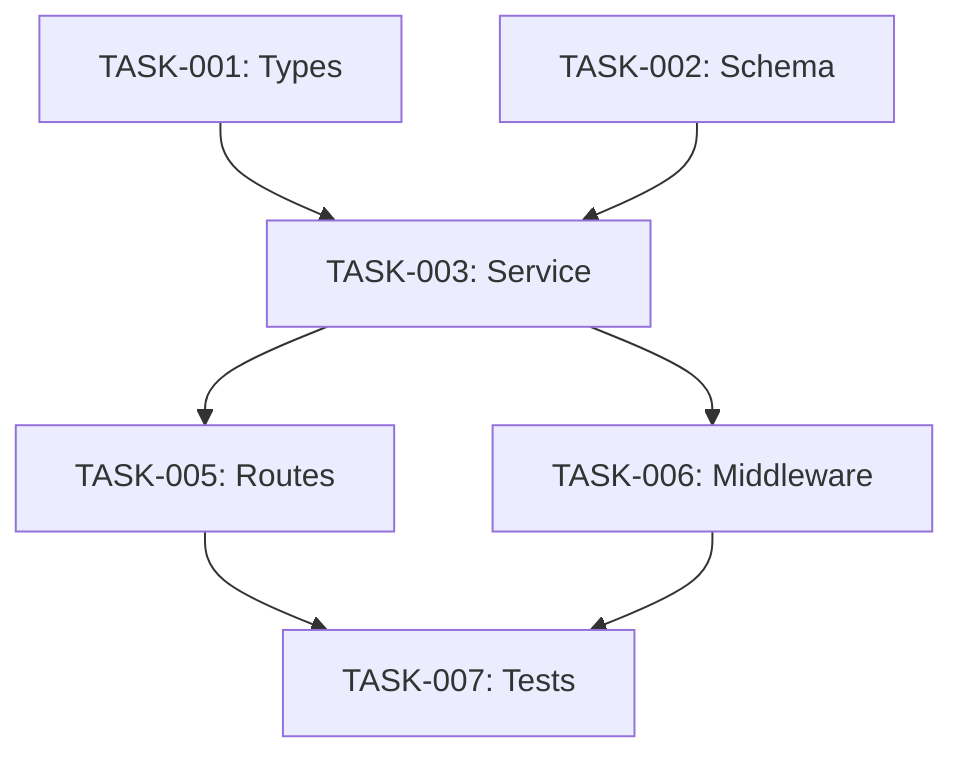

Generate technical architecture and prepare for parallel execution.

## Pre-Flight

```bash
FEATURE=${Mahabharatha_FEATURE:-$(cat .gsd/.current-feature 2>/dev/null)}
TASK_LIST=${CLAUDE_CODE_TASK_LIST_ID:-$FEATURE}

if [ -z "$FEATURE" ]; then
  echo "ERROR: No active feature. Run /mahabharatha:plan first"
  exit 1
fi

SPEC_DIR=".gsd/specs/$FEATURE"

if [ ! -f "$SPEC_DIR/requirements.md" ]; then
  echo "ERROR: Requirements not found. Run /mahabharatha:plan first"
  exit 1
fi

# Check for approval marker
if ! grep -q "Status.*APPROVED" "$SPEC_DIR/requirements.md" 2>/dev/null; then
  echo "WARNING: Requirements not marked as APPROVED"
  echo "Continue anyway? (design may need revision)"
fi
```

## Load Context

Read thoroughly:
1. `.gsd/specs/$FEATURE/requirements.md`
2. `.gsd/INFRASTRUCTURE.md`
3. `.gsd/PROJECT.md`
4. Key source files related to the feature

## Phase 1: Architecture Design

Generate high-level architecture:

### 1.1 Component Analysis

For each functional requirement, identify:
- What components are needed?
- What are the responsibilities of each?
- How do they interact?

### 1.2 Data Flow

Map how data moves through the system:
- Entry points (APIs, events, UI)
- Processing stages
- Storage points
- Exit points

### 1.3 Interface Design

Define contracts between components:
- API endpoints and payloads
- Function signatures
- Event schemas
- Database schemas

### 1.4 Key Decisions

Document architectural decisions with rationale:

```markdown
### Decision: {title}

**Context**: {situation and problem}

**Options Considered**:
1. {option 1}: {pros/cons}
2. {option 2}: {pros/cons}
3. {option 3}: {pros/cons}

**Decision**: {chosen option}

**Rationale**: {why this option}

**Consequences**: {what this means for implementation}
```

## Phase 2: Implementation Plan

Break down into phases that enable parallel execution:

### Phase Structure

```markdown
## Implementation Phases

### Phase 1: Foundation (Level 1)
Tasks with no dependencies. Can all run in parallel.
- Types and interfaces
- Schema definitions
- Configuration
- Constants

### Phase 2: Core (Level 2)
Depends on Foundation. Can parallelize within phase.
- Business logic services
- Data access layer
- Utility functions

### Phase 3: Integration (Level 3)
Depends on Core. Wire components together.
- API routes
- Event handlers
- Middleware

### Phase 4: Testing (Level 4)
Depends on Integration.
- Unit tests
- Integration tests
- E2E tests

### Phase 5: Quality (Level 5)
Final polish.
- Documentation
- Type coverage
- CHANGELOG.md update (required — add entries under [Unreleased])
- Lint fixes
```

### Mandatory Documentation Tasks

Every task graph MUST include these documentation tasks. This is non-negotiable.

#### CHANGELOG.md (ALWAYS Required)

Every task graph MUST include a CHANGELOG.md update task in Level 5 (Quality). This task:
- Updates the `[Unreleased]` section with entries for all changes in this feature
- Uses categories: Added, Changed, Fixed, Removed
- Depends on all testing-phase tasks

#### Doc Update Tasks (Conditional)

When a feature changes command/flag functionality, the task graph MUST also include tasks to update:
- `README.md` — if CLI usage examples change
- `docs/commands-quick.md` and `docs/commands-deep.md` — if command flags change
- `.gsd/wiki/Command-Reference.md` — if user-facing commands change
- `.gsd/wiki/Tutorial.md` — if workflows change
- `CLAUDE.md` — if project conventions change

These doc update tasks go in Level 4 or 5 (after implementation/testing, before or alongside quality).

### File Ownership Matrix

Critical for parallel execution: each file is owned by ONE task.

```markdown
## File Ownership

| File | Task | Phase |
|------|------|-------|
| src/auth/types.ts | TASK-001 | foundation |
| src/auth/schema.ts | TASK-002 | foundation |
| src/auth/service.ts | TASK-003 | core |
| src/auth/routes.ts | TASK-004 | integration |
| src/auth/service.test.ts | TASK-005 | testing |
```

### Consumer Matrix

Every task that creates a module must declare who calls its output. Tasks with no consumers are leaf tasks (CLI entry points, test files).

| Task | Creates | Consumed By | Integration Test |
|------|---------|-------------|-----------------|
| {task} | {file} | {consumer task IDs or "leaf"} | {test file path or "—"} |

Rules:
- If a task has consumers, it MUST have an `integration_test` field
- If a task is a leaf (no consumers), `integration_test` is optional
- Consumer references must point to real task IDs in the graph

## Phase 2.5: Context Engineering

For each task in the task graph, populate the optional `context` field with scoped context to minimize worker token usage.

### Per-Task Context

For each task entry in task-graph.json, add a `context` key containing:

1. **Relevant spec excerpts** — paragraphs from requirements.md and design.md that relate to this task's title, description, and file paths
2. **Security rules** — filtered by file extensions in the task's create/modify lists:
   - `.py` files → include Python security rules summary
   - `.js`/`.ts` files → include JavaScript security rules summary
   - `Dockerfile` → include Docker security rules summary
   - Always include OWASP core rules summary
3. **Dependency context** — brief summary of what upstream dependencies produce (types, interfaces)

### Budget

Keep each task's `context` field under ~4000 tokens (~16,000 characters). Prioritize:
- Security rules: ~30% of budget
- Spec excerpts: ~50% of budget
- Dependency context: ~20% of budget

### Example

```json
{
  "id": "TASK-003",
  "title": "Implement auth service",
  "context": "## Security Rules (Python)\n- Use parameterized queries...\n\n## Spec Context\nThe auth service must support JWT...\n\n## Dependencies\nTASK-001 creates User TypedDict in types.py..."
}
```

Workers receiving task-scoped context skip loading full spec files, saving ~2000-5000 tokens per task.

## Phase 3: Task Graph Generation

Generate `task-graph.json` for the orchestrator:

```json
{
  "feature": "{feature}",
  "version": "2.0",
  "generated": "{timestamp}",
  "total_tasks": {N},
  "estimated_duration_minutes": {N},
  "max_parallelization": {N},

  "tasks": [
    {
      "id": "TASK-001",
      "title": "Create authentication types",
      "description": "Define TypeScript interfaces for auth domain",
      "phase": "foundation",
      "level": 1,
      "dependencies": [],
      "files": {
        "create": ["src/auth/types.ts"],
        "modify": [],
        "read": ["src/shared/types.ts"]
      },
      "verification": {
        "command": "npx tsc --noEmit src/auth/types.ts",
        "timeout_seconds": 60
      },
      "estimate_minutes": 15,
      "skills_required": ["typescript"],
      "consumers": ["TASK-003"],
      "integration_test": "tests/integration/test_types_wiring.py"
    },
    {
      "id": "TASK-002",
      "title": "Create user database schema",
      "description": "Define Drizzle schema for users table",
      "phase": "foundation",
      "level": 1,
      "dependencies": [],
      "files": {
        "create": ["src/db/schema/user.ts"],
        "modify": ["src/db/schema/index.ts"],
        "read": []
      },
      "verification": {
        "command": "npx drizzle-kit generate:check",
        "timeout_seconds": 60
      },
      "estimate_minutes": 20,
      "skills_required": ["drizzle", "postgres"],
      "consumers": ["TASK-003"],
      "integration_test": "tests/integration/test_schema_wiring.py"
    },
    {
      "id": "TASK-003",
      "title": "Implement authentication service",
      "description": "Core auth logic: register, login, verify",
      "phase": "core",
      "level": 2,
      "dependencies": ["TASK-001", "TASK-002"],
      "files": {
        "create": ["src/auth/service.ts"],
        "modify": [],
        "read": ["src/auth/types.ts", "src/db/schema/user.ts"]
      },
      "verification": {
        "command": "npm test -- --testPathPattern=auth/service",
        "timeout_seconds": 120
      },
      "estimate_minutes": 45,
      "skills_required": ["typescript", "testing"],
      "consumers": [],
      "integration_test": null
    }
  ],

  "levels": {
    "1": {
      "name": "foundation",
      "tasks": ["TASK-001", "TASK-002"],
      "parallel": true,
      "estimated_minutes": 20
    },
    "2": {
      "name": "core",
      "tasks": ["TASK-003", "TASK-004"],
      "parallel": true,
      "estimated_minutes": 45,
      "depends_on_levels": [1]
    },
    "3": {
      "name": "integration",
      "tasks": ["TASK-005", "TASK-006"],
      "parallel": true,
      "estimated_minutes": 30,
      "depends_on_levels": [2]
    },
    "4": {
      "name": "testing",
      "tasks": ["TASK-007", "TASK-008"],
      "parallel": true,
      "estimated_minutes": 45,
      "depends_on_levels": [3]
    },
    "5": {
      "name": "quality",
      "tasks": ["TASK-009"],
      "parallel": false,
      "estimated_minutes": 15,
      "depends_on_levels": [4]
    }
  },

  "conflict_matrix": {
    "description": "Tasks that cannot run in parallel due to shared files",
    "conflicts": []
  }
}
```

## Phase 4: Generate design.md

```markdown
# Technical Design: {feature}

## Metadata
- **Feature**: {feature}
- **Status**: DRAFT | REVIEW | APPROVED
- **Created**: {timestamp}
- **Author**: Factory Design Mode

---

## 1. Overview

### 1.1 Summary
{One paragraph summary of the technical approach}

### 1.2 Goals
- {goal 1}
- {goal 2}

### 1.3 Non-Goals
- {non-goal 1}
- {non-goal 2}

---

## 2. Architecture

### 2.1 High-Level Design
{ASCII diagram or description}

```
┌─────────────┐     ┌─────────────┐     ┌─────────────┐
│   Client    │────▶│   API       │────▶│   Service   │
└─────────────┘     └─────────────┘     └─────────────┘
                                              │
                                              ▼
                                        ┌─────────────┐
                                        │  Database   │
                                        └─────────────┘
```

### 2.2 Component Breakdown

| Component | Responsibility | Files |
|-----------|---------------|-------|
| {name} | {what it does} | {files} |

### 2.3 Data Flow
{How data moves through the system}

---

## 3. Detailed Design

### 3.1 Data Models

```typescript
// src/auth/types.ts
interface User {
  id: string;
  email: string;
  // ...
}
```

### 3.2 API Design

```typescript
// POST /api/auth/register
interface RegisterRequest {
  email: string;
  password: string;
}

interface RegisterResponse {
  user: User;
  token: string;
}
```

### 3.3 Database Schema

```sql
CREATE TABLE users (
  id UUID PRIMARY KEY,
  email VARCHAR(255) UNIQUE NOT NULL,
  -- ...
);
```

---

## 4. Key Decisions

### 4.1 {Decision Title}
{Decision record as described above}

---

## 5. Implementation Plan

### 5.1 Phase Summary

| Phase | Tasks | Parallel | Est. Time |
|-------|-------|----------|-----------|
| Foundation | {N} | Yes | {time} |
| Core | {N} | Yes | {time} |
| Integration | {N} | Yes | {time} |
| Testing | {N} | Yes | {time} |
| Quality | {N} | No | {time} |

### 5.2 File Ownership

| File | Task ID | Operation |
|------|---------|-----------|
| {file} | {task} | create/modify |

### 5.3 Dependency Graph



---

## 6. Risk Assessment

| Risk | Probability | Impact | Mitigation |
|------|-------------|--------|------------|
| {risk} | Low/Med/High | Low/Med/High | {strategy} |

---

## 7. Testing Strategy

### 7.1 Unit Tests
{What will be unit tested}

### 7.2 Integration Tests
{What will be integration tested}

### 7.3 Verification Commands
{Commands that prove tasks are complete}

---

## 8. Parallel Execution Notes

### 8.1 Safe Parallelization
- Level 1 tasks have no dependencies, fully parallel
- Level 2+ respects dependency graph
- No two tasks modify the same file

### 8.2 Recommended Workers
- Minimum: {N} workers (sequential by level)
- Optimal: {N} workers (based on widest level)
- Maximum: {N} workers (diminishing returns beyond)

### 8.3 Estimated Duration
- Single worker: {time}
- With {N} workers: {time}
- Speedup: {N}x

---

## 9. Approval

| Role | Name | Date | Signature |
|------|------|------|-----------|
| Architecture | | | PENDING |
| Engineering | | | PENDING |
```

## Phase 4.5: Track Design in Claude Task System

At the START of design (before Phase 1), create a tracking task:

Call TaskCreate:
  - subject: "[Design] Architecture for {feature}"
  - description: "Design phase for {feature}. Generating architecture and task graph via /mahabharatha:design."
  - activeForm: "Designing {feature}"

Immediately call TaskUpdate to set it in_progress:
  - taskId: (the Claude Task ID just created)
  - status: "in_progress"

After task registration succeeds (Phase 4.6 below), mark the design task completed:

Call TaskUpdate:
  - taskId: (the design task's Claude Task ID)
  - status: "completed"

## Phase 4.6: Register Tasks in Claude Task System

After generating task-graph.json, create a Claude Task for every task using the TaskCreate tool.

For each task in the task graph:

1. Call TaskCreate:
   - subject: "[L{level}] {title}"
   - description: Include full description, file ownership list, verification command
   - activeForm: "Executing {title}"

2. After ALL tasks are created, set up dependency chains.
   For each task with dependencies, call TaskUpdate:
   - taskId: the Claude Task ID assigned to this task
   - addBlockedBy: list of Claude Task IDs for each dependency

3. Call TaskList to verify all tasks created and dependencies wired correctly.

The backlog markdown is auto-generated by the CLI at tasks/{FEATURE}-BACKLOG.md.

## Phase 5: Validate Task Graph

Check for issues:

```bash
# Verify no circular dependencies
# Verify file ownership is exclusive
# Verify all files exist or are created
# Verify verification commands are valid
# Verify every task with non-empty consumers has an integration_test
# Verify consumer references point to real task IDs
# Verify integration_test files are owned by a task
```

## Phase 6: User Approval

```
═══════════════════════════════════════════════════════════════
                   DESIGN READY FOR REVIEW
═══════════════════════════════════════════════════════════════

Feature: {feature}

Architecture:
  • {N} components
  • {N} key decisions documented

Task Graph:
  • {N} total tasks across {N} levels
  • Max parallelization: {N} workers
  • Estimated duration: {time} (single) → {time} ({N} workers)

Files to Create:
  • .gsd/specs/{feature}/design.md
  • .gsd/specs/{feature}/task-graph.json

───────────────────────────────────────────────────────────────

Please review the design document.

Reply with:
  • "approved" - to proceed to launch
  • "changes needed" - describe what needs to change

═══════════════════════════════════════════════════════════════
```

## Completion Criteria

- design.md exists with Status: APPROVED
- task-graph.json is valid JSON with no circular dependencies
- All tasks have verification commands
- File ownership is exclusive (no conflicts)
- User has explicitly approved
- Claude Tasks created for all tasks with correct dependencies
- Consumer matrix populated for all tasks with created files
- Task graph includes a CHANGELOG.md update task in the final quality level

## Help

When `--help` is passed in `$ARGUMENTS`, display usage and exit:

```
/mahabharatha:design — Generate technical architecture and prepare for parallel execution.

Flags:
  --help              Show this help message
```
