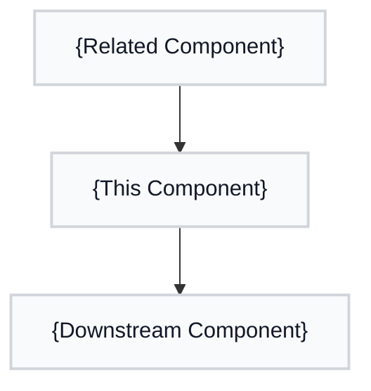
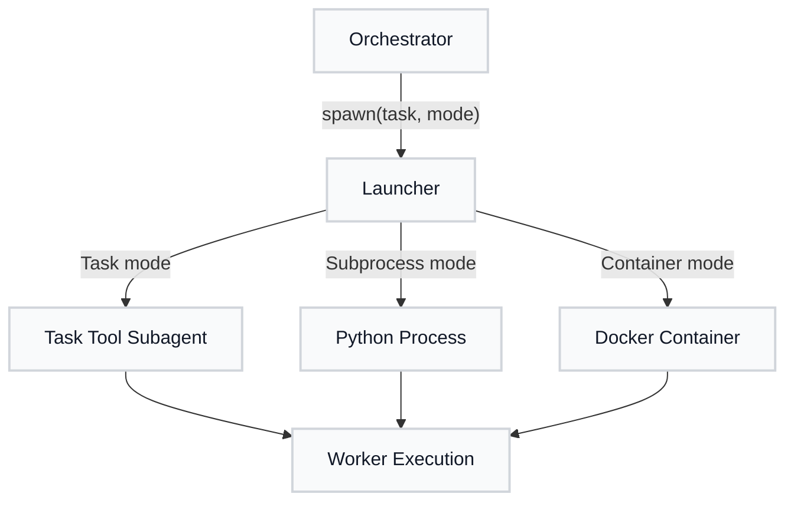

# Educational Tone

**Default tone for `/mahabharatha:document`.**

Teaches "why" not just "what". Every concept gets a plain-language explanation, a narrative connecting it to the bigger picture, a Mermaid diagram, and concrete CLI examples.

## When to Use

- New users learning Mahabharatha for the first time
- Onboarding documentation
- Concept-heavy components where understanding matters more than quick reference
- Any documentation where the reader needs to understand the reasoning behind design decisions

## Required Sections Per Concept

Every concept or component documented in this tone MUST include these four sections:

### CONCEPT

A plain-language explanation of what this thing is and why it exists. No jargon without definition. Answer: "What problem does this solve?"

- Start with a one-sentence summary
- Explain the problem it addresses
- Define any domain-specific terms
- State the key insight or principle

### NARRATIVE

Connect this concept to the bigger picture. How does it fit into the overall system? What comes before and after it in the workflow?

- Explain the context: what triggers this, what depends on it
- Describe the relationship to other components
- Use analogies where helpful
- Keep it conversational but precise

### DIAGRAM

A Mermaid diagram showing the concept's relationships, data flow, or lifecycle.

- Use `graph TD` for dependency/flow diagrams
- Use `sequenceDiagram` for interaction sequences
- Use `stateDiagram-v2` for state transitions
- Keep diagrams focused (5-10 nodes max)
- Label edges with action descriptions

### COMMAND

Concrete CLI examples showing how to use or interact with this concept.

- Show the most common usage first
- Include expected output where helpful
- Show at least one variation or option
- Use real file paths from the project, not placeholders

## Output Structure Template

```markdown
# {Component Title}

> One-sentence summary of what this component does.

## CONCEPT

{Plain-language explanation of what this is and why it exists.}

## NARRATIVE

{How this fits into the bigger picture. What comes before/after. Relationships.}

## DIAGRAM



## COMMAND

```bash
# Primary usage
{command example}

# With options
{command example with flags}
```

---

{Repeat CONCEPT/NARRATIVE/DIAGRAM/COMMAND for each additional concept in the component.}
```

## Example Output

```markdown
# Mahabharatha Launcher

> Spawns and manages parallel Claude Code worker processes.

## CONCEPT

The Launcher is Mahabharatha's process manager. When you run `/mahabharatha:Kurukshetra`, the Launcher takes the task graph and spawns one Claude Code instance per worker, each in its own git worktree. It handles three execution modes: Task (in-process subagents), Subprocess (local Python processes), and Container (Docker containers).

Think of it as a foreman on a construction site: it assigns workers to tasks, makes sure they have the right tools, and reports back when they finish.

## NARRATIVE

The Launcher sits between the Orchestrator (which decides what to build) and the Workers (which do the building). After `/mahabharatha:design` produces a task-graph.json, and `/mahabharatha:Kurukshetra` triggers execution, the Orchestrator calls the Launcher to spawn workers for each level.

The Launcher is the only component that interacts with the operating system to create processes. Everything upstream is pure planning; everything downstream is pure execution.

## DIAGRAM



## COMMAND

```bash
# Default: Task mode (in-process subagents)
/mahabharatha:Kurukshetra --workers 5

# Subprocess mode
/mahabharatha:Kurukshetra --workers 3 --mode subprocess

# Container mode (requires Docker)
/mahabharatha:Kurukshetra --workers 5 --mode container
```
```
